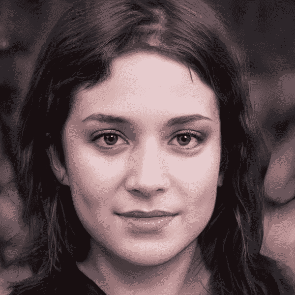
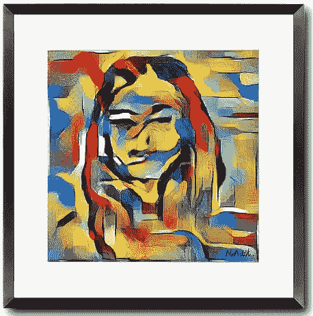
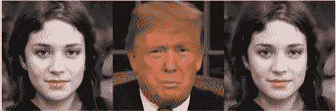
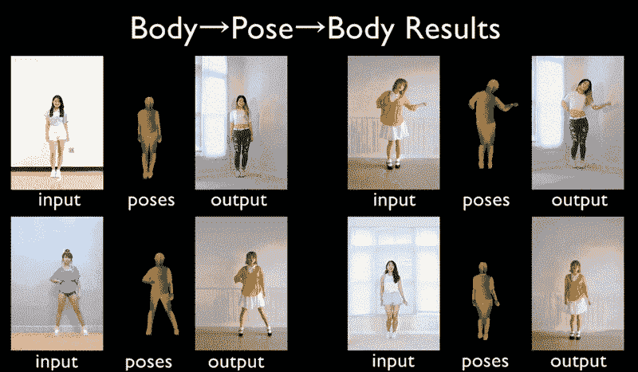

# 甘的伦理问题

> 原文：<https://medium.datadriveninvestor.com/the-ethical-concerns-of-gans-9ef6b88f79db?source=collection_archive---------3----------------------->

下面是一个简短的 GIF 图片，展示了人们互相变形。这些人不是真的，我只用了一天时间就创造出来了。是的……相当可怕。

# 介绍

在我们深入研究甘的伦理问题之前，我们应该解释一下他们是什么。GANs 或[生成对抗网络](https://arxiv.org/pdf/1406.2661.pdf)是一个深度学习框架，其中两个神经网络基本上是在相互进行“竞争”游戏。一个神经网络(生成器)试图创建假图像。另一个神经网络(鉴别器)试图确定输入图像(伪图像和真实图像)是伪图像还是非伪图像的概率。来自鉴别器的输出概率和类别标签(假的或非假的)现在被反馈到生成器中，以帮助提高生成的图像的质量。这个训练过程会一直持续到生成器胜过鉴别器，然后游戏结束。在简短地介绍了 GANs 之后，让我们深入一些领域，至少对我来说，这些领域提出了一些使用 GANs 的*伦理问题。如果你想更深入地了解 GANs，可以看看这篇很棒的文章:“[理解生成性对抗网络(GANs)](https://towardsdatascience.com/understanding-generative-adversarial-networks-gans-cd6e4651a29) 。*

# *易于实施*

*如果有人有一个谷歌帐户，他们可以实现自己的甘。随着 [StyleGan2](https://github.com/NVlabs/stylegan2) 的诞生，NVIDIA 让这个过程变得非常简单。随着各种各样的预先训练的 GAN 模型的出现，人们使用这种技术的能力得到了提高。理解引擎盖下发生的事情有一个轻微的学习曲线，但是如果你的唯一目的是生成假图像，你是幸运的。这个视频"[在 Colab 上训练 StyleGAN2 模型](https://youtu.be/hv3A62Ojqdg)"是训练你自己的 GAN 的一个很好的视频。像这样的视频和一些博客帖子确实凸显了使用这种先进技术变得多么容易。再一次，上面的视频花了我不到一天的时间来制作。从伦理上讲，你不得不质疑这样的技术是否应该为每个人所用。*

* [## 什么是数据目录，它如何使机器学习取得成功？数据驱动的投资者

### 数据目录是机器学习和数据分析的燃料。没有它，你将不得不花费很多…

www.datadriveninvestor.com](https://www.datadriveninvestor.com/2020/08/27/what-is-a-data-catalog-and-how-does-it-enable-machine-learning-success/) 

# 产品农业

对于我在[大会](https://generalassemb.ly/)上的顶点项目，我使用 StyleGan2 来生成假人物，最终用作社交媒体影响者。每个人都知道这些影响者可以赚多少钱，所以我想，“理论上你可以创造无限数量的这些假影响者，他们可以通过使用甘发布无限数量的内容。”显然，在想到这一点后，激发了我写这篇文章的想法。这就引出了产品农业的概念。有人可以创建一个 GAN 来创建现代艺术作品，生成成千上万的图像，并将其标记为自己的艺术作品，并开始出售。是这样吗？这有错吗？我不知道，但这又是一个需要思考的非常重要的问题。这里有一个目前正在发生的确切概念的例子:【https://www.noartist.io/[。对于像我们这样的技术人员来说，这是非常令人印象深刻的，但对于那些想把这作为职业的艺术家和画家来说呢？](https://www.noartist.io/cubisme)

GAN generated artwork: [https://www.noartist.io/product-page/damour](https://www.noartist.io/product-page/damour)

# 深度假货

这又回到了易于实现的问题。随着技术的不断进步，访问变得越来越容易。有了像 [DeepFaceLab](https://github.com/iperov/DeepFaceLab) 这样的“牛逼”资源，制作深度假货变得轻而易举。只用了几行代码，我就能创造出一张我生成的像唐纳德·特朗普一样说话的脸的深度假像。

这张脸是我用 GAN 生成的其中一张。现在，我可以让这张脸说话，眨眼，像任何人一样移动他们的头。花一点时间，开始思考如何利用这一点。政治是一个非常可怕的领域，这可能会被利用。有了这项技术，理论上你可以让任何人说话，说任何你想说的话。你应该开始质疑你所看到的是否真实？

# 工作替换

这与深度造假密切相关，但 GANs 有可能被用来取代乔布斯。天气预报员？脱口秀主持人？模特们？影响者？男演员和女演员？等等。这个清单可以一直列下去。如果需要某人出现在屏幕上并讲话，就有可能替换那个人。

噗，对抖音舞者的需求消失了:

NVIDIA vid2vid: [https://github.com/NVIDIA/vid2vid/blob/master/imgs/pose.gif](https://github.com/NVIDIA/vid2vid/blob/master/imgs/pose.gif)

如果有技术可以让一个假的人跳舞，为什么他们不能代替屏幕上的任何人？

这是一个可能发生的非常简单的管道。让成千上万的计算机生成的人，然后让所有这些计算机生成的人跳舞成千上万次，现在你有一个社交媒体的内容农场。

对于技术人员来说，这真的很棒，也很有趣，但对于想把这作为职业的人来说，这太可怕了。这显然不会直接伤害到任何人，但几年后会有什么影响呢？某些工作会因为 GANs 而被取代吗？谁知道呢。就像我在过去几节中所做的那样，认真思考这项技术的可能性，并问自己，这符合道德吗？

# 结论

我非常喜欢 GANs 和它们的一些非常棒的实现，比如照片恢复，社交媒体过滤等等。我在做顶点的时候突然想到，如果有人想利用 GANs，它是很容易被利用的。

我的项目想法最初是制造一个计算机生成的影响者，并进行自动内容生成，但是我认为让一个人成为唯一能赚取更多收入的人在伦理上是不合理的。我转动了我的顶点，现在想让人们意识到生成内容的潜在好与坏。

我希望这篇文章能让你对 GANs 的伦理问题有所思考。我认为人工智能作为一个整体的伦理意识应该得到更多的讨论。我看到了所有展示这些非常酷的应用程序的令人敬畏的技术文章，但我真的想知道如果有人恶意使用它，会发生什么？

如果你已经做到这一步，我非常感谢你，如果你有任何建议让我添加到这篇文章中，我很乐意这样做！

请随时通过 LinkedIn 联系我: [LinkedIn](https://www.linkedin.com/in/aidancurley/)

## 获得专家视图— [订阅 DDI 英特尔](https://datadriveninvestor.com/ddi-intel)*