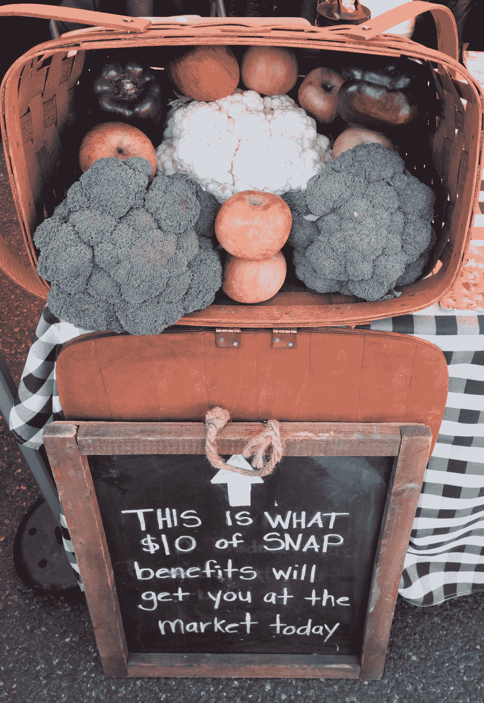

# 关于食品券欺诈的事实

> 原文：<https://medium.datadriveninvestor.com/the-facts-about-food-stamp-fraud-72c2f994f5f0?source=collection_archive---------6----------------------->

U.S. Department of Agriculture [Public domain] via Wikimedia commons

有太多关于美国政府食品券计划的错误信息。

因此，经过一些调查后，这里有一些关于这种好处的事实，也被称为补充营养援助计划(SNAP)。

结论是，在截至 2016 年的四年中，食品券欺诈激增，但它仍然只占该计划的一小部分。

对于那些不熟悉的人来说，SNAP 福利是面向低收入个人和家庭的。对于个人来说，他们在 2018 年可能获得的最高总收入以及仍然领取粮票[是 15684 美元。更多的是针对家庭](https://www.fns.usda.gov/snap/eligibility)。根据政府统计数据，2016 年的平均月福利仅为每人 125.40 美元。(参见本报告中[的表 1。)对拥有何种货币资产也有限制。](https://fns-prod.azureedge.net/sites/default/files/snap/FY16-State-Activity-Report.pdf)

 [## 为什么包容性财富指数比 GDP 更能衡量社会进步？|数据驱动…

### 你不需要成为一个经济奇才或金融大师就能知道 GDP 的定义。即使你从未拿过 ECON 奖…

www.datadriveninvestor.com](https://www.datadriveninvestor.com/2019/03/08/why-inclusive-wealth-index-is-a-better-measure-of-societal-progress-than-gdp/) 

然而，值得注意的并不是个人收益的大小(无疑是很小的)。这是利益欺诈的增长。

欺诈增长了多少？根据美国农业部的[数据，2016 年，这一数字跃升至 5.927 亿美元，比 2012 年的 3.671 亿美元增长了 61%。(见报告中的表 46。)货币数字是“通过调查确定的欺诈金额。”换句话说，这些数字是基于已查明的事件。2016 年，欺诈调查数量共计 963，965 起，比 2012 年增长超过 30%。(附注:根据该报告，这些调查中有近一半是在纽约州进行的。)](https://fns-prod.azureedge.net/sites/default/files/snap/FY16-State-Activity-Report.pdf)

关于欺诈，美国农业部声明如下:

> *在 SNAP 中，欺诈通常被定义为用利益换取现金或其他不符合条件的物品(非法交易),或故意在您的 SNAP 申请中虚报信息，以获得您无权获得的利益或比您有权获得的更多的利益。*

简单来说，如果你把你的利益换成现金，等等。，或者谎报收入或资产，那就是欺诈。美国农业部表示，欺诈总额包括如果未被发现本应作为福利给予的金额，或者政府可以收回的金额。

然而，令人着迷的是，根据政府数据，欺诈行为的激增与领取福利的人数下降了 5%相一致，平均总人数从 4，660 万下降到 4，420 万。

如果欺诈是一个固定的百分比，那么我们预计它会随着注册人数而波动，但事实并非如此。相反，当参加这个项目的人数减少时，这个数字上升了。

所以，是的，欺诈的金额和参与者人数都在增长。

纳税人应该担心吗？

如果你担心，那么考虑以下几点。2016 年发放的 SNAP 福利总成本为 665 亿美元，低于 2012 年的 746 亿美元。这些数字意义重大，因为美国是一个大国。

与这些总数相比，2016 年发现的欺诈仅占总数的 0.9%。这一比例高于 2012 年的 0.5%。

或者换句话说，99%的福利资金与欺诈毫无关系，假设政府正在履行其识别渎职的职责。如果欺诈数字继续以同样的速度增长，那就真的有问题了，但目前还没那么严重。

当然，还有其他理由对 SNAP 项目产生怀疑，比如它助长了对政府援助的依赖，而不是独立性，但那是另一回事了。

目前，最大的问题是，在政府项目涉及到民众的情况下，你如何完全消除欺诈？有没有可能做到这一点，而不完全废弃该计划？

或许这是不可能的。

*本文为* [*原载于 2018 年 4 月 4 日 Forbes.com*](https://www.forbes.com/sites/simonconstable/2018/04/04/the-facts-about-food-stamp-fraud/#12795aa3f880)*。*