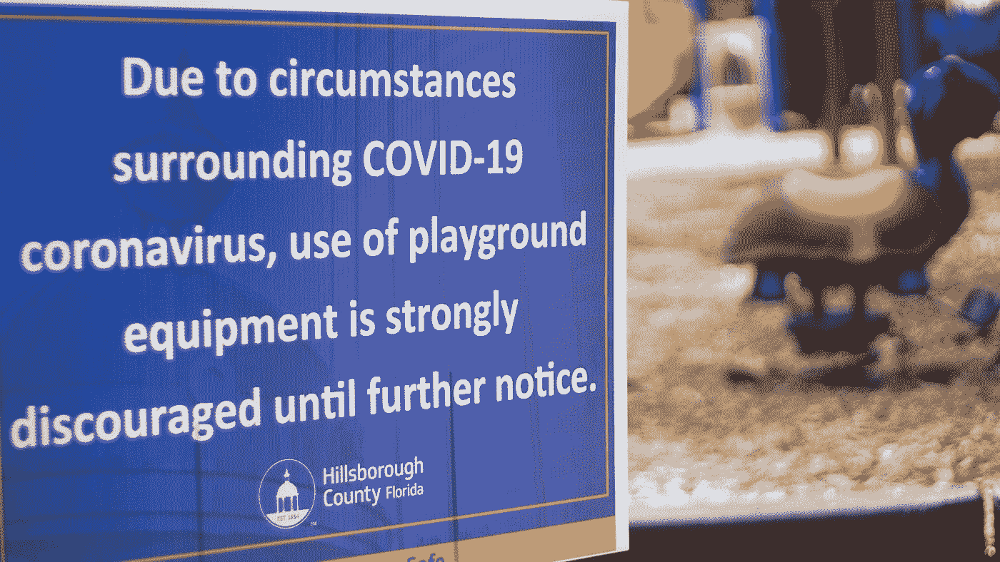
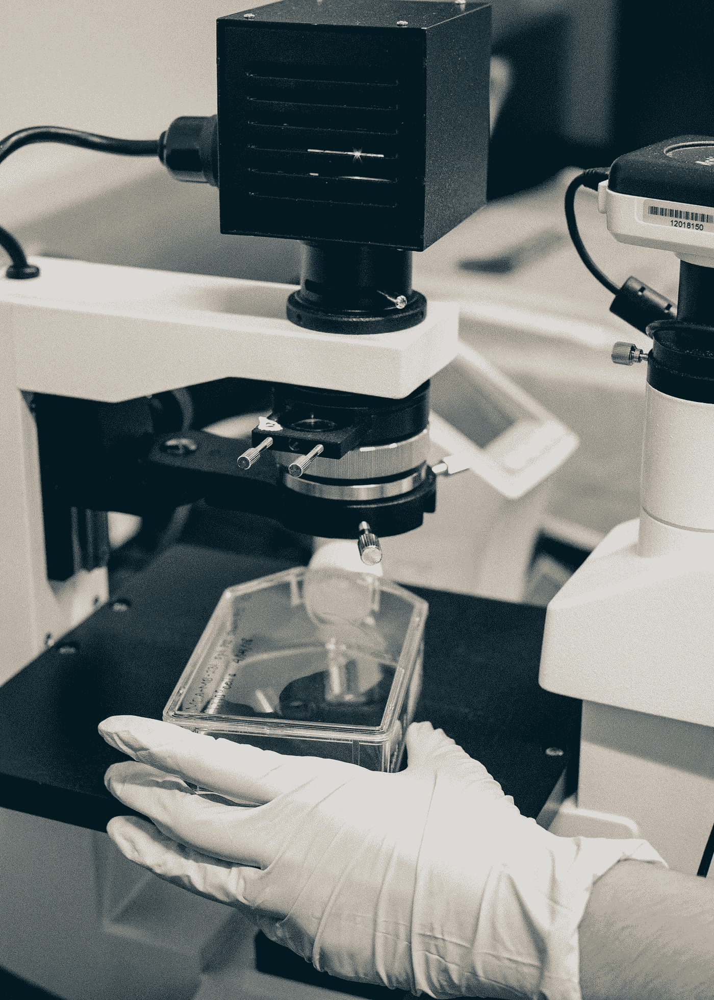

# 我们经济的信念:社会企业如何在 COVID 期间有所作为

> 原文：<https://medium.datadriveninvestor.com/the-faith-of-our-economy-how-social-enterprises-can-make-a-difference-during-covid-c779c07ed572?source=collection_archive---------20----------------------->

Photo by [Jordan Hopkins](https://unsplash.com/@jhopkinswriting?utm_source=medium&utm_medium=referral) on [Unsplash](https://unsplash.com?utm_source=medium&utm_medium=referral)

新冠肺炎疫情让每个人、每个职业都陷入了可怕的境地。随着经济几乎关闭，裁员率经历坎坷，供应链面临重大不确定性，已经服务不足的领域遭受更多。根据联合国大学世界发展经济研究所的研究，由于疫情，全球贫困人口可能增加近 5 亿，占总人口的 8%。与此同时，卫生保健机构面临着资金和资源方面的问题，这使得它们几乎不可能援助这些遭受苦难的社区。政府和企业需要干预，以确保这种情况不会变得比现在更糟。

 [## SpaceX vs 维珍银河——太空旅游业务主导地位的竞赛|数据驱动的投资者

### 只有 566 个人去过太空。这些人 85%以上来自三个民族。超过一半的…

www.datadriveninvestor.com](https://www.datadriveninvestor.com/2020/11/25/spacex-vs-virgin-galactic-the-race-to-a-space-tourism-business-dominance/) 

社会企业也因为新冠肺炎疫情遭受了巨大损失。尽管情况如此，他们仍然坚韧不拔，致力于在其社区内发挥作用。许多社会企业，甚至一些其他企业，所做的是操纵他们的商业计划来帮助那些受 COVID 影响的人。这方面的两个主要例子是 **Cycle Connect** 和 **PichaEats** : Cycle Connect 是一家通常为创收资产提供融资的公司，在疫情期间，该公司将重点转向设计一个新的种子贷款项目，以帮助农村社区获得足够的食物，PichaEat 通常只是一家普通的餐饮公司，现在培训难民担任厨师，并为他们提供菜单和其他资源。在这两个例子中，企业正在转变商业模式，一方面是为了生存，另一方面是为了帮助那些遭受全球危机的人。

世界各地的医疗保健系统目前也跟不上全球需求。社会企业必须带着新技术和创新理念介入进来，帮助在全球分发基本药物和健康产品。所有企业，尤其是社会企业，都有三个关键机会来帮助减轻这场危机的影响。

1.  创建模型，允许顺利，无接触的获取药物的方法。这些方法的例子有电子商务、远程药房和自动配药。
2.  与药房合作，帮助指导他们度过危机。例如，他们可以建立药剂师和其他卫生专业人员的网络，并向他们提供有关病毒和社区的关键信息，以便他们能够正确地指导他们的病人。为了更进一步，一些企业与大型医疗机构合作，教导市民如何应对 COVID。
3.  提供质量保证服务，帮助生产商和消费者识别不断增加的假冒药品。

Photo by [Jaron Nix](https://unsplash.com/@jaronnix?utm_source=medium&utm_medium=referral) on [Unsplash](https://unsplash.com?utm_source=medium&utm_medium=referral)

社会企业可以对疫情的结果产生巨大的影响。为了他们自己的经济利益和社会利益，他们应该考虑改变他们的商业模式以适应今天的环境。与此同时，企业应该专注于帮助医疗保健领域，以便尽可能无缝地分发药品。在社会企业的帮助下，社会将能够在没有社会企业帮助的情况下跨越这一障碍。

## 访问专家视图— [订阅 DDI 英特尔](https://datadriveninvestor.com/ddi-intel)