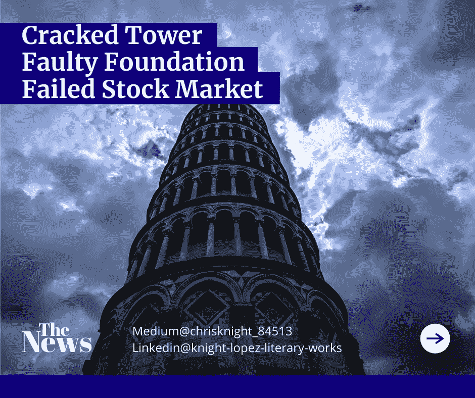

# 一座塔无休止的螺旋上升的坠落

> 原文：<https://medium.datadriveninvestor.com/the-fall-of-a-towers-endless-spiral-upward-8780c21025c?source=collection_archive---------7----------------------->

## 在过去的一个世纪里，我声称我总是向上，从而毁灭了这个世界。我以公民权利为代价享受经济特权。现在民权兑现他们的支票，让我爬得更高。

Source: Self Created Image with [Canva](http://www.canva.com).

**高塔**

在一座大城市的中心，一座塔楼耸立在多层建筑中。这些建筑在阳光下闪着金色、银色和混凝土的光芒。这座城市被建成一个巨大的圆环。每一个圆环都环绕着高高耸立的巨塔。

从鸟瞰的角度看，好像每一排都有前列腺。

一种崇拜形式。

*投稿*。

每一排建筑都环绕着这座塔。

只有一座塔。人们早就私下谈论这座塔的功能了。有人说是为了自我。其他人说这是为了彰显统治地位。这座城市的领导人说这是为了军事目的。

没有人真正知道它的用途。

这座城市中只有一座塔。法规要求这些建筑都要保持一定的高度。

超过一定门槛的建筑比民事罚款带来更多的后果。

[自 1817 年 3 月 8 日以来，每年都有钟声敲响，象征着这座塔的统治地位](https://www.britannica.com/topic/New-York-Stock-Exchange)。

这座塔不断扩展，达到了前所未有的高度。[截至 2020 年 12 月 31 日，该塔的高度达到了 14524.80 米](https://www.wsj.com/market-data/quotes/index/NYA/historical-prices)。

许多人声称这么高的塔永远无法制造。有人说这座塔是用魔法建造的。

**黑魔法**。

也有人说是白魔法。

理性的人说这简直是个奇迹。

当争论席卷全城时，一个孤独的石匠走在人群中。他来视察这座大楼。他伪装成普通人来避免引起怀疑。塔顶的精英们知道一些事情。会让城里人充满恐惧的事情。

他必须证实事实。他必须证实这个谎言。他必须发现这种担心的原因。

**地基**

石匠穿过熙熙攘攘的街道。人们奔忙着，就像一条穿过狭窄的大坝裂缝的河流。人们激烈地四处走动。一切似乎都有目的。没有人停下来交谈。每个人都川流不息。

各个方向都铺了路。街道下面有一个迷宫。人们从隧道的开口处浮上来又沉下去。这些隧道是新世界的奇迹。

隧道是城市的一种交通方式。

现在除了隧道，很少有人走别的路。最好的公共交通。就好像这些隧道允许人们在城市里四处流动，就像溃烂的血液在尸体周围流动一样。每个人都是携带病毒的血细胞。

病毒是认为一切都在上涨的误解。人们已经被灌输了使这种虚假永久化的活动。人们相信他们自己的谎言。

石匠继续朝着人流的中心前进。它们似乎都来自这座塔。

这座塔是胜利的灯塔。这座塔代表着向上的永恒广阔。人们继续声称它将永远上涨。

石匠对人们愚蠢的逻辑摇头。

“想想 1906 年 1 月 12 日，100 米大关是值得庆祝的事情，”他小声嘟囔着。

**实现**

石匠的眼睛因沮丧而凝视着。他的头脑知道真相。他在溃烂的城市血管中停下来。

人的溃烂。

人们聚集在他懒散的姿态周围。他们继续走来走去，没有注意到他。他已经隐形了。就像…

*这道裂缝！？*

石匠不敢相信自己的眼睛。在每个人面前矗立着一个深深的裂缝在塔的基础上。在中午时分，风呼啸着发出狼的叫声。

人们怎么会忽视事实呢？

这座城市是否已经被彻底感染，以至于看不到显而易见的事实？

不止一个。

很多。

许多裂缝散落在地基上。一个裂缝导致大约 70 万个必要的交易过程停止。另一个漏洞破坏了该塔的安全协议，使其容易受到网络攻击。

老鼠在地基裂缝造成的大洞中进进出出。在光天化日之下，这些啮齿动物趾高气扬。

“太神奇了……”石匠看着地基问题。

“……这些人非常骄傲。尽管有宣传，该塔 2001 年至 2011 年的经济产出仅为 0.67%。然而，他们仍然声称其震中的必要性。”

他的目光从主街转移到塔楼的侧巷。前面有光。光线总是很好，但是黑暗呢？

他走到一边，走到一些路障后面。他走了一小段路。然后他看到了隐藏在黑暗中的东西。

他的眼睛无法相信他们所看到的。老鼠互相打架，流浪狗对着狗大小的老鼠吠叫。人们简单地跨过携带害虫的疾病。

不仅人民堕落了，他们的荣耀也堕落了。这些人是这座塔的延伸。

人民是这座塔的血脉。

血是蓝色的。

不自然。

在浅水区，石匠看到的不仅仅是地基问题。他看到了过度傲慢和腐败的问题。他给精英们的报告不会很好。他们认为他只打算报道基金会。

“这里的错误远不止基础问题。”

 [## 首次创业的 4 个资金管理技巧|数据驱动的投资者

### 超过 82%的企业倒闭是由于财务管理不善和现金流问题。开始新的…

www.datadriveninvestor.com](https://www.datadriveninvestor.com/2020/10/23/4-money-management-tips-for-first-time-entrepreneurs/) 

**股市炒作**

我们市场的真相即将实现。正如一座建筑不可能永远向上延伸；我们的股票交易价值也不会。总是假设上涨会导致灾难性的下跌。

不要被底层借贷带来的膨胀收益所迷惑。首次公开募股(IPO)和特别收购公司(SPACs)的融资正在推动创纪录的升值步伐。

股票市值将高于昨天，但不会达到我们今天看到的水平。谨慎对待新问题，关注基本面。大数据有价值。大数据没有达到数十亿美元的价值。

没有现金流，没有资产和消极的收入预测导致一件事。破产。

祝你知识成功！

***

关于 Christopher:Christopher Knight Lopez 是一名职业骗子，在他的职业生涯中，他与职业企业家进行了广泛的合作。在他 14 年的职业生涯中，Christopher 已经开了超过 7 家公司。克里斯托弗的目的是利用各种市场驱动的机会。Christopher 是注册项目经理(MPM)和认证财务分析师(AFA)。Christopher 之前通过了 65 系列证券执照考试。克里斯托弗也有他的总路线——人寿、意外、健康和健康维护组织。Christopher 已经管理了总计 2 . 86 亿美元的报告管理资产和建议资产。Christopher 在 29 个国家有工作经验，为各种业务筹集了超过 5000 万美元，在他的个人职业生涯中总收入超过 1300 万美元。Christopher 曾在高科技行业工作:生物技术、金融、证券、制造、房地产和住房抵押贷款。克里斯托弗是一名美国空军老兵。克里斯托弗热爱家庭、竞技体育、钓鱼、武术，并倡导企业家精神。克里斯托弗为崭露头角的企业家提供自助课程。克里斯托弗对导师的热情来自于企业家和骗子需要指导的信念。这个世界充满了关于企业家身份的相互矛盾的信息。在[www.christopherklopez.com 看更多。](http://www.christopherklopez.com.)

免责声明:这些信息并不意味着是一种投资建议或财务建议。不要把这种情况应用到你自己的个人环境中。各种风险包括:商业风险、投资风险、政治风险和其他风险。此信息仅用于信息和教育目的。请不要向作者寻求任何投资策略或哲学。针对自己的情况，请咨询自己的理财顾问或法律顾问。不是任何形式的推荐或认可。

**访问专家视图—** [**订阅 DDI 英特尔**](https://datadriveninvestor.com/ddi-intel)