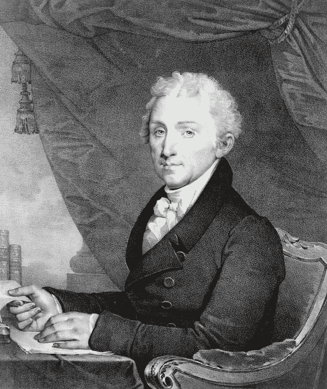

# 托马斯·阿尔瓦·爱迪生迷人的生活秘密

> 原文：<https://medium.datadriveninvestor.com/the-fascinating-life-secrets-of-thomas-alva-edison-eabd323b380a?source=collection_archive---------9----------------------->

## 美国国会图书馆对这位灯泡发明者的生活进行了详细的总结——早年、工作、妻子、家庭。

Photo by [Library of Congress](https://unsplash.com/@libraryofcongress?utm_source=unsplash&utm_medium=referral&utm_content=creditCopyText) on [Unsplash](https://unsplash.com/s/photos/thomas-edison?utm_source=unsplash&utm_medium=referral&utm_content=creditCopyText)

> 我没有失败。我刚刚发现了一万种行不通的方法。—托马斯·A·爱迪生

托马斯·阿尔瓦·爱迪生是有史以来最著名、最多产的发明家之一，他对现代生活产生了巨大的影响，发明了白炽灯、留声机和电影摄影机，还改进了电报和电话。

**在他的 84 年里，他获得了惊人的 1093 项专利。**

除了是一个发明家，爱迪生还设法成为一个成功的制造商和商人，向公众推销他的发明。无数的商业联络、合伙关系和公司充斥着爱迪生的生活，围绕各种专利和公司的法律斗争也在持续。

一些优秀的传记在当地的图书馆里很容易找到，那些希望了解更多关于他的生活和许多商业冒险的细节的人。

以下只是一个非常活跃和复杂的生活的简要概述，充满了经常同时发生的项目，来源于[国会图书馆](https://www.loc.gov/collections/edison-company-motion-pictures-and-sound-recordings/articles-and-essays/biography/life-of-thomas-alva-edison/)。

# 爱迪生的早年

托马斯·A·爱迪生的祖先一直居住在新泽西，直到他们在美国独立战争期间对英国王室的忠诚驱使他们来到加拿大的新斯科舍。从那里，后来的几代人迁移到安大略，在 1812 年的战争中与美国人作战。爱迪生的母亲南希·埃利奥特最初来自纽约，后来全家搬到了加拿大的维也纳，在那里她遇到了小萨姆·爱迪生，后来嫁给了他。19 世纪 30 年代，萨姆卷入了安大略省一场不成功的起义，他被迫逃往美国。1839 年，他们在俄亥俄州的米兰安家。

托马斯·阿尔瓦·爱迪生于 1847 年 2 月 11 日出生在俄亥俄州的米兰，父母是萨姆和南希。爱迪生年轻时被称为“艾尔”，是七个孩子中最小的一个，其中四个活到成年。爱迪生年轻时健康状况不佳。

为了寻求更好的运气，1854 年，萨姆·爱迪生举家迁往密歇根州的休伦港，在那里他从事木材生意。

爱迪生是个穷学生。

当一位校长称爱迪生“糊涂”时，他愤怒的母亲把他带出学校，开始在家里教他。早年，他就对机械和化学实验表现出了极大的兴趣。爱迪生多年后说，

> “我的母亲造就了我。她是如此真诚，对我如此有信心，我觉得我找到了一个值得活下去的人，一个我不能让她失望的人。” [1](https://www.loc.gov/collections/edison-company-motion-pictures-and-sound-recordings/articles-and-essays/biography/life-of-thomas-alva-edison/#N_1_)

1859 年，爱迪生在通往底特律的铁路干线上找到了一份卖报纸和糖果的工作。在行李车厢里，他建立了一个化学实验实验室和一台印刷机，在那里他创办了第一份在火车上出版的报纸【T2 大箱先驱报】。一场意外的火灾迫使他停止了在船上的实验。

**爱迪生 12 岁左右，几乎丧失了所有的听力。**

关于是什么导致了他的听力损失，有几种理论。有人把这归因于他小时候患猩红热的后遗症。其他人将此归咎于爱迪生在行李车引发火灾后，一名售票员打了他的耳朵，爱迪生声称这一事件从未发生。

爱迪生本人将其归咎于一次事件，在那次事件中，他被人揪住耳朵，抬上了火车。然而，他并没有因为自己的残疾而气馁，而是经常把残疾视为一种财富，因为这让他更容易专注于自己的实验和研究。

然而，毫无疑问，他的耳聋使他在与人交往时更加孤独和害羞。

# 电报工作

1862 年，爱迪生从轨道上救出了一个三岁的孩子，当时一辆货车快要撞到他了。心怀感激的父亲 J.U .麦肯齐教爱迪生铁路电报作为奖励。那年冬天，他在休伦港找到了一份电报员的工作。与此同时，他继续从事他的科学实验。1863 年至 1867 年间，爱迪生在美国从一个城市迁移到另一个城市，从事电报工作。

1868 年，爱迪生搬到波士顿，在那里他在西联公司工作，甚至更多地致力于他的发明。1869 年 1 月，爱迪生辞去了工作，打算全身心地投入发明创造。1869 年 6 月，他的第一项获得专利的发明是电子投票记录器。由于害怕政客们不愿使用这台机器，他决定以后不再浪费时间发明没人要的东西。

爱迪生在 1869 年中期搬到了纽约市。朋友富兰克林·l·波普允许爱迪生睡在他受雇的塞缪尔·劳斯黄金指示器公司的一个房间里。当爱迪生设法修好了那里的一台坏机器时，他被雇来管理和改进打印机。

在他生命的下一阶段，爱迪生参与了多个项目，并与电报公司建立了合作关系。1869 年 10 月，爱迪生与富兰克林·l·波普和詹姆斯·阿什利成立了波普、爱迪生公司，他们标榜自己是电气工程师和电气设备制造商。

爱迪生获得了几项改进电报机的专利。1870 年，该合伙企业与黄金股票电报公司合并。爱迪生还与威廉·昂格尔一起在新泽西州纽瓦克建立了纽瓦克电报厂，生产普通打印机。同年晚些时候，他成立了美国电报局，致力于开发自动电报机。1874 年，他开始为西部联合电报公司开发多路电报系统，最终开发出一种四路电报，可以同时向两个方向发送两条信息。

当爱迪生把他对四路电报系统的专利权卖给竞争对手大西洋和太平洋电报公司时，一系列的法庭斗争接踵而至，西联电讯公司赢了。除了其他电报发明，他还在 1875 年发明了一支电笔。

 [## 集中式经济发展的无用性和 UBI |数据驱动投资者的希望

### 在我的家乡缅因州的乡村海岸，我们曾经有一个经济发展委员会，但它只不过是一个…

www.datadriveninvestor.com](https://www.datadriveninvestor.com/2020/09/11/the-uselessness-of-centralized-economic-development-and-the-hope-of-ubi/) 

# 个人生活

这一时期他的个人生活也发生了很大的变化。

爱迪生的母亲于 1871 年去世，同年晚些时候，他在圣诞节与一名前雇员玛丽·史迪威结婚。

虽然爱迪生很爱他的妻子，但他们的关系充满了困难，主要是他对工作的专注和她不断的疾病。

爱迪生经常睡在实验室里，大部分时间和他的男同事在一起。然而，他们的第一个孩子，马里恩，出生于 1873 年 2 月，随后的儿子，小托马斯，出生于 1876 年 1 月。

爱迪生给这两个数字起了个绰号叫“点”和“划”，指的是电报术语。第三个孩子威廉·莱斯利出生于 1878 年 10 月。

# 工作

1876 年，爱迪生在新泽西州的门洛帕克开设了一个新实验室。这个地方后来被称为“发明工厂”，因为他们在任何给定的时间都致力于几项不同的发明。爱迪生进行了大量的实验来寻找问题的答案。他说，

> “我不会放弃，直到我得到我想要的。消极的结果正是我所追求的。对我来说，它们和积极的结果一样有价值。” [2](https://www.loc.gov/collections/edison-company-motion-pictures-and-sound-recordings/articles-and-essays/biography/life-of-thomas-alva-edison/#N_2_)

爱迪生喜欢长时间工作，对他的员工期望很高。

1877 年，爱迪生发明了一种电话发射机，大大改进了亚历山大·格雷厄姆·贝尔的电话工作。他的发射机使声音在标准电话线上以更高的音量和更清晰的声音传输成为可能。

爱迪生对电话和电报的实验导致他在 1877 年发明了留声机。

他想到声音可以通过快速移动的纸张上的凹痕记录下来。他最终设计出了一台带有锡箔涂层圆筒、隔膜和针的机器。

当爱迪生对着话筒说“玛丽有只小羊羔”时，令他吃惊的是，机器竟然向他回放了这句话。爱迪生有声留声机公司于 1878 年初成立，以销售这种机器，但留声机最初的新奇价值逐渐消失，爱迪生将注意力转向其他地方。

# 电灯工作

爱迪生在 1878 年专注于电灯系统，将留声机搁置了近十年。在金融家的支持下，爱迪生电灯公司于 11 月 15 日成立，以进行电灯实验并控制由此产生的任何专利。作为向公司交出专利的回报，爱迪生获得了大量股票。这项工作一直持续到 1879 年，因为实验室不仅试图设计一个白炽灯泡，还试图设计一个可以在城市中使用的完整的电力照明系统。

一根碳化细丝被证明是制造持久灯泡的关键。实验室里放上了灯，许多人去门洛帕克观看新发现。除夕夜，实验室为众多惊讶的参观者举办了一场特别的公开展览。

1881 年，爱迪生在东纽瓦克建立了一家电灯厂，次年，他和家人搬到了纽约，并在那里建立了一个实验室。

为了证明其可行性，第一个商业电灯系统于 1882 年安装在曼哈顿下城金融区的珍珠街，毗邻市政厅和两家报社。最初，只有四百盏灯被点亮；一年后，有 513 名顾客使用了 10，300 盏灯。 [3](https://www.loc.gov/collections/edison-company-motion-pictures-and-sound-recordings/articles-and-essays/biography/life-of-thomas-alva-edison/#N_3_)

爱迪生成立了几个公司来制造和操作电力照明系统所需的设备:纽约爱迪生电力照明公司、爱迪生机器厂、爱迪生电子管公司和爱迪生电灯厂。

这种照明系统还被带到国外参加 1881 年的巴黎照明博览会、1882 年的伦敦水晶宫和莫斯科的沙皇加冕典礼，并在几个欧洲国家建立了公司。

爱迪生照明系统的成功并不能阻止他的竞争对手开发他们自己的不同方法。一个结果是爱迪生领导的 DC 电流和乔治·威斯汀豪斯领导的交流电流的支持者之间的斗争。

双方都攻击了各自系统的局限性。特别是爱迪生，他指出用交流电电击来证明其危险性。DC 电流不能像交流电一样在系统中传播这么长时间，但是交流发电机的效率不如 DC 发电机。到 1889 年，一种将交流感应电机和 DC 发电机结合起来的装置的发明提供了最好的性能，交流电成为主导。

爱迪生通用电气公司于 1892 年与汤姆森-休斯顿合并，成为通用电气公司，有效地将爱迪生从电气商业领域进一步排挤出去。

# 再婚和改良的留声机

爱迪生的妻子玛丽于 1884 年 8 月 9 日去世，可能死于脑瘤。

1886 年 2 月 24 日，爱迪生与米娜·米勒再婚，并与妻子一起搬进了新泽西州西奥兰治县一座名为格伦蒙特的豪宅。爱迪生第一次婚姻的孩子远离了他们父亲的新生活，因为爱迪生和米娜有自己的家庭:马德琳，出生于 1888 年；1890 年的查尔斯；西奥多在 1898 年。

玛丽体弱多病，经常呆在家里，也顺从丈夫的意愿，与她不同，米娜是一个活跃的女人，花很多时间参加社区团体、社交活动和慈善活动，并试图改善丈夫经常粗心大意的个人习惯。

1887 年，爱迪生在新泽西州的西奥兰治新建了一个更大的实验室。该设施包括一个机械车间、留声机和照相部门、一个图书馆以及冶金、化学、木工和检流计测试的附属建筑。

当爱迪生忽视了留声机的进一步研究时，其他人已经开始改进它了。特别是，奇切斯特·贝尔和查尔斯·萨姆纳·泰恩特开发了一种改进的机器，使用蜡筒和浮动唱针，他们称之为留声机。

他们派代表去爱迪生那里讨论机器的可能合作关系，但爱迪生拒绝与他们合作，觉得留声机只是他一个人的发明。这场竞争促使爱迪生采取行动，并于 1887 年继续从事留声机的研究。

爱迪生最终在他自己的留声机中采用了类似贝尔和泰恩特的方法。

留声机最初是作为商业听写机销售的。企业家杰西·h·利平科特获得了包括爱迪生在内的大多数留声机公司的控制权，并于 1888 年成立了北美留声机公司。

这项业务并不盈利，当利平科特生病时，爱迪生接管了管理工作。

1894 年，北美留声机公司破产，这一举动使得爱迪生买回了他发明的权利。

1896 年，爱迪生创立了国家留声机公司，目的是制造留声机供家庭娱乐。多年来，爱迪生改进了留声机和在留声机上播放音乐的圆筒，早期的圆筒是由蜡制成的。

大约在 1912 年爱迪生进入唱片市场的同时，他推出了一种牢不可破的圆筒唱片，名为 Blue Amberol。爱迪生光盘的推出是对市场上光盘压倒性流行的反应，而不是柱面光盘。

被吹捧为优于竞争的记录，爱迪生光盘被设计成只能在爱迪生留声机上播放，并横向切割，而不是垂直切割。然而，爱迪生留声机业务的成功总是受到该公司选择低质量录音行为的声誉的阻碍。

20 世纪 20 年代，来自广播的竞争导致业务恶化，爱迪生唱片公司于 1929 年停产。

# 其他投资:矿石加工和水泥

爱迪生的另一个兴趣是从矿石中提取各种金属的矿石加工过程。

1881 年，他成立了爱迪生矿石碾磨公司，但由于没有市场，这一冒险没有结果。

1887 年，他回到这个项目，认为他的方法可以帮助大部分枯竭的东部矿山与西部矿山竞争。

1889 年，新泽西和宾夕法尼亚选矿厂成立，爱迪生被它的运营所吸引，开始花大量时间在新泽西奥登斯堡的矿山上。

尽管他在这个项目上投入了大量的金钱和时间，但当市场下跌，中西部发现了额外的矿石来源时，这个项目被证明是不成功的。

爱迪生也参与推广水泥的使用，并于 1899 年成立了爱迪生波特兰水泥公司。他试图推广水泥在低成本住宅建设中的广泛应用，并设想混凝土在留声机、家具、冰箱和钢琴制造中的替代用途。

不幸的是，爱迪生在这些想法上领先于他的时代，因为混凝土的广泛使用在当时被证明在经济上是不可行的。

# 电影

1888 年，爱迪生在西奥兰治见到了埃德沃德·迈布里奇，并参观了迈布里奇的动物实验镜。这台机器使用一个圆盘，圆盘上有连续运动阶段的静态照片，用来重现运动的幻觉。

爱迪生拒绝与迈布里奇一起研究这个装置，决定在他的实验室里研究自己的电影摄影机。

正如爱迪生在同年写的一份说明中所说，

> "我正在试验一种仪器，它对眼睛的作用相当于留声机对耳朵的作用。" [4](https://www.loc.gov/collections/edison-company-motion-pictures-and-sound-recordings/articles-and-essays/biography/life-of-thomas-alva-edison/#N_4_)

发明机器的任务落到了爱迪生的同事威廉·k·l·迪克森身上。在转向赛璐珞带之前，迪克森最初试验了一种基于圆柱体的设备来记录图像。

1889 年 10 月，迪克森带着一台能放映图像和声音的新设备迎接爱迪生从巴黎归来。

经过更多的工作后，1891 年，一种叫做电影摄影机的电影摄影机和一种电影窥视镜申请了专利。

1894 年，电影放映室在纽约开业，并很快扩展到其他主要城市。

1893 年，一个电影工作室，后来被称为黑玛利亚(一个警察囚车的俚语名称，工作室很像)，在西奥兰治复杂开放。

短片是利用当时的各种表演制作的。爱迪生不愿意开发电影放映机，觉得通过窥视孔观众可以获得更多的利润。

当迪克森帮助竞争对手开发另一个窥视孔电影设备和幻灯机投影系统，后来发展成 Mutoscope，他被解雇了。

迪克森与哈里·马文、赫尔曼·卡斯勒和埃利亚斯·库普曼一起成立了美国 Mutoscope 公司。爱迪生后来采用了由托马斯·阿马特和查尔斯·弗朗西斯·詹金斯开发的投影仪，并将其重新命名为 Vitascope，并以他的名字销售。

Vitascope 于 1896 年 4 月 23 日首次公演，获得了极大的好评。

来自其他电影公司的竞争很快在他们和爱迪生之间引发了激烈的专利法律战。爱迪生起诉多家公司侵权。1909 年，电影专利公司的成立给 1909 年获得许可证的各个公司带来了一定程度的合作，但在 1915 年，法院发现该公司是不公平的垄断。

1913 年，爱迪生尝试将声音与电影同步。他的实验室发明了一种 Kinetophone，可以使留声机圆筒上的声音与屏幕上的图像同步。

虽然这最初带来了兴趣，但该系统远非完美，并于 1915 年消失。到 1918 年，爱迪生结束了他在电影领域的参与。

# 爱迪生的晚年

1911 年，爱迪生的公司重组为托马斯·A·爱迪生公司。随着组织变得更加多样化和结构化，爱迪生越来越少参与日常运营，尽管他仍然有一些决策权。该组织的目标更多的是保持市场活力，而不是频繁地创造新发明。

1914 年，西奥兰治实验室发生了一场大火，烧毁了 13 栋建筑。尽管损失巨大，爱迪生还是带头重建了这块场地。

当欧洲卷入第一次世界大战时，爱迪生建议做好准备，并认为技术将是战争的未来。1915 年，他被任命为海军咨询委员会的负责人，这是政府将科学引入国防计划的一次尝试。

虽然主要是一个咨询委员会，但它对 1923 年成立的海军实验室起了重要作用，尽管爱迪生在这个问题上的几个建议都被忽视了。

战争期间，爱迪生花了很多时间进行海军研究，特别是潜艇探测，但他觉得海军不接受他的许多发明和建议。

20 世纪 20 年代，爱迪生的健康状况恶化，他开始花更多的时间在家陪妻子。尽管查尔斯是托马斯·A·爱迪生公司的总裁，但他和孩子们的关系很疏远。

当爱迪生继续在家里做实验时，他不能在他的西橙实验室做一些他想做的实验，因为董事会不同意。这一时期令他着迷的一个项目是寻找橡胶的替代品。

亨利·福特是爱迪生的崇拜者和朋友，他在密歇根州的格林菲尔德村重建了爱迪生发明工厂作为博物馆，在 1929 年爱迪生发明电灯 50 周年时开放。

由福特公司和通用电气公司联合主办的电灯公司成立五十周年的主要庆祝活动在迪尔伯恩举行，同时为爱迪生举行了盛大的庆祝晚宴，出席晚宴的名人有胡佛总统、小约翰·洛克菲勒、乔治·伊斯曼、玛丽·居里和奥维尔·莱特。然而，爱迪生的健康状况已经恶化到不能参加整个仪式的地步。

在他生命的最后两年里，一系列疾病导致他的健康状况进一步恶化，直到 1931 年 10 月 14 日他陷入昏迷。1931 年 10 月 18 日，他在新泽西州西奥兰治的格兰蒙特庄园去世。

## 注意事项:

1.  马丁·v·梅洛西，*托马斯·A·爱迪生和美洲的现代化*，(伊利诺伊州格伦维尤:斯科特，福尔斯曼/利特尔，布朗高等教育，1990 年)第 8 页。[转到信号源](https://www.loc.gov/collections/edison-company-motion-pictures-and-sound-recordings/articles-and-essays/biography/life-of-thomas-alva-edison/#one)
2.  托马斯·A·爱迪生 150 周年纪念海报，1847-1997，美国内政部，国家公园管理局，新泽西西奥兰治爱迪生国家历史遗址。[转到信号源](https://www.loc.gov/collections/edison-company-motion-pictures-and-sound-recordings/articles-and-essays/biography/life-of-thomas-alva-edison/#two)
3.  Melosi，第 73 页。[转到信号源](https://www.loc.gov/collections/edison-company-motion-pictures-and-sound-recordings/articles-and-essays/biography/life-of-thomas-alva-edison/#three)
4.  马修·约瑟夫森，《爱迪生传》(纽约:约翰·威利父子公司，1959 年)第 386 页。[转到信号源](https://www.loc.gov/collections/edison-company-motion-pictures-and-sound-recordings/articles-and-essays/biography/life-of-thomas-alva-edison/#four)

## **本文资料来源包括:**

国会图书馆

罗伯特·康诺。托马斯·A·爱迪生:一种运气。纽约:达·卡波出版社，1979 年。

约瑟夫森马修。*爱迪生:传记。纽约:约翰·威利父子公司，1959 年。*

*托马斯·A·爱迪生与美国的现代化。伊利诺伊州格伦维尤:斯科特，福尔斯曼/利特尔，布朗高等教育，1990 年。*

我分享这些是为了激励自己永不放弃。

此外，这也提醒我们，尽管托马斯·爱迪生以他的伟大发明而闻名，但他经历了很多失败，才成为历史记忆中的那个人。失败是可以的。

## 请考虑在这里注册会员，直接支持我的写作。

 [## 通过我的推荐链接加入 Medium-Elizabeth kasu jja

### 作为一个媒体会员，你的会员费的一部分会给你阅读的作家，你可以完全接触到每一个故事…

ekasujja.medium.com](https://ekasujja.medium.com/membership) 

你可以和其他喜欢阅读爱情、生活、人际关系和心理健康的人分享这个链接。谢谢你，❤ ❤ ❤

你可能也会喜欢阅读这些故事

 [## 9 个痛苦的信号，表明你的伴侣不再爱你

### 以及你能做些什么来决定是否挽救你们的关系。

medium.com](https://medium.com/hello-love/9-painful-signs-that-your-partner-is-no-longer-in-love-with-you-a2dfd2c7191f)  [## 爱情不再是关系中最重要的东西

### 爱本身是不够的，但这一件事可能是。

medium.com](https://medium.com/hello-love/love-is-no-longer-the-most-important-thing-in-relationships-28a68862c528)  [## 感觉永远不够好背后的心理

### 和 9 个明确的方法来重新调整你的思维，找到爱自己的价值

medium.com](https://medium.com/swlh/the-psychology-behind-never-feeling-good-enough-2ad963d16119)  [## 伟大生活伴侣的 7 个最吸引人的特质

### 选择一个爱你的人，即使你感到心碎

medium.com](https://medium.com/hello-love/the-7-most-alluring-traits-of-a-great-life-partner-1c6354bc8509)  [## 9 个伤害信号你有一个情感虐待的伴侣(有科学依据)

### 以及你能做些什么来挽回你内心的平静。

medium.com](https://medium.com/hello-love/9-hurtful-signs-you-have-an-emotionally-abusive-partner-backed-by-science-937726948203)  [## 9 个奇妙的迹象表明你的伴侣疯狂地爱着你

### 所有的小细节都讲述了一个更大的故事。

medium.com](https://medium.com/hello-love/9-fantastic-signs-that-your-partner-is-madly-in-love-with-you-8911e5dea19f)  [## 7 条线索表明你正处于一段真正的恋爱关系中

### 真正的爱情有卷土重来的习惯。

medium.com](https://medium.com/hello-love/7-clues-that-you-are-in-a-truly-loving-relationship-faa1f4988964)  [## 神经科学家推荐的 5 件事将改善你的心理健康

### 关键在于学会如何将不想要的想法拒之门外

medium.com](https://medium.com/clear-yo-mind/5-things-neuroscientists-recommend-that-will-improve-your-mental-health-4f238cd03697)