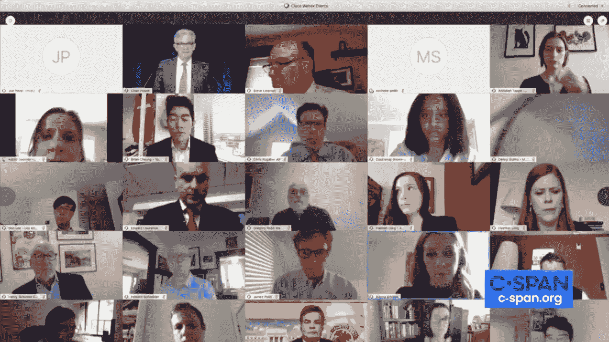
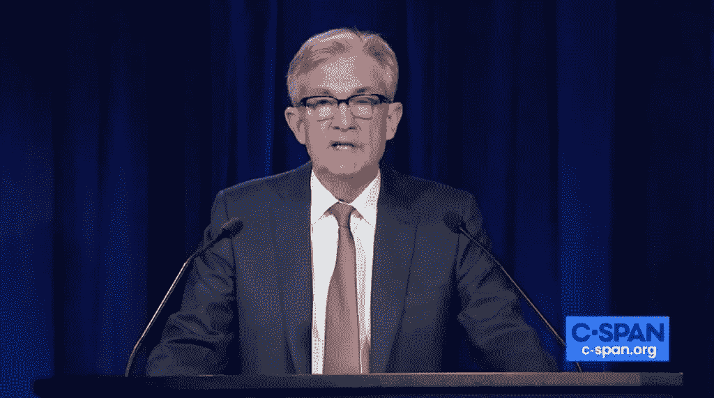

# 美联储可能已经完成了目前所能做的拯救经济的工作

> 原文：<https://medium.datadriveninvestor.com/the-federal-reserve-may-be-about-done-with-what-it-can-do-for-now-to-bail-out-the-economy-11d7e75ae8f?source=collection_archive---------3----------------------->

This is what a Federal Reserve news conference looks like these days

## 此外，为什么特朗普政府试图向实际小企业发放更多小企业贷款的举措实际上弊大于利

我们已经写了很多文章来赞扬美联储在应对由新冠肺炎引起的前所未有的经济危机时所做的英勇努力。尽管特朗普政府和国会在各自的救助计划上争论不休。当他们推出这些计划时，发现其中最大的一个——[工资保护计划](https://www.sba.gov/funding-programs/loans/coronavirus-relief-options/paycheck-protection-program) —被严重破坏。(我们一会儿就会谈到这一点)。

我们赞扬了美联储主席杰罗姆·鲍威尔(Jerome Powell)卓越而冷静的领导(T4)。鲍威尔经常警告说，美联储的权力是有限的，即使他已经将这些限制远远超出了央行以往的权限。但现在，它可能已经走到了极限。

金融市场普遍认为美联储主席鲍威尔周三在视频新闻发布会上承诺在可预见的未来将利率保持在零左右是积极的。鲍威尔还承诺继续执行美联储为支持企业和个人而实施的所有计划。尤其是那些旨在保持信贷流动的措施。因为即使利率为零，如果银行不敢借钱给任何人，那也没关系。

 [## 现金为王，比我们想象的更强大|数据驱动的投资者

### 2020 年 3 月 12 日，在川普总统宣布新冠肺炎进入国家紧急状态的前夕，纽约时报报道…

www.datadriveninvestor.com](https://www.datadriveninvestor.com/2020/03/26/cash-is-king-more-potent-than-we-think/) 

尤其是对地方政府的支持，这是一个政治上的烫手山芋。因此，目前州政府和地方政府只能得到美联储的帮助，而且这种情况可能会持续一段时间。(但美联储只能真正放贷，不能拨款，因此只有联邦政府才能真正为州和地方政府提供长期稳定)。

但是我们不确定这些都是完全积极的。因为事情是这样的:鲍威尔用了很多“继续”这个词。这意味着美联储可能没有更多的新举措。

现在，鲍威尔确实强调了美联储不受某些美元数额的限制，所以这给了一些灵活性。与此同时，美联储无法救助破产的公司、个人或市政当局。

“还需要做更多吗？”鲍威尔反问道。然后，他回应道:“我认为这个问题的答案将是‘是’”。

因此，尽管鲍威尔为美联储在未来必要时采取更多行动留下了空间，但他根本没有具体说明可能会留下哪些选项或设施。点击下面的照片观看剪辑:

Federal Reserve Chair Jerome Powell

债务总额远远超过经济增长也总是存在巨大风险。这意味着美国正在背负巨额债务，如果经济不迅速复苏，它可能负担不起。尽管美联储主席鲍威尔一再明确表示，现在不是对这种担忧采取行动的时候。他是对的。此外，这不是美国目前独有的情况；许多其他工业国也感受到了类似的经济冲击。

言外之意是，美联储似乎正在关注通货膨胀，因为政府现在正在印刷和支出大量的货币。

当太多的美元四处流动，追逐太少的商品时，就会发生通货膨胀。因此，商品变得更值钱，美元变得更不值钱。美联储和联邦政府都在向经济注入比以往更多的现金。尽管没有通货膨胀，但很大程度上是因为消费者对商品的需求下降，能源价格也很低(部分原因是需求下降，但部分原因是全球价格战)。但不能保证它会一直这样。因此，央行必须保持警惕。(尤其是对于一个总是把钱扔向空中，让未来的首席执行官们处理其长期影响的总统来说)。

与此同时，通货紧缩也是一种风险。如果经济进入一个深度、长期的衰退阶段，价格开始下跌，因为人们买不起东西。经济活动减少可能导致工作岗位减少和工资降低，从而导致价格下跌，进而导致经济活动更加减少。因此，通货紧缩被认为是特别危险的。

因此，至少看起来美联储现在暂停了一下。直到它对未来几个月和几年的经济走势有了更多的了解。

这反映在美联储主席的更多声明中:

> *这是一种新的不确定性*

**并且:**

> ***"* 很明显，我们正进入比过去风险更大的领域。这没关系。我认为这是我们应该做的。这是一个很平常的时间*。***

**并且:**

> **“我们将看到第二季度的经济数据，这比我们看到的任何经济数据都要糟糕。”**

**但是鲍威尔说，他有信心，即使在找到疫苗之前，经济就可以开始复苏。**

**与此同时，财政部和小企业管理局正试图进行干预，使政府的薪酬保护计划对小企业更加公平。但是他们所做的有一个很大的潜在问题。他们正在做的是在某些指定的时间内关闭美国最大的银行，这样较小的银行可以进来，帮助他们通常代表的较小的企业获得更好的机会。**

**我们看到的问题是。在纽约、波士顿、洛杉矶和旧金山等大城市，小企业仍然经常使用大银行开展业务，因为他们大多没有太多的选择:大银行主宰着那里的市场。因此，尽管政府的最新举措可能会帮助郊区或农村地区的一些企业(特朗普的许多支持来自这些地方——当然是巧合)，但它可能不会对大城市的小企业有那么大的帮助(大城市通常是蓝色的，不支持特朗普——当然也是巧合)。事实上，这可能会让大城市的小企业获得贷款变得更加困难，因为它们已经在与拥有更富有客户的大银行打交道了。这些银行已经私下贷款数亿美元给那些富裕的客户，并会优先考虑尽一切可能确保这些贷款得到偿还。因此，现在政府介入并限制这些银行的准入，可能会进一步限制需要现金的小企业的准入，至少在大城市是这样。**