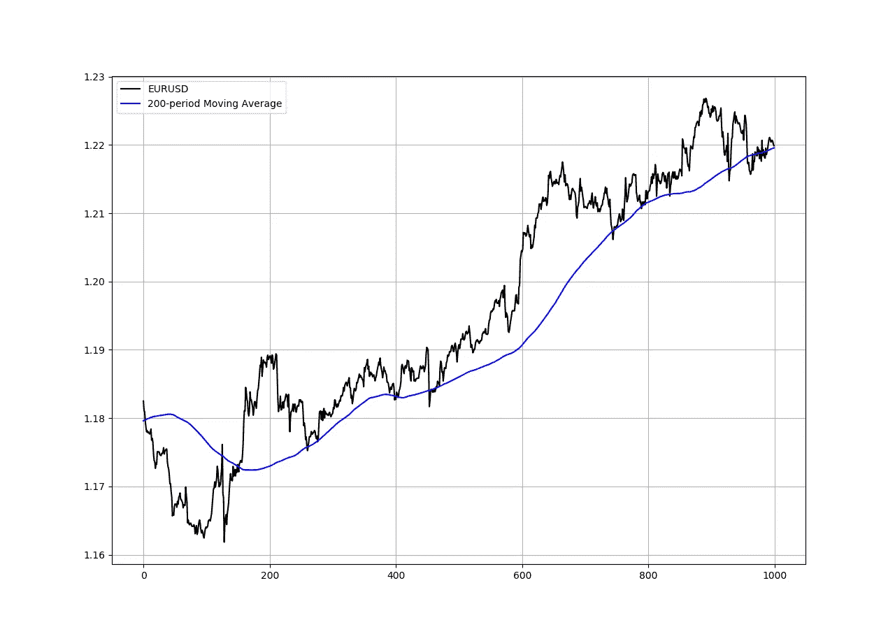
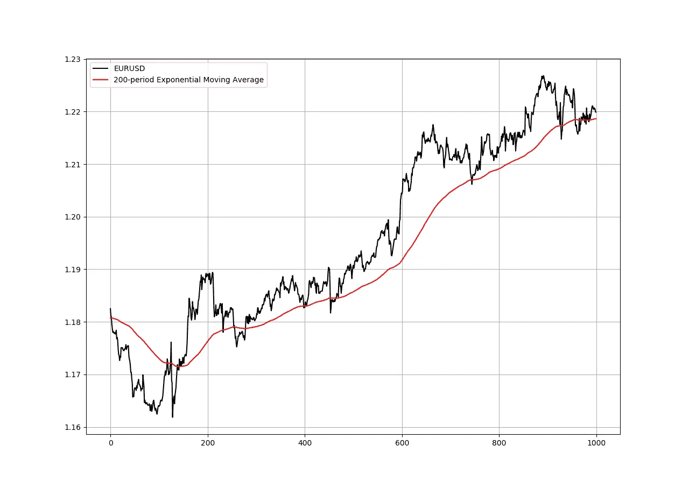
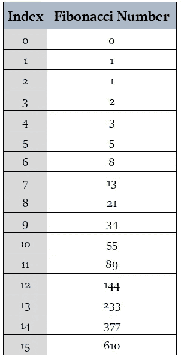
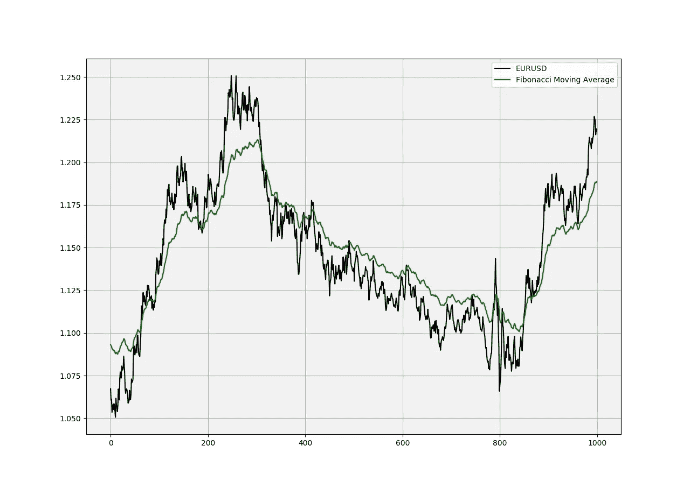
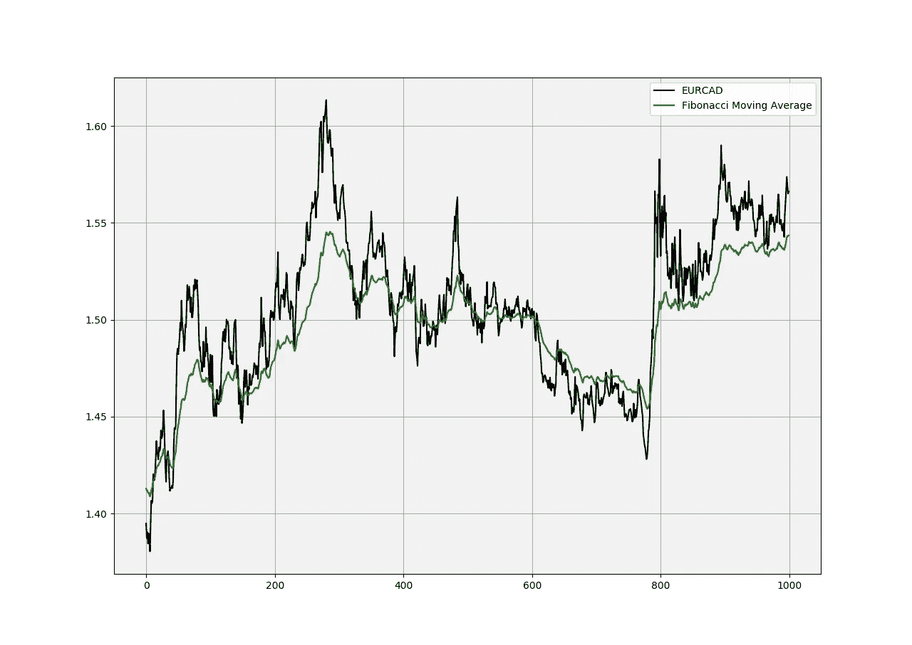
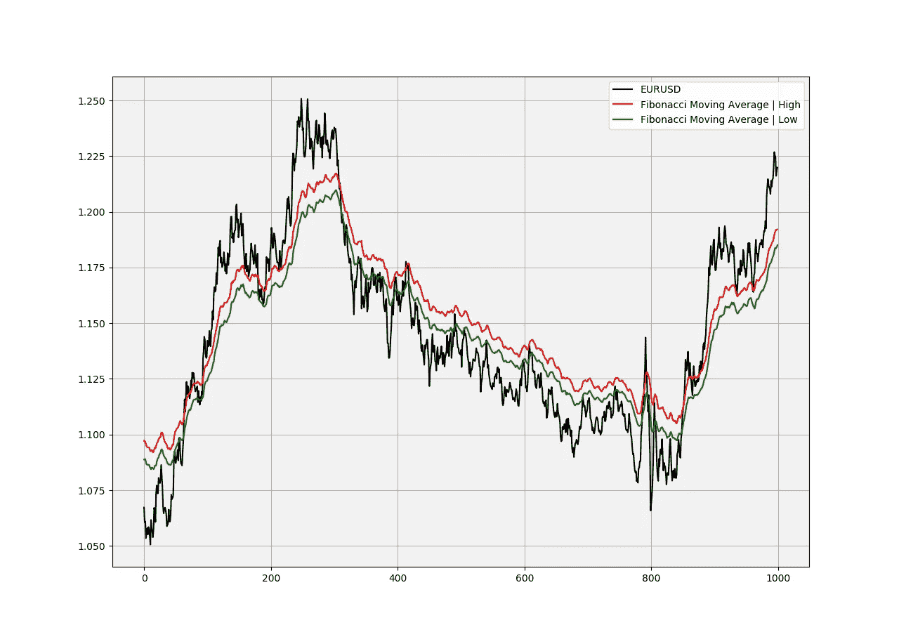
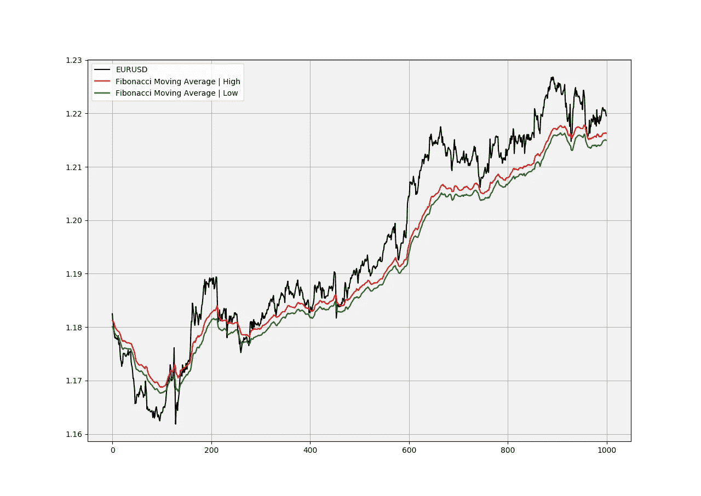

# 斐波那契移动平均线。Python 中的新交易领域。

> 原文：<https://medium.datadriveninvestor.com/the-fibonacci-moving-average-new-trading-horizons-in-python-f2d0f8c86222?source=collection_archive---------0----------------------->

## 创建斐波那契移动平均线来帮助趋势检测。


如果我必须为我的余生选择一个技术指标，那就是均线。由于它们的简单性、灵活性和可见性，它们是最有用和决定性的技术因素。每个人都看着它们，跟随趋势，寻找支撑位和阻力位。

在这篇文章中，我将介绍一种新型的移动平均线，我称之为斐波那契移动平均线——FMA。这个指标的作用和普通均线一样，但是反应能力更强，对市场波动的反应更快，并且有更好的支撑位和阻力位。首先从移动平均线和斐波纳契数列的概念开始，稍后我将展示如何创建斐波纳契移动平均线，然后展示 FMA 的增强版本。

在 Python 的 ***新技术指标成功后，我刚刚出版了一本新书。它对复杂的交易策略进行了更完整的描述和补充，Github 页面致力于不断更新代码。如果你对此感兴趣，请随时访问下面的链接，或者如果你喜欢购买 PDF 版本，你可以在 Linkedin 上联系我。***

[](https://www.amazon.com/gp/product/B09919GQ22/ref=as_li_tl?ie=UTF8&camp=1789&creative=9325&creativeASIN=B09919GQ22&linkCode=as2&tag=sofien-20&linkId=bc5df3f6ab0f3af2df79641c56b949ba) [## 交易策略之书

### 亚马逊网站:交易策略之书:9798532885707: Kaabar，Sofien:书籍

www.amazon.com](https://www.amazon.com/gp/product/B09919GQ22/ref=as_li_tl?ie=UTF8&camp=1789&creative=9325&creativeASIN=B09919GQ22&linkCode=as2&tag=sofien-20&linkId=bc5df3f6ab0f3af2df79641c56b949ba) 

# 移动平均线的概念

均线帮助我们确认和驾驭趋势。它们是最著名的技术指标，这是因为它们的简单性以及它们为分析增值的良好记录。我们可以用它们来寻找支撑位、阻力位、止损位和目标位，并了解潜在的趋势。这种多功能性使它们成为我们交易中不可或缺的工具。



EURUSD with its 200-period Simple moving average. (Image by Author)

顾名思义，这是一个简单明了的平均数，在统计学和我们生活中的任何地方都会用到。它就是观察值的总和除以观察次数。从数学上来说，它可以写成:


Image by Author.

我们可以看到移动平均线提供了不错的动态支撑和阻力位，万一市场下跌，我们可以从这里下单。

```
def ma(Data, lookback, what, where):

  for i in range(len(Data)):
      try:
        Data[i, where] = (Data[i - lookback + 1:i + 1, what].mean())

            except IndexError:
                pass
    return Data
```

另一个更动态的均线是指数均线。它的想法是给最近的值更多的权重，从而减少价格和平均值之间的差距。



EURUSD with its 200-period Exponential moving average. (Image by Author)

注意当趋势强劲时，指数移动平均线比简单移动平均线更接近价格。这是因为它赋予最新值更大的权重，因此平均值不会停留太远。要用 Python 编写输出这种平均值的函数，可以使用下面的代码片段:

```
def ema(Data, alpha, lookback, what, where):

    # alpha is the smoothing factor
    # window is the lookback period
    # what is the column that needs to have its average calculated
    # where is where to put the exponential moving average

    alpha = alpha / (lookback + 1.0)
    beta  = 1 - alpha

    # First value is a simple SMA
    Data = ma(Data, lookback, what, where)

    # Calculating first EMA
    Data[lookback + 1, where] = (Data[lookback + 1, what] * alpha) + (Data[lookback, where] * beta) # Calculating the rest of EMA
    for i in range(lookback + 2, len(Data)):
      try:
        Data[i, where] = (Data[i, what] * alpha) + (Data[i - 1, where] * beta)

            except IndexError:
                pass
    return Data
```

在我们继续学习斐波纳契数列之前，让我们记住指数移动平均线的概念。

# 斐波那契数列

该序列遵循以下独特的模式:


这些数字是通过将后面的前两个数字相加得到的。在 13 的情况下，它被计算为 8 + 5，因此公式为:


这给了我们使用以下代码对其进行编码的直觉:

```
def Fibonacci(n):
   if n == 1:
      return 1

   elif n == 0:   
      return 0 

   else:                      
      return Fibonacci(n - 1) + Fibonacci(n - 2)
```

下面的函数根据斐波纳契数的索引给出了它的值。索引就是下表中的数字顺序。



Fibonacci Table. (Image by Author)

现在，如果我们使用该函数并查看其结果，我们会更好地理解。

```
fib(14)
**# Output: 377** fib(5)
**# Output: 5**
```

现在，从上面看到的指数移动平均线和斐波纳契数列，我们将创建新的指标，斐波纳契移动平均线。

如果你也对更多的技术指标和使用 Python 创建策略感兴趣，那么我关于技术指标的畅销书可能会让你感兴趣:

[](https://www.amazon.com/gp/product/B08WZL1PNL/ref=as_li_tl?ie=UTF8&camp=1789&creative=9325&creativeASIN=B08WZL1PNL&linkCode=as2&tag=sofien-20&linkId=e3cb9716bb6a07cf6c8b9fb585412b07) [## Python 中的新技术指标

### 亚马逊网站:Python 中的新技术指标:9798711128861: Kaabar，Sofien 先生:书籍

www.amazon.com](https://www.amazon.com/gp/product/B08WZL1PNL/ref=as_li_tl?ie=UTF8&camp=1789&creative=9325&creativeASIN=B08WZL1PNL&linkCode=as2&tag=sofien-20&linkId=e3cb9716bb6a07cf6c8b9fb585412b07) 

# 斐波那契移动平均线——FMA

斐波纳契移动平均线是一个使用选定斐波纳契数回看的等权重指数移动平均线。我的意思是一步一步来:

*   我们使用以下回看来计算指数移动平均线{2，3，5，8，13，21，34，55，89，144，233，377，610，987，1597}。
*   我们用指数移动平均线的总和除以它们的数目。在我们的例子中，我们将除以 15。
*   绘制斐波那契移动平均线和市场价格。



EURUSD Daily data with the Fibonacci Moving Average. (Image by Author)



EURCAD Daily data with the Fibonacci Moving Average. (Image by Author)

很明显，FMA 表现出更好的反应水平，尤其是在价格下跌的时候。交易 FMA 的方法就是当市场接近它时开始反向交易。例如，如果市场正在下跌并走向 FMA，我们可以考虑在该区域附近可能发生的看涨反应。

```
def adder(Data, times):

    for i in range(1, times + 1):

        z = np.zeros((len(Data), 1), dtype = float)
        Data = np.append(Data, z, axis = 1)return Datadef fibonnaci_moving_average(Data, fib_range, what, where):

    for i in range(3, fib_range):

        Data = adder(Data, 1)
        lookback = fib(i)
        Data = ema(Data, 2, lookback, what, -1)

    Data = adder(Data, 1) for i in range(len(Data)):
        Data[i, -1] = np.sum(Data[i, where:where + 15])
        Data[i, -1] = Data[i, - 1] / 15

    return Data
```

# 增强型斐波那契移动平均线——EFMA

如果我们试图通过包括 FMA 的高点和低点来完成财务信息，会怎么样？这将有助于捕捉波动性，并创建更强大的区域，以更好地解释反应是否仍然完好无损。

如果你也对更多的技术指标和使用 Python 创建策略感兴趣，那么我最新的书可能会让你感兴趣:

[](https://www.amazon.com/dp/B08WZL1PNL) [## Python 中的新技术指标

### 亚马逊网站:Python 中的新技术指标(9798711128861): Kaabar，Sofien 先生:书籍

www.amazon.com](https://www.amazon.com/dp/B08WZL1PNL) 

基本的想法是计算高点和低点的 FMA，然后叠加在图表上，这样我们就可以得到一个移动的支撑和阻力区，就像下图一样。



EURUSD Daily data with the Enhanced Fibonacci Moving Average. (Image by Author)

下面是创建 EFMA 函数的 Python 代码。记得要有一个 OHLC 阵列

```
def deleter(Data, index, times):

    for i in range(1, times + 1):
        Data = np.delete(Data, index, axis = 1)return Datadef enhanced_fibonnaci_moving_average(Data, fib_range, high, low, where):

    for i in range(3, fib_range):

        Data = adder(Data, 1)
        lookback = fib(i)
        Data = ema(Data, 2, lookback, high, -1)

    Data = adder(Data, 1)

    for i in range(len(Data)):
        Data[i, -1] = np.sum(Data[i, where:where + 15])
        Data[i, -1] = Data[i, - 1] / 15

    Data = deleter(Data, where, 15)for i in range(3, fib_range):

        Data = adder(Data, 1)
        lookback = fib(i)
        Data = ema(Data, 2, lookback, low, -1)

    Data = adder(Data, 1)

    for i in range(len(Data)):
        Data[i, -1] = np.sum(Data[i, where + 1:where + 1 + 15])
        Data[i, -1] = Data[i, - 1] / 15

    Data = deleter(Data, where + 1, 15)

    return Data
```



EURUSD with its Enhanced Fibonacci Moving Average. (Image by Author)

请注意上面的图表，并将其与本文中使用简单移动平均线和指数移动平均线的前两个图表进行比较。很明显，这张图片对 EFMA 更有帮助。这并不能保证高回报，但有助于找到短期和长期波动的更好水平。

# 结论

为什么写这篇文章？这当然不是填鸭式的方法，也不是盈利战略之路。如果你关注我的文章，你会注意到我更强调如何去做，而不是 T2，这里是 T3，而且我也提供了功能 T4 和不完全可复制的代码 T7。在金融行业，你应该自己从其他外生信息和数据中组合碎片，只有这样，你才会掌握研究和交易的艺术。

## 访问专家视图— [订阅 DDI 英特尔](https://datadriveninvestor.com/ddi-intel)