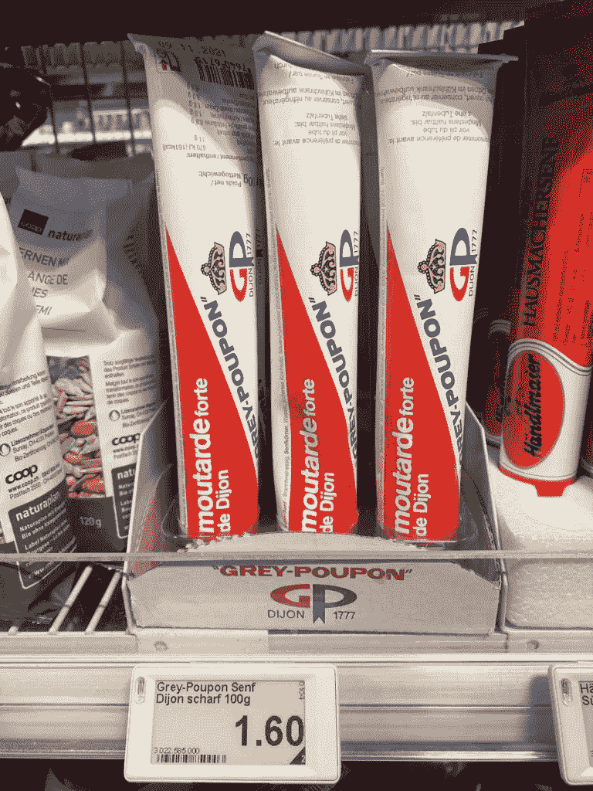
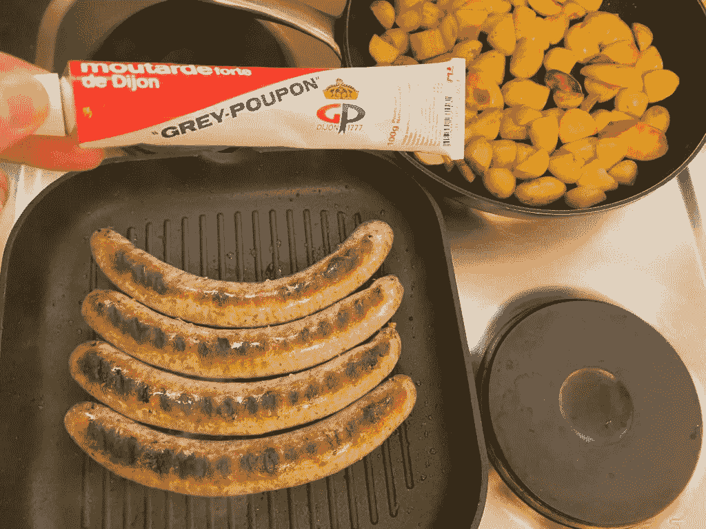
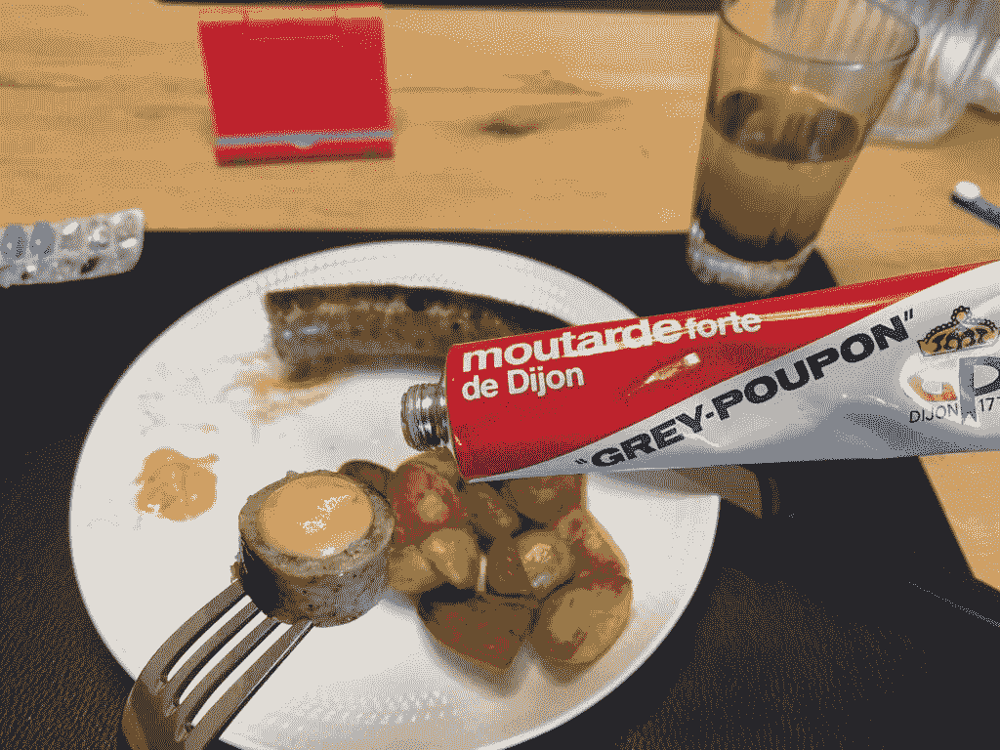
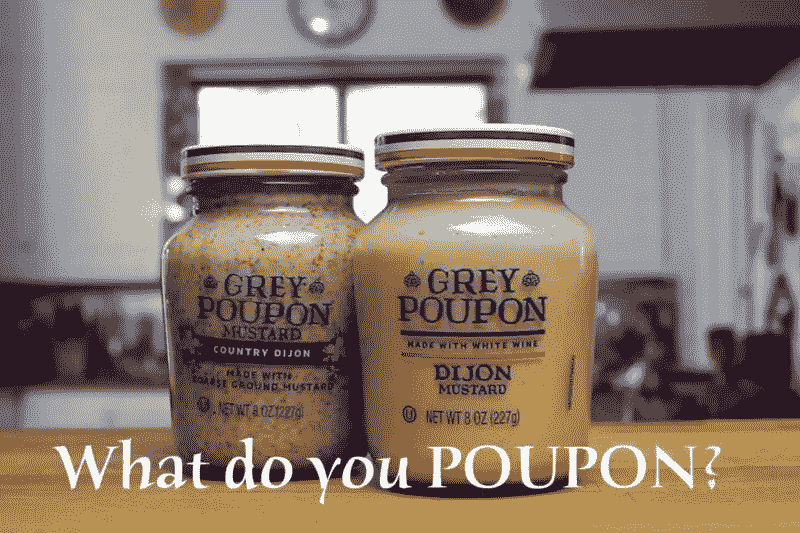

# 生活中美好的事物

> 原文：<https://medium.datadriveninvestor.com/the-finer-things-in-life-d02fc89ea21d?source=collection_archive---------7----------------------->

新年伊始，我问了自己一个简单却深刻的问题:有没有什么事情是我一直想尝试却一直没有去做的？出于一些非常奇怪的原因，我的突触立即想到了一些“非常令人兴奋”的事情。它很别致，有一种奢华的风格，很适合我们刚买的香肠。终于想试试“Grey Poupon”了！芥末酱！！！

如果你以前没有听说过“Grey Poupon ”,不要担心。

不要再看了。我掩护你。对我来说,“Grey Poupon”是我与“奢侈品”联系在一起的东西，但我实际上从未尝试过。不知何故，它一点也不流行。经过一些研究，我发现“Grey Poupon”芥末酱在 20 世纪 80 年代有一个天才的营销活动，这就是为什么它被几个说唱艺术家放在他们的歌曲和视频中。我是从说唱歌曲中了解到这个名字的……“Grey Poupon”听起来很棒，我想不出还有什么比“Grey Poupon”更适合与“Evian”、“Dom Pérignon”或“Filet Mignon”押韵了！

你可能会想，芥末是如何变得如此出名的？好吧，先看看下面这个 1980 年代的广告:

顺便提一下，这是他们的第一次尝试。

更好的紧随其后。

这样介绍芥末肯定是文化的东西。我喜欢他们说这是“负担得起的”和用“真正的白葡萄酒”制成的。但是当然，这是芥末——我想。他们还能说些什么呢？

我去了超市！

令我惊讶的是，我在瑞士发现“Grey Poupon”芥末酱仅售 1.60 瑞士法郎(1.85 美元)。喜欢的话可以直接从[这里](https://amzn.to/2MDjQD9)订购。人们可能会说，这样的奢侈品真的买得起。毕竟，我喜欢在追求“生活中更美好的东西”的背后达成这样的交易。此外，我真的被一家芥末公司的企业营销努力如何影响我的购买决定以及我现在写这篇博客帖子迷住了——四十年后！

是不是很神奇！？

*必做*伟大的营销！

这让我在网上查看了更多的“Grey Poupon”广告。我发现下面的汇编(3 x 30 秒)是“生活中更好的娱乐选择”之一，相信我，你会像我一样喜欢它:

后来我明白了，正是这三个制作精良的广告让“*grey pound*”这种调味品进入了奢华的巅峰。它真的变成了“生活中最美好的事情”之一。

在我的生活中，到目前为止，我已经尝试了不同的芥末酱，并对梅勒第戎芥末酱产生了偏好。

因此，这是很多很多年以来我第一次对 Maille“不忠”。

今天就是看谁是真正的“芥末王”的日子。

香肠进入了锅里…

是的，这些是香肠，不是“菲力牛排”，对你来说有问题吗？

档次太低？

这篇博文给我的主要启示是:

> 享受“生活中美好的事物”并不一定要花费大量金钱！

就像这个例子一样，你已经用少得惊人的钱接触到了“精致的美食”。

*当然还有*，…随着香肠发出咝咝声，我在网上找到了关于“do-you-poupon”香肠的即时反馈:

好吧，既然我的香肠已经差不多做好了，那就没有回头路了。

我的孩子们被这些广告弄得超级兴奋，迫不及待地想尝尝真正的“Grey Poupon”。

我的女儿已经成为一名出色的演员，在我端上晚餐时，她会用最优雅的口音说出“对不起”和“当然可以”。

测试时间到了！

我的孩子们喜欢这种食物，并要求再来几份“Grey Poupon”。虽然我的妻子和我更喜欢浓烈的芥末，但我们的孩子更喜欢“Grey Poupon ”,它是其他温和芥末的真正不错的替代品。他们要求我再买一次。是的，也许我通过这整个练习帮助他们被洗脑了。

请原谅。

测试通过。

我来总结一下！

好的第戎芥末酱在任何厨房都有它的位置。第戎芥末得名于法国小镇第戎，它有着用磨碎的芥末籽和葡萄酒制作芥末的悠久历史，这种芥末有着独特的辛辣味道，而不像用醋和水制作的更“工业化”的芥末。一个伟大的第戎是大胆和厚与主导的芥末味，淡淡的盐和酸，和一个愉快的山葵-山葵类完成的鼻子。它应该是明亮的，辛辣的，有一种令人愉快的，刺鼻的热度。你可以把它用在任何需要提神的东西上，无论是肉、香肠、腌泡汁、三明治、沙拉酱、酱汁还是蘸酱。一旦你尝试和比较了不同的芥末酱，你就可以很容易地和正常的芥末酱进行比较。

简而言之:

用不到 2 美元提升你的晚餐，给它一个豪华的旋转是可能的。在我看来，这是一项很好的投资，物有所值。给你所爱的人看看这篇文章中的视频，你会神奇地提升你的家庭烹饪水平。

但是当然！

现在，把踏板放在金属上，你也可能在天堂着陆:

虽然我与芥末生产商没有任何关系，据我所知还没有，但我确实发现这个关于这种优质芥末的故事非常有趣，如果它启发了你自己去买一些“灰色 Poupon”，如果你和你的朋友一起“传播好味道”，我会很高兴！

传播好品味！

生活中最美好的乐趣之一！

马特(男子名ˌ等于 Matthew)

如果你还没有加入我的收件箱团队，请在下面的框中通过电子邮件订阅，[喜欢我的脸书页面](https://www.facebook.com/financialimagineer)或[在 Twitter 上关注我](https://twitter.com/FI_imagineer)。

免责声明:这篇文章可能包括附属链接。

*原载于 2021 年 1 月 9 日*[*【https://www.financial-imagineer.com】*](https://www.financial-imagineer.com/the-finer-things-in-life/)*。*