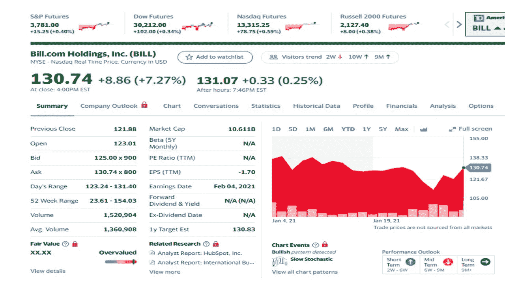
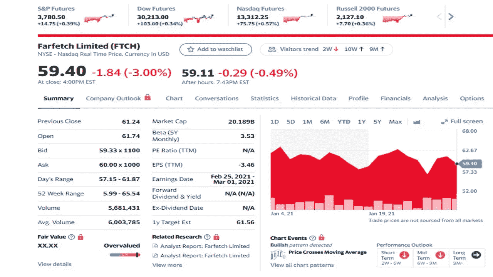
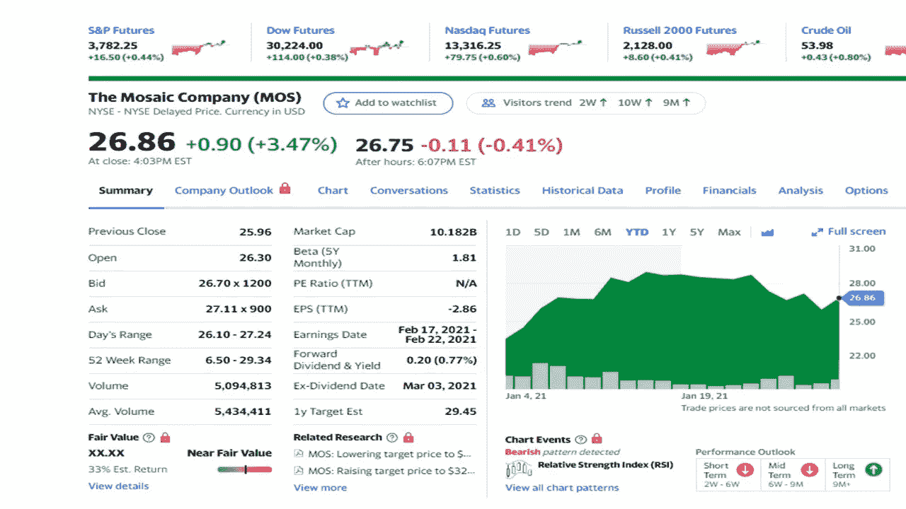
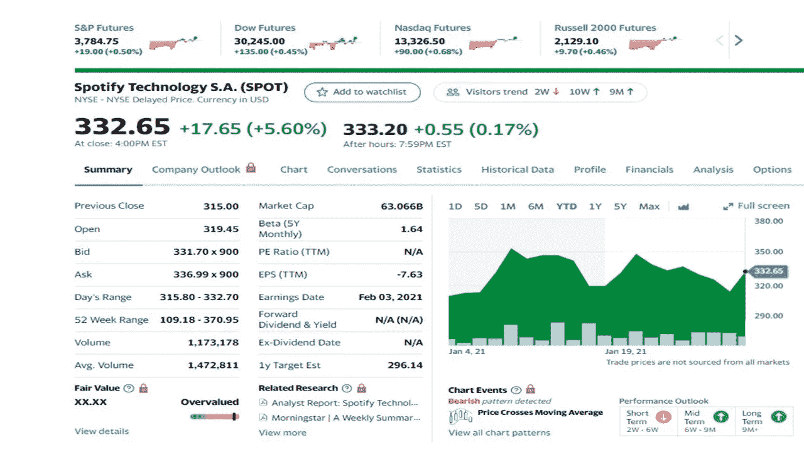
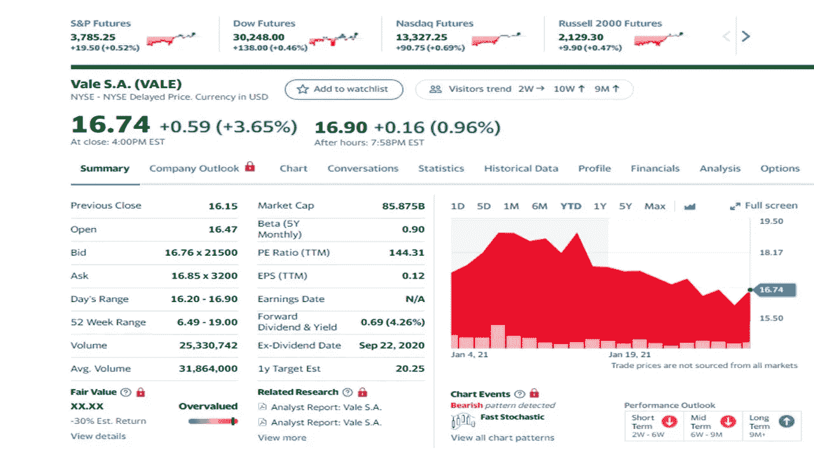

# 二月份投资的五只最佳股票

> 原文：<https://medium.datadriveninvestor.com/the-five-best-stocks-to-invest-in-february-3c344991cf2b?source=collection_archive---------11----------------------->

## 今天没人谈论的热门股票

Photo by Artem Podrez from Pexels

Reddit 用户现在吵得不可开交，但不要忘了这些股票，它们可能会成为 2 月份更好的选股对象。投资是一场长期游戏，有时你必须避开噪音，做出最佳选择。你的血汗钱不是随便扔的。

总体而言，股市表现良好，但有时总有回调的机会。最好的建议是不要被市场波动所吓倒，继续投资。

涵盖的五只股票是:

*   【Bill.com(比尔)****
*   **法尔费奇(FTCH)**
*   **马赛克(MOS)**
*   **Spotify(现货)**
*   **Vale(淡水河谷)**

股票价格记录在 2021 年 2 月 1 日收盘时。

> “睡觉的时候不找到赚钱的方法，就一直工作到死。”
> 
> 沃伦•巴菲特

# Bill.com 控股公司(比尔)

Yahoo Finance

**公司简介**

Bill.com 提供基于云的软件技术，以支持中小型企业(2 到 500 人)的财务运营。该公司提供人工智能(AI)财务软件。

**分析**

自上市以来，该股一直稳步上涨。基于订阅的模式在第三季度实现了正增长，同比增长 53%。预计 Bill.com 将像其他公司(Shopify 和 Square)一样大力帮助小企业。在 11 月和 12 月的强劲增长之后，分析师预计这种增长将持续下去。

# 法菲奇有限公司(FTCH)

Yahoo Finance

**公司简介**

Farfetch 为全球奢侈品时尚提供在线市场，包括美洲、非洲、亚洲、欧洲和中东。该公司在网上和店内经营。商店分布在纽约、拉斯维加斯、伦敦和其他 50 个地方。Farfetch 还与阿里巴巴和历峰(拥有卡地亚和其他奢侈品牌)合作。

**分析**

该股第三季度的上涨带来了销售额的增长(增长 71%)。与阿里巴巴的合作有望带来更多销售额。到 2025 年，Farfeth 对中国的渗透可能会占据奢侈品市场近 50%的份额。11 月份的强劲突破可能会让这只股票在 2021 年继续上涨。

# 马赛克公司

Yahoo Finance

**公司简介**

Mosaic 公司在北美和世界范围内提供浓缩的磷酸盐和钾肥(用于肥料和动物饲料)。该公司还提供用于除冰和水软化剂的材料。产品销售给批发商、零售连锁店和独立零售商。随着天气条件的改善和出口的增加；中国以大买家的身份回归。这些变化的条件有利于迎合农民的公司。

**分析**

最近几个月对磷酸盐和碳酸钾的需求一直很高。另一个原因是商务部最近的一项裁决有利于 Mosaic 对摩洛哥和俄罗斯出口商的价格倾销。这使得价格上升到美国市场水平。分析师预计，这将阻止出口商在卖给农民时降低价格。马赛克将能够提高他们的销售价格。分析师认为马赛克的底线是今年的三倍。

# Spotify 技术公司(SPOT)

Yahoo Finance

**公司简介**

Spotify 在美国、英国和全球提供流媒体服务。该公司提供付费和广告支持的服务。Spotify 为其用户提供在线和离线的音乐和播客流媒体服务。截至 2020 年 3 月，Spotify 在 92 个国家拥有 2.86 亿月活跃用户。

**分析**

Spotify 第三季度末的付费用户(10 美元，无广告)有所增长(比一年前增长 27%)。免费用户(带广告)也增加了(31%)。Spotify 拥有 1.44 亿付费用户和 1.85 亿免费用户。第三季度增长加快，分析师预计 2021 年将继续增长。

# 淡水河谷

Yahoo Finance

**公司简介**

淡水河谷在巴西和其他国家生产和销售用于炼钢的铁矿石。该公司经营贱金属、煤炭和黑色矿物。含铁矿物生产和提取铁矿石。贱金属提取和生产镍和其他副产品，如金、银、铜和其他贵金属。淡水河谷是巴西最大的公司之一，也是全球第二大铁矿石和镍生产商。

**分析**

随着铁矿石价格上涨，随着中国对这种金属的需求增长，生产商再次成为焦点。该公司预计，今年铜和镍的产量将会增长，这两种商品的价格也会上涨。公司债务减少，从 134 亿美元减少到 35 亿美元。第三季度收益为 57 美分(比一年前增长 78%)。第三季度产量增加了。分析师预计今年每股收益为 3 美元。

参见其他投资文章:

 [## 一月股市你应该考虑的五只股票

### 新的一年给你带来新的市场机会

medium.com](https://medium.com/datadriveninvestor/five-stocks-you-should-consider-in-the-january-stock-market-ddd574e1bfc0)  [## 你应该知道的 2021 年投资入门指南

### 作为资本新手，一些简单的事实可以增加你的资源

medium.com](https://medium.com/datadriveninvestor/the-beginners-guide-to-investing-in-2021-that-you-should-know-54a41cd643eb) 

**免责声明**。作者不拥有任何这些股票。

# 参考资料:

[卡博特财富网](https://cabotwealth.com/)

[雅虎财经](https://finance.yahoo.com/)

[**汤姆·汉迪**](https://medium.com/@tomhandy1) 是 Medium 上的顶级作家，前 Quora 作家，也是两个孩子的父亲。他从军队退役，并在几个非营利委员会任职。你可以在推特上找到他 [@tomhandy1](https://www.twitter.com/tomhandy1) 和[人生如游戏](https://medium.com/lifeislikeagame)。

本文仅供参考。不应将其视为财务或法律建议。并非所有信息都是准确的。在做出任何重大财务决定之前，请咨询财务专家。