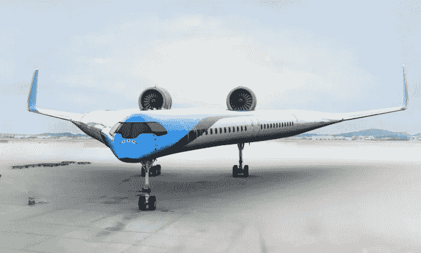
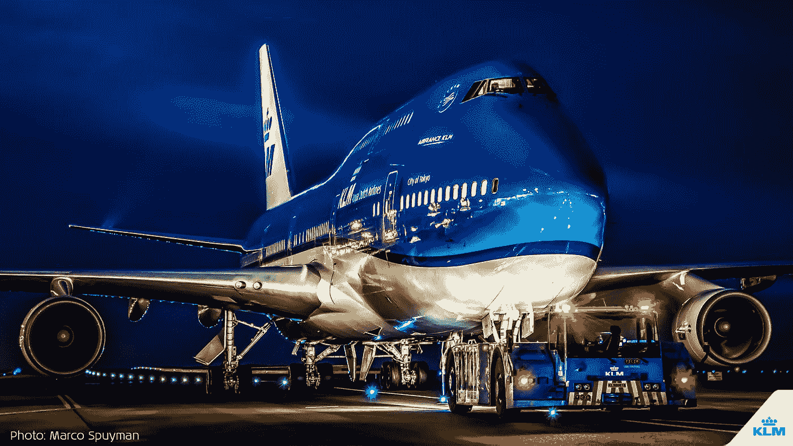
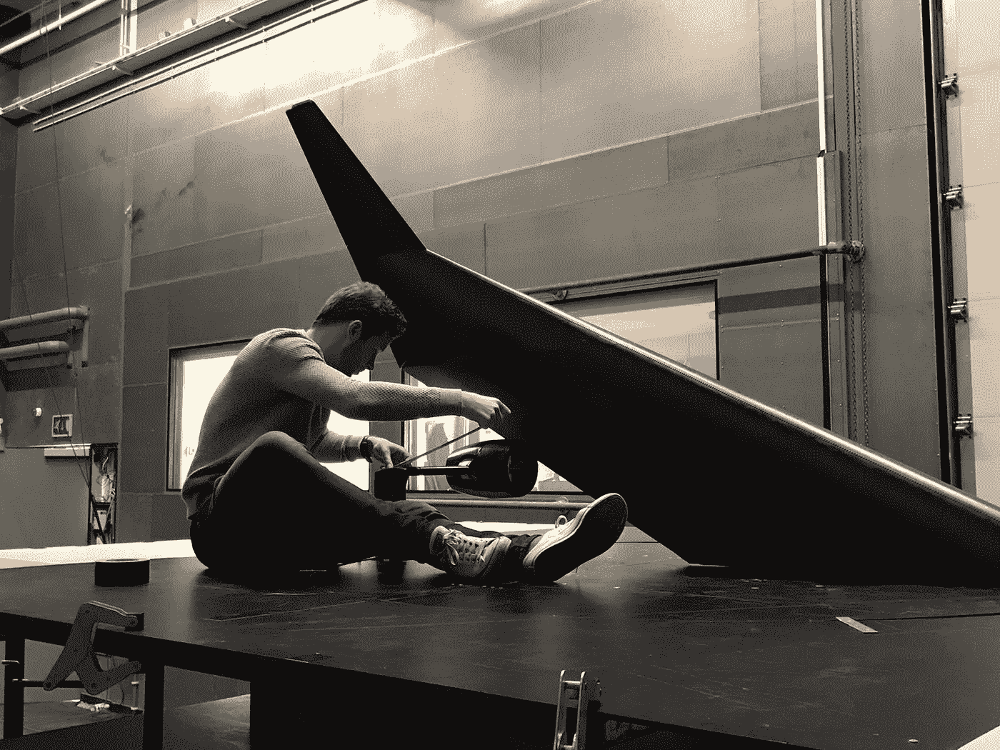

# “飞人 V”气动飞机成功首航

> 原文：<https://medium.datadriveninvestor.com/the-flying-v-aerodynamic-airplane-makes-successful-maiden-flight-47af91371154?source=collection_archive---------4----------------------->

## **这种飞机的外形将减少 20%的燃料消耗**

The ‘Flying V’ Aerodynamic Airplane — Photo by ([www.klm.com](https://www.klm.com/home/us/en))

研究人员已经领导了一次有效的*飞行-V* 的处女航，这是一种现代和环保的飞机，人们可以用它的翅膀在白天运送旅客。

*飞行 V 型飞机的*独一无二的计划将旅行者小屋、货舱和燃料箱放在机翼上，专家相信这种飞机的流线型外形将比现在的飞机减少 20%的燃料消耗。

专家们尝试了一个 22.5 公斤和 3 米比例的尖端飞机模型，该模型由荷兰代尔夫特理工大学的分析师和荷兰航空公司的合作伙伴创造，以使这种被深刻预见的飞机沿着其下一步的发展前进。

## 代尔夫特理工大学

Delft University of Technology / Photo by ([*Delft University of Technology*](https://www.tudelft.nl/en/ae/flying-v/)*)*

高水平的教育和研究是荷兰最大和最古老的技术大学的核心。8 个学院提供 16 个学士学位课程和 30 多个硕士学位课程。超过 25，000 名学生和 6，000 名员工对科学、设计和技术有着共同的兴趣。代尔夫特理工大学的共同使命:为更美好的社会而影响。

## 荷航的组织

KLM Royal Dutch Air Lines / Photo by Marco Spuyman ([www.klm.com](http://www.klm.com))

荷兰皇家航空公司成立于 1919 年 10 月 7 日，是世界上历史最悠久的航空公司，并以其独特的名称运营。荷航集团在阿姆斯特丹总部工作，2018 年为其全球组织提供 214 架飞机，使用 33，000 人。2017 年，荷航集团产生了 100 亿欧元的收入。

## 飞天 V

在 Flying-V 中——最初是柏林工业大学学生 Justus Benad 在汉堡空中客车公司的理论冒险中提出的想法——旅行者小屋、货舱和燃料箱被协调到其机翼结构中。

该计划无法与空客 A350 媲美，但它有着相似的翼展。这使得 Flying-V 可以在航空站利用现有的基础，例如入口通道和跑道。

Flying-V 运载的乘客数量大致相同(标准设计中为 314 人)，载重量也大致相同，为 160 立方米。代尔夫特大学的创业先锋，Roelof Vos 博士:*“Flying-V 比 A350 更适中，与容量的可及性相比，流入表面区域更小。结果反对的声音更少了。这意味着 Flying-V 在同样的距离需要更少的燃料。*

“我们的担忧之一是飞机可能会很难升空，因为之前的计算表明‘旋转’可能是一个问题，”*代尔夫特科技大学*航空航天工程学院助理教授 Roelof Vos 在一份声明中解释道，他领导了这个项目。

> “研究小组优化了缩尺飞行模型以防止这一问题，但是布丁的好坏要靠吃来证明。你需要坐飞机才能确定，”他说。

他们指出，通过远程控制飞机，专家们找出了如何在 80 公里的速度下起飞，同时飞机的飞行速度、点和推力都是按照安排好的。

*Marleen Hillen, MSc Aerospace Engineering / Photo by (*[www.tudelft.nl](https://www.tudelft.nl/))

> "在不久的将来，我们将继续听到和看到很多 V 型飞行器."

**玛琳·希伦，航空航天工程硕士，轨道科学硕士:飞行性能和推进**

专家们努力升级飞机:为了改进遥测技术，研究小组不得不改变飞机的重心和接收线。

在搭载乘客起飞之前，仍有工作要做，以改进飞机:研究人员表示，试飞表明，飞机目前的设计允许过多的*“荷兰滚，*”导致粗糙着陆。

这个学生发现这个项目的实践部分特别令人愉快。首先，他必须自己层压短舱，发动机的外壳，然后他可以在风洞中进行测量。

> 范恩培伦:“最大的挑战之一是严格的截止日期。你在风洞中只有很短的时间，所以你必须提前准备好每一个细节。”

*Van Empelen 的*研究为进一步深入研究 *Flying-V 的*起落架和翼梢小翼的空气动力学行为提供了坚实的基础。同时,“飞行者五号”得到了进一步发展，并成功进行了首次试飞

Sjoerd Van Empelen, MSc Aerospace Engineering / Photo by *(*[www.tudelft.nl](https://www.tudelft.nl/))

> "希望在未来的某一天，我们能看到这架飞机进行全尺寸飞行。"

**Sjoerd Van Empelen，航空航天工程硕士，专业:飞行性能和推进**

> 专家们打算利用从飞机流线型模型的练习运行中收集的信息，允许他们在未来的测试和改进飞行的飞行员测试程序中对其进行编程。

鉴于该计划适合输送液态氢而不是煤油，该小组将指导该模型的更多测试，并愿意给 Flying-V 提供可支持的驱动。

## 感谢您的阅读！📖

## 如果你喜欢这篇文章，这里有另一篇你可能喜欢的文章:

 [## 风力货船是货运的未来吗

### 绿色能源运输可以减少 90%的排放

medium.com](https://medium.com/datadriveninvestor/is-wind-cargo-ships-the-future-of-cargo-b80118baea2c)