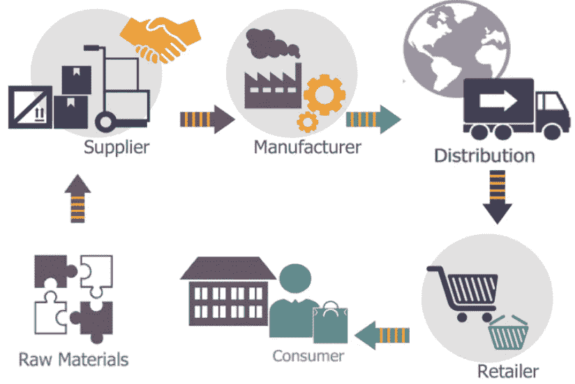
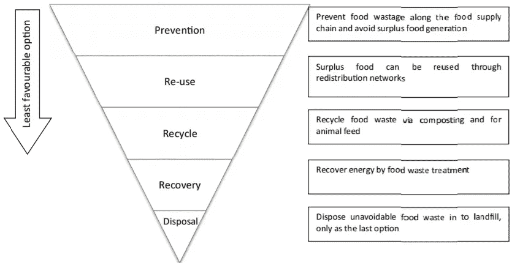
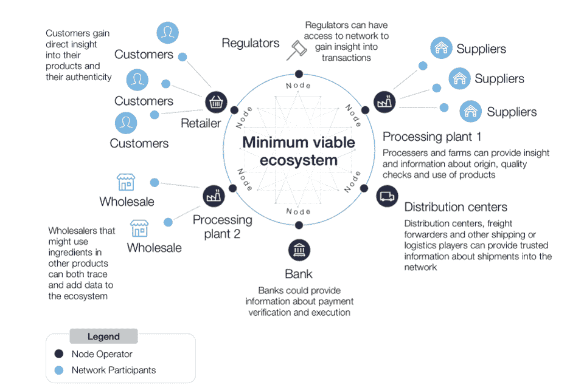

# 食品供应链断裂。

> 原文：<https://medium.datadriveninvestor.com/the-food-industry-is-causing-a-sinkhole-in-world-economics-and-blockchain-seems-to-be-the-new-74b13f753696?source=collection_archive---------16----------------------->

区块链似乎是解决之道。

食品供应链复杂且易受灾害影响，尤其是非快速消费品、易腐商品。一个非常简单的食物链示意图将集中于生产者、经销商和消费者——但像 21 世纪的所有事情一样，食品供应链非常复杂，我们当前的食品供应链是断裂的。今天我们将谈论世界经济论坛(WEF)使用区块链工具包简化链条的方式。

Photo by [eggbank](https://unsplash.com/@eggbank?utm_source=medium&utm_medium=referral) on [Unsplash](https://unsplash.com?utm_source=medium&utm_medium=referral)

今年早些时候，大量经销商和农场受到疫情和家庭订单的沉重打击。这些生产商和经销商必须保持开放，这样饥荒才不会发生。

> “我们的一家牛肉工厂每天为 2200 万人提供食物，因此这些工厂保持运营至关重要”
> — Dave MacLennan，嘉吉公司首席执行官。

大多数食品供应链看起来很简单。它始于供应商将原材料交付给制造商，制造商将货物供应给配送中心，再从配送中心通过零售商销售给客户。

Courtesy: Sidra Malik

但是这些供应链不是很可靠。印度大约 18%的农产品被浪费了，这看起来并不多，但考虑到印度仅出口了 1—2%。印度仅因浪费农产品就损失了近 500 万美元。减少食物浪费有一个分层次的方法。

The food waste hierarchy (Source: Papargyropoulou et al., 2014).

浪费是一个问题，另一个问题是效率或缺乏效率。食品工业在很大程度上仍然依靠纸张来记账。有人试图实现数字化，但互联网普及率低的国家或在用户界面上苦苦挣扎的人口被落在了后面。许多组织使用集中的方法来处理本质上分散的事情，因为没有中央机构来管理特定的供应链。当然，你有一些部门希望形成一个框架，为所有相关人员优化利润，但这些组织容易出现人为错误，被提供不正确的数据，有错误的估计，做出不准确的假设，或者就是腐败。分权一直是确保两党信任的一种方式。从远处看，WEF 似乎旨在用区块链工具包解决 3 个重要问题:

1.  **隐私可追溯性**
2.  **简化全球供应链和自动化**
3.  **让财务变得更简单**

***All 14 modules provided by the Blockchain Toolkit***

区块链是追踪之王。如果你向使用比特币的卖家支付一袋可卡因，你就会知道这些信息将永远留在链条上。区块链本质上是防篡改的，这在缺乏信任的食品行业尤为重要。

区块链工具包进入了一个从根本上动摇食品供应链的时代。从原材料供应商到零售商，所有人都动摇了。非典-COV-2 成为最大的头条新闻。政府不得不发布限购要求，以免出现抢购。这是在 50%的消费者——餐馆、酒店等——作为企业死亡之后。应该是有盈余的。尽管有剩余的收成等待运送，经销商还是倒闭了。MVP 和未煮熟的产品是有区别的，区块链工具包两者都不是。它(几乎)已经准备好被部署，它应该在那里补充行业。

 [## 危机？风投适应的 3 种方式|数据驱动的投资者

### 当我写这篇文章的时候，一场全球性的危机正在发生。这不是第一次，也不会是最后一次。很多事情已经…

www.datadriveninvestor.com](https://www.datadriveninvestor.com/2020/03/22/crisis-3-ways-vcs-adapt/) 

但是这可行吗？

基于区块链的应用受到政府的敌视，我的意思是看看新的数字元，尽管[是一种加密货币，但它是集中的](https://medium.com/thecryptoelement/china-goes-full-offence-with-the-new-chinachain-and-digital-yuan-and-heres-what-it-means-for-you-ed3d1029c4e1)。对分权的不信任是显而易见的。权威想要控制，分权本质上是反权威的。我对这作为政府力量部署不抱什么希望，然而，私营公司有可能沉迷于用区块链工具包或类似的东西来补充他们的链。在一次 meetup @ Vellore 上，[宇宙印度](https://medium.com/u/7139d53a352b?source=post_page-----74b13f753696--------------------------------)的创始人之一 Deepanshu Tripathi 说了一些非常有趣的事情。区块链项目旨在“颠覆”现有技术。但是这种程度的改变通常不受欢迎。相反，开发者和营销人员应该把重点放在提供解决方案上，作为对现有技术的补充和增强。

The MVE proposed by the toolkit devs

区块链产品旨在建立网络用户之间的某种信任，这正是工具包的切入点。这将是非常令人兴奋的看到工具包的长期实施，鉴于一些行业的顶级球员支持它。

🌺嘿，希望你喜欢看那篇文章。我是 Abhinav，密码元素的编辑。研究和写这样一篇文章需要做很多工作，还需要鼓掌或关注👏从你开始意味着整个世界🌍对我来说。对你来说不到 10 秒，对我来说也是伸手可及！你也可以问我任何问题，或者指出任何事情，或者只是说声“嘿”👇在下面。我💓结交新朋友！