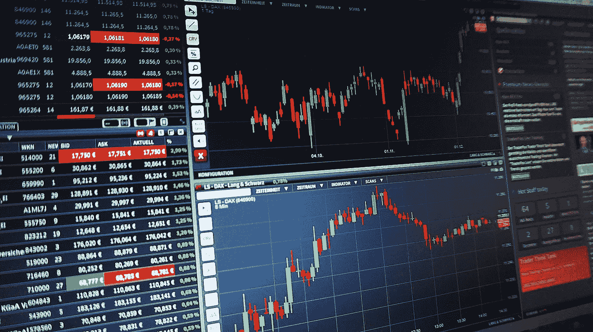
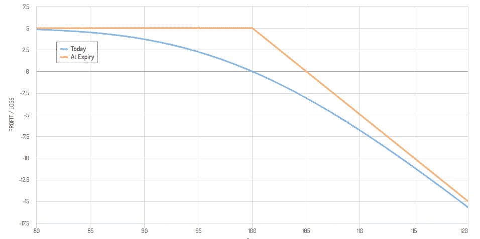
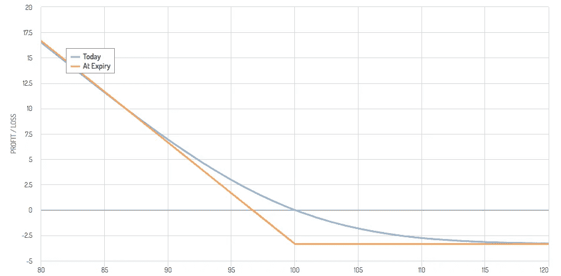
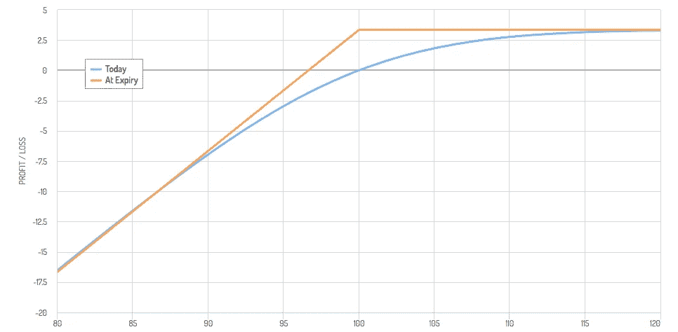
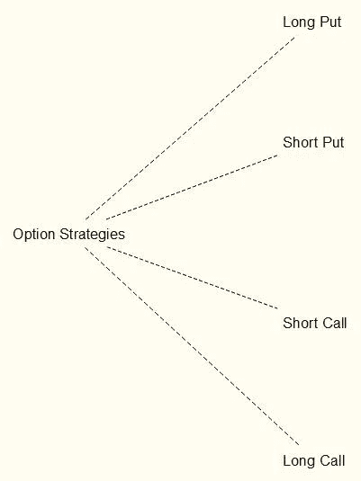

# 四种基本的单脚期权交易及其风险分析。

> 原文：<https://medium.datadriveninvestor.com/the-four-basic-options-trades-and-their-risk-profile-85539985e323?source=collection_archive---------1----------------------->

这篇文章将是我的“选项中的[初学者指南”的后续。在我们学习了什么是期权之后，现在是时候学习如何交易它们了。](https://medium.com/@gourtzilidisdemetris/a-beginners-guide-in-options-da0f9fdc8073)

# 风险简介图表

风险图表是一个简单的 x-y 轴，显示了下划线资产的价格与期权的利润或损失。纵轴显示利润/损失，横轴显示下划线资产的价格变动。

The risk profile chart of a long call. The screenshot has been taken from [https://optioncreator.com/](https://optioncreator.com/)

上图是多头买入头寸风险状况的一个示例，下面将进一步解释。

如上所述，纵轴显示利润/损失，横轴显示下划线资产的价格变动。在垂直 0 处的横向货币显示了盈亏平衡点及其调用“盈亏平衡线”。蓝线显示了下划线资产可能向上或向下移动时的利润或损失。如果下划线资产的价格保持在 100 美元，那么我们收支平衡。如果它走向 120 美元，那么我们将如图所示获利。以防涨到 80 美元。

 [## 总部位于瑞士的 ETP 进入加密交易市场|数据驱动的投资者

### 虽然金融市场几乎没有沉闷的时刻，特别是在引入…

www.datadriveninvestor.com](https://www.datadriveninvestor.com/2019/03/10/swiss-based-etp-enters-the-crypto-trading-market/) 

橙色线显示了我们的头寸在到期日的结果。我们要么损失了购买期权合约的溢价，要么获得了如图所示的美元金额。

# 四种基本选择策略

## 01.买入看涨期权

**解说**

我们的第一个期权策略叫做“**多头叫**，多头是买入的另一种说法。当我们使用这种策略时，我们需要非常看好基础资产。在这种策略中，时间也对我们不利，因为期权到期时可能一文不值，也可能只值一文钱。在这种情况下，我们失去了购买期权合约所支付的溢价。这里需要注意的一点是，一份期权合约等于 100 股股票。这意味着当我们购买 4.34 美元的期权合约时，我们要支付 434 美元。

**用途和市场状况**

这是一种“简单”的套利策略(低买高卖)，或者用于对冲基础资产的空头头寸。在第一个场景中，我们需要下划线资产跟随上升趋势。在第二个例子中，我们需要下划线资产向下划线资产的相反方向移动。

**战略清单(经验法则)**

*   隐含波动率< 40%
*   距离到期的天数= 60 到 90 天
*   0.5 和 0.6 之间的增量
*   风险管理=保费
*   买入原价或略低于原价的执行价格
*   买卖价差=不大于 0.40 美元至 0.50 美元
*   100 至 500 英镑之间的未平仓合约

The risk profile chart of a long call. The screenshot has been taken from [https://optioncreator.com/](https://optioncreator.com/)

## 02.卖空(卖出或卖出)电话

**解释**

做空看涨期权意味着我们向买方提供保险，以防他或她的基础资产对他或她的头寸产生不利影响，我们将以预定的价格从他或她那里购买 100 只基础股票(例如)。在这种情况下，损失可能大于我们的利润，也就是我们获得的溢价。请再次注意，如果我们以 1 美元的价格出售期权合约，这意味着我们投保了 100 只股票，因此我们将获得价值 100 美元的溢价。当我们卖出期权时，我们会提前收到溢价，我们需要保持这种状态，直到期权合约到期。在这种情况下，时间衰减对我们有利。

**用途和市场状况**

我们支持下划线资产的向下移动。如果下划线资产横向移动，我们也可以获利。

**战略清单(经验法则)**

*   100 至 500 英镑之间的未平仓合约
*   卖出价外执行价格(高于自动柜员机 1 或 2 个执行价格)
*   隐含波动率> 50%
*   距离到期的天数= 30 到 40 天
*   0.4 和 0.5 之间的增量

The risk profile chart of a short call. The screenshot has been taken from [https://optioncreator.com/](https://optioncreator.com/)

这张图表意味着，当基础资产的价格保持不变或下跌时，我们的利润将是 5 美元，而当基础资产价格上涨时，我们的风险将上升。

## 03.看跌期权

**解释**

与“看涨期权”完全相反的是“看跌期权”。当我们使用这种策略时，我们需要非常看空下划线资产。在这种策略中，时间也对我们不利，因为期权到期时可能一文不值，也可能只值一文钱。在这种情况下，我们失去了购买期权合约所支付的溢价。这里需要注意的一点是，一份期权合约等于 100 股股票。这意味着当我们购买 4.34 美元的期权合约时，我们要支付 434 美元。

**用途和市场状况**

这是一种“简单”的套利策略(高价卖出，低价回购)，或者用于对冲标的资产的多头头寸。在第一种情况下，我们需要下划线资产跟随下降趋势。在第二个例子中，我们需要下划线资产向下划线资产的相反方向移动。

**策略清单(经验法则)**

*   隐含波动率< 40%
*   Days until expiration = 60 to 90
*   Delta between 0.5 and 0.6
*   Risk management = Premium < 2% of our account’s equity
*   Buying an at-the-money or slightly in-the-money strike price
*   Ask and bid Spread = not greater than $0.40 to $0.50
*   Open interest between 100 and 500

The risk profile chart of a long put. The screenshot has been taken from [https://optioncreator.com/](https://optioncreator.com/)

## 04\. Short (Sell or Write) Put

**解释**

这是与做空位置完全相反的位置。同样，在这种情况下，损失可能大于我们的利润，也就是我们获得的溢价。时间的流逝又一次对我们有利。

**用途和市场状况**

我们支持下划线资产的上升趋势。如果下划线资产横向移动，我们也可以获利。

**战略清单(经验法则)**

*   100 至 500 英镑之间的未平仓合约
*   卖出价外执行价格(高于自动柜员机 1 或 2 个执行价格)
*   隐含波动率> 50%
*   距离到期的天数= 30 到 40 天
*   0.4 和 0.5 之间的增量

The risk profile chart of a short put. The screenshot has been taken from [https://optioncreator.com/](https://optioncreator.com/)

# 两种基本的期权出售策略及其抵押品。

## 裸买入/卖出

裸看涨或看跌期权被称为一种头寸，在这种情况下，我们出售期权合约，而没有任何形式的抵押品来弥补我们的头寸，以防头寸对我们不利。

## 备兑买入/卖出期权

转换看涨或看跌期权就是这种情况，我们持有下划线资产(乘以 100)，如果我们的头寸不利于我们，我们将把它们转让给期权合同的所有者。

## 现金买入/卖出期权

在这种情况下，如果我们的头寸对我们不利，我们在账户中持有购买标的资产所需的现金量(乘以 100，如果我们出售了股票的美国期权合约)。

出售的期权合同的名称根据我们的抵押资产(如果存在)而变化。

*消息来源*

1.  李·洛厄尔的《选择致富》。
2.  可选阿尔法课程—【https://optionalpha.com/ 
3.  期货和期权市场基础
4.  劳伦斯·麦克米兰的《作为战略投资的期权》
5.  [https://tastytrade.thinkific.com/](https://tastytrade.thinkific.com/)
6.  盖伊·科恩的期权策略圣经

免责声明:

为了投资这些市场，你必须意识到风险并愿意接受它们。不要用你输不起的钱去交易。本文包含的信息仅用于教育目的，不作为任何特定投资的建议。在任何市场交易都有很高的风险，可能不适合所有的投资者。