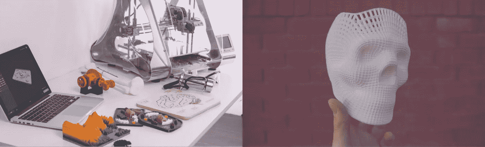

# 第四次工业革命和 3D 打印——是答案吗？

> 原文：<https://medium.datadriveninvestor.com/the-fourth-industrial-revolution-and-3d-printing-is-it-the-answer-fd70a2f825a2?source=collection_archive---------1----------------------->

**Images: Unsplash**

在新的工业革命中，3D 打印如何帮助转型？

## Introduction✏️

3D 打印正在改善许多行业，包括医疗、建筑和航天行业。随着 3D 打印机现在有能力制造人类皮肤、可持续的房屋和耐用的火箭，很难说在不久的将来它们还能做什么。

我将简要介绍第四次工业革命和 3D 打印，以及 3D 打印如何推动这场革命向前发展。我还将讨论一些使用 3D 打印来推动业务发展的公司。

**Image: Canva**

## 什么是第四工业 Revolution❔

第四次工业革命正在改变工作场所、商业和工作的世界。随着我们从一个完全物理的世界走向一个数字和物理融合的世界，我们正在模糊这些领域之间的界限，以及在最近的工业革命中在工业中工作意味着什么。这场革命非常重要，因为它正在影响从医药到制造的每一个行业。

第四次工业革命中值得注意的最大变化之一是我们以前由人类执行的许多任务的数字化。例如，预订酒店、预订航班和在商店结账。这场革命中看到的另一个行业转变是娱乐业的转变。本世纪初，人们购买 CD 上的音乐和 DVD 上的电影。现在，在本世纪初，几乎每个人都通过流媒体平台，如 Spotify 和网飞，消费音乐和电影。

 [## 生活在算法社会|数据驱动的投资者

### 鉴于当今最新技术扩散到我们的日常生活中，毫不夸张地说…

www.datadriveninvestor.com](https://www.datadriveninvestor.com/2018/08/17/living-in-the-algorithmic-society/) 

3D 打印有助于加速我们目前所处的工业革命。在制造业方面，3D 打印将彻底颠覆这一领域。据估计，由于第四次工业革命，在未来 10 年，全球经济将有 4-6 万亿美元被分割和重新分配。人们还认为，3D 打印机的使用将有助于解决我们今天面临的可持续发展问题。据说这是一种“更绿色”的制造形式，因为它只需要制造产品的材料。截至目前，制作一条标准的李维斯牛仔裤需要 **347 升**水。

Image: Unsplash

## 什么是 3D Printing❓

三维打印是从数字文件制作实物的过程。3D 打印是通过一层一层地构建一个物品来完成的。3D 打印机通常使用塑料细丝来生产物体，以降低成本。它们对企业很有用，因为它们可以快速制造新的、详细的产品，减少人工劳动和时间的成本。除了塑料，你还可以在 3D 打印中使用银、钛、钢和蜡。

3D 打印在 20 世纪 70 年代首次成为一个想法，当时**大卫·e·h·琼斯**(英国化学家和作家)在《新科学家杂志*阿里阿德涅*的定期专栏中讨论了 3D 打印的概念。然而，直到最近，3D 打印一直被视为一个相当困难和昂贵的前景。

如今，我们有了桌面 3D 打印机，它们的形状和大小与普通的 2D 打印机一样。这些打印机对于希望生产小规模原型的爱好者来说是很好的选择。最标准的台式 3D 打印机是 FDM(熔融沉积成型)打印机。FDM 打印机使用塑料(通常是 ABS 或 PLA 塑料)熔化后用于制作文件模型，然后从计算机发送到 3D 打印机。我见过的最好最便宜的 3D 打印机之一是 [Creality 3D Ender-3](https://www.creality3d.shop/collections/3d-printer/products/creality-ender-3-3d-printer-economic-ender-diy-kits-with-resume-printing-function-v-slot-prusa-i3-220x220x250mm) 。这款 3D 打印机售价仅为 309.99 美元，但能生产出高质量的产品。3D 打印最常用的文件类型是 STL(立体平版印刷)文件。

**Image: Canva**

## 3D 打印的当前使用案例🚀

我要讨论的第一家公司叫做[相对论空间](https://www.relativityspace.com/)。这家公司由 Tim Ellis 和 Jordan Noone 于 2015 年创立。他们的总部目前位于加利福尼亚州的洛杉矶。相对论空间利用 3D 打印彻底改变了火箭的制造方式。他们在几天内而不是几年内生产出适用的火箭，颠覆了航空航天工业。

接下来，我们有公司[图标构建](https://www.iconbuild.com/)。Icon Build 由 Jason Ballard 创建，他毕生致力于解决无家可归等问题。他们正与 New Story 和 Echale 合作，利用 3D 打印技术解决无家可归问题。他们的工作产生了深远的影响，因为他们最近在墨西哥托巴斯科推出了第一个 3D 打印社区。他们仅用 24 小时就打印出了 **500** 平方英尺大小的房屋。事实上，在过去的五年里，他们在 T4 建造了超过 2700 栋房屋，容纳了超过 15000 人。

我要讨论的最后一家公司是[organovo](https://organovo.com/3d-cell-bioprinting-for-regenerative-medicine-research-and-therapies/)。由现任首席执行官泰勒 j 克劳奇于 2007 年创立。他们已经开发出 3D 生物打印人体组织的能力。正在打印的组织目前被用于医学研究。由于生产时间和成本较低，这使得新的治疗方法很快可用。该公司还利用其生物打印皮肤来测试美容产品。在 **2015** 年，他们与欧莱雅签署了一份协议，声明他们有权使用他们的技术来测试他们化妆品的安全性和功效。

**Image of 3D printing process: Ines Álvarez Fdez**

## 最后

3D 打印有能力帮助解决许多社会问题，如无家可归和疾病，并将其研究成果用于医学和航空航天工业。

随着我们进入第四次工业革命的早期，重要的是我们要善用这一强大的技术，并解决已经持续了几十年的许多紧迫问题。

*   *所有观点和意见仅代表我个人，不代表甲骨文**