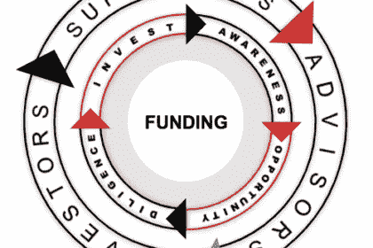
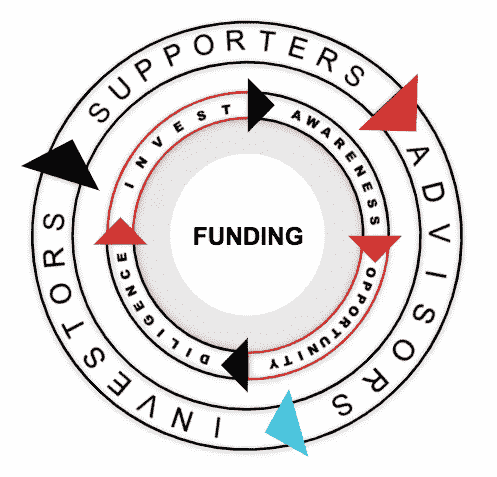

# 资金飞轮

> 原文：<https://medium.datadriveninvestor.com/the-funding-flywheel-a84fecdc629f?source=collection_archive---------15----------------------->

企业和初创公司的创始人很早就知道销售中的一种重要方法，这种方法被称为漏斗。开发产品和服务，市场营销是组织了解*潜在*客户的过程，然后对人们进行描述，以便更好地了解他们的需求和动机。

当然，目标是将人们转化为购买消费者或商业伙伴。

自从约翰逊先生的高中商业基础课开始，这个**漏斗**就占据了我脑海的一个角落。

大约在上个世纪初，广告业高管伊莱亚斯·圣·埃尔默·刘易斯提出了漏斗的概念；1899 年，西方药剂师*第一次注意到*广告*的功能是“抓住读者的眼球，通知他，让他成为顾客。”十几年后，他的论文进一步发展，指出广告是为了“吸引注意力，唤醒兴趣，说服/说服。”*

## 随着时间的推移，对他作品的研究将这个漏斗分成了四个阶段:**意识、兴趣、欲望和行动。**

这些阶段描绘了顾客购物的过程。这个模型让人想起一个漏斗，因为在这一大群人当中，有很多潜在客户位于漏斗的顶端，他们和你做着同样的事情，也许有一天会成为其中的一员。每个人都知道一些事情，但只有一小部分人达到了推动决策的兴趣点，即使如此，这些决策也需要转化为企业的行动，即购买。

在历史上的大部分时间里，这个漏斗完全有意义，并帮助企业和营销人员描述人和计划活动，以满足漏斗每个部分的期望。该组织将共同努力，接触更多的人，改善将人们从一个阶段转移到另一个阶段的过程，并发现新的渠道，通过这些渠道接触其他人或通过自己的渠道介绍新产品。

> 漏斗仍然是今天学习和欣赏营销的最简单的方法之一，例如，迪士尼在影院播放电影前播放预告片，在亚马逊 Prime 上播放预告片，为下一部复仇者联盟电影创造意识。但请考虑一下，这实际上不是漏斗的意识阶段……电影业以更微妙的方式植入了意识:在前一部电影结束时演职员表滚动后导致下一部电影的剪辑，reddit 上泄露的消息，以及我们敬爱的演员向吉米·法伦暗示。是由我们的预告和预告片产生的。随着电影日期的临近，商业广告播出了，口口相传受到了鼓励，更多的脱口秀主持人搭讪我们的演员，他们的兴趣转向了看电影；现在我们知道它将在何时何地上演。当然，人们很容易认为决定已经做出，但是忽略了漏斗的这一部分，一些电影似乎就变得默默无闻了；人们的注意力持续时间很短，我们需要被提醒关注自己的兴趣。我们确实这样做了，随着票房开幕的新闻，Instagram 上的红毯照片，以及电台和播客上对这部电影的谈论，我们发现自己处于漏斗的底部。

**2014 年，大卫·埃德尔曼与** [**弗朗西斯科·班菲**](https://medium.com/u/64a7ed48a09f?source=post_page-----a84fecdc629f--------------------------------) **，与麦肯锡&公司，宣告** [**漏斗已死**](https://eiuperspectives.economist.com/marketing/funnel-dead-long-live-consumer-decision-journey) **。**

**今天，我想让你考虑一下，创业营销已经过时了。**

# 资金飞轮

Edelman 和 Banfi 称之为漏斗的终结，因为人们越来越意识到，品牌与个人的接触点是如此之大和多样(在很大程度上归功于互联网)，以至于将客户旅程简单地视为漏斗已经不再有意义。

> *“今天的频道冲浪客户在考虑之后通常会扩大选择和决定的范围。现在，消费者在通过社交媒体和网络购买产品或服务后，也经常积极参与品牌活动，包括他们的朋友和同行。”*
> 
> *-埃德尔曼和班菲*

创业公司与投资者的接触点是如此之多和多样(很大程度上要归功于互联网)，以至于把投资者如此简单地视为你正在推介的某个人已经不再有意义。

> Edelman 和 Banfi 补充道:“如果没有理解客户的能力，公司将很难做到客户所在的位置。“公司难以理解客户的部分原因是客户行为本身很复杂。”

那时我才明白，*营销从漏斗到飞轮的*演变，如果不是更适合创始人与投资者的关系，也同样适合。

飞轮是一种旋转装置，用于积累、储存和释放能量。这种循环与创业者在创业的各个阶段所做的事情没有什么不同。

飞轮的目的是在能源不连续时提供连续的能量。事实上，你的能量，你的团队和工作的能量，将会经历起起落落；不要把你的工作视为胜利和失败，你所有的努力都是在建立和储存动力，这种动力应该用来推动你前进。

 [## 这么说一家大型风投基金正在投资你的初创公司？4 实际考虑|数据驱动的投资者

### 首先，恭喜你。融资总是需要努力的，一个大的风险投资基金当然是一个大的…

www.datadriveninvestor.com](https://www.datadriveninvestor.com/2020/08/09/so-a-big-vc-fund-is-investing-in-your-startup-4-practical-considerations/) 

飞轮以超出标准能源能力的速率输送能量，飞轮收集能量以便以更大的速率释放能量；这与创业公司在[风险项目](https://collective.mediatech.ventures)中获得的加速差不多，或者，当资金有保障时，团队以更快的创新步伐前进。

# 你的资金飞轮如何工作

## 如果你熟悉向心力的概念，我们的飞轮将能量导向其运动的中心，和/或当动量施加到我们的中心时，当我们远离中心时，会经历更大的速度。

筹集资金时，我们可能会(过度)简化与投资者的接触，并重新思考这个飞轮上的“漏斗”。

***我们的资金飞轮旋转起来。***

*   **意识**仍然是在我们的融资飞轮中使用的正确词汇，我相信你已经在考虑如何与投资者联系；如何让他们对你正在做的事情产生意识(和兴趣)。
*   **机会**是激发投资者兴趣的东西，也是你必须在创业中展现的机会。无论是发现问题和解决方案，还是验证产品的市场适应性，投资者都在寻找一种能为你所做的事情创造更大价值(并带来回报)的资本用途——一种机会。
*   **尽职调查**指大家熟悉的资金尽职调查流程；投资者的决定是对你、你的团队和你的工作尽职尽责的结果。他们在这个过程中的目标是了解你和创业公司，降低风险，并熟悉他们的资本将如何投入工作，而不仅仅是宣传资料上所说的。
*   **投资**，因为这是我们在本案中寻求的所有行动。行动。

营销的漏斗已经死了，你认为这是一个狭隘的过程，心中有目的的看法也应该死了。有了担保资本并不意味着你就完了，对吗？

随着聪明人意识到顾客之旅也在继续，现代营销人员超越了漏斗。一些人将*保留*和*推荐*添加到漏斗中(参见[戴夫·麦克卢尔](https://medium.com/u/ed0a2ab3c5be?source=post_page-----a84fecdc629f--------------------------------)的盗版指标；[这是摘自](https://medium.com/@ms.mbalke/aarrr-framework-metrics-that-let-your-startup-sound-like-a-pirate-ship-e91d4082994b) [Melanie Balke](https://medium.com/u/9c44a9a74dc6?source=post_page-----a84fecdc629f--------------------------------) 的一段话，指出我们的工作是如何继续的，因为我们支持客户、服务合作伙伴，并能与他们一起提高他们对我们业务的兴趣，以及他们是如何宣传所提供的产品或服务的。

作为一名创始人，最重要的是要认识到，你与投资者的关系永远不会结束(除非你选择这样做或者忽视他们)。在我们的飞轮中收到行动，一项投资，我们保持轮子旋转回到意识，因为我们创造了对资金本身的意识，它意味着什么，因为我们从这里开始宣传和促进我们的计划。这反过来会提高投资者的认知度，并带来估值更高的新机会。

***我们的资金飞轮开始转动。***

在我们加速的速度的极限边缘，旋转的不仅仅是获得资金，还有这些利益相关者在你创业的各个阶段所扮演的角色。

在获得资金之前，我们的观众是投资者。我们正与投资者一起创造速度和动力，我们希望投资者能给我们带来意识和机会。随着我们的车轮旋转，一些投资者，在成为我们的投资者之前，成为了**的支持者**。这些投资者会花时间喝咖啡，到处给点反馈，[把你介绍给其他人](https://mediatech.ventures/the-door-is-open-to-venture-capital-why-are-we-told-we-need-an-intro/)，加入你的 [LinkedIn 页面](https://www.linkedin.com/company/mediatech-ventures/)或[脸书群](https://www.facebook.com/groups/mediatech.ventures/)。这样的支持者是你正在与对你的事业有意义的人发展的关系，他们能够并且愿意更多地参与进来，提供建议。一些**支持者**成为**顾问**随着势头越来越猛，顾问成为你的投资者；投资者自己作为支持者，至少有些人作为正式顾问(也许是董事会成员)继续旋转车轮，并且有足够的速度，这样的投资者将再次参与未来几轮融资。

# 用你的资金飞轮来筹款

飞轮受三个基本因素的影响:

1.  你转得多快
2.  摩擦力有多大
3.  它是什么以及如何被创造出来的(它有多大，有多重)

风险投资最成功的筹资对这三者都有一个计划。

和任何飞轮一样，它的速度是通过在最有效的地方施加力来提高的。这就是从漏斗中转移你的观点的真正亮点，因为作为一个漏斗，你的思想可能专注于“会见投资者”、“联系投资者”或“向投资者推销”，你在漏斗的顶部，随意地试图在你的过程中投入更多，电梯推销> 10 张幻灯片演示文稿>财务>条款清单是你要关闭的漏斗。事情不是这样的。

[*我们在车轮中勤奋的过程？揭开并减少摩擦。*](https://seobrien.com/overcoming-obstacles-startups-prevent-hiccup-due-diligence)

如果你的初创公司没有创造太多或足够的机会，那就在那里施加压力，让你的轮子运转起来:创造一个机会，考虑投资者会对你的初创公司做的努力，投资自己的成长或关注，投资者会注意到的。如果你的创业公司有一个机会，比方说你有一项可以授权的专利，但是你没有投入时间和精力将这项专利转化为商业化的风险投资，那么首先在那里施加更多的力，让你的轮子转动起来。

当我们旋转时，我们会遇到摩擦。摩擦力使我们的飞轮变慢；虽然有一天你可能仍然会获得资金，但由于不一致或压力阻碍了你的动力，你会增加几个月的时间。许可专利不仅仅是一个潜在的机会，它也是一种摩擦，需要通过正确的协议和条款来释放；如果专利持有者有限制:摩擦。市场营销是否同意并配合您的产品路线图计划发布的内容？你是在找到投资者的地方还是在你觉得方便的地方与他们联系？

最后，非常认真地欣赏你的飞轮的重量和大小，因为这是一套经常让创始人质疑他们的理智的想法。更多的顾客是一个更重的飞轮

让我重复一遍:更多的顾客是一个更重的飞轮。

那个经常被引用的建议是“一切都是为了客户”还是“客户永远是对的”？在创新领域，在创业公司内部，这很少是完全正确的。

较重的车轮需要更多的能量和动量来旋转。顾客带着期望、需求和偏见而来；顾客会误导，顾客会分散注意力。

但是在你怀疑*的顾客*，并且认为我在暗示你想要一个轻便易转的轮子之前，也要意识到**一个更重的轮子在旋转时会产生更大的能量**。飞轮的密度会产生一个更难控制的动量，但同样的，一个轮子也需要更多的努力来旋转。用优秀的团队、竞争优势和卓越的运营来支持您的车轮，您将拥有一个密度更高的车轮，随着速度的提高，它将保持更高的速度。

记住这个飞轮，现在我们可以用许多你熟悉或正在学习的技巧和技术来接近筹款的过程。现在，那些博客帖子、宣传资料、顾问和孵化器在转动你的轮子时变得有意义，这样你就不只是在转动你的轮子了。

*   意识:你在宣传你的工作吗？你在 LinkedIn、AngelList 或其他地方有社区吗？当地或其他地方的媒体中有没有人宣传你正在做的事情？你在活动中建立关系网，在隔离区工作吗？建立一个客户关系管理系统，比如 FounderSuite 是我的最爱，去了解这些用户，创造知名度。
*   机会:一个可资助的创业公司是指投资者能够从中获得回报的公司。知道你能提供什么样的回报是开始的地方。你的创业公司是准备好满足可转换债券的期望，还是仍处于朋友和家人的阶段，让那些“投资者”为更高的风险做好准备？对于天使投资者或银行贷款来说，机会是什么样的？你在开发对风险投资有意义的机会吗？？
*   **勤奋**:向后工作。任何资金来源在为你提供资金之前都要进行尽职调查，这一点已经非常明确了。如果寻求资助，你能达到首都的目标吗？银行会对你能还上感到满意吗？员工在*当地风险基金*的尽职调查列表上的复选框会阻止他们资助你吗？
*   **投资**:有意义地让资本发挥作用，确保资本投资不仅仅是银行存款，而是有目的地使用资金，让我们的飞轮转得更快。更快地，让循环继续下去，因为我们用资本创造更大的意识，发现新的机会，并消除勤奋过程中应该发现的障碍和其他摩擦。

*原载于 2020 年 9 月 9 日*[*https://seobrien.com*](https://seobrien.com/funding-flywheel)*。*

**访问专家视图—** [**订阅 DDI 英特尔**](https://datadriveninvestor.com/ddi-intel)