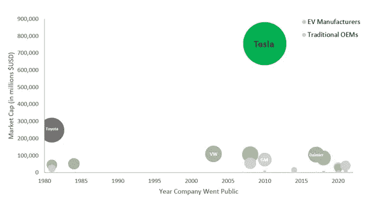
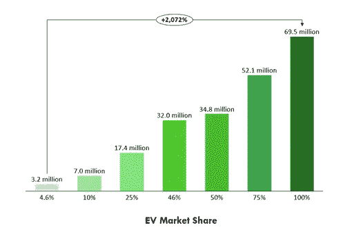
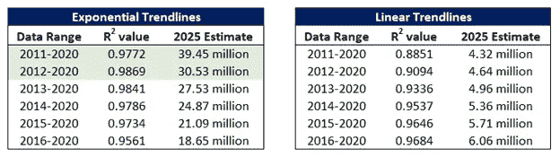
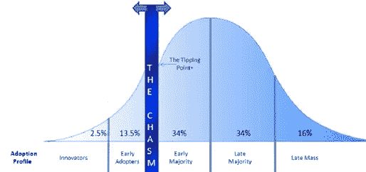
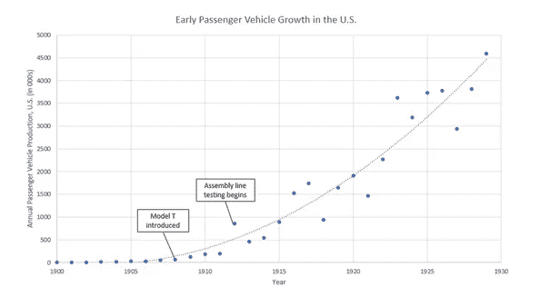
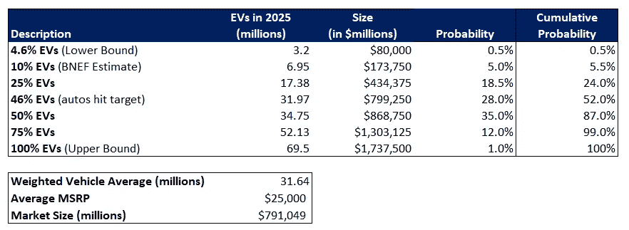
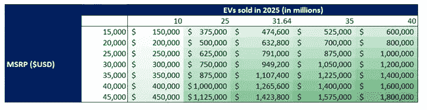

# 未来是电动的

> 原文：<https://medium.datadriveninvestor.com/the-future-is-electric-99fe2398f2cb?source=collection_archive---------3----------------------->

*评估电动汽车市场机会*

几乎每个汽车制造商都承诺在未来几年内生产电动汽车——从特斯拉或 Nio 这样的纯电动汽车制造商，到通用汽车和福特汽车这样的主要内燃机汽车制造商，到 Rivian、Lucid Motors 和 Lordstown Motors 这样的(有时是预收入)新来者。

但是，尽管许多人承诺建设更加电动化的未来，但关于市场份额、需求动态和供应约束的关键问题仍然没有答案。了解整体市场规模会有所帮助。量化一系列生产预期可以揭示潜在的瓶颈或产能限制(如电池所需的特定稀有金属供应不足)，并提供对这些材料投入未来价格上涨的洞察。

精明的投资者不仅会利用市场预测来识别哪些汽车制造商将获得市场份额，更重要的是，在整个电动汽车价值链中，哪些公司将大获全胜。

# **评估市场**

**上下界*上下界***

让我们从确定上限和下限开始。

为了估计 2025 年将销售的电动汽车数量，我们可以从全球汽车市场的规模开始。从 2010 年到 2019 年，每年售出 6950 万辆汽车，预计 2021 年的单位销量为 6940 万辆。[1]未来五年的年销量有可能会增长，但是，考虑到这些数字的一致性，我们假设 2025 年的销量约为 6950 万台。这为我们的市场规模创造了上限——2025 年销售 6950 万辆电动汽车。不太可能的情况，但仍有可能。

接下来，让我们尝试估计一个下界。从技术上讲，下限可能是 2025 年电动汽车销量为零。然而，这种极端情况可能需要黑天鹅事件，例如供应链的关键重要部分关闭。一个更合理的下限是假设电动汽车只是保持目前的市场份额。2020 年全球售出 320 万辆电动汽车(占汽车总量的 4.6%)。[2]鉴于我们预计到 2025 年汽车总销量将保持相对稳定，这意味着我们的下限表明 2025 年电动汽车销量将仅为 320 万辆。

***追加概算***

上限和下限都不太可能是正确的市场规模。为了确定市场规模，我喜欢创建一系列情景，给每个情景分配概率，然后进行加权平均，得出一个估计值。这个范围将包括我们的上限和下限，尽管两者的概率都很低。

重要的是，没有一个预测是准确的。但是一些预测比另一些更有可能。分配概率迫使预测者(在这种情况下是我/我们)通过另一个层次的严密性来思考。此外，通过合并一系列场景，它使预测能够反映出如果单个预测只有*部分*是正确的会发生什么(这比任何单个预测成真都更有可能准确)。

除了我们的上限和下限，我还选择了五个场景:

**电动汽车市场份额= 10%** (根据《2020 年彭博新能源金融电动汽车展望报告》预测)[3]

**电动汽车市场份额= 25%**

**电动汽车市场份额= 46%** (计算方法是将全球最大汽车制造商预测/陈述的 2025 年电动汽车销量相加，然后除以 2025 年预期单位总销量；比 2020 年的水平增加了 10 倍)

**电动汽车市场份额= 50%**

**电动汽车市场份额= 75%**

假设 2025 年全球仅售出 6950 万辆汽车，那么每种情况下将售出多少辆电动汽车:

但是，同样，并非每种情况都有同等的可能性。让我们探讨一些可能使某些市场份额比其他市场份额更有可能的因素。

# **每个场景的现实程度如何？**

在确定每种情况的可能性时，我们会想到几个关键因素:电动汽车的增长率、潜在的材料/供应限制以及实际生产能力。增长率在理解消费者偏好和采纳曲线方面很重要，而供应和产能限制可能会阻碍增长，即使需求存在。

***增长率***

从增长率开始，我们可以用两种方法接近它:线性或指数。查看 2011 年至 2020 年的电动汽车销售数据，我使用指数和线性趋势线测试了相关性。我还在缩短的时间范围内测试了这些趋势线。结果如下:

Data sourced from EV-Volumes.com

首先要注意的是，除了 2016 年至 2020 年，指数趋势线在每个时间段都更具解释性(R 更接近 1)。第二，只有在缩短的时间范围内，线性趋势线甚至优于*最小*相关指数趋势线的 R(2016–2020)。六条指数趋势线中有五条比任何一条线性趋势线更符合数据。最后，值得记住的是指数增长在短期内看起来是线性的。这可能解释了为什么随着时间范围的缩小，线性趋势线似乎有所改善(尽管它们仍然没有指数趋势线好)。

查看数据，我们可以看到完美的相关性(R =1)落在 2011–2020 和 2012–2020 数据之间。值得注意的是，R 没有任何预测能力——在这种情况下，它只是解释了时间流逝如何解释电动汽车销量的任何变化。然而，这确实表明，我们看到的是一条指数增长曲线。如果电动汽车销量继续相对符合两条最具解释性的趋势线，那么我们可以预计 2025 年电动汽车销量将在 3945 万至 3053 万辆之间。

电动汽车市场呈现指数级增长并不奇怪。研究表明，电动汽车的成本曲线符合莱特定律(产量每增加一倍，成本就会降低一个固定的百分比)。在最初几年，这种曲线的含义被放大了:累计产量仍然相对较低，这意味着翻一番可能会很快发生，而成本通常仍然很高，这意味着每一个百分比的下降都代表一个阶梯函数的下降。每一个新的、更低的价格点都能让一种技术接触到对价格更敏感的客户。它还产生了飞轮效应:释放新一波需求通常会刺激更多的生产，这反过来又会让我们更接近另一个累计翻番和额外成本下降的目标。这样，成本曲线呈指数下降的技术也往往会经历需求的指数增长。

在两种情况下，技术往往会成为主流:当一项技术跨越传统采用曲线中所谓的“鸿沟”(约 16%)时，或者当一项技术与它试图取代的现有产品达到同等成本时。大约 4.6%的市场份额，电动汽车还没有达到“鸿沟”。然而，到 2025 年，它们可能会达到与传统内燃机车同等的成本。

Technology Adoption Curve

此外，随着成本的下降和后续采用的增加，我们可能会在未来一两年的某个时候跨越鸿沟，在这种情况下，增长将迅速加快。事实上，我们对 25%市场份额和 50%市场份额的设想可能会比 25%和 10%更相似，尽管从绝对数字来看，25%比 50%更接近 10%。这是因为要从 10%提高到 25%，采用率必须提高 1.5 倍，而要从 25%提高到 50%，采用率只需提高一倍。此外，一旦存在足够的需求，支持性基础设施就会出现。对于电动汽车，这可能看起来像一个不断增长的充电网络，或者在 Nio 的情况下，电池交换站。到 2025 年，充电器可能会像今天的加油站一样普遍。

指数增长是一个很难理解的概念。收养似乎是慢慢发生的，然后突然发生。例如，考虑汽车工业的早期阶段。在 20 世纪初，一辆乘用车的成本约为 2000 美元。当亨利·福特在 1908 年推出 T 型车时，它的零售价约为 850 美元。然后，随着 20 世纪 10 年代初装配线的发明，一辆 T 型车的价格降到了 490 美元。到 20 世纪 20 年代初，T 型车的价格降到了 300 美元左右。从 1910 年到 1920 年，汽车年产量(代表需求)增长了 10 倍。到 1929 年，产量是 1910 年的 25 倍以上。如果我们生活在 1910 年(10 年的实质性数据，大致相当于我们正在研究的电动汽车)，并试图使用线性预测来预测 5 年的增长，估计可能会在 220，000 辆汽车的范围内——比 1915 年的实际产量少近 4 倍。

Source: U.S. Government Census Report, 1945

画面很清晰:早期的汽车工业经历了指数增长。更大的需求刺激了降低成本的创新方法，这反过来释放了更多的需求。这种模式并不是早期汽车独有的——它在许多颠覆性技术中都很常见。我们很可能会在电动汽车上再次看到这种情况。

***政府监管***

政府的激励措施也有助于推动向电动汽车客运车队的转变。中国和美国都为每一辆新的电池电动汽车(“BEV”)的购买提供数千美元的补贴。具有环保意识的政府已经推出了支持电动汽车采用的计划:英国将在 2030 年禁止销售燃气汽车，而加州和许多斯堪的纳维亚国家也将在 2035 年采取类似措施。

随着其他政府加大应对气候变化的力度，我们可能会在未来几年看到更多这类法规。虽然这些法规中的许多——如彻底的禁令——直到我们的预测期结束后才会生效，但它们仍然会影响汽车制造商的行为。建设工厂、获得供应商合同以及设计新的电动汽车都需要时间。因此，我们已经开始看到主要汽车制造商发出信号，表示他们正在计划对电动汽车资源进行大量投资。

***供应约束***

一些人推测，稀缺资源，尤其是电池供应链中的稀缺资源，可能会限制电动汽车的发展。关键的原材料包括钴、锂和镍。鉴于近 60%的钴集中在刚果民主共和国，而锂和镍的供应遍布世界各地，钴似乎构成了更大的风险。[4]

如今，普通的电动汽车电池*含有大约 8 千克的钴。[5]麻省理工学院最近的一项研究表明，2025 年钴的产量可能会超过 30 万吨。[6]麦肯锡估计 2025 年产量将接近 25 万吨。如果这是真的，电动汽车产量将在 3200 万辆左右遇到问题——假设电动汽车是钴需求的唯一来源。更现实的是，电动汽车制造商最多可以获得 50%的钴，产量限制在 10%到 15%左右。

值得注意的是，电池制造商已经开始放弃钴基电池，部分原因可能是出于对供应的担忧。中国最大的电动汽车制造商之一比亚迪已经采用了磷酸铁锂电池。早在 2020 年 2 月，特斯拉就发出信号，他们正在远离钴基电池。[7]在 9 月份的电池日活动中，马斯克概述了生产无钴电池的计划。[8]其他主要制造商，如通用汽车公司，已经宣布他们计划采用钴用量减少 70%的电池。这些仅仅是一些公司已经表明他们打算减少钴的使用。随着无钴电池技术的进步，很可能会有许多其他公司效仿。

虽然可用性和不稳定性的风险给钴的未来蒙上了一层阴影，但锂却是另一番景象。每个电池大约需要 10 公斤的锂。[9]按 2020 年 320 万辆电动汽车计算，这相当于 32，000 吨锂。目前的锂产量估计约为 80，000 吨(产量反映了进入市场的锂，而产能是可用于采矿/加工的锂)。麦肯锡的一项研究认为，2025 年锂(和碳酸锂当量)产能为 120.6 万吨，而其他估计认为可能高达 150 万吨。[10，11]即使在我们最乐观的情况下——2025 年有 6950 万辆电动汽车——电动汽车的生产也只需要 695，000 吨锂，不到预期可用供应量的一半。锂需求估计也基于特斯拉，一家电动汽车供应商，其电池可能比插电式和混合动力电动汽车(PHEVs)使用更多的锂。因此，总的来说，锂的低概率限制了电动车的生产。

镍供应是最后一个大问号。电动汽车电池平均使用 14 公斤镍。[12]2025 年的供应量估计超过 450，000 吨，足以满足 3200 万辆电动汽车的需求。[13]值得注意的是，埃隆·马斯克曾表示[镍供应是他最大的担忧](https://www.reuters.com/article/us-tesla-nickel/please-mine-more-nickel-musk-urges-as-tesla-boosts-production-idUSKCN24O0RV)，并不断敦促矿商提高产量。随着镍消费量飙升，矿商很有可能会增加产量来满足需求。

现在，有些人可能会说，即使锂和镍的供应超过电动汽车的需求，也不会超过这些金属的总需求。毕竟，电动汽车不是唯一使用电池的技术。我不认为这是一个主要问题。事实上，稀缺往往是有语境的。更大的需求刺激更大的投资。支持性的基础设施不仅仅意味着更多的增压器——它将贯穿整个供应链。如果矿产公司相信这些金属会有买家，他们会投资更多的矿山和更好的技术。更多的玩家可能会进入这个领域，或者找到新的方法来制造电池，而不需要使用太多的材料。电动汽车公司放弃钴已经证明他们愿意投资和采用基于材料可用性的新技术。

***产能***

另一个潜在的瓶颈是实际生产能力，即实际生产汽车的工厂的数量和可用性。例如，特斯拉因建造巨型工厂而臭名昭著，这是他们扩大生产规模和满足需求的关键因素。

如有必要，通用汽车或福特汽车等原始设备制造商可以重组现有工厂，生产电动汽车，而不是汽油动力汽车。这需要时间和金钱，但不会像从零开始建工厂那么困难。此外，在过去的一年中，主要汽车制造商已经宣布增加电动汽车投资，从通用汽车的额外 70 亿美元到福特的 220 亿美元。

他们的主要限制是电池的生产，公司不能轻易从现有的 ICE 基础设施中创造。目前，电池产能约为 400 GWh，其中 80%以上产自亚太地区(尤其是中国)。PHEV 电池的电量范围约为 20-70 千瓦时，而 BEV 电池的电量高达 70-100 千瓦时(随着电池技术的改进，预计还会增加)。如果我们假设平均电动汽车电池的存储容量为 70 千瓦时，那么目前的电池容量足够大约 570 万辆电动汽车使用。

Wood Mackenzie 估计，未来十年，锂离子电池的产量将增长四倍，达到 1，300 GWh。[14]Benchmark Mineral Intelligence 是一家领先的电池技术信息提供商，据其估计，目前正在为未来十年规划的锂离子电池容量约为 3，153 GWh。这两个估计创造了约 1850-4500 万辆的电动汽车产能范围。但他们只考虑当前的、有计划的投资。随着电池需求的上升，或者电动汽车制造商推动额外供应，我们可能会看到产能扩张方面的新投资。

***分配概率***

更好地研究了上述考虑因素后，我们可以为每个市场份额情景分配概率。我的过程是查看假设需求可能缺少任何约束的地方，然后反向工作，考虑每个潜在障碍的可能性。

下表列出了每种情况的概率。低端情景(4.6%、10%和 25%)假设供应约束的影响大于预期，特别是考虑到当前半导体短缺和其他电子产品对电池需求增长的影响。将近 2/3 的累积概率被分配到 46–50%的市场范围场景，这与汽车制造商声明的生产目标和我们预计的指数增长曲线一致。最后，两个最重要的情景(75%和 100%)考虑到了有利政府的可能性(例如限制汽油动力汽车的销售)以及比预期更急剧的成本下降，使得电动汽车价格比预期更早下降到低于 ICE 汽车*的*。**

在分配概率后，这些情景的加权平均值表明，2025 年将售出 3164 万辆电动汽车。平均制造商建议零售价(MSRP)为 25，000 美元(约为丰田凯美瑞目前的价格)，市场机会为 7，910 亿美元。

乘用车的平均零售价格目前约为 40，000 美元。考虑到在未来五年内，电动汽车的价格有望低于燃气汽车，25，000 美元的建议零售价并非不合理。然而，使这种假设更加敏感的是，大约 3150 万辆电动汽车创造了 7910 亿至 1.27 万亿美元的(合理的)市场机会。根据 Ark Invest 估计的 2025 年 4000 万辆电动汽车的市场规模，这一机会将增加到 1-1.6 万亿美元。

重要是，电动汽车利润可能无法反映如此强劲的收入增长。潜在的资源短缺和/或电池需求增加可能会增强供应商的实力，对投入价格造成上行压力。同样，供应链的中断——特别是与中国(目前大部分电池加工供应链位于中国)发生冲突的风险——可能会带来意想不到的问题。然而，数据仍然表明，总体生产成本可能会下降。随着累积产量的增长，劳动力变得更加熟练，标准化和批量生产变得更加容易(这反过来减少了所需的熟练劳动力)。

这并不是说每个公司都会盈利。一些公司可能会破产。事实上，有些公司几乎肯定会破产。但历史上没有哪个行业的所有参与者都幸存下来。这就是为什么采取全行业视角非常重要。此外，纵观整个电动汽车行业的盈利潜力，未来看起来非常光明。

# **最后的想法**

这个关于电动汽车的系列一开始试图回答这样一个问题:Nio 能与特斯拉竞争吗？(你可以在这里阅读[)。许多人将 Nio 称为“中国的特斯拉”。围绕电动汽车的未来，市场也出现了广泛的炒作，过去一年似乎有数十家新公司进入该市场。看起来他们不可能都活下来。事实上，随着公司意识到他们需要更大的规模来加速成本下降，我们仍然很有可能看到重大的整合。](https://medium.com/datadriveninvestor/can-nio-compete-with-tesla-45ac8e36401c)

然而，Nio 能否与特斯拉竞争的答案其实很简单:他们不需要这么做。正如本文所展示的，电动汽车市场对这两家公司(以及更多公司)来说都有巨大的机会。特斯拉有望在 2025 年前年产 500 万辆电动汽车，而 Nio 刚刚在合肥为一家年产 30 万辆汽车的新工厂奠定了基础。两者都只代表了总需求的一小部分。问题不再是是否有空间容纳所有这些玩家，而是谁拥有更好的技术，消费者更喜欢谁。目前正在大举投资的公司——在扩大产能、建立强大的供应链、甚至垂直整合电池制造方面——是那些为未来做好准备的公司。

*这是电动汽车系列的第三部分。* [*本系列的第一部分*](https://medium.com/datadriveninvestor/can-nio-compete-with-tesla-45ac8e36401c) *评估了 Nio 的独立运营，并将关键指标与特斯拉进行了比较。* [*第二部分*](https://medium.com/datadriveninvestor/understanding-nios-battery-as-a-service-dc1a38ec2375) *特别关注 Nio 的电池即服务模型，并试图了解其在各种需求场景下的可行性。如果你还没有阅读第一和第二部分，请务必阅读。*

**来源和注释**

*关于所有三种金属的千克/电池的说明:这取决于电池范围、电池成分类型和电池生产商。以上数字是基于现有数据的平均值。

[1][https://www . scotiabank . com/ca/en/about/economics/economics-publications/post . other-publications . autos . global-auto-report . January-27-2021.html](https://www.scotiabank.com/ca/en/about/economics/economics-publications/post.other-publications.autos.global-auto-report.january-27--2021.html)

[https://www.ev-volumes.com/](https://www.ev-volumes.com/)

[3][https://about.bnef.com/electric-vehicle-outlook/](https://about.bnef.com/electric-vehicle-outlook/)

[4][https://www . wired . com/story/a-cobalt-crisis-can-put-the-brakes-on-electric-car-sales/](https://www.wired.com/story/a-cobalt-crisis-could-put-the-brakes-on-electric-car-sales/)

[5][https://www . McKinsey . com/~/media/McKinsey/industries/metals %20 and % 20 mining/our % 20 insights/lithium % 20 钴% 20a % 20 tale % 20 of % 20 two % 20 commodities/lithium-and-cobalt-a-tale-of-two-of-two-commodities . ashx #:~:text = For % 20 example % 2C % 20 当今的% 20 典型的%20EV，以及% 206.6% 20](https://www.mckinsey.com/~/media/mckinsey/industries/metals%20and%20mining/our%20insights/lithium%20and%20cobalt%20a%20tale%20of%20two%20commodities/lithium-and-cobalt-a-tale-of-two-commodities.ashx#:~:text=For%20example%2C%20today's%20typical%20EV,and%206.6%20kg%20refined%20Co)

[6][https://pubs.acs.org/doi/abs/10.1021/acs.est.9b04975](https://pubs.acs.org/doi/abs/10.1021/acs.est.9b04975)

[7][https://www . Reuters . com/article/us-Tesla-China-electric-exclusive/exclusive-Tesla-in-talks-to-use-catls-cobalt-free-batteries-in-China-made-cars-sources-iduskbn 20 c 0 RP](https://www.reuters.com/article/us-tesla-china-electric-exclusive/exclusive-tesla-in-talks-to-use-catls-cobalt-free-batteries-in-china-made-cars-sources-idUSKBN20C0RP)

[8][https://www . sp global . com/market intelligence/en/news-insights/research/tes las-ambiguous-cost-cutting-plans-positive-for-nickel-lithium-if-realize](https://www.spglobal.com/marketintelligence/en/news-insights/research/teslas-ambitious-cost-cutting-plans-positive-for-nickel-lithium-if-realized)

[9][https://www . barrons . com/articles/new-risk-Tesla-other-electric-vehicle-makers-lithium-supply-batteries-51601498472？mod=article_signInButton](https://www.barrons.com/articles/new-risk-tesla-other-electric-vehicle-makers-lithium-supply-batteries-51601498472?mod=article_signInButton)

[10][https://www . McKinsey . com/~/media/McKinsey/industries/metals % 20 and % 20 mining/our % 20 insights/lithium % 20 and % 20 cobalt % 20a % 20 tale % 20 of % 20 two % 20 commodities/lithium-and-cobalt-a-tale-of-two-commodities . ashx](https://www.mckinsey.com/~/media/mckinsey/industries/metals%20and%20mining/our%20insights/lithium%20and%20cobalt%20a%20tale%20of%20two%20commodities/lithium-and-cobalt-a-tale-of-two-commodities.ashx)

[11][https://www . sp global . com/en/research-insights/articles/lithium-supply-is-set-to-triple-by-2025-be-it-be-success](https://www.spglobal.com/en/research-insights/articles/lithium-supply-is-set-to-triple-by-2025-will-it-be-enough)

[12][https://www . adamasintel . com/nickel-deployed-ev-batteries-September-2019/#:~:text = On % 20a % 20 regional % 20 basis % 2C % 20 batteries，high % 20 nickel % 20 content % 20 per % 20EV % 2C](https://www.adamasintel.com/nickel-deployed-ev-batteries-september-2019/#:~:text=On%20a%20regional%20basis%2C%20batteries,high%20nickel%20content%20per%20EV%2C)

[13][https://www . wood MAC . com/news/opinion/how-electric-vehicles-are-driving-the-nickel-sulfate-market/](https://www.woodmac.com/news/opinion/how-electric-vehicles-are-driving-the-nickel-sulphate-market/)

[14][https://www . wood MAC . com/press-releases/global-Li-ion-cell-manufacturing-capacity-to-four-to-1.3-twh-by-2030/](https://www.woodmac.com/press-releases/global-lithium-ion-cell-manufacturing-capacity-to-quadruple-to-1.3-twh-by-2030/)