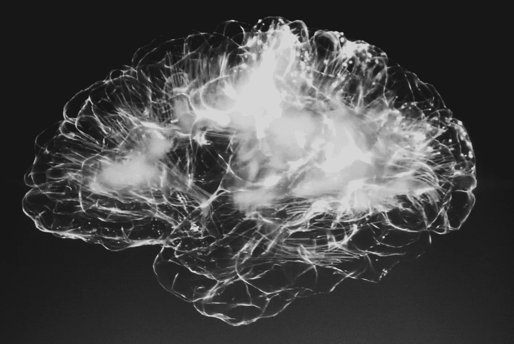
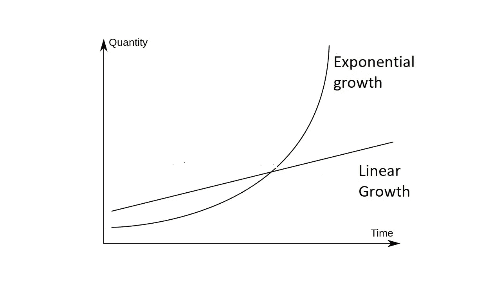

# 未来会比过去发生得更快。

> 原文：<https://medium.datadriveninvestor.com/the-future-is-going-to-happen-a-lot-faster-than-the-past-did-8bc7295f63ef?source=collection_archive---------1----------------------->

## 摩尔定律刚刚服用了类固醇。

1965 年，一位名叫[戈登·摩尔](https://en.wikipedia.org/wiki/Gordon_Moore)的年轻工程师预测，集成电路上的晶体管数量每两年就会翻一番。

> 用外行人的话来说，这意味着计算机的能力将每两年翻一番。

摩尔在一篇推测未来十年计算机这个新兴领域将会发生什么的论文中做出了这个预测。1975 年，他的预测被证明是惊人的准确，一个新的定律诞生了:[摩尔定律](https://en.wikipedia.org/wiki/Moore%27s_law)。然而，该定律甚至比摩尔最初的预测更加深刻。

> 除了计算能力每两年翻一番之外，计算能力的成本也将每两年减半。

事实证明，摩尔定律从那时起就一直适用。计算机的计算能力每两年翻一倍，而所有这些不可思议的新计算能力的成本持续下降。这就是我们在过去几十年里看到的所有技术奇迹的原因。由于摩尔定律，计算机已经从笨重的算术机器，到电子表格，到图形界面，到视频编辑，到智能手机，到人类基因组测序。所有这些都需要越来越多的计算能力，摩尔定律已经实现了。

摩尔定律是指数增长的一个例子，即随着时间的推移，增长速度越来越快。对我们人类来说,[很难理解指数增长。我们更习惯于以线性增长的方式思考，即随着时间的推移以稳定的速度增长。当我们展望未来时，我们倾向于考虑线性增长。](https://www.sciencedirect.com/science/article/abs/pii/S0167487016306596)

让我们看一个实践中的例子。如果我让你预测未来十年技术会发生多大的变化，你可能会思考过去十年技术是如何变化的，然后从现在开始预测。但那是线性思维。这种思维方式认为，未来十年的发展速度将和过去十年一样。

摩尔定律和指数增长告诉我们，未来十年的发展速度将比过去十年更快。未来二十年的发展速度将比过去二十年快得多。

今天计算的尖端是人工智能。

> 用外行人的话说，人工智能是“教”计算机“思考”和“学习”的领域。

它已经存在了一段时间，可能已经以一些小的方式悄悄进入你的生活。网飞“知道”你喜欢什么样的电影。当你使用智能手机摄像头时，它会在人脸周围放一个黄色框，并聚焦在人脸上，因为它“知道”他们是人脸。Siri 或 Alexa“理解”你问它们的问题。

但是摩尔定律在这里也存在，计算能力以越来越快的速度增长。因此，人工智能软件开始做越来越多令人印象深刻和有趣的事情。例如，无人驾驶汽车已经上路。

一个[最近的例子](https://www.vox.com/future-perfect/21355768/gpt-3-ai-openai-turing-test-language)已经获得了很多关注，这是一个叫做 GPT-3 的软件，它在理解和使用语言方面[出奇的好](https://www.theverge.com/21346343/gpt-3-explainer-openai-examples-errors-agi-potential)。[将近 50%的人在比较一篇由软件写的新闻和一篇由真人写的新闻时，分不清是谁写的哪篇](https://arxiv.org/pdf/2005.14165.pdf)。

而这些还是人工智能的早期。摩尔定律告诉我们，未来十年的进步将比过去十年更快、更显著。

随着人工智能成为计算的前沿，自然有专门为此目的设计的专用计算机芯片。这提出了一个问题，摩尔定律是否仍然成立:计算能力仍然每两年翻一番，还是速度已经放缓或加快？

> 越来越多的证据表明摩尔定律的步伐已经加快。差很多。

根据一些计算，人工智能的计算能力现在每 3.4 个月翻一番。很难表达比摩尔定律快多少。两年和 3.4 个月的差别听起来可能不多，但这是线性思维。这是指数增长。我们说的是比摩尔定律快 50-60 倍的速度。

用一些数字来说明，人工智能的计算能力在 2012 年至 2018 年间增长了 30 万倍。摩尔定律会产生 8 倍的增长。

这里有一个更具体的例子。人工智能的一个常见(也非常有用)的任务是对图像中的内容进行分类。一个经典的测试是确定一张照片是狗还是猫。一个更有用的实现将是让自动驾驶汽车确定什么是人，什么是骑自行车的人，什么是树，什么是另一辆车。

2017 年初，在最新的计算机上对 10 亿张图像进行分类需要花费 1 万美元。到 2019 年底[完成同样的任务花费 3 美分](https://ark-invest.com/analyst-research/ai-training/)。这是指数级的增长，比摩尔定律快得多。

上面提到的人工智能语言软件 GPT-3 的功能是其前身 GPT-2 的 117 倍。GPT 3 号比 GPT 2 号晚 16 个月问世，花费了几百万美元的处理能力。如果摩尔定律的这种加速率保持下去，GPT-4 就在眼前，它将非常强大，而且价格相对低廉。GPT-3 已经是让人们震惊的，所以很难揣测 GPT-4 会有什么能力。

指数增长对于人类思维来说是难以想象和预测的。2000 年甚至 2010 年的人很难想象我们今天的技术能力。即使你在场，戈登·摩尔也不可能理解今天的技术。但是他的法律无情地将我们带到了今天。

现在看来，他的定律加速了。这意味着未来将开始更快到来，从现在到 2030 年或 2040 年之间发生的发展将在一些非常根本的方面改变社会。如果你认为智能手机极大地改变了事物，你还没有看到任何东西。

