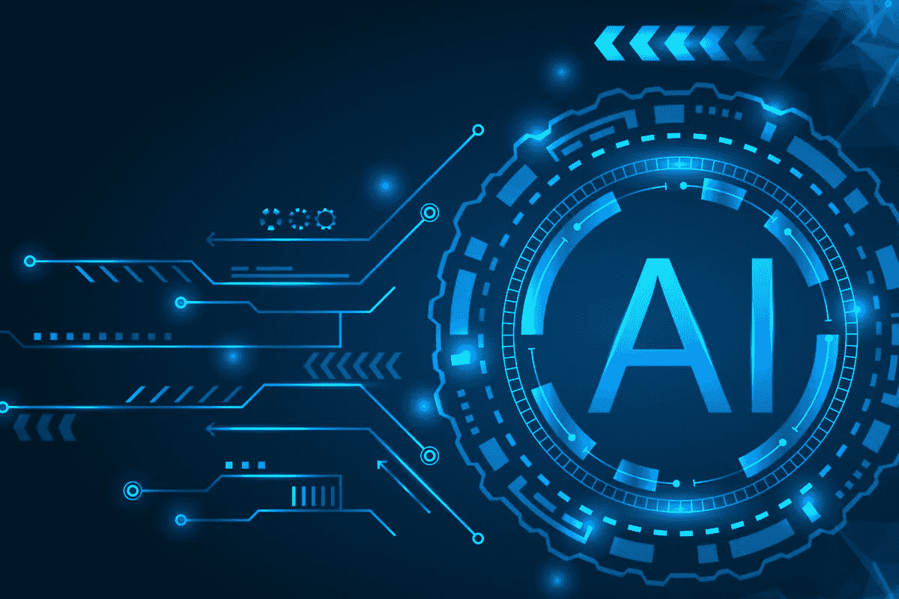
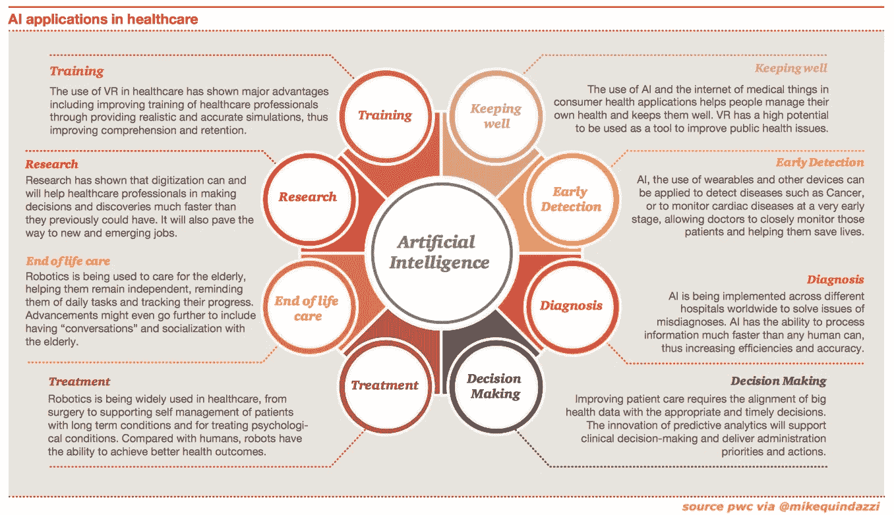
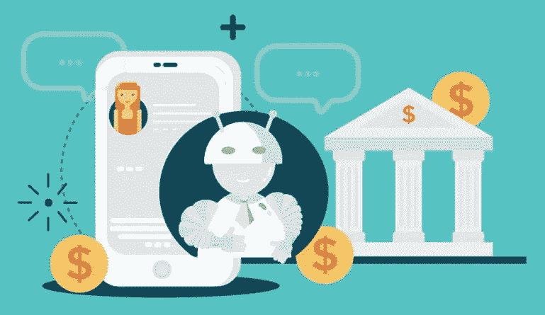
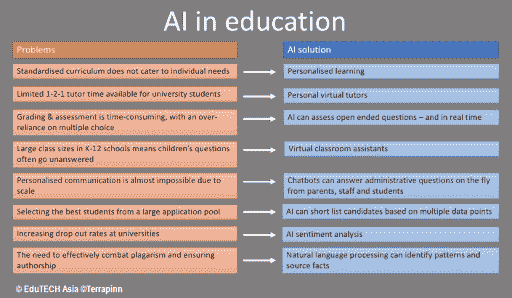

# 人工智能的未来

> 原文：<https://medium.datadriveninvestor.com/the-future-of-ai-9b580c17982d?source=collection_archive---------16----------------------->

在我的上一篇帖子中，我讨论了篮球领域的人工智能，以及它如何帮助改变这项运动——通过帮助球员磨练他们的技能，并让教练能够阅读和做出更好的比赛。然而，篮球(和体育领域)肯定不是唯一一个将获得人工智能援助的行业。

未来十年将会有一批行业被 AI 改造(Wallace，e .，2020)。那么这些领域是什么，这种变化会是什么样的呢？

 [## 如何向风投推销你的早期医疗创业公司？三大挑战|数据驱动…

### Tau Ventures 是种子基金，数字健康是我们投资组合的一半；我们的主要观点是医疗保健市场规模…

www.datadriveninvestor.com](https://www.datadriveninvestor.com/2020/06/07/how-to-pitch-your-early-stage-healthcare-startup-to-a-vc-the-three-main-challenges/) 

## 卫生保健

医疗保健既昂贵又缓慢。医生和护士的工作时间不健康，有数百名病人。人工智能的转变将影响患者接受护理的方式，以及我们进行研究的方式。制药公司永远需要制定和测试药物，但人工智能将有助于将数据投入直接使用。它将使用这些数据把所有的细节放在一起，以便做出准确的预测。随着技术在我们生活中如此普遍，它将不仅限于健康数据，还将提供我们的手机和电脑收集的数据——我们的习惯、活动、互动、关系等。

它还提供了对可能给我们带来新的治疗和治愈方法的事物的洞察力。随着人工智能、机器学习和其他技术的预测能力有望使寻找新药的过程更快、更便宜、更有效，公司可以更快地进行试验，更快地发现新的见解。

除了前面提到的使用人工智能节省时间之外，通过使用机器人在医院外监控病人，病人护理也可以发生巨大变化。在家里使用的人工智能还可以帮助医生连续监控他们的病人，而病人不必像平时那样频繁地去医院或医生办公室。在未来几年里，医疗保健系统可以彻底改革。

## 金融

未来十年，金融也可能发生巨大变化。许多人已经在使用网上银行和金融机构，而不是我们所知道的传统银行。然而有了人工智能，更多的事情可以被改变。

事实证明，人工智能甚至比人类更能预测人类的行为。随着对海量数据的访问和智能安全触发器的实施，因“可疑行为”而标记您的卡的日子可能会结束(Wallace，e .，2020)。AI 使用智能算法来分析和预测你的行为。当你的消费发生变化或者你的账户上出现一个不可能的位置时，安全就会被触发，你会比以往任何时候都更快地被联系到。

我们还可以看到(并使用)一种更好的申请信贷的方法。尽管这些预测工具仍在开发中，但信贷行业的真正变革可能很快就会出现。人工智能可以帮助打破信贷、资本和融资的障碍，这些障碍传统上阻碍了某些人群。

## 教育和护理

人工智能促进教育和护理是一个牵强的想法，或者我们大多数人可能会这样认为。然而，真正思考人工智能可能做什么，它可以在许多方面提供帮助，包括一定程度的人性。

之前我写过关于数据科学在教育中的[应用](https://medium.com/@grace.park/using-data-science-for-k-12-education-41ac8f3cdd27)，我已经了解了它是如何帮助缩小成绩差距和创造更加个性化的学习环境的。

华尔街日报最近报道了人工智能和机器学习目前对中国教育的影响，在中国有不同的实施方式，如教室中的机器人可以控制学生的健康水平，带有追踪器的制服可以保护学生的安全，以及可以确定学生注意力集中程度的头带(马丁，2019)。在学生安全和学习方面正在采取许多措施。

当谈到照顾老人时，在没有足够的人照顾他们的地方，孤独和孤立的影响会对老人产生很大的影响。虽然机器人可能还不能完全取代人类的互动，但它们肯定能帮助认知活动，从长远来看，这有助于延长寿命。机器人可以鼓励保持身心健康更长时间的活动。在未来，我们甚至可能会看到完全支持的人工智能机器人，它们像朋友一样互动，甚至提供宠物的好处，而病人不必实际照顾宠物。

## 结论

如果我们真的仔细想想，我们的世界可能开始出现的变化和转变的数量可能是可怕的。“机器人接管”的恐惧经常被讨论。然而，不要消极地思考，所有这些事情都有积极的一面。人工智能肯定能够以人类无法做到的方式帮助我们所有人，为我们生活中的其他事情节省了如此多的时间和精力。

**人工智能的进一步阅读——人工智能的好处和风险。**

 [## 人工智能的好处和风险-生命的未来研究所

### 为什么我们需要研究来确保人工智能保持安全和有益？有什么好处和…

futureoflife.org](https://futureoflife.org/background/benefits-risks-of-artificial-intelligence/?cn-reloaded=1) 

**资源**

 [## 人工智能如何改变药物发现

### 一个巨大的数字笼罩着寻找新药的科学家们:据估计，开发新药的费用高达 26 亿美元。

www.nature.com](https://www.nature.com/articles/d41586-018-05267-x)  [## 未来十年哪些行业最会被 AI 改造？

### 未来十年有相当多的行业会被 AI 改造，但是我们所说的…

opendatascience.com](https://opendatascience.com/what-industries-will-be-transformed-by-ai-most-in-the-next-decade/) 

**进入专家视角—** [**订阅 DDI 英特尔**](https://datadriveninvestor.com/ddi-intel)