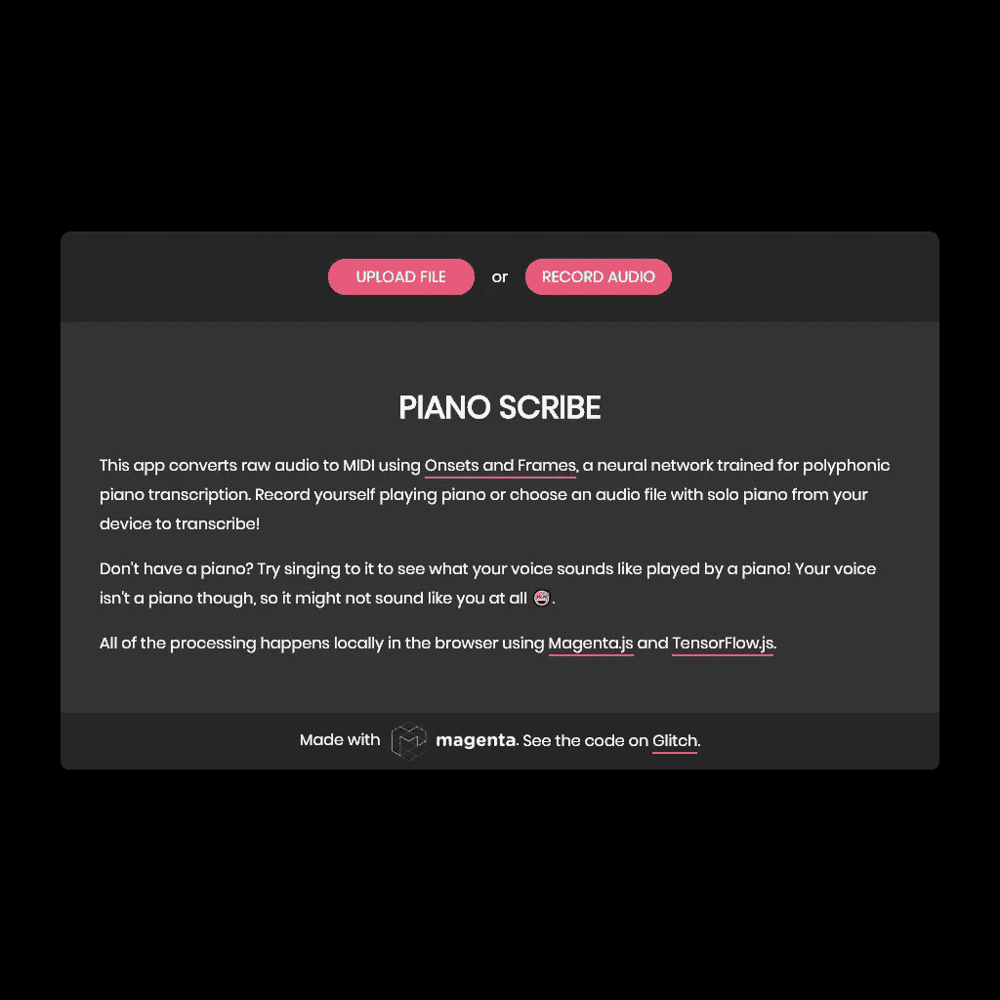
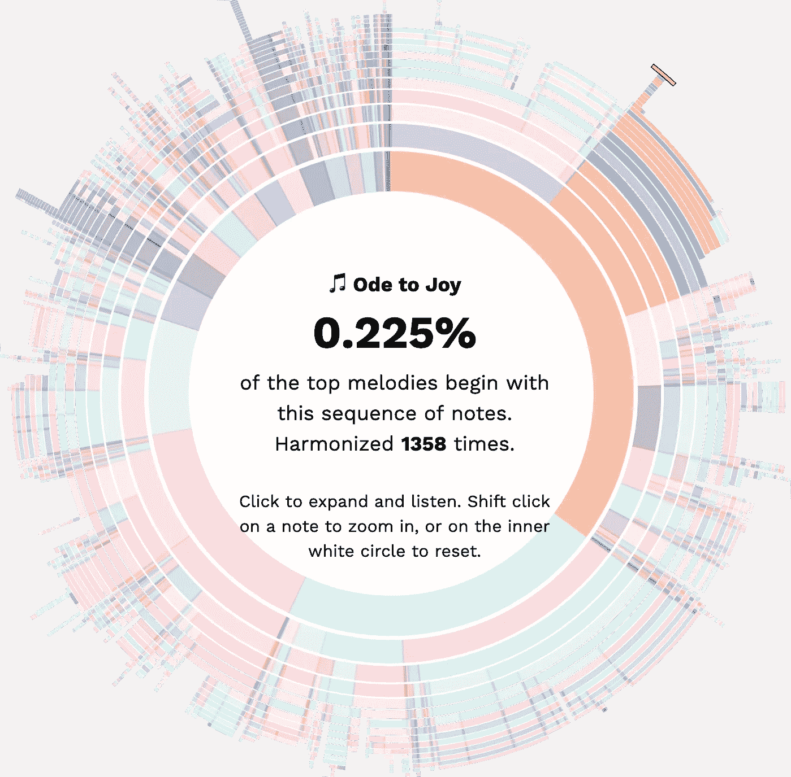
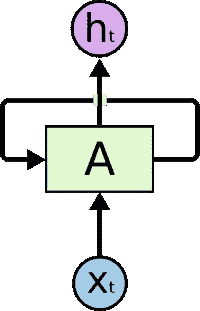
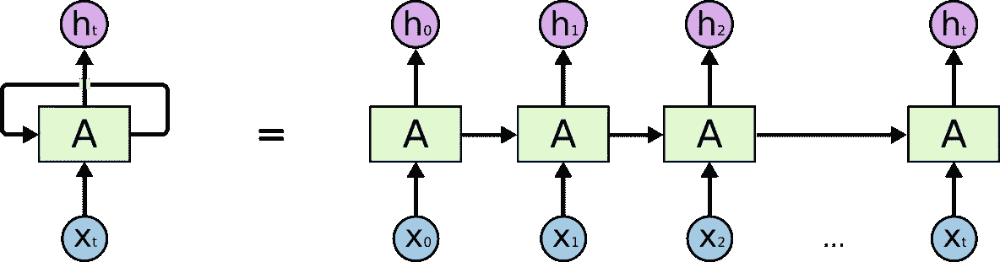
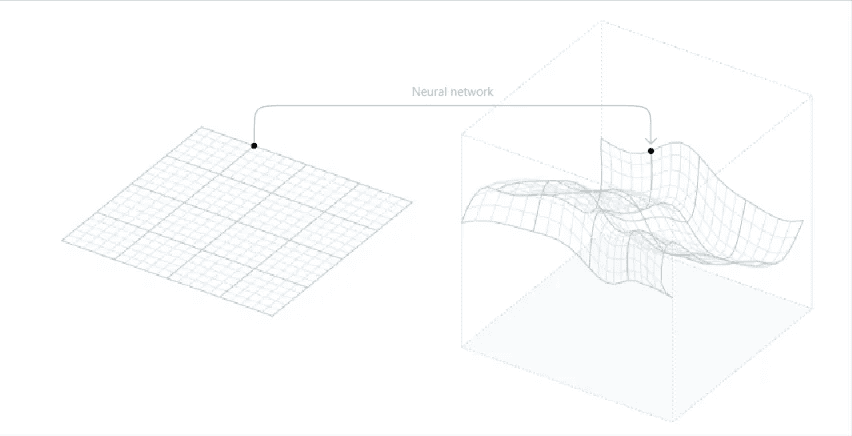
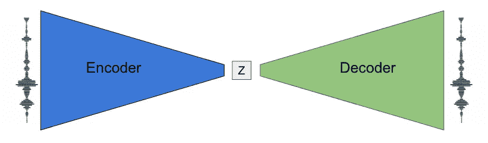
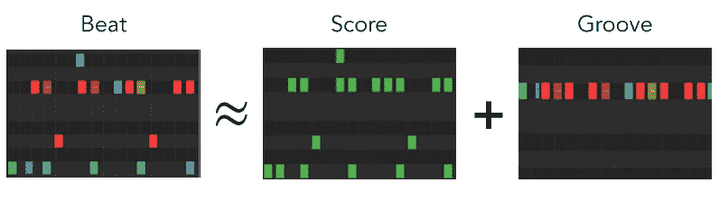

# 人工智能音乐的未来是品红色|数据驱动的投资者

> 原文：<https://medium.datadriveninvestor.com/the-future-of-ai-music-is-magenta-data-driven-investor-28a6f2806ab9?source=collection_archive---------7----------------------->

音乐似乎是人工智能无法渗透的领域之一，至少在表面上是如此。人工智能正在迅速接管许多领域，在音乐领域也有巨大的进步！有这么多令人敬畏的发展(查看应用程序[变压器](https://magenta.tensorflow.org/listen-to-transformer))和进展正在以极快的速度前进。

那么问题出在哪里？

# 为什么这些没有被使用？

有很多创作工具对任何作曲家来说都是惊人的，但音乐家却不是！尽管有些不完美，这些工具提供了大量的创造性材料；但是根本没有人使用它。

> 怎么可能会缺少音乐家呢？

你说得对。没有。短缺存在于拥有使用这些工具所必需的技术技能的音乐家中——进入的门槛太高了。为了使用非常基本的工具之外的任何东西，用户(让我们称他为 Sam)被**要求**了解 Python，已经排除了任何非程序员。Sam 还需要完成 Python 及其依赖项(以及 IDE)的安装和设置*和*复杂的安装网络，以便 Magenta 模块工作。

> Sam 已经完成了堆栈溢出的梳理，并清除了所有的`*ImportErrors*`，现在他肯定可以进入音乐创作了吧？

是的，但不尽然。山姆现在不得不像这样完成他所有的作曲和构思，而不是与乐谱、乐谱、钢琴曲或无处不在的音乐打交道:

Sam can forget about training his own AI musician — Deep Learning is notoriously resource-greedy, so he would need at least a CUDA-enabled GPU

**可爱。我甚至不知道那是不是“亮晶晶”——如果萨姆真的把名字从“T1”改成了“T2 ”,我怀疑我能分辨出其中的区别。很明显为什么这对任何音乐家都无效。**

可怜的萨姆。

# 断开在哪里？

很明显，从研究到用户之间有一条鸿沟，我认为这不仅仅是鸿沟。这是这条线的终点。这项研究已经取得了足够的进展，可以为开发人员发布工具，但在包装和向任何关心的人提供服务方面却没有同样的进展——因为所有的样板文件，绝大多数音乐家都不会这样做。

这种脱节的一个很好的例子是[开始和框架](https://magenta.tensorflow.org/onsets-frames)，我[去年写了关于](https://medium.com/@dronh.to/automatic-music-transcription-where-bach-meets-bezos-54dcb80ae819)的文章。我知道很多音乐家绝对会喜欢这个工具，但它就是不可用，而 Onsets and Frames 实际上是目前最容易使用的工具之一。通过这个[网络应用](https://piano-scribe.glitch.me/)，你可以(理论上)上传任何一段音乐(钢琴优先)并将其转录(即放入 MIDI)。

当我发现这件事的时候，我非常生气。我的大部分时间都花在了努力寻找好的改编曲或努力自己改编音乐上。我迫不及待地想试试！

我上传了一篇文章，关闭了其他所有的标签页，焦急地等待着。我等了很久。原来，浏览器在大约 2 分钟内“失去了上下文”，之后它就停止了。在做了一些挖掘，查看控制台并分析我的计算机资源后，我得出的结论是，我的英特尔集成显卡只是没有切割它(即使实际上只使用了 2.5/4 GB 的 GPU RAM)。

现在，这个具体的问题本质上是技术性的，如果它是一个实际的项目，给定的时间肯定会得到解决。然而，截至目前，这只是一个演示；这些只是草图，未来可能发生的事情的片段。

# 只要小心，这些工具能够并且已经成功了

当设计 UI/UX 和优化可访问性时，这些工具产生了巨大的影响。

典型的例子:巴赫的 [**谷歌的**](https://www.google.com/doodles/celebrating-johann-sebastian-bach) **。**

如果你不是一个音乐家，那么你很有可能充其量只是略微知道这是什么。但对我、我的音乐家朋友和音乐内容创作者来说，这是一件大事。

对于门外汉来说，这个谷歌涂鸦是为了庆祝约翰·塞巴斯蒂安·巴赫而发布的，他被许多人誉为有史以来最好的作曲家之一。他以他的合唱和合唱和声而闻名，他把一个简单的旋律变成了四声部的 SATB 美。

这在全世界都非常受欢迎(尽管“有用性”有限)，它给全世界的音乐家带来了欢乐。这个网络应用收到了超过 5000 万次的查询,“和谐”按钮被点击了超过 5500 万次，用户总共花了 350 年的时间来尝试这个网络应用。

There is ***definitely*** *a market for this. For more amazing visualizations, check out the* [*Bach Doodle Dataset*](https://magenta.github.io/bach-doodle-visualization/index.html) *page*

虽然它背后的 ML 非常有趣(也许我会写点什么…)，但这个产品简单易用。然而，它仍然足够强大，足以让任何人像巴赫那样寻求真正的和声(我知道我用了很多音乐理论作业)。这是一项真正的爱的劳动，它证明了只要设计得当，这些工具将会得到更好的使用。

关键是:这仅仅是开始。就实际适用性而言，它的用例是有限的和特定的。除非我在合唱方面真的有困难(这是我比涂鸦更擅长的)，否则除了玩这个新工具之外，我几乎没有理由使用它。

# 案例研究 2: Magenta 工作室

Magenta Studio 是音乐家人工智能音乐创作工作流程的完美例子。Magenta Studio 是一个为音乐人设计的(截至目前)5 个音乐创意工具的集合。它们既可以作为独立的应用程序，也可以作为广受欢迎的 [**Ableton Live**](https://www.ableton.com/en/) DAW(数字音频工作站)的插件。

这些工具由 Magenta.js 模型提供支持，而这些模型又由 Tensorflow.js 提供支持。Tensorflow.js 用于在浏览器中训练、运行和部署模型，并利用 GPU 加速，而用户无需安装 CUDA 等 GPU 驱动程序。另一方面，Magenta Studio 不是在网络浏览器中运行的——它是使用 electronic 构建的。电子允许所有的 Magenta.js 模型作为一个 app 在本地运行！

这 5 个工具是:

## 继续

这套系统由 Magenta 的 [MelodyRNN](https://github.com/tensorflow/magenta/tree/master/magenta/models/melody_rnn) 提供动力。使用 LSTMs(长短期记忆网络，一种 RNN)，它可以扩展给定的输入旋律！关于 RNNs 的更多信息，你可以在这里查看我的文章，但是这里有一个快速的纲要。

rnn 是为分析音频等顺序数据而构建的神经网络。它们建立在我们人类思考的基础上——我们不会从零开始思考。当我们写作时，我们一个字一个字地写，每个字都与前面的字紧密相连——我们的思想是持久的。传统的神经网络做不到这一点。

递归神经网络通过循环网络来解决这个问题。这看起来令人困惑，但请抓紧。

The beautiful diagrams in this section are courtesy of [Chris Olah](https://colah.github.io/posts/2015-08-Understanding-LSTMs/)

RNN 中的每个细胞就像它自己的网络，如果我们展开这些细胞，它们就形成了一个相同网络的长链。网络沿着链条传递输入。

这使得 rnn 能够使用过去的信息来通知当前的决策，使它们非常擅长预测单词、句子和语音识别等连续任务。

MelodyRNN 利用这一点，把音乐当作一种语言(当然是！).它将本质上无监督的生成问题转化为有监督的问题，通过分派网络来预测序列中的下一个音符。它预测下一个音符，然后下一个，然后下一个，直到它将旋律延伸得足够长！

注意:这只是他们的“basicRNN”模型的工作方式。Magenta 团队进行了各种改进，包括实现回看功能、注意力和许多其他功能。

## 产生

“生成”模型表面上类似于“继续”模型，只是它不需要输入序列，它只是生成给定长度的全新旋律。

> 但是 rnn 需要过去的输入来通知预测！

没错。正是因为这个原因，这个组件不使用 RNNs。相反，该工具利用了 MusicVAE 模型，这是一种可变自动编码器(VAE)。

这种模式利用了所谓的“潜在空间”。理解这些，举个例子超级有帮助。这是谷歌大脑的人发表的一篇[论文](https://distill.pub/2017/aia/)中的一个很棒的例子。

比方说，你想要一个神经网络来创造全新的字体。让我们假设每个字母是 64x64 像素。这意味着描述一个字母需要多达 4096 个参数。然而，生成模型提供了一个简单得多的解决方案，它只有 40 个潜在空间维度来描述字体。

The neural network acts as a function approximator

这类潜在空间模型在较低维中表达极高维的数据。对于字体示例，有 40 个维度或“参数”，它们一起映射字体，原本需要 4096 个参数。低维数据被称为“潜在变量”，它们最好被概念化为字体、旋律、人物等的高级表示。

本质上，这些模型在许多例子上训练，并“实践”将潜在变量映射到它们相应的高维数据。他们被训练去概括和抽象什么构成了一个字体，并使用它来为潜在变量的任何可能的组合生成一个字体。

潜在空间需要具备三个品质:

*   **表情**

任何现实生活中的例子都可以映射到潜在空间。

*   **现实主义**

潜在空间中的任何一点都代表现实的例子。

*   **平滑度**

潜在空间中彼此接近的点产生类似的结果。

很明显，音乐是高维数据。仅考虑单音(一次一个音符)钢琴旋律，在任何给定的时间步长，88 个键中正好有一个键可以被按下或释放，或者演奏者可以休息。这是 90 个可能的事件(88 次按键，1 次释放，1 次停止)。忽略速度并将节奏限制在第 16 个音符，正好有**组 2 小节的 4/4 音乐！**扩展到 3 个小节，我们得到 9⁰⁴⁸可能的旋律——这超过了**宇宙原子数量的 6000 亿倍！**

显然，我们不能只考虑每一种可能性，但很明显，这些序列中的大多数都是非音乐性的——它们从极低跳到极高。这是潜在空间模型的完美用例！

MusicVAE 使用一种称为自动编码器(AE)的潜在空间模型。本质上，自动编码器通过学习压缩每个示例(编码)，然后从该压缩形式再现每个示例(解码)，来构建数据集的潜在空间。

This architecture forces a “bottleneck” (the middle is lower-dimensional) which forces the model to learn a compression scheme

然而，这产生了“洞”，其中潜在空间中的所有点并不都映射到现实的例子。这就放弃了“现实主义”的要求。Magenta 解决这个问题的方法是使用变分损失。更多细节和例子，请看他们的[博客文章](https://magenta.tensorflow.org/music-vae)。

## 插入

使用 MusicVAE，这个扩展可以让作曲家在两个旋律或鼓点之间平滑地插入！

Remember this?

根据定义，任何两个旋律在潜在空间中都有一个对应的点。让我们从空间上考虑一下:MusicVAE 本质上是用一个向量连接这两个点，并沿着这个向量走一定数量的“步”。不同的步数是两种旋律混合的不同“比例”。

## 鼓噪

这个工具可能是我个人最喜欢的。它接受任何节奏输入，并创建一个全新的鼓槽来配合它！

太酷了！

它与 MusicVAE 基于相同的架构，但有一些关键的不同。

This is how the AI was trained

“节拍”由乐谱和音乐套路组成。乐谱是精确的模式，这是西方音乐符号在乐谱上规定的。这种节奏是量化的，或者说是贴合网格的。**凹槽**是节拍的全部**速度**(音量——重音和力度)和**微计时**(稍微偏离网格)。

这个模型像 MusicVAE 一样被训练，但是有一些不同。除了 MIDI 模式，序列的**凹槽也被编码为潜在向量。这是通过训练模型来重建力度和微计时来实现的，而不仅仅是量化的 MIDI。**

编码器还屏蔽了一个区域(音乐套路或乐谱),以优化模型，从而在仅给出部分数据的情况下预测实际节拍**。这使得输入和输出不同，从技术上来说，这是一个 VIB(变异信息瓶颈)，它有助于保持所有的鼓点真实。这甚至导致模型增加和改变输入，增加响弦打击和省略一些打击！**

最明显的区别是模型是根据不同的数据训练的。这些数据是由专业鼓手用节拍器在电子鼓上演奏产生的。这允许分析鼓手对网格的微计时，以及允许节拍被量化。记录了许多不同的风格，目的是让 Drumify 概括和提取 *凹槽的*精华。**

## 律动

Groove 非常类似于 Drumify，但它不是制作全新的鼓点，而是采用量化的模式(乐谱)并“人性化”它。技术基本相同，但如果你想了解更多细节，一定要看看 Magenta 的博客文章。

所有这些都证明，人工智能为音乐家提供的工具，如果包装得当，是强大、有用和非凡的。我们只是需要像 ML 巴赫涂鸦和 Magenta 工作室这样以艺术家为中心的开发，以弥合开发者和音乐家之间的差距。

# 关键要点

*   由人工智能驱动的作曲和作曲工具超级强大…
*   但是他们没有被利用
*   使用许多工具需要:
*   大量的初步设置
*   编程的某种程度的流利程度
*   相当高端的硬件(用于培训)
*   这些工具是原始的，使用起来不直观
*   当这些工具变得可访问和可用时，它们会非常受欢迎

## 在你走之前

非常感谢您阅读这篇文章！如果你想联系我，你可以发电子邮件到 dron@intellear.com 找我。注意安全！

嗨！我是 Dron，我是知识社会中充满激情的年轻创新者。知识社会是 WEF 的未来学校，为未来的首席执行官、创新者和思想领袖提供奥林匹克级别的培训。我对人工智能及其应用非常感兴趣，比如音乐。我曾帮助 Sidewalk Labs(一家致力于城市创新的 Alphabet 公司)和 Kidogo(一家为内罗毕贫民窟的儿童早期发展(ECD)提供低成本儿童保育的社会企业)解决问题。

*原载于 2020 年 4 月 25 日 https://www.datadriveninvestor.com***。**