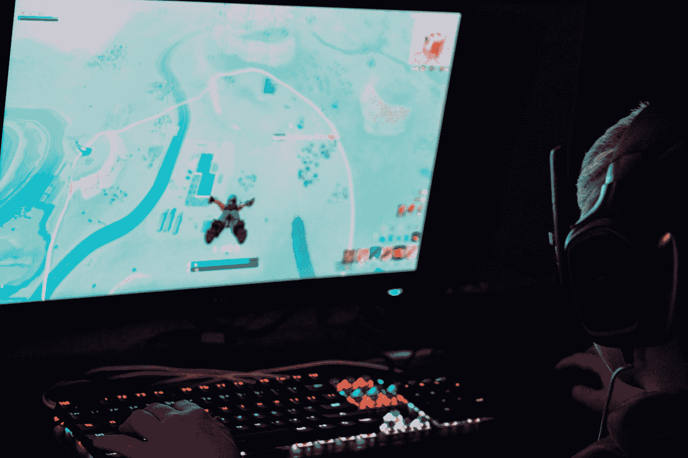

# 皇家战役的未来小游戏

> 原文：<https://medium.datadriveninvestor.com/the-future-of-battle-royale-games-a1edad33825f?source=collection_archive---------11----------------------->

这种类型的游戏在过去几年中一直占据主导地位。这一切都始于 2017 年《PUBG》和《堡垒之夜》的上映。现在，我们在市场上有很多皇家战役游戏，看起来新的版本并没有放缓。

Photo by [Alex Haney](https://unsplash.com/@alexhaney?utm_source=medium&utm_medium=referral) on [Unsplash](https://unsplash.com?utm_source=medium&utm_medium=referral)

皇家战役类型的游戏已经成为关注的焦点有一段时间了，它们似乎在市场上占据主导地位。今年，即使发生了这一切，似乎也没有减缓新版本的发布。仅在今年，我们就收到了《使命召唤:战争地带》、《超级风景》、《替罪羊:终极击倒》,还有更多正在制作中。

即使你可能认为所有这些游戏都是一样的，但它们之间的细微差别使它们脱颖而出。有些与现实生活相似，有些则相去甚远。最后，他们都有相同的理念，所以他们也和他们的竞争对手非常相似。

## PC、控制台和移动设备

《皇室战争》游戏的崛起不仅仅是在 PC 和游戏机上，移动端市场一直在蓬勃发展，在某些情况下已经超过了 PC/游戏机版本的游戏。一些公司在这些平台上也采取了不同的策略。例如，PUBG 的价格为 30 美元，而移动版本是免费的，这一策略对腾讯来说效果很好。相比之下，其他人选择在所有平台上免费，比如堡垒之夜。

随着这些游戏的兴起，山寨游戏也随之兴起。许多游戏开发者看到了这个机会并抓住了它。他们因此获得了可观的利润。这在市场的移动端更加明显。这类游戏的兴起也是这些公司决定开发手机版游戏的重要原因。

 [## 技术的下一个时代|数据驱动的投资者

### 量子计算。这似乎是继人工智能之后最流行的词汇。然而，很多…

www.datadriveninvestor.com](https://www.datadriveninvestor.com/2020/07/14/the-next-era-of-tech/) 

如今，每家公司都有自己的皇家战袍已经成为一种常态。有些只是根据他们正在进行的特许经营进行调整。例如，《反恐精英:全球攻势》在他们的游戏中发布了《危险地带》，他们对通常的《皇家战役》进行了重大修改，并对其进行了改编，因此它看起来与他们的专营权相似。使命召唤也跳上了炒作列车。一开始他们发布了使命召唤:黑色行动 4 | Blackout，今年发布了使命召唤:Warzone，天梯免费玩。另一家正在做类似事情的公司是育碧。他们正在发布 Hyper Scape，这是从他们自己的彩虹 6 围攻中获得的灵感。

## 未来

正如我们所看到的，皇室战争游戏的宣传并没有达到历史最高水平，但它仍然存在。随着越来越多的玩家涉足这一领域，它就越难消亡。我喜欢玩这些类型的游戏，我不认为自己会很快放弃这种类型的游戏。为了支持这一点，我们可以看到这些游戏在 Twitch 等流媒体平台上的数字。未来仍不明朗，但这些类型的游戏仍有几年的美好时光。

**进入专家视角—** [**订阅 DDI 英特尔**](https://datadriveninvestor.com/ddi-intel)