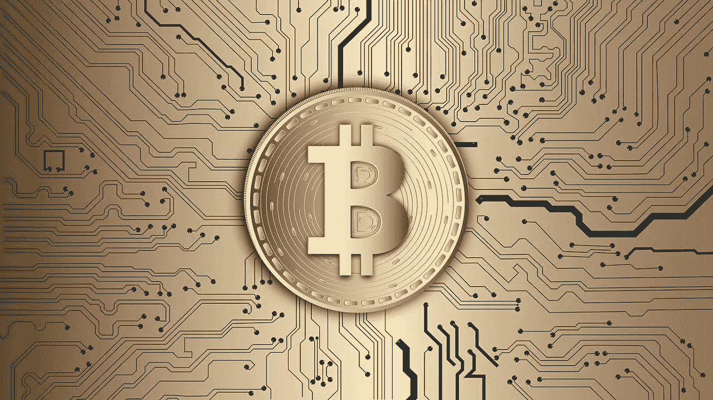

# 比特币的未来包括减半

> 原文：<https://medium.datadriveninvestor.com/the-future-of-bitcoin-including-halving-b0e3f6ef984c?source=collection_archive---------19----------------------->

Bitcoin: A decentralised digital currency

今天，基于其 1000 亿美元的市值，比特币是最大的加密货币。这种分散化的货币于 2009 年推出，自那以后，它一直是全球政府和个人关注的焦点。比特币通过提供更快的低费用交易，并且不受地理边界的限制，改变了支付行业。

 [## 总部位于瑞士的 ETP 进入加密交易市场|数据驱动的投资者

### 虽然金融市场几乎没有沉闷的时刻，特别是在引入…

www.datadriveninvestor.com](https://www.datadriveninvestor.com/2019/03/10/swiss-based-etp-enters-the-crypto-trading-market/) 

虽然这些好处非常显著，但领先的加密货币在不久的将来可能会提供更好的东西。它可以为投资者带来巨大的利润，同时创新几个依赖区块链的行业，这是一种支持比特币的现代技术。

比特币也可以成为未来的货币，原因如下:

**1。比特币减半**

第三次比特币减半将发生在 2020 年 5 月。减半后，矿工的集体奖励将从 12.5 BTC 降至 6.25 BTC。因此，比特币的供应量将减半 50%，这对其价格的影响相当大。2012 年 11 月 28 日，当比特币[第一次减半](https://en.bitcoin.it/wiki/Halving_day_2012)时，其价格在 2013 年 12 月从 13 美元涨到了 1100 美元。此外，2016 年 7 月 9 日第二次减半，到 2017 年 12 月，比特币从 400 美元飙升至 2 万美元。

除了这一历史性的价格变动，一些分析师还暗示了减半后可能发生的情况。计划 B [称](https://medium.com/@100trillionUSD/modeling-bitcoins-value-with-scarcity-91fa0fc03e25)虚拟资产，定价在 10，000 美元左右，减半后可飙升至 55，000 美元。此外，摩根克里克数字公司的联合创始人兼合伙人安东尼·庞普利亚诺评论道，

> *比特币到 2021 年可冲击 10 万美元。*

除了价格受到影响，这表明比特币不能像法币一样被过度印刷。

**2。比特币期货**

在 2018 年和 2019 年初，人们对比特币期货抱有很高的期望。像 Bakkt 和 VanEck 这样的公司一直在不知疲倦地寻求美国证券交易委员会(SEC)对其交易所交易基金(ETF)的批准。如今，Bakkt 已经推出了自己的 ETF，其他公司如[芝加哥商业交易所](https://www.cmegroup.com/media-room/press-releases/2019/11/12/cme_group_announcesjan132020launchforbitcoinoptions.html)(芝加哥商业交易所集团)也推出了 ETF。

有趣的是，世界第二大证券交易所纳斯达克也在[寻求](https://www.bloomberg.com/news/videos/2018-01-24/nasdaq-ceo-adena-friedman-on-the-market-economy-video)推出比特币期货。

因此，个人不仅仅是投资这一资产类别的人，因为机构投资者也是如此。因此，它创造了对虚拟货币的更多需求。随着更多的机构资金被注入加密领域，这可能有助于推高比特币的价格。此外，这些投资者的关注可以给加密领域带来更多的可信度。

**3。比特币需求**

世界各地的时事创造了对比特币作为避风港的更多需求。一个例子是包括阿根廷、土耳其和委内瑞拉在内的国家的高通货膨胀率和法币贬值。2019 年[调查](https://www.statista.com/chart/18345/crypto-currency-adoption/)显示，由于其中一些国家的经济崩溃，拉丁美洲国家是比特币的最高用户。

与此一致，美国 2020 年大选将消除比特币的负面压力。根据 Fundstrat Global Advisors 的研究主管 Tom Lee 的说法，

> *白宫延缓了比特币在 2019 年的价格飙升。*

然而，今年的情况就不同了，因为他们的注意力都在选举上。因此，2020 年是比特币的牛市。

除此之外，更多的国家可能会步中国、T2 和南非的后尘，实行现金限额。后者是为了控制一个人可以进出这个国家的数量。因此，那些希望在没有任何控制的情况下转移更多资金的人将会求助于加密货币。

**4。最近的发展**

2020 年，更多的商家接受比特币作为他们商品和服务的支付方式。例如，一项调查显示，美国 36%的中小企业现在接受加密资产。更重要的是，像[摩根大通](https://www.jpmorgan.com/global/news/digital-coin-payments)、[高盛](https://www.investopedia.com/news/goldman-sachs-cryptocurrency-patent-setlcoin-crypto-settlement-system/)、[宝盛](https://www.juliusbaer.com/gg/en/news/julius-baer-launches-digital-assets-services-2/)和[富达](https://www.fidelitydigitalassets.com/overview)这样的大型金融机构已经进入了加密货币领域。

社交媒体巨头也未能幸免。例如，脸书想要发行一种基于区块链的货币，叫做 Libra。Twitter 的联合创始人也在加密项目上投入了大量资金。

其中值得注意的是克里斯托弗·艾萨克·比兹·斯通，他最近投资了现代银行业务，

> *一款可以让用户购买比特币的应用。*

同样，杰克·多西的金融服务公司 Square 正在寻求推出一个照明开发套件(LDK ),以促进比特币成为一种无法阻止或篡改的全球货币。这些最近的发展表明，像比特币这样的加密货币现在有了更多的用例，可以成为未来的货币。

**结论**

从现在起的 10 到 20 年内，比特币有可能成为一种全球货币。多年来，它获得了很高的采用率，其价格也在稳步上升。机构和个人目前都在投资虚拟货币。各国央行也在寻求利用区块链创造集中式数字货币的方法。

因此，比特币可能会比世界预期的更好。