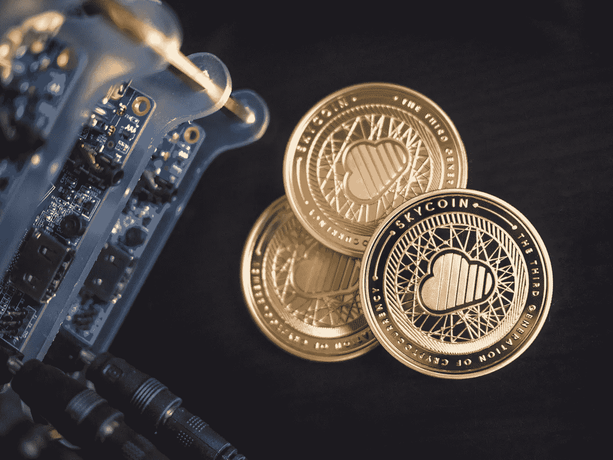

# 区块链的未来

> 原文：<https://medium.datadriveninvestor.com/the-future-of-blockchain-606e4789fd4d?source=collection_archive---------10----------------------->

自从中本聪发明了第一台[区块链](https://www.datadriveninvestor.com/glossary/blockchain/)以来，已经过去了将近十年。当时，他没有明确提到区块链，但这个概念是关于[比特币](https://www.datadriveninvestor.com/glossary/bitcoin/)的点对点电子交易。正如我在[上一篇文章](https://medium.com/datadriveninvestor/the-underlying-technologies-of-blockchain-and-implementation-on-the-scm-5808df76ecd6)中提到的，由于一些担忧，区块链的受欢迎程度一直在下降，但主要是缺乏监管、复杂性和安全问题。因此，这是一篇综述文章，通过分析问题和差距，认为区块链仍然是一项有前途的技术。

# 区块链还像几年前一样是“首席女歌手”吗？

我们可以从彻底回答这个问题开始。[德勤(Deloitte)2019 年全球区块链调查](https://www2.deloitte.com/us/en/insights/topics/understanding-blockchain-potential/global-blockchain-survey.html)显示，企业高管仍然相信这项技术，特别是随着用例实施的扩展(Pawczuk 等人，2019)。此外，他们还认为，从现在开始，重要的是如何将“原始的”区块链技术转化为更精细的解决方案，因此也就是颠覆性技术。虽然企业更喜欢被动地等待更现实的实施场景，但银行业开始考虑采用它，这也导致了国家加密货币( [Gogan，2020](https://www.aithority.com/guest-authors/blockchain-technology-in-the-future-7-predictions-for-2020/) )。另一个有趣的发现是，根据国际数据公司(IDC)的报告，区块链和[物联网](https://www.datadriveninvestor.com/glossary/internet-of-things/)的整合预计将占区块链& [物联网](https://www.datadriveninvestor.com/glossary/internet-of-things/)部署的 20%左右。

Photo by [Stanislaw Zarychta](https://unsplash.com/@stahooo?utm_source=unsplash&utm_medium=referral&utm_content=creditCopyText) on [Unsplash](https://unsplash.com/@stahooo?utm_source=unsplash&utm_medium=referral&utm_content=creditCopyText)

深入到技术部分，Drljevic 等人(2020 年)在他们最新的期刊中发现了三个明显的研究缺口，说明为什么区块链实施没有发挥其全部潜力。

首先，区块链技术的可持续利用。良好的实施基于强大的基础。收养必须持续下去；因此，需要一个规范性框架。现在，当讨论规范框架时，治理是关键方面，因为一个规划良好的治理政策可以提高区块链采用的可持续性(Drljevic 等人，2020)。

 [## 数字货币、区块链和货币的未来|数据驱动的投资者

### “区块链”、“加密货币”、“令牌化”，以及现在的“央行数字货币”已经成为…

www.datadriveninvestor.com](https://www.datadriveninvestor.com/2020/02/18/digital-currencies-blockchain-and-the-future-of-money/) 

第二，尽管政策对框架很重要，但从更大的角度出发的整体方法也很重要。在管理业务转型过程的强大整体框架、风险管理和战略管理方面，仍然存在一些缺失(Drljevic 等人，2020)。

第三，缺乏监测和评估区块链相关项目的应用研究。每年都有大量基于区块链的新项目，以及科学期刊/白皮书。然而，它仍然缺乏一个跟踪这些动向的框架。至关重要的是实时案例研究，这些研究合并成一个协作和透明分析的基础，以促进区块链的采用(Drljevic et al .，2020)。

此外，区块链的透明度也可能带来隐私和安全领域的问题(Hassan et al .，2019)。他们解释说，如果个人身份被泄露，区块链的所有交易都可能面临风险。我们必须关注几种隐私攻击:[地址](https://www.datadriveninvestor.com/glossary/address/)重用、去匿名化分析、[钱包](https://www.datadriveninvestor.com/glossary/wallet/)隐私泄露、sybil 攻击、消息欺骗、链接攻击。然而，Hassan 等人(2019 年)进一步表明，处理这些攻击的防御战略已经实施。这些是匿名、[加密](https://www.datadriveninvestor.com/glossary/encryption/)、混合、私人契约和差分隐私。唯一剩下的问题是，这仍然受到限制，导致我们的个人数据暴露的风险。例如，加密保证了强大的安全性。然而，攻击者可以找到其数学形式的漏洞来破解密码，数据隐私将被泄露。此外，加密需要强大的计算能力，特别是对于实时加密过程(Hassan 等人，2019)。

Photo by [NASA](https://unsplash.com/@nasa?utm_source=unsplash&utm_medium=referral&utm_content=creditCopyText) on [Unsplash](https://unsplash.com/@nasa?utm_source=unsplash&utm_medium=referral&utm_content=creditCopyText)

# 观点—我的观点

在回顾了几十年前引入的区块链采用场景中缺少什么来实现其潜力的一些最新研究后，一个关键信息是强大的基础(理解为:框架)在整个过程中是最重要的。涵盖技术、风险、政策和业务转型管理的良好框架将是填补前面提到的空白的好主意。另一个关键点是隐私和安全问题，这里总是存在个人数据泄露的可能性，最危险的部分是它可以通过操纵人的银行账户或健康信息来导致危及生命的情况。

然而，正如已故的科比·布莱恩特所说，“伟大的事情来自于努力和毅力。”[区块链](https://www.datadriveninvestor.com/glossary/blockchain/)仍然是一项有前途的技术，如果我们成功解决差距和问题，它将带来巨大的颠覆(当然是以一种好的方式)来克服一些商业挑战。我已经展示了一些位于区块链[的 SCM 项目](https://medium.com/datadriveninvestor/the-underlying-technologies-of-blockchain-and-implementation-on-the-scm-5808df76ecd6)。除了我的例子之外，Rashideh (2020)解释了一个区块链框架，它涵盖了旅游业的商业模式、资金转移系统、安全性、绩效和信任。

举例来说，许多旅游网站现在还包括来自客户的评论和评级。但可信度有时是值得怀疑的，因为系统是集中的，这使得餐馆、酒店等所有者更容易修改评论(Rashideh，2020)。相反，凭借区块链技术的完整性和分散性，它可以提高客户评论或评级的可信度和透明度。由于这个链总是相互连接的，因此，用户可以随时检查评论的完整性(阅读:[公钥加密](https://www.datadriveninvestor.com/glossary/public-key-cryptography/)的概念)。

总之，虽然区块链仍然是有史以来发明的重要技术之一。然而，我们将不得不等待，直到它可以通过解决本文中解释的一些差距来完成许多领域中的一些任务。同时，这篇文章希望能帮助读者获得一个关于区块链技术及其对人类的潜力的广阔视角。

# 参考

努西·德尔列维奇。、阿兰达、丹尼尔·阿里亚斯。弗拉基米尔·斯坦切夫。, 2020.影响区块链技术需求工程的风险和标准透视。计算机标准与接口。

戈根，硕士，2020。未来的区块链技术:2020 年的 7 个预测。[在线]见:[https://www . aithority . com/guest-authors/区块链-未来技术-7-2020 年预测/](https://www.aithority.com/guest-authors/blockchain-technology-in-the-future-7-predictions-for-2020/)[2020 年 5 月 28 日访问]。

穆尼布·哈桑。、拉赫曼尼、穆巴拉克侯赛因。、陈、晋军。, 2019.基于区块链的物联网系统中的隐私保护:集成问题、前景、挑战和未来研究方向。下一代计算机系统，97。

i-Scoop，2020。一勺。[在线]见:[https://www . I-scoop . eu/internet-of-things-guide/区块链-IOT/](https://www.i-scoop.eu/internet-of-things-guide/blockchain-iot/)[2020 年 5 月 28 日访问]。

波丘克，l，梅西， [R](https://www.datadriveninvestor.com/glossary/r/) 。，& Holdowsky，j .，2019。德勤 2019 年全球区块链调查。[在线]见:[https://www2 . Deloitte . com/us/en/insights/topics/understanding-区块链-潜力/全球-区块链-调查. html](https://www2.deloitte.com/us/en/insights/topics/understanding-blockchain-potential/global-blockchain-survey.html)[2020 年 5 月 28 日访问]。

瓦利德·拉希德。, 2020.区块链技术框架:旅游业的当前和未来前景。旅游管理。

*原载于 2020 年 6 月 3 日 https://www.datadriveninvestor.com**的* [*。*](https://www.datadriveninvestor.com/2020/06/03/the-future-of-blockchain/)