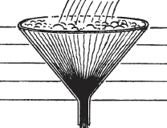
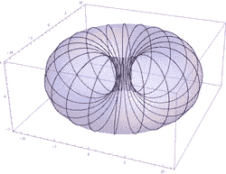

# 资本主义的未来

> 原文：<https://medium.datadriveninvestor.com/the-future-of-capitalism-9bd831e8e96a?source=collection_archive---------3----------------------->

> “利润系统遵循阻力最小的路径，而阻力最小的路径是使河流弯曲的原因。”—犹他州菲利普斯

众所周知，晚期资本主义有其自身的问题，而且这些问题不会消失。从经常看不见但极具破坏性的负外部性效应，到普通人有限投资机会中固有的不公平，再到美国税收结构使穷人比富人更昂贵的 T2，很明显，上个世纪的资本主义模式有许多裂缝，这些裂缝在很大程度上表现出来。

当前的全球资本主义体系是在传统的基于价格的经济模式下运行的。众所周知，在这个模型中，市场报价的价格是由供求关系决定的[。工人阶级日益增长的不满情绪是经济不平等的一个历史重复，也是经常令人担忧的结果，而阻止这种不平等的创可贴正在失去吸引力。这些问题清楚地表明，基于成本的经济模式为大众创造了机会，并在未来的资本主义经济中占有一席之地。](https://www.bridgewater.com/research-library/how-the-economic-machine-works/)

 [## 如果资本主义失败了，那么还有什么选择呢？数据驱动的投资者

### 在当前政治领域的修辞之旅中，我们都可以面对面地接触到流行词汇，如…

www.datadriveninvestor.com](https://www.datadriveninvestor.com/2020/03/16/if-capitalism-is-a-failure-then-what-is-the-alternative/) 

在以成本为基础的经济模型中，产品或服务的价格与产品或服务的成本直接相关，这反映在产品开发和维护的硬成本中，或者反映在提供持续服务的年度总预算中。虽然这并没有完全消除中间环节对成本(以及价格)的影响，但它确实在一开始就解决了每一个加价点，对其进行了调整，并将其作为一个单项包括在市场报价的总成本中。

**用例**

一个简单的说明性例子是一个数字产品，一个应用程序。在这种情况下，通过使用基于成本的经济模型，用户对应用程序的访问(支付的价格)被彻底改变。在这个例子中，这个应用程序的创建成本是 1000 美元，并作为可下载产品出售，每次下载一美元。按照传统标准，这款应用的所有者/创造者在第一批 1000 名用户购买之前是在冒险，之后他们就开始盈利，随着他们积累更多的用户和赚更多的钱，他们被认为越来越成功，永无止境。把这个模型想象成金字塔或者漏斗的形状，拥有者在顶点，接收他们的发明创造的财富和流入其中的财富。

在基于成本的经济模型中，我们将使用相同的应用程序，固定成本为 1000 美元，初始价格为 1 美元。在拥有 1000 名用户后，这款应用现在已经收回了成本，但在基于成本的经济模式下，事情开始发生变化。在接下来的 1000 个用户中，用户总数增加到 2000。在这一点上，该应用程序现在在下载后退还所有用户 50 美分，因为用户群的成本负担现在是 2000 用户 50 美分，而不是 1000 用户 1 美元。如此周而复始，直到成本大规模降低到几乎为零。把这个形状想象成一个圆环，折叠起来，以一种整体的方式生长。

**用词语表达**

这个经济模型的方程表述为:
P=(k + i) / n
P=价格，k =盈亏平衡/成本，n =用户数，I =激励。

在这种情况下，如果 i=固定金额或 i=随着用户群规模的增加而调整的递增百分比，则可以解决激励结构问题。这两种激励结构都可以用来满足创新者、持续签约维护提供商或早期投资者的需求。

**从早期投资者到推动者**

仍然有许多方法来保持对产品和服务的创造者的激励，在这种模式下，报酬对所有参与者都是透明的，包括最终用户。每个用户确切地知道他们的购买价格的多少将用于什么，以及每个项目的成本结构的完整性和内容，他们也可以推荐他们的朋友使用。

**从早期采用者到推荐者**

随着对用户的退款随着每个额外用户的增加而增加，这有效地使得提供的价格随着每个额外购买而下降。以 1 美元下载该应用程序的第 10，000 名用户将自动获得 0.90 美元的退款，并且只为该应用程序支付了 0.10 美元。在 100，000 个用户的情况下，所有用户将被退款到支付一分钱的程度，并且为了达到该用户数量，所有用户被激励(通过他们退款的效果)推荐他们的朋友。

**为什么是这个，为什么是现在**

目前，我们的反企业情绪空前高涨。这种模式通过提供一种对社会负责的、生态友好的标签来解决这个问题，这种标签可以将参与的企业区分为更好的企业公民。

由于最近的创新，我们有技术来实现快速、可扩展的退款机制，这是这种基于成本的经济系统运行所固有的过程。这使得在永久降价模式中吸引用户变得容易，从而使企业能够通过活动和激励性参与获得更好的用户。在基于成本的经济生态系统中，参与的企业可以延长客户参与的寿命，超越(传统结构的)竞争，同时获得持久的忠诚度，并为客户带来终身价值。

**操作注意事项**

用例必须在特定的时间段内具有预先确定的固定价格(一次性成本或年度预算，包括固定的硬成本和持续改进的成本)，对创新者、初始投资者和创造者具有明确的激励参数，它必须在直接的消费者访问范围内运营，这意味着它具有规模上的 B 到 C 模型，并且必须非常可扩展。这就是为什么选择数字应用程序作为示例的原因。要探索的其他用例有交通系统、医疗保健系统、能源(尤其是可再生能源)、软件即服务模型和会员模型。

退款/折扣系统可以通过几种实用的方式来实现。这些包括退还用户的信用卡，未来费用的信用，实物支付，发行礼券或将资金转移到用户的数字钱包(用于加密应用)。

该项目目前正在开发中。要参与，请[发送电子邮件](mailto:monika@monikaproffitt.com)了解更多详情和讨论。要将该模型投入使用，请在此处提交您的项目。