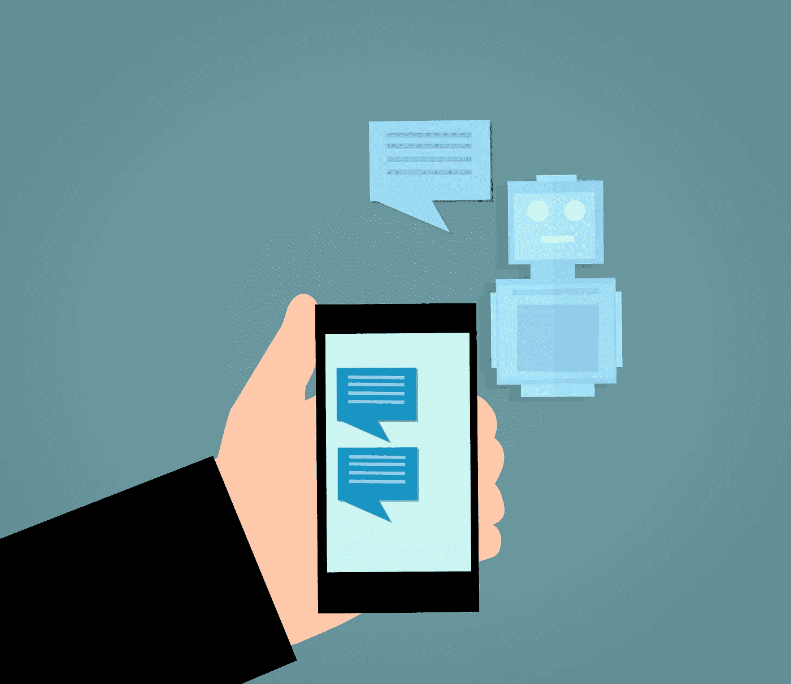

# 客户服务的未来:人工智能

> 原文：<https://medium.datadriveninvestor.com/the-future-of-customer-service-artificial-intelligence-12e2dead8847?source=collection_archive---------1----------------------->

亚马逊创始人兼首席执行官杰夫·贝索斯曾经说过:“我们把顾客视为派对的受邀嘉宾，而我们是主人。我们每天的工作就是让客户体验的每个重要方面都变得更好。”

在当今世界，你可以在 iPhone 和三星手机之间选择，在亚马逊 Alexa 和谷歌 Home 之间选择，在 Mac 和 PC 之间选择。对于一个公司来说，卓越的客户服务是失去还是留住一个有价值的客户的关键。让你的客户等 20 分钟对你的生意没有帮助，反而给了你的客户一个转向竞争对手的理由。这就是为什么现在比以往任何时候都更需要通过提供快速、简单和无摩擦的客户服务来满足客户需求，这是在一个客户可能会在眨眼间转向竞争对手的世界中取胜的唯一途径。

几十年来，客户服务一直被视为公司的低优先级成本中心，但在过去五年中，客户服务已成为投资的主要重点领域。企业正在意识到，投资于让现有客户满意，比通过昂贵而耗时的过程寻找新客户要便宜得多。尽管迄今为止大多数投资都是在改进软件和增加电子邮件/信息作为沟通渠道，但客户服务创新的新前沿是人工智能。

 [## 不管准备好了没有，革命就在我们面前|数据驱动的投资者

### “对于技术如何影响我们的生活和重塑经济，我们必须形成全面的全球共识……

www.datadriveninvestor.com](https://www.datadriveninvestor.com/2019/02/12/ready-or-not-the-revolution-is-upon-us/) 

人工智能正在通过提高成本效益、改善客户服务体验和节省代理时间来颠覆客户服务行业。代理人一遍又一遍地面对同样的基本问题，这些问题很容易被计算机回答。由机器学习和自然语言处理组成的人工智能不仅能够自动化这些基本请求，还能够实时帮助代理，将呼叫路由到最佳代理，以及评估客户服务代表等应用。

作为人工智能的一个用例，客户服务的强大之处在于，有大量训练数据来建立机器学习模型。聊天机器人或任何其他基于语言的客户服务人工智能解决方案需要能够理解用户的意思，即使他们的问题不是非常清楚。它可以通过分析包括雅虎在内的大量现有数据来做到这一点。语言数据、Twitter 支持数据和其他开源数据集。企业也可以选择收集特定于聊天机器人旨在回答的问题的数据。

人工智能在客户服务中有三个主要应用:

1.  通过可搜索的自助知识库和聊天机器人实现自助服务。
2.  自动化交互前任务，包括问题分类和智能路由。
3.  让代理实时提高工作效率。

下面，我们将详细回顾这些应用领域，并介绍一些有趣的公司，包括初创公司和现有公司，它们正在客户服务领域创造强大的创新。

# 启用自助服务

帮助客户的最好方法是让他们自助:他们很快就能得到想要的答案，公司也不需要花钱提供客户服务。有了自助服务，客户和公司都赢了。实现自助服务有两个核心策略:可搜索的知识库和聊天机器人。

可搜索的知识库就像每个公司的专业谷歌。很多网站都有“帮助”页面，但实际上，很少有人真正提供帮助。原因是搜索结果不一致，并且通常不便于用户使用。虽然谷歌一直在不断地将人工智能添加到其搜索算法中，以随着时间的推移提供更准确的答案，但公司不具备这种专业知识，因此他们需要找到能够帮助将人工智能融入其客户自助服务产品的供应商。Solvvy 是这一领域的一家创新公司，它通过使用人工智能来自动化基本请求，从而节省了客户和代理的时间。该平台可以全天候回答常见的客户问题。该平台的分析部分允许企业查看重要指标，如自助服务率和投资回报率。他们与许多企业合作，包括移动票务平台 SeatGeek。Solvvy 实现了 35%的自助服务率，帮助了 50，000 名客户，并通过即时解决客户问题节省了 350，000 美元。他们服务于许多其他知名品牌，如 Codecademy、安德玛和 GoFundMe。

建立这些知识库需要访问公司的机构知识，其中包含代理寻找的解决客户问题的解决方案和文章。它还要求确保知识访问正确的信息(而不是过时的内容)，并在有经验的代理离开公司之前获取他们的专业知识(客户服务因高流动率而臭名昭著)。Zendesk 的知识库名为 Guide，允许人们访问常见问题、产品细节、政策等。该软件允许代理自动将对话转换成文章，供未来的客户用来解决他们的问题。例如，对于 Evernote 来说，这已经导致超过 2 亿用户的 17%的票证偏差。

除了可搜索的知识库，AI 聊天机器人还可以提高客户服务质量，节省资金，并提供更好的客户体验。人工智能聊天机器人使用机器学习和自然语言处理来为客户问题提供智能答案。人工智能聊天机器人的主要用途是自动化日常问题，以节省客户服务代理的时间。通过理解简单的请求，如检查订单何时发货或收集产品的基本信息，人工智能聊天机器人将能够在不需要人类代表的情况下回答问题。一旦客户的问题变得太难，聊天机器人无法解决，聊天机器人就可以将对话转移到一个现场代理。人们天生缺乏耐心，不喜欢等待很长时间来获得支持。人工智能聊天机器人是 24/7 全天候运行的，因此可以在客户需要时随时提供服务，而不是像呼叫中心那样只在某个小时开放，而不是每天都开放。这不仅改善了客户体验，还改善了代理体验。客服人员的培训需要大量资金，该行业的高离职率意味着大量资金被用于培训客服人员。AI 聊天机器人只需要训练一次，可以边走边学。

Pypestream 是一家开发聊天机器人的创新公司。他们的平台包括高级分析，包括客户特定的性能指标，显示他们的进展情况，包括特定时间段的消息量，聊天机器人在没有代理帮助的情况下处理整个交互的频率，以及调查结果。如果你是一家企业，了解你的模式以及你的代理商的表现对于优化你的客户服务是非常重要的。该平台还包括“热图”，显示用户进行特定客户旅程的频率(客户从听说你的产品到研究它再到购买的步骤)。这很重要，因为如果你能了解哪些途径会引导客户购买，哪些途径会导致他们不购买，那么你就可以做出改变，将客户引向正确的方向。最后，该平台保留了对话日志，供公司的人工智能算法使用。聊天机器人主要用于 Facebook Messenger 和 Whatsapp，但也可以与包括亚马逊 Alexa 在内的许多其他平台集成。在旅游行业，该平台用于邮轮公司自动化预订，帮助客户找到定价信息，处理旅游保险，并安排游览。对于酒店来说，它可以实现客房服务、忠诚度积分、奖励、预订、升级以及长期住宿的自动化。旅行可能是一种非常令人沮丧的体验——一个简单的全天候工作的聊天机器人不仅可以帮助旅游企业降低成本，还可以为客户提供更好的体验。

# 自动化交互前任务

成功的客户服务体验远在代理与客户互动之前就开始了。它包括了解客户问题并对其进行分类，然后使用大量数据将客户与合适的代理匹配起来。

第一个自动化领域是自动化问题识别。这是一个重复的过程，传统上是手工完成的，但现在使用人工智能实现了自动化。自动化问题识别是对客户面临的问题类型进行自动分类的过程。

该领域一个有趣的初创公司是 MonkeyLearn，它为公司的支持团队、产品团队和开发人员提供基于人工智能的机器学习解决方案。对于支持团队，它会根据主题、问题、意图、客户情绪和优先级自动标记支持票证。然后，软件会根据公司标准和客户紧急程度自动发送支持票。MonkeyLearn 集成了一组流行的服务，包括 Zendesk、Front 和 Freshdesk，使集成变得无摩擦和简单。对于产品团队，他们提供基于客户反馈收集见解的服务。该软件根据主题、方面、意图、情绪等自动标记客户反馈。这些算法可以在任何来源的数据上运行，包括评论、聊天和支持票。这允许产品团队基于数据开发独特的见解。例如，产品团队渠道可以查看关于新功能的反馈，并确定它通常是积极的，他们应该保持未来(或者如果反馈是负面的，他们如何改进它)。该平台允许开发人员在云端训练模型，用于定制主题分类、情感分析和实体提取。MonkeyLearn 是一家非常强大的初创公司，它让支持团队、产品团队和开发人员的整个客户服务流程变得更好。

自动化的第二个领域是智能路由到代理。票证路由在获取传入的客户支持票证并将其分配给针对该请求准备最充分的代理的冗长过程中。这个过程非常耗时，效率非常低，并导致响应时间延迟。在票发送过程中，票从不同的来源集中，票被标记(例如，帐单问题、运输请求、销售问题或技术问题)，然后最终它们被发送到最佳代理。机器学习算法可以自动将票分类成不同的类别，在这种情况下是标签。另一个额外的好处是，您可以使用情绪分析来确定愤怒或不满的客户，并优先解决他们的问题。

Afiniti 是一个用于呼叫中心的人工智能平台，在上一次估值中估值为 16 亿美元。他们提供人工智能软件，根据行为将客户与代理配对，以实现更成功的互动。传统上，在大多数呼叫中心，当代理变得可用时，他们被分配给队列中的第一个呼叫者，而不考虑任何其他因素。更好的配对和更好的互动导致更高的客户满意度以及更高的代理满意度。该技术的工作原理是获取客户的来电显示或唯一的识别号码，然后收集客户的数据，以决定客户将与哪个代理通话。

# 实时提高代理的工作效率

到目前为止，人工智能已经帮助客户自助，并在代理人与客户接触之前就为代理人更成功做好了准备。第三个关键领域是提高代理的实时工作效率，并在通话过程中为代理提供见解和建议。你可以想象，这很难做到，因为它必须是实时的，从呼叫中收集数据，将其与现有数据相联系，并做出预测以提高代理的生产力。

在这一领域取得创新进展的一家公司是 Oberve.ai，它能够对通话数据进行实时和自动分析。这极大地自动化了重复性的质量保证工作。他们的语音识别软件是顶级的，甚至比亚马逊和谷歌还要准确。他们的语音识别技术通过每天记录超过 100 万个电话而得到改进。该平台能够进行高级情绪分析，并可用于接触不满意的客户。猫途鹰利用其平台改善客户服务。对代理进行排名的代理排行榜是该平台包含的另一个功能。目前只有一小部分来电被审查，但有了 Oberve.ai 平台，100%的来电都可以被自动审查。代理通过该平台获得反馈和指导。

# 结论

即使在与人类代表交谈时，人工智能也可以用来改善客户服务体验，方法是自动获取信息并建议解决方案，以便代理可以更快地向客户提供答案。通过自动化日常任务，人工智能使客户服务代理能够在最复杂的问题上花费更多时间，这些问题只能由人工代理解决，而不是重复聊天机器人可以为代理解决的相同基本问题的简单答案。人工智能在客户服务方面的全部潜力可能需要十年或更长时间才能实现，但它的力量和潜力是不可否认的，它的道路是不可避免的。

感谢您的阅读。如果你喜欢它，一定要为这篇文章“鼓掌”。如果你想在 LinkedIn 上和我联系，[这里的](https://www.linkedin.com/in/andrew-courey/)是链接。