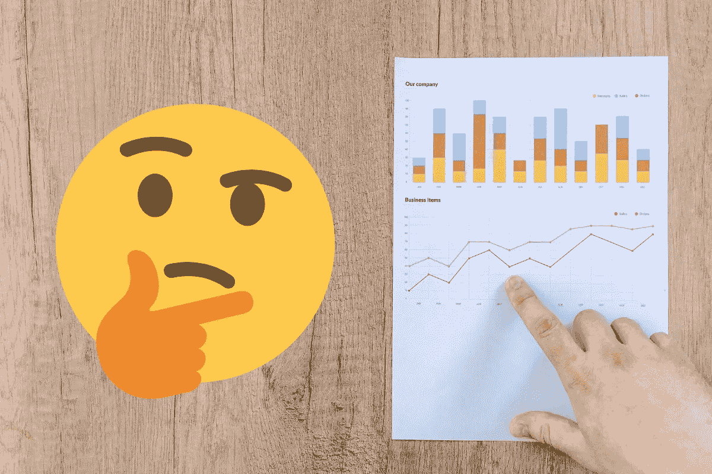
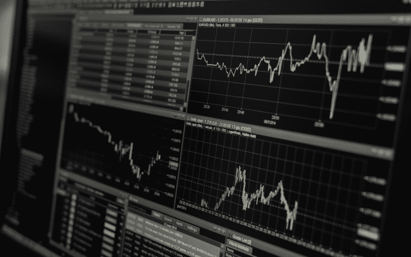
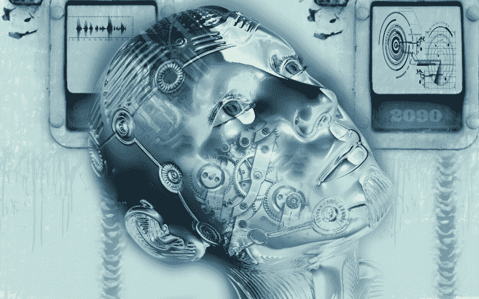

# 数据分析的未来:对我们前进方向的 5 个预测

> 原文：<https://medium.datadriveninvestor.com/the-future-of-data-analytics-5-predictions-for-where-we-are-headed-385f8d9df269?source=collection_archive---------4----------------------->

在基本层面上，数据分析只是利用数据做出更明智的决策。这是我们大多数人每天都在做的事情。我们看天气预报来决定我们是否应该带雨伞。我们检查电影分级来看一部电影是否值得看。

在业务层面，对*大数据的访问允许公司分析他们的客户*或潜在客户，以及跟踪某些活动的进展。例如，在线博客跟踪访问者的数量和花在文章上的时间。他们还可以跟踪哪些文章导致了销售线索、产品购买、订阅等形式的转化。

随着人工智能的出现和对数据仓库更容易的[访问](https://lionbridge.ai/datasets/ultimate-dataset-aggregator-for-machine-learning/)，数据分析的潜力已经极大地增长，并将在不久的将来继续增长。在本文中，我们将对数据分析的未来、它将增长的领域以及可能阻碍增长的事情给出五个预测。

# 1.智能一切—用户数据农业

未来 10 到 20 年，用户数据将变得越来越容易获取。这意味着私营公司和政府机构将会更加积极地跟踪、存储和使用您的个人数据。

一个日常的例子就是在你的电脑和移动设备上监控你的互联网活动。谷歌的部分条款和服务(实际上没人阅读)允许他们*跟踪你的在线活动*。谷歌使用这些数据的一种方式是，根据你的网上购物历史和互联网浏览历史，个性化显示给你的广告。我们接受与我们下载的应用程序和我们使用的程序类似的协议。然而，大多数人并不关心或者甚至不知道这种情况正在发生。

随着物联网(IoT)的不断扩大，这种对我们用户数据的*耕作*将变得越来越普遍。智能手表和智能家居等设备将能够利用这些数据让我们的生活更加便利。虽然这种连接将使我们的生活变得更容易，但这也意味着我们更多的个人数据将被提供给像谷歌这样的组织，他们将利用这些数据来更好地了解我们并营销他们的产品。

作为消费者，我们有责任根据我们是否同意他们的做法来支持公司。举个例子，越来越多反对谷歌追踪系统的人选择使用像 DuckDuckGo 这样的搜索引擎，这些搜索引擎不会追踪你的搜索历史。

然而，即使公众强烈要求围绕数据农业实施法律，政府的行动也相当缓慢。在 Joe Rogan 的播客中，科技大亨 Elon Musk 解释了他对政府立法减缓人工智能步伐的缺乏信心，并举了一个例子，仅在汽车上强制使用安全带就花了大约 10 年时间。

人工智能和数据分析很可能都会经历类似的政府干预的缓慢步伐。数据农业在放缓之前可能会加速发展。

# 2.规范分析的道德行为准则

在不久的将来，公司将不得不为他们的规范性分析模型创建道德行为准则。

**什么是规定性分析？**

简单地说，规范分析就是利用数据预测来决定下一步行动。一个很好的例子是股票交易预测模型的使用。一个简单的模型可以在一定的增长增量后触发购买股票，比如一只股票连续 3 天上涨。这个模型可以设置为给你一个警告，预测股票在下个月的预期涨幅，并列出最佳行动方案。

可以创建类似的模型和系统来跟踪公司的销售额、员工产量等等。随着更好的模型被开发出来，可能会有更多的大公司求助于它们来帮助制定商业战略。例如，假设您创建了一个规定性分析模型，以寻找在一年内将利润提高 10%的方法。为了便于讨论，假设分析结果指向一个选项列表:

> 1.解雇 20%的人力资源员工
> 
> 2.关闭你的生产仓库，把它们转移到一个欠发达的国家
> 
> 3.将广告预算削减 50%,并雇佣额外的销售人员

虽然这些建议很可能会将利润提高 10%，但每一项都会产生巨大的影响。更重要的是，这些建议可能会违反*的道德行为准则*。这就引出了一个问题:我们应该仅仅基于数据分析做出如此重大的商业决策吗？

早在 2015 年，斯蒂芬·霍金、埃隆·马斯克和比尔·盖茨都发表公开声明，警告世界人工智能的风险。他们都警告说，在没有首先了解如何避免技术带来的相关风险的情况下开发人工智能。同样，对于规范分析，创建严格的指导原则必须成为标准的业务实践，如果不是法律法规的话。

# 3.数据分析外包将会增加

大大小小的公司都将开始外包数据分析服务，这将导致数据分析外包公司的崛起。

一个相当明显和确定的预测是，数据分析将变得更加普遍，不仅是在大公司内部，小公司也是如此。就像搜索引擎营销(SEM)现在是营销和广告战略中最重要的元素一样，数据分析也将变得不可或缺。

然而，较小的公司通常没有预算来雇佣数据工程师或数据科学家在内部完成这项工作。因此，就像 SEM 一样，许多公司将转向外包数据分析服务的供应商。

# 4.公立学校利用数据分析技术的速度会很慢

数据分析技术最有趣的应用之一是改善教育系统。然而，公立学校很可能会对在当前的工作流程和协议中实施数据分析技术犹豫不决。

原因很简单:繁文缛节越多，实施任何变革所需的时间就越长。在许多西方国家，很少有机构比公立学校系统有更多的繁文缛节。另一方面，*私立学校可能会很快采用这项技术。*

私立学校，尤其是私立大学，有更多的自由来运作和创新。此外，数据分析有许多方法可以帮助大学生保持正轨，降低辍学率。

本科学位应该在四年内完成，但美国只有 50%的学生在六年内完成本科学位，20.5%的学生在六年内辍学。虽然更好的咨询可以降低流失率，但《时代》杂志报道，美国大学平均每 1737 名学生有一名辅导员。

数据分析模型可以从学生数据中学习，并在辍学的学生中找到“T4”模式。这些模式可能是缺课、考试不及格或总平均成绩下降。然后，该模型可以在现有学生中寻找这些模式，并通过显示类似问题的学生列表来提醒辅导员。数据分析可以帮助学校优先考虑有风险的学生，为他们提供所需的帮助，并防止他们辍学。

# 5.现实生活中的 J.A.R.V.I.S:虚拟助手将与数据分析融合

或许更准确地说，虚拟助理将利用数据分析技术。虽然没有达到钢铁侠 x J.A.R.V.I.S .的规模，但将自然语言处理技术与数据分析模型相结合将大大改善用户体验。这反过来会减少分析数据和制定下一步行动的总时间。我们已经看到了谷歌分析的早期阶段。

Google Analytics 是站长用来跟踪网站数据和监控变化的工具。但是，您可以简单地输入问题或命令，如“显示本月的任何异常情况”，而不是查看每份报告。

然后，系统会向您显示重要指标的峰值或下降。简单地给这个系统添加一个 ASR 模型就可以为网络数据创建一个用户友好的虚拟助手。

以上只是对数据分析未来的五个预测。随着机器学习技术的更大进步，我们肯定会看到数据分析市场也在增长。

有关数据分析的更多文章、新闻和指南，请查看下面我们的相关资源，不要忘记订阅我们的时事通讯。

[原创文章](https://blog.getcangler.com/the-future-of-data-analytics-5-predictions-for-where-we-are-headed)经许可转贴。