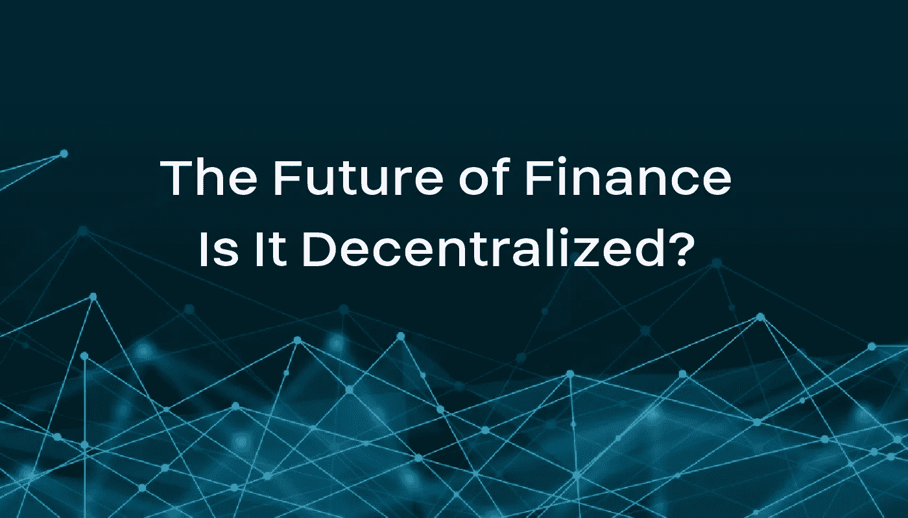
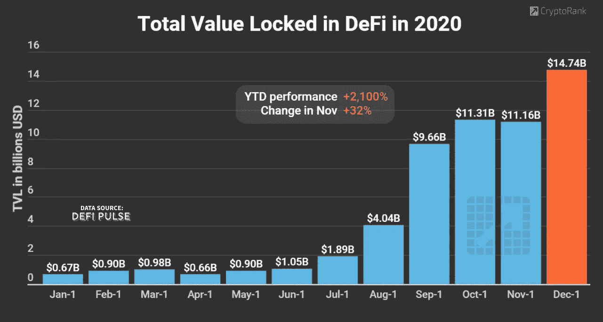
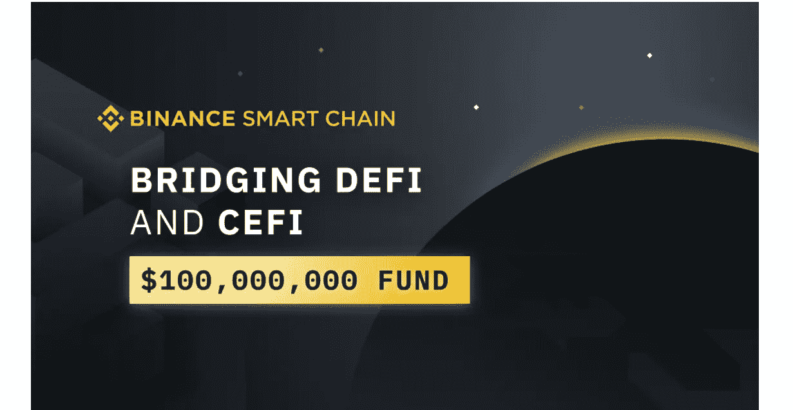

# 金融的未来——是去中心化的吗？

> 原文：<https://medium.datadriveninvestor.com/the-future-of-finance-is-it-decentralized-ecef239a5c96?source=collection_archive---------13----------------------->

The Future of Finance — Is It Decentralized?

## 在过去的几个月里，人们对 DeFi 的兴趣大增。对许多人来说，它的吸引力在于它能够提供一种更好的方式来赚取利润，而所需的投资只是他们原本需要的投资的一小部分。

去中心化金融，更好的说法是 **DeFi** 是 2020 年最热门的加密术语，并且在我们进入 2021 年时看起来是最热门的话题。分散金融基本上描述了基于区块链的协议和应用程序，这些协议和应用程序旨在创建一个替代金融系统，以取代当前的集中金融系统。

尽管存在争议(从传统银行业的角度来看)，但在过去几个月里，人们对 DeFi 的兴趣激增。对许多人来说，它的吸引力在于它能够提供一种更好的方式来赚取利润，而所需的投资只是他们原本需要的投资的一小部分。据 [DeFi Pulse](https://defipulse.com/) 称，对这种另类投资和金融系统的兴趣已经膨胀，从 2020 年 1 月锁定的 6.7 亿美元总价值开始，相比之下，2020 年 11 月的水平为 147.4 亿美元

Total Value Locked in DeFi — Data Source DeFi Pulse, Image Source CryptoRank

即使对它很感兴趣，大多数公众仍然不明白它是如何工作的。

## **DeFi——与当前金融体系的对比**

在传统的金融体系中(被狂热分子称为 CeFi，或集中金融)，整个货币控制权掌握在少数人或组织手中。这包括制定政策，发行货币，确定利率，甚至控制通货膨胀。一方面，这看起来不错。少数有专业知识的人可以决定采取什么行动最符合公众的利益。然而，随之而来的是几个缺陷。

例如，可以采取许多步骤来启动一个垂死的经济，但是一小群闭门造车的人可能更喜欢走最快的路线。这可能导致决策者采取措施，有可能抹去一个国家数百万人的财富。委内瑞拉的情况就是如此，一些糟糕的政策选择导致了超过 1000 万的通货膨胀。通货膨胀率如此之高，以至于许多人目睹他们辛辛苦苦挣来的积蓄在几天之内变得一文不值。

这种步骤和糟糕的决定是导致中本聪最初创造比特币的原因。加密货币不可信、独立且没有中央控制，被誉为未来。不幸的是，对于去中心化的支持者来说，具有讽刺意味的是，大多数围绕加密货币发展的服务都是集中的。

**DeFi 解决方案**

利用区块链的力量，DeFi 系统为人们投资和获利提供了一个更好的选择。数字货币、由数字编码的智能合约组成的协议以及用户界面都是构建 DeFi 应用程序所需的元素。

DeFi 的主要价值主张是每个人都保留对其资产的完全控制权。储存在银行和其他金融机构的法定货币，或传统货币，从来不在所有者手中。在 DeFi 中，除了你自己，没有人持有你的资产。今天，有几个 DeFi 平台以与传统系统相同的方式为人们提供投资和其他机会。

## **DeFi:maker Dao 和 Compound 的父亲**

虽然许多人会争论什么是第一个 DeFi 系统，但[马克尔道](https://makerdao.com/en/)和[大院](https://compound.finance/)无疑是第一个让 DeFi 真正为公众所用的平台。这两个平台都被认为是核心 DeFi 原语。

人们可以将资金存入资金池，然后这些资金被贷给借款人。从借款人那里获得的利息被分配给资金池成员。由于所有的控制都是通过成员的直接投票和智能合约中的协议来完成的，因此不需要银行和担保等中介机构。

这意味着本应属于银行家的佣金被直接转嫁给了贷款人，给了他们更高的投资利息。在合同的另一方面，借款人得到的利息比他们从银行得到的要低得多。所有人的双赢。

**分散交易所**

DeFi 服务已进一步扩展到包括更复杂的投资和盈利服务，如加密交换。区块链的速度、效率和经济融入了这些交易所的根基。它们被命名法所伪装: [**分散交换**](https://en.wikipedia.org/wiki/Decentralized_exchange) (DEX)。

用户只需要直接连接他们的钱包，使用内置的智能合约进行交易，他们的目标密码直接存入他们的钱包。除了合同执行之外，没有交易所的参与。一些交换甚至不需要注册，给予真正的经济和隐私自由，这是区块链的精髓。

*让我们来看几个比较流行的指数:*

**币安指数**:币安是世界上最大的中央加密交易所之一，提供独立的指数。它有自己的本土区块链，提供最快的 DEX 交易速度和较低的交易费用。

**uni swap**:uni swap 是所有 dex 中最有影响力的，交易量最大([、日交易额 2.2 亿美元](https://www.bnnbloomberg.ca/defi-boom-makes-uniswap-most-sought-after-crypto-exchange-1.1509130))。Uniswap 也是首个放弃传统订单簿方法的 DEX，所有交易都通过流动性池进行互换。这意味着用户的订单是实时执行的，因为需要购买的令牌总是可用的。因此，不需要等待匹配的订单。

**Bisq**:Bisq 是极少数提供比特币的 dex 之一，其核心是去中心化的。Tor 路由和本地计算意味着交换的每个方面都是去中心化的，隐私得到最大限度的维护。然而，这使得交换在操作上相当慢。

**Kyber Network** :深究 DeFi 生态系统的最深处，Kyber Network 并不是传统意义上的交易所(即使对于 DeFi 和 dex 来说)。Kyber 是一组协议和智能合约，可以部署在任何区块链之上，就像第二层一样。这种逆向方法允许任何人构建 DEX，只要所讨论的区块链具有智能合约功能。

 [## 如何在不牺牲孩子或财务的情况下安全理智地离婚|数据驱动…

### 在美国，七月是以孩子为中心的离婚月。作为 cdfaⓡ的专业人士，我可以向你保证，从长远来看…

www.datadriveninvestor.com](https://www.datadriveninvestor.com/2020/07/28/how-to-divorce-safely-and-sanely-without-sacrificing-your-children-or-your-finances/) 

**其他定义用途**

DeFi 已经扩大，远远超出了简单的交易和贷款业务。如今，DeFi 平台提供涵盖其他金融方面的不同服务，包括以下服务:

**支付协议** : **PumaPay、xDai Chain** 和 **Raiden** 就是很好的例子，在这些协议中，人们可以向接受加密支付的商家支付日常服务费用。

**身份和 KYC**:Civic**，SelfKey** 和 Bloom**Bloom**等平台根据 KYC 和反洗钱规定验证个人身份证件。这样，用户就不需要在每次创建登录时都在合作伙伴平台上进行验证。

**保险**:用 **Nexus Mutual、**Ehterisc、 **VouchForMe** 去掉保险的中间人。

**投资**:通过 **Melonport** 、 **Swarm、Brickblox** 和 **Slice** 投资多个产品。

**稳定型**:避免了密码的波动性，增加了的安全性，稳定型的有**戴、、**和碳。

**NFTS:** 不可替代令牌是代表独特资产的加密令牌，其主要特征是数字稀缺性和不可替代性。像 [**基因金融**](https://gene.finance/) 这样的 DeFi 公司正在建立平台，通过引入矿池来入股闲置的 NFTs 和无缝交易的分散市场，增加虚拟经济中 NFT 的流动性机会。

> “像 Uniswap 或 Aave 这样的公司已经为流动性创造了创新的解决方案，以及从闲置加密资产中赚取被动收入的有效方法。在不久的将来，我预见 CeFi 和 DeFi 之间的桥梁将引领开放金融的未来，重要的是我们要尽早开始利用这一点。”— Michael Liu，全球业务发展经理， [ViewFin](https://www.viewfin.com/)

[**Bridging DeFi and CeFi Image Source: Binance**](https://www.binance.com/en/blog/421499824684900972/Bridging-DeFi-and-CeFi-Introducing-a-%24100M-Support-Fund-for-DeFi-Projects-on-Binance-Smart-Chain/)

## CeFi-DeFi 桥

许多人认为，DeFi 不会取代 CeFi，但 CeFi/DeFi 混合产品更有可能存在，CeFi 机构可能会挑选他们喜欢的 DeFi 产品，并将其集成到他们更方便用户的平台中。

世界上最大的加密货币交易所币安在 2020 年 9 月宣布，它将让其新的分散式币安智能链(BSC)访问其集中交易所(CeFi)，并投入 1 亿美元支持基于 BSC 的 DeFi 项目，推动 CeFi 和 DeFi 之间的合作。

根据[公司的新闻稿，币安的](https://www.binance.com/en/blog/421499824684900972/Bridging-DeFi-and-CeFi-Introducing-a-%24100M-Support-Fund-for-DeFi-Projects-on-Binance-Smart-Chain/)用户可以从 CeFi 的两种产品中受益——期货、保证金、储蓄和 DeFi 解决方案，包括赌注、池化、贷款、自动做市商、流动性开采和产量养殖..

这一新计划的目标用户是希望在不离开中央平台的情况下参与 DeFi 的币安用户。

> 基于区块链的 DeFi 是结合 P2P 加密货币、物联网、人工智能和 DLT 等新兴技术的自然结果。现在，全球数字资产阈值以及任何潜在的参数或过滤器都可以编码在智能合同中，由机器学习进行跟踪、丰富、路由或以其他方式采取行动，这些机器学习可以通过自动化流动性池进行增强，并通过 DeFi dApps 调用风险管理措施。智能合约触发的加密货币交易及其内在的行动治理是人工智能未来的命脉，DeFi 将成为赋能工程和金融引擎。— [流动账簿首席执行官兰迪·麦奎尔](https://www.linkedin.com/in/randy-mcguire-a61428/)

**结论**

虽然 DeFi 部门相对来说只是主流金融行业的一小部分，但它在最近几个月显示出了巨大的前景和惊人的增长。许多项目和 dApps 已经启动，它们提供的产品和服务比传统的金融和投资公司更具盈利能力。虽然破坏 CeFi 的目标可能还有很长的路要走，但 DeFi 部门绝对值得关注。

Linkedin 上的奥黛丽·奈斯比特

[@ audreynesbit 11 在推特上](https://twitter.com/AudreyNesbitt11)

[螺旋营销&公关](http://www.spinspirational.com/)

访问专家视图— [**订阅 DDI 英特尔**](https://datadriveninvestor.com/ddi-intel)