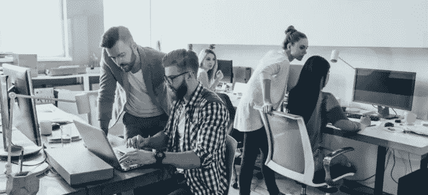

# 新闻业的未来

> 原文：<https://medium.datadriveninvestor.com/the-future-of-journalism-6bc9d9d90cb2?source=collection_archive---------23----------------------->

科技正无处不在，现在在新闻业也是前所未有！

Y 是的，今天我来说说 **AR 论文** ( **又名— AR 期刊**)。你还记得在《哈利·波特》系列电影**中，有报纸(**《每日预言家》**)载着行走和交谈的人，更不用说“活生生的”照片了吗？我实际上要说，由于技术的不断进步，我们已经非常接近了。**

根据 Techxplore 的说法，它将不再是魔法，而是别的东西:一个变得真实的虚拟世界。

事实上，在苏黎士的**媒体技术中心**，例如，学生和研究人员正在合作发明一种“增强现实论文”，如果我们可以这样称呼它的话，它将允许我们通过 **AR 眼镜**看到报纸上移动的照片，就像**每日预言家**。

> TCM 的总经理还说，将来这种眼镜会非常小，可以全天候使用。

更详细地看，**TCM 和苏黎世联邦理工学院**的研究人员正在开发这种**增强版报纸**，使用传统纸张，但带有数字内容:

> 克林勒解释说:“你通常把报纸拿在手里，一旦戴上护目镜，你就能看到照片和文字的变化。”。

你可能会想:“**是的，但这就像在网站上看视频**重点是，会显示它的不会是电脑或智能手机，而是用纸做的报纸**！**

**未来，它将首先在瑞士**使用视频来代表一个事件或新闻，例如苏黎世 sechseluten festival 上的 bgg。****

******MTC** 在**苏黎士**中心的 [**AR 眼镜**](https://medium.com/y-technology/the-next-big-thing-in-apple-852d80329cdc) 项目，正在追求一个非常现实的目标。****

****任何通过 AR 眼镜观看游行广场的人都会看到当地信息，如电车发车时间、周边商店的广告横幅，或者关于位于那里的两家主要银行的报纸文章。****

********

****重点是实际可读性的主题:何时何地展示广告横幅、报告和参展商？****

> ****“MTC 主要关心的是如何尽可能容易地为媒体生成这些新型的数字内容，”kling ler 说。****

****使用 **MTC 工具**，很容易增加虚拟人物的游行广场，例如，把它变成动物园或海底世界。****

> ****“人们在虚拟现实中创造的一切都会自动出现在真实的游行广场上，”克林勒解释道。****

****我们的工具意味着用户不再需要面对如何将他们的虚拟内容带到正确位置的难题。**他们可以专注于设计。******

********

****我们现在处于项目的困难阶段。事实上，目前还没有简单的解决方案的技术挑战之一是“遮挡管理”:与在工作室编辑的电影不同，在真实场景中实时移动的虚拟角色**通常不能在用户转过街角时立即从视野中消失**。****

****这扰乱了增强虚拟体验的可信度。****

********

******瑞士联邦理工学院的研究人员已经开发出一种使这项工作更好的方法**:例如，一只在 Stampfenbachplatz**电车站附近游荡的虚拟恐龙现在就像在现实生活中一样立即从视野中消失，转到苏黎世州媒体中心附近的拐角处。******

****为此，瑞士联邦理工学院的研究人员使用了苏黎世市的三维模型。相当可观！****

****你怎么想呢?你想看类似《哈利·波特》的报纸吗？****

****干杯！****

********