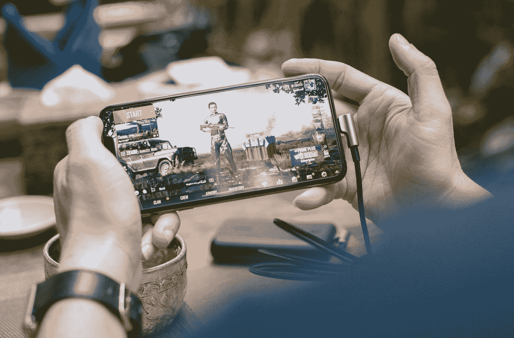
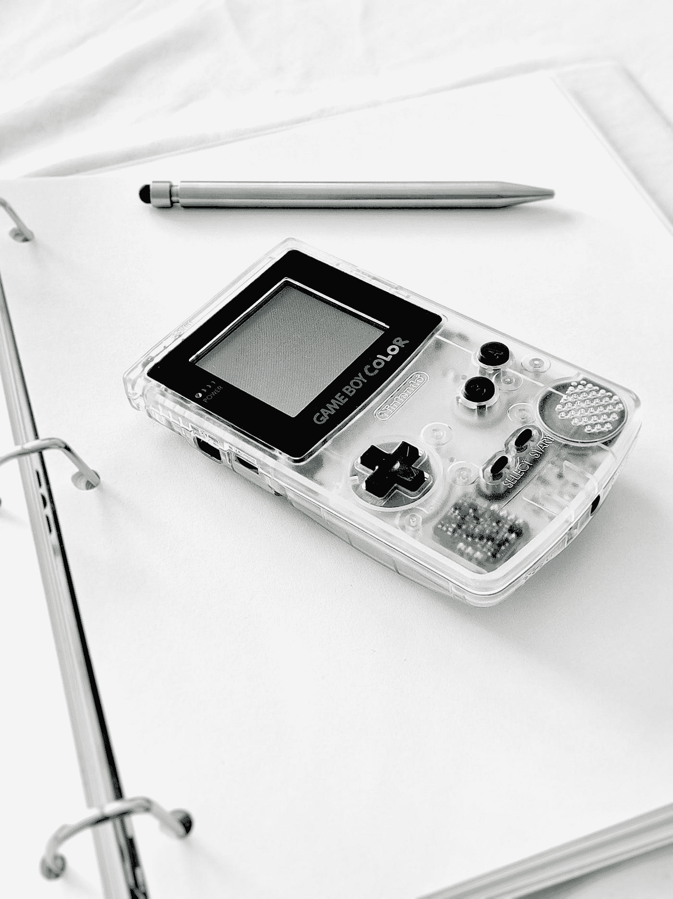

# 移动游戏的未来！

> 原文：<https://medium.datadriveninvestor.com/the-future-of-mobile-gaming-1bc5b31acd35?source=collection_archive---------1----------------------->

在这个时代，手机游戏的崛起当然是显而易见的。这种游戏方式一直被认为不如其他平台。我们已经到了这样一个阶段，移动游戏已经成长为世界上最大的游戏市场之一。即使这个平台上的大部分游戏看起来都是“低质量”的。

Photo by [SCREEN POST](https://unsplash.com/@screenpost?utm_source=medium&utm_medium=referral) on [Unsplash](https://unsplash.com?utm_source=medium&utm_medium=referral)

# 未来会怎样

让我们来看看移动游戏的未来。这个行业的主要“问题”之一是缺乏高质量和高端的游戏。这种情况现在每天都在发生变化。仅在今年，Riot games 就已经进入了移动游戏行业，他们推出了一款名为《Runeterra 传奇》( Legends of Runeterra)的卡牌游戏，其冠军与《英雄联盟》( League of Legends)相同。团队作战战术是他们的另一个释放。还有英雄联盟狂野 Rift 手机版 LoL 在 2020 年 6 月进行了 alpha 测试。也有传言说 Riot 也将把 Valorant 带到手机上。

因此，我们可以看到 Riot 公司对这个市场非常感兴趣。但是 Riot 并不是唯一一个进入移动市场的公司。新的暗黑破坏神游戏将只适用于手机，这显示了手机游戏市场的重要性。

这些只是即将登陆手机的游戏中的一小部分。移动游戏市场的另一个关键部分是移动部分。现在的智能手机变得非常强大。以至于苹果正在制造由移动 CPU 驱动的笔记本电脑。

 [## 现代个体医疗实践需要的不仅仅是一项技术。数据驱动的投资者

### 围绕医疗保健的官僚主义和不断增加的行政负担对任何医学专家来说都不陌生…

www.datadriveninvestor.com](https://www.datadriveninvestor.com/2020/06/03/the-modern-day-solo-medical-practice-needs-more-than-just-a-technology/) 

# PC 与移动

如果我们比较一下 PC 游戏世界和手机游戏世界，我们会发现很多不同之处。例如，如果你想在 PC 上有一个好的游戏体验，你必须花很多钱，你可能无法玩所有的游戏。另一方面，有了旗舰手机，你可以玩任何你想玩的东西。你可能会说你的个人电脑功能更多，用途更广。但在这个时代，你几乎可以用智能手机做任何你想做的事情。

移动游戏的另一个光明前景是电子竞技。在这方面，PC 世界遥遥领先，但这并不意味着手机游戏没有竞争的场景。很多游戏已经展示了移动电子竞技的潜力。在电竞场景最大的游戏中，我们可以提到 PUBG Mobile、Clash Royale、Brawl Stars 等等。

# 游戏仿真

模拟也是手机游戏的一个重要组成部分，对于所有复古游戏玩家来说，你可以在你的设备上模拟很多游戏，随着你的智能手机变得越来越强大，你将能够玩更多的游戏。

Photo by [Spencer](https://unsplash.com/@spen?utm_source=medium&utm_medium=referral) on [Unsplash](https://unsplash.com?utm_source=medium&utm_medium=referral)

# 云游戏

随着云游戏的增加，移动已经成为移动游戏的一个非常有价值的选择。有了 Google Stadia、GeForce Now、PlayStation Now 等服务。你有非常多的种类，所以你可以在手机的小屏幕上玩所有你想玩的游戏。此外，5G 将使这一过程更加顺畅。

总之，移动游戏看起来是一个非常有前途的领域。尽管它可能会取代个人电脑和游戏机游戏，但它正在接近它。我不能肯定地说什么，但光明的未来就在前面，我们只能等着看事情会如何发展。随着主要玩家进入这个市场，只有好事会发生。

## 访问专家视图— [订阅 DDI 英特尔](https://datadriveninvestor.com/ddi-intel)