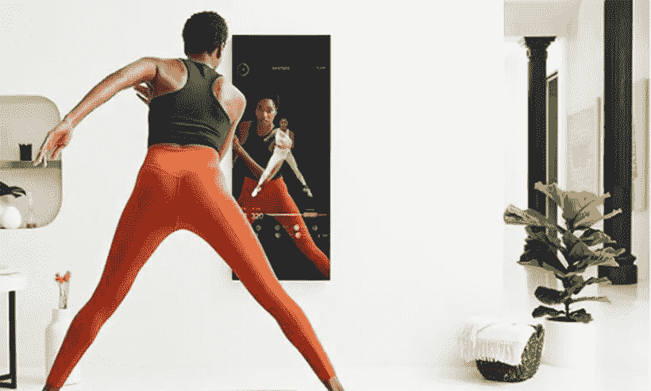

# 体育的未来

> 原文：<https://medium.datadriveninvestor.com/the-future-of-sports-48a45a14a874?source=collection_archive---------4----------------------->

Photo by [Form](https://unsplash.com/@theformfitness?utm_source=medium&utm_medium=referral) on [Unsplash](https://unsplash.com?utm_source=medium&utm_medium=referral)

你知道自己练瑜伽最难的是什么吗？把温暖的床换成瑜伽垫是找不到动机的。也不是把你自己扭曲成一个体式或者连续做 108 个体式。对我来说，主要的挑战是放置手机摄像头来记录我的运动。它既不能太高也不能太低，既不能太近也不能太远。这样我就可以观看视频，并检查我是否以正确的方式做了体式。锻炼时摆弄相机可能是一种令人厌烦的经历。

上瑜伽课也好不到哪里去。老师不可能注意到所有的学生，通常情况下，课程的进度和最差的学生一样快。作为一名经验丰富的瑜伽练习者，我需要一些更符合我需求的东西。我的私人瑜伽教练，但不去印度。

接收细微的、实时的、准确的反馈是任何身体练习的主要挑战。无论你是练瑜伽、太极还是攀岩，知道自己什么时候做错了什么对提高至关重要。当反馈是零星的和不一致的，开发会非常慢。在科技时代，我们能为此获得更好的工具吗？

**辉煌与适者生存的苦难**

健身和健康技术(或 FitTech)在过去五年中蓬勃发展。它从简单的健身应用程序开始，以预订健身课程，在线课程和分享结果。但是可穿戴设备的发明彻底改变了它。可穿戴设备是放置在身体上收集实时数据(如位置、速度、心跳等)的设备。预计到 2024 年，可穿戴设备市场[将达到 670 亿美元。活动追踪器目前](https://www.ukactive.com/wp-content/uploads/2019/03/ActiveLab_Report_The_Current_State_Of_FitTech_Web.pdf)[占了一半](https://www.ccsinsight.com/press/company-news/2332-wearables-market-to-be-worth-25-billion-by-2019-reveals-ccs-insight/)。苹果、Fitbit 或小米等可穿戴设备制造商已经获得了大量消费者。FitTech 的发展受到了千禧一代的推动，他们关心健康，希望随时掌握个人数据，以便为运动和健康部署更智能的策略。

帮助设定和监控健身目标的活动追踪器和应用程序仍然是最受欢迎的 FitTech 技术。他们变得越来越老练。例如， [Fitbit 的 SmartTrack](https://www.fitbit.com/uk/technology) 可以自动识别七种类型的活动。然而，这项技术提供了与您的活动模式相关的一般数据。你仍然需要理解这些信息。它告诉你你锻炼了多少，但不是多好。它与一个全程指导你提高练习的体贴教练相去甚远。

这就是适者生存的辉煌和痛苦所在。它是基于数字测量，而不是定性评估。它激励你多锻炼，但多并不总是意味着一件好事。有时候越少越好。锻炼过程中的质量和注意力提供了最好的结果。

直到最近，该技术一直在努力改善这一领域，但它已经改变了吗？

**超然物外**

当我参观英格兰板球委员会的办公室时，我第一次看到了“生物力学应用程序”。作为一个非常精通技术的组织，他们开发了一个[互动教练](https://www.ecb.co.uk/video/118656/helping-our-fast-bowlers-improve-pace-and-craft)来收集和分析运动员的运动数据。互动教练提供高度个性化和准确的反馈，有助于发现运动员表现的不足并加以改进。它只有一个巨大的缺点。捕捉动作需要配备大量传感器的重型设备。不是你在家就能复制的。

Source: Ecb.co.uk

但是整个想法似乎很吸引人。经过一点研究，我发现一些合适的初创公司在运动捕捉(MoCap)这个勇敢的新领域冒险。一家是总部位于香港的 OliveX 公司，它开发了一个八段锦应用程序。该应用程序帮助用户仅使用智能手机摄像头练习中国运动八段锦。这项基于谷歌 TensorFlow Lite 的技术可以识别主体姿势并对动作进行分类。然后，它会对动作进行评分，这样用户就可以看到他是否正确地完成了一项练习。

八段锦是一款相对不复杂的 app。但新一代可穿戴设备将它带到了一个新的高度。几家公司提供轻型微型传感器，可以捕捉运动并将数据实时发送到智能手机。Notch 提供少至六个设备的套件(429 美元)。该套件可以很好地捕捉任何运动的身体运动——瑜伽、拳击、自行车、游泳、体操。[阿索斯运动服](https://www.liveathos.com/) (696 美元)结合了 MoCap 技术和肌肉活动测量。阿索斯的衬衫和裤子含有肌电图传感器来测量肌肉产生的电信号。当你第一次使用这个系统时，你通过做一些基本的练习来校准它。之后，该系统会向您显示最佳的运动水平以及哪些肌肉运动不足或过度。另一款智能服装，[纳迪 X 瑜伽裤](https://www.wearablex.com/collections/nadi-x-smart-yoga-pants)(249 美元)，采用了触觉技术。当你练习瑜伽时，裤子会在臀部、膝盖和脚踝处轻轻震动，以引导你的动作。虽然对初学者来说很复杂，但对于只需要一点调整的更有经验的从业者来说，它们是完美的。

这些产品不仅比过去笨重的设备更便宜、更容易使用。它们通过物理方式(通过在普通运动服中嵌入传感器)和虚拟方式(通过智能手机获取和理解数据)让技术更接近客户。为了实现这一目标，他们专注于围绕自己的技术构建应用生态系统。

这也是可穿戴设备厂商面临的最大挑战。如果没有理解数据的用户友好的应用程序，硬件是没有用的。许多主流客户认为 FitTech 设备不够容易理解和使用。这意味着 FitTech 初创公司仍在努力争取更广泛的客户采用。但是未来就在眼前——像谷歌和三星这样的大鲨鱼已经开始寻求潜入这些有利可图的水域。

**透过窥镜**

FitTech 初创公司的另一个令人兴奋的选择是将 MoCap 设备嵌入环境中的一个对象。当你伸展或扭动时，捕捉你的动作的第一个候选者是一面古老的镜子！

[MIRROR](https://www.mirror.co/)

镜子正成为我们进入虚拟现实的大门。开发“八段锦”应用的 OliveX 公司已经向亚洲市场推出了一款名为“KARA Smart Fitness”的互动镜子。它有一个内置的摄像头，可以在你跟随镜面上显示的专业教学视频时检测动作。然后镜子会根据你的锻炼强度给你打分。这鼓励你更加努力地工作。你锻炼得愉快吗？给你的虚拟教练击掌！类似的产品在世界各地迅速增长。镜子是美国健身海报的孩子。以 1495 美元的惊人价格，[登陆了许多名人的 Instagram 页面](https://www.theatlantic.com/health/archive/2020/01/mirror-mirror-workout-wall/604699/)，包括詹妮弗·安妮斯顿、格温妮丝·帕特洛、Lady Gaga，并吸引了媒体的赞誉。《镜报》雄心勃勃，要通过将体育与社交媒体相结合来重新发明锻炼程序——它肯定会成功的！

**我们要去哪里？**

很明显，技术改变了我们运动的方式。

首先，它变得非常个性化——从八段锦应用程序和振动瑜伽裤到建议你减轻右腿创伤压力的镜子。没有两次健身是相同的。你的所见所感与任何人的经历都不一样，因为科技比你妈妈更了解你。

其次，这项技术让健身更贴近用户。你不必花时间开车或在公共交通工具上流汗，就可以在健身房锻炼一个小时。健身现在触手可及，只需点击一下，就在你的智能手机应用程序中。

最后，这一切都是为了收集、分析和存储尽可能多的数据。你的速度、强度和心跳速率。一周，一个月，一年前。什么都没丢。您可以看到自己的锻炼进度，细节非常详细，非常精确。

也有局限性。这项新技术很昂贵。有传感器的衣服或花哨的互动镜子仍然属于极少数人。大多数人注定要去当地的健身房和 YouTube 视频。然而，随着技术变得越来越好，越来越便宜，这将不再是一个问题。很快人们就会意识到它对他们的健康和幸福的好处。

对我来说，是时候订购振动裤，智能衬衫，并开始以一种新的方式锻炼了！