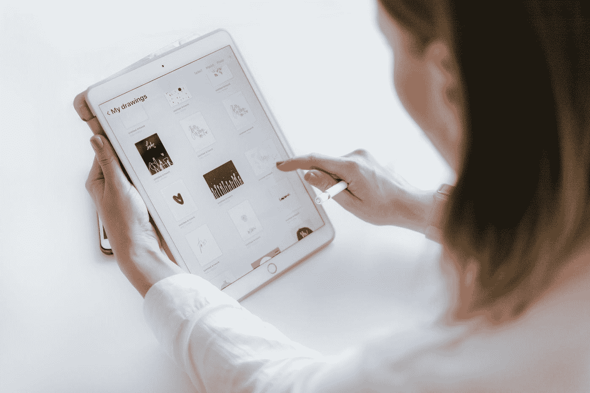

# 平板电脑的未来！

> 原文：<https://medium.datadriveninvestor.com/the-future-of-tablets-42acbbeae103?source=collection_archive---------5----------------------->

在过去的几年里，平板电脑有起有落，尤其是平板电脑的安卓方面。智能设备市场的这一面总是在用智能手机和笔记本电脑“打”许多仗。

Photo by [Marek Levák](https://unsplash.com/@designmesk?utm_source=medium&utm_medium=referral) on [Unsplash](https://unsplash.com?utm_source=medium&utm_medium=referral)

## iPads

苹果在平板电脑市场拥有最大的市场份额，接近第二名三星的三倍。他们的平板电脑系列取得了巨大成功。在过去的几年里，他们一直试图使它们更类似于笔记本电脑。要实现这一目标，他们还有很多工作要做，但他们已经走上了正确的道路。

## 安卓平板电脑

安卓平板一直被 iPads 压得喘不过气来。但近年来，出现了一些伟大的安卓平板电脑，可以与最新最伟大的 iPads 并驾齐驱。尤其是三星最新的平板电脑，它将成为 iPad 最大的竞争对手之一。三星对许多不同部门进行了一些重大改进，主要改进是 SPen 技术和屏幕。

与现有的平板电脑相比，Windows 平板电脑最接近笔记本电脑，主要原因是它们的操作系统。亚马逊也在平板电脑市场上，他们的产品主要包括电子书阅读器和平板电脑，目的只是为了在他们的网站上购买。

 [## 创新农场和先锋精神:所有组织(和你)都需要在…

### “首席数字官”和“首席转型官”是组织目前的新管理角色…

www.datadriveninvestor.com](https://www.datadriveninvestor.com/2020/08/13/innovation-farm-and-a-pioneers-spirit-all-organization-and-you-need-to-still-have-a-say-in-the-future/) 

## 今后

与智能手机市场相比，平板电脑市场几乎不算什么。然而，它们仍然有市场。艺术家和内容创作者，尤其是移动游戏内容创作者，大量使用高端平板电脑，如 iPads 或 Galaxy Tab S7。这些设备提供比旗舰智能手机更好的性能，让您的生活更加轻松。除此之外，平板电脑也被用作电子书阅读器。现在，我们的世界大部分都是在线的，你可以购买一台设备来做多件事情，在大多数情况下，这导致购买一台平板电脑。就这些设备的未来而言，它仍将保持不变。然而，如果制造商让平板电脑更类似于笔记本电脑，笔记本电脑市场将不得不担心平板电脑成为他们的竞争对手。

**进入专家视角—** [**订阅 DDI 英特尔**](https://datadriveninvestor.com/ddi-intel)