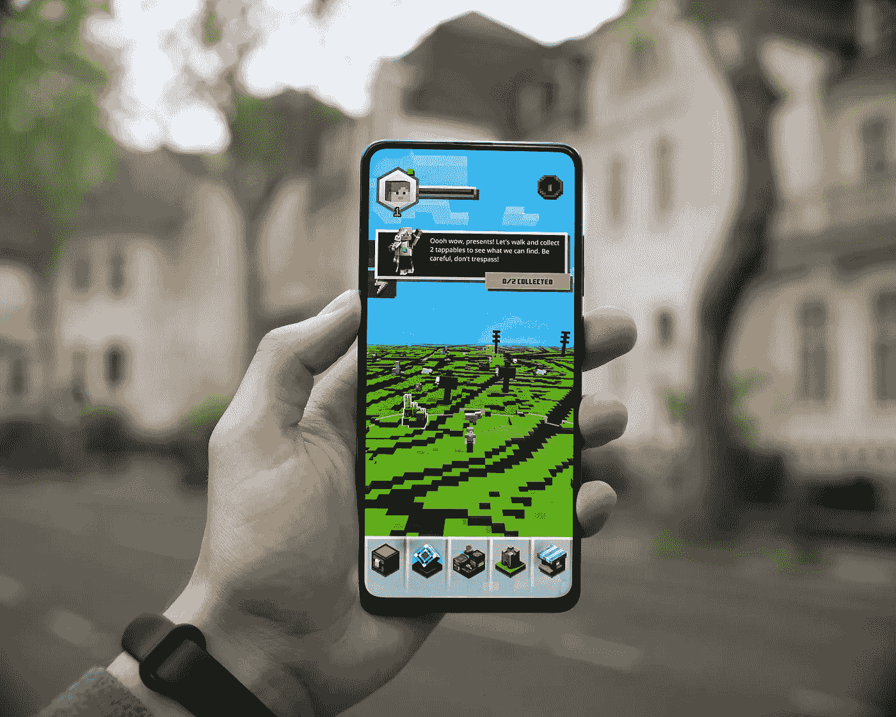
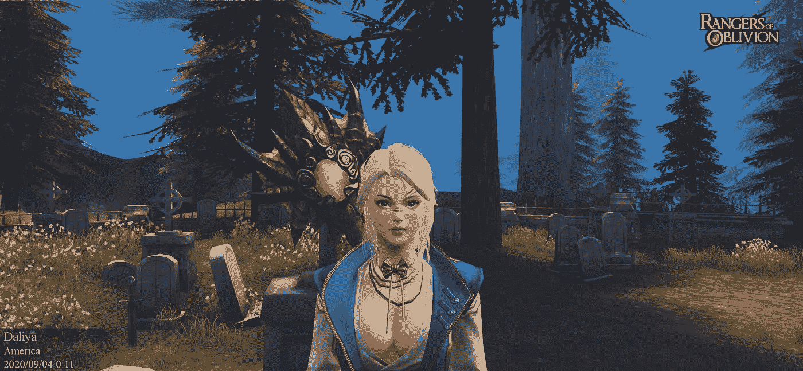
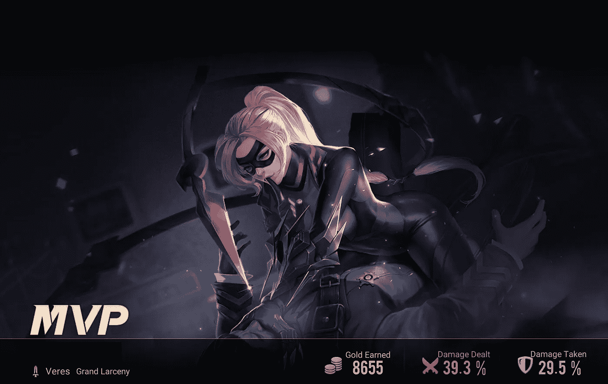
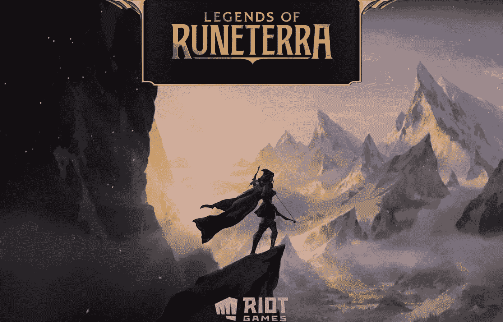

# 游戏行业的未来是移动的

> 原文：<https://medium.datadriveninvestor.com/the-future-of-the-gaming-industry-is-mobile-c698195729f5?source=collection_archive---------2----------------------->

## 探索视频游戏市场的最大领域。

Photo by [Mika Baumeister](https://unsplash.com/@mbaumi?utm_source=unsplash&utm_medium=referral&utm_content=creditCopyText) on [Unsplash](https://unsplash.com/s/photos/phone-games?utm_source=unsplash&utm_medium=referral&utm_content=creditCopyText)

公众对手机游戏的兴趣正以天文数字的速度增长，目前的数据显示超过 13.6 亿用户。众所周知，手机游戏越来越受欢迎——随着越来越多的游戏加入这个领域，越来越多的用户也加入进来。像[苹果的金属](https://developer.apple.com/metal/)这样的技术已经在推动进步，现在一系列主要的主机游戏都有可以在任何地方玩的移动版。

分析师和手机游戏玩家似乎都明白[手机游戏带来了一个巨大的机会](https://techcrunch.com/2019/08/22/mobile-gaming-mints-money/)，那么游戏社区的其他人会怎么做呢？为什么如此多的主机和 PC 游戏玩家仍然对移动游戏翻白眼，好像每个移动游戏都只是披着新皮肤的 [*糖果粉碎*](https://apps.apple.com/us/app/candy-crush-saga/id553834731) ？是时候我们开始像对待视频游戏行业的大多数人一样对待手机游戏了——原因如下。

Photo From Author

## 手机游戏是“真正的”电子游戏

作为一个手机游戏玩家，你会很习惯其他玩家在提到手机游戏时翻白眼的方式。人们普遍认为，所有真正的视频游戏都必须在游戏机或个人电脑上玩。手机游戏不可能是真正的游戏，因为手机没有相同的处理器或显卡——或者嘿，屏幕太小，它不可能是好的！

这是为什么呢？

当你和主机游戏玩家谈论热门游戏时，他们往往会关注像 [*怪物猎人*](https://www.monsterhunterworld.com/) 或 [*使命召唤*](https://www.callofduty.com/home) 这样的大牌。那些应该是真正的游戏。你知道，复杂的游戏随着时间的推移会有详细的机制。大世界和密集的战斗方式。那种你可以吹嘘自己赢了的游戏。这些游戏不可能在手机上运行——除非它们已经在运行了。

[*遗忘游侠*](https://roo.gtarcade.com/) 是一款手机版的*怪物猎人*，有一些非常有创意的怪物(巨兽)和一个写得非常好的支线任务集，分散在整个世界。 [*使命召唤手机*](https://www.callofduty.com/mobile) 让你有机会和玩控制器的人玩这个经典游戏(唯一的*真正的*玩家工具！)还能在触摸屏上用它们擦地板。

> 你在用 *iPad 玩*使命召唤*吗？*

是的，我是。这是同一个游戏。大部分相同的地图。同样的挑战和机制，甚至更多！

Photo From Author

## 大牌，大投资

*使命召唤*并不是游戏界唯一进军移动领域的大牌。电脑游戏玩家都非常了解 Riot Games 以及他们对手机游戏日益增长的兴趣。他们已经带来了 [*团队战斗战术*](https://teamfighttactics.leagueoflegends.com/en-us/) 和 [*符文特拉传说*](https://playruneterra.com/en-us/) ，现在他们准备好了[全球增量发布](https://www.forbes.com/sites/mikestubbs/2020/11/18/league-of-legends-wild-rift-release-date-announced/?sh=749ea0fe2d86) [*英雄联盟*](https://wildrift.leagueoflegends.com/):荒野大裂谷 ，一款将 LoL MOBA 体验带到手机上的游戏。

这与目前拥有 Riot Games 的公司腾讯(T0)以及他们向移动游戏的推进是一致的，这些移动游戏拥有受欢迎的游戏，如 iOS 和 Android 上受欢迎的国际 MOBA[*【PUBG Mobile】*](https://www.pubgmobile.com/en-US/)*和*[*【Arena of Valor】*](https://www.arenaofvalor.com/)。《英雄竞技场》( Arena of Valor )( Arena of Valor )( Arena of Valor )( Arena of Valor )( Arena of Valor )( Arena of Valor )( Arena of Valor )( Arena of Valor )( Arena )( Arena of Valor )( Arena )( Arena of Valor )( Arena )( Arena )( Arena )(简称“T13 ”)的作曲家名单上有一位因创作《星际争霸》( Interstellar)和《加勒比海盗》( Pirates of Caribbean)而闻名的天才作曲家汉斯·季默(“T15 ”),这一事实证明了腾讯对投资兹默的净资产估计为 2 亿美元，供你参考。

[网易](https://netease-na.com/)，一家以分享游戏而闻名的强大公司，如 [*【魔兽世界】*](https://worldofwarcraft.com/en-us/) 和 [*风暴英雄*](https://heroesofthestorm.com/en-us/) 通过与[暴雪](https://www.blizzard.com/en-us/)的合作，已经推出了令人难以置信的沉浸式手机游戏，包括*遗忘游侠*和 [*身份 V*](https://idv.163.com/) ，这是一款类似于 [*的不对称恐怖游戏 以及*](https://deadbydaylight.com/en) *[*LifeAfter*](http://www.lifeafter.game/) ，这是一款后世界末日生存游戏，汇集了来自世界各地的玩家来狩猎、建造家园，并对不断进化的僵尸和危险动物发起战争。 LifeAfter* 现已登陆 PC，向我们展示了移动游戏与其他平台无缝对接的未来。

Photo From Author

## 在我们中间应该是规则，而不是例外

在最近的手游新闻中，我们当中的**风靡全球。这款充满谋杀和阴谋的古怪游戏吸引了很多关注，并鼓励大量新用户尝试手机游戏。虽然这对手机游戏来说是一个巨大的进步，但我们中的*不应该被认为是手机游戏的例外。***

**尽管我们当中的*是一款受到很多关注的手机游戏，但它并不能真正证明手机游戏的能力。在未来，我们可以希望在一些更大更强大的手机游戏中看到这种热情。我们需要减少对简单手机游戏的关注，更多地关注更复杂的游戏以及它们所能提供的东西。触摸屏为稍加练习的游戏玩家提供了大量的控制——特别是对于现在伴随着触摸屏而不是按钮长大的一代人来说。***

****

**Photo From Author**

## **所有人都在关注暴乱**

**当我们展望移动游戏的未来时，似乎没有人比 Riot Games 更有机会永远改变移动游戏的面貌。随着[每月有 1 . 15 亿玩家](https://leaguefeed.net/did-you-know-total-league-of-legends-player-count-updated/#:~:text=League%20of%20Legends%20has%20a,of%2050%20Million%20daily%20players.)在*英雄联盟*上，没有人有更大的权力在未来几个月吸引人们对手机游戏的关注。目前，[发布的游戏性](https://www.theverge.com/2020/5/29/21274419/league-of-legends-wild-rift-gameplay-trailer-mobile-console)展示了这款游戏从 PC 到移动的近乎完美的翻译。随着这款游戏在世界各地发行，看看有多少用户开始玩 *Wild Rift* 以及它是否会鼓励玩家尝试其他一些主要的手机游戏将会很有趣。目前，我们能做的就是等着瞧。**