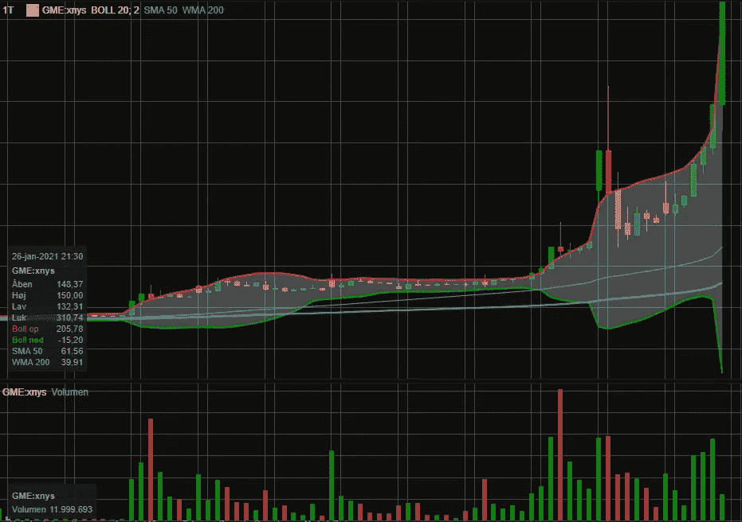
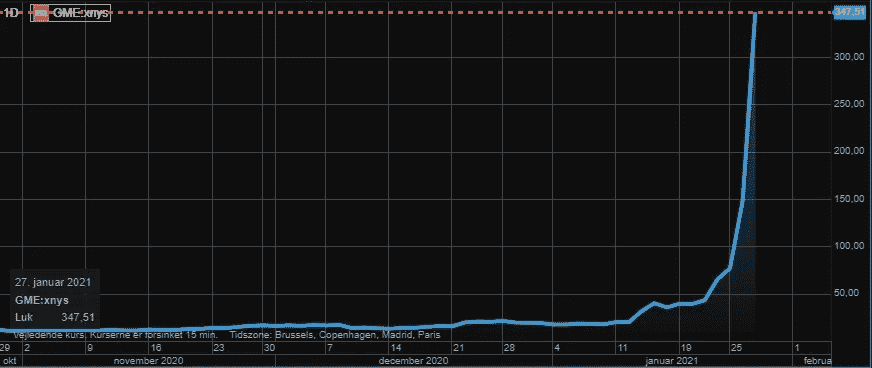
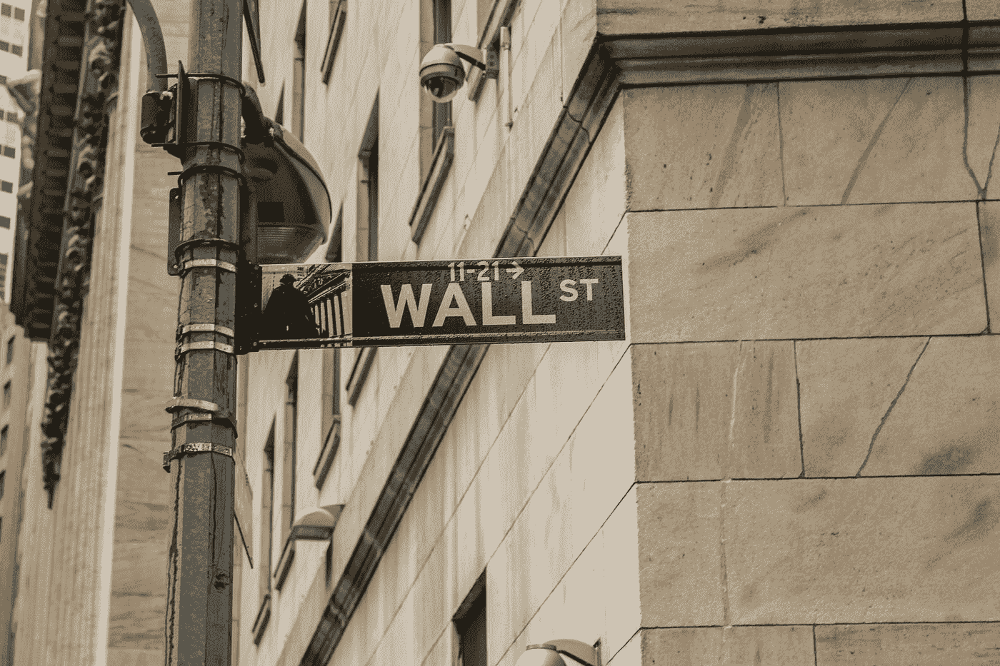

# GameStop 热潮会让散户投资者抓狂

> 原文：<https://medium.datadriveninvestor.com/the-gamestop-craze-will-screw-retail-investors-fea762111434?source=collection_archive---------2----------------------->

## 零售商对金融市场操纵者的反抗

## 随着次级 Reddit WallStreetBets 接受激进卖空者，一些对冲基金无论结果如何都在获利

GameStop price action, last 10 days. Screenshot by the author. Source: Saxo Bank

GameStop 是金融市场上的热门话题。

视频游戏的重磅炸弹已经挣扎了多年。尽管过去一年有一些不错的基本面消息，让实体商店的承诺在越来越在线驱动的行业中幸存下来，但这只股票一直是卖空者的最爱。

那是直到现在。该股在一年内(截至 1 月 27 日中午)的涨幅超过了*6.600%。这种增长的大部分可以归功于仅在一月份就增长了大约 1.5%的股票*。**

尽管一些基本面消息推动了股价，但最近的崩盘与基本面无关，而是与一场“社交媒体遇上金融市场”的完美风暴有关。

一家名为 *WallStreetBets* 的子 Reddit 已经开始挑战对冲基金行业，打破金融市场的规则。

虽然给许多参与者带来了异常收益，让接受刺激计划的人一夜之间成为百万富翁，但实际上只有少数对冲基金在幕后真正受益。

许多散户投资者面临被挤兑的风险。

为了理解发生了什么，下面将揭示伽玛和短挤压是如何工作的。以及低成本(和低质量)经纪服务的使用、过度冒险和投机行为的短暂性意味着许多散户投资者将留下咸咸的眼泪。

## 著名投资者和亿万富翁企业家支持的 GameStop

乍一看，GameStop 的商业模式似乎已经过时了。

一家销售视频游戏的实体连锁店，人们可以在他们的游戏客户端直接在线购买大部分游戏，如用于 PC 的 Steam 和 Epic 或用于游戏机的 PlayStation Store 和 Microsoft Store。

大多数人会打赌他们会慢慢死去。因此也有了电子游戏大片的绰号，指的是曾经如此成功的电影租赁连锁店的失宠。

但随着新一代游戏机上市以及与微软的合作，前景可能不会那么暗淡。

最近，在线宠物零售商 Chewy 的创始人 Ryan Cohen[重金收购了](https://markets.businessinsider.com/news/stocks/gamestop-stock-price-investment-ryan-cohen-chewy-founder-1700-return-2021-1-1030000866)公司，并让自己和前 Chewy 高管进入董事会。

向在线市场的过渡看起来很有可能。

该公司还获得了迈克尔·j·伯里(Michael J. Burry)的支持，后者以预测 2007 年至 2008 年的房地产泡沫并做空而闻名，因此是电影《大空头》(The Big Short)中主角的现实版。

今年夏天，他[透露](https://markets.businessinsider.com/news/stocks/big-short-michael-burry-1500-percent-gain-gamestop-stake-2021-1-1030004676)已经建立了约*170 万*的公司股票的多头头寸，现在有望大幅获利。

但基本论点不应与当前的狂热混为一谈，Burry 自己在 Twitter 上称之为危险的:

> 如果我把$GME 放在你的雷达上，你做得很好，我真心为你高兴。然而，现在发生了什么——应该会有法律和监管方面的影响。这是不自然的，疯狂的，危险的。@ sec _ enforcement
> ——Michael j . Burry 在 2021 年 1 月 26 日发布的一条现已被删除的推文[。](https://twitter.com/redditinvestors/status/1354244064091246595/photo/1)

相反，股价上涨是由于散户投资者群体对低流通股和大量相对短流通股的卖空者进行投机。

## 触发伽玛和短挤压

GameStop stock price over time, 3 months. Screenshot by the author. Source: Saxo Bank

对于那些不知道的人，华尔街赌注(WSB)是社交媒体 Reddit 上的一个分论坛。它由交易股票和期权的成员组成，主要是看涨期权。

用户互相称呼对方为堕落者或自闭者。该论坛因其*损益色情*而闻名，用户在这里展示他们高风险/高回报交易的结果，通常被称为 *YOLO 交易*。

但是在金融迷因和火箭运载表情符号的表面之下，[社区](https://www.reddit.com/r/wallstreetbets/comments/l5teyc/we_are_tired_of_market_manipulators_and_corrupted/)对他们眼中的普通人被对冲基金和机构投资者欺骗越来越失望。

> 空头回补将导致价格大幅上涨

为了反击所谓的市场操纵，社区对投机被对冲基金大量做空的股票产生了兴趣。

完美的目标有一个很大的短期浮动，有时甚至超过浮动的 100%。如果交易活跃的股票数量很少(例如，创始人和高管持有大量股票)，那就更好了。

为了执行，他们需要通过买入股票来推动股价上涨，迫使卖空者平仓，从而进一步推高股价。

WSB 用户购买的股票份额越大，卖空者就越难找到愿意出售的股东。这意味着触发空头回补将导致价格大幅飙升。

如果 WSB 能引起伽玛挤压，这一切都会被放大。他们通过购买大量看涨期权来实现这一目标。

> 做市商将开始以当前价格购买股票

看涨期权是一种合同，赋予所有者在特定日期(*到期日*)以特定价格(*执行价格*)购买特定数量股票的权利而非义务。

如果期权到期时执行价格高于实际股价，这些期权就没有价值。

因此，用现金购买*期权——执行价格高于当前价格的期权——通常很便宜，因为它们包含了期权将一文不值的重大风险。*

另一方面，如果在到期日股价远高于行使价，期权代表着执行期权并以市场价出售股票的直接收益。

因此，期权价格反映了市场对从现在到到期日之间股价变动的预期。

投资者从他们的经纪人那里购买期权，或者从做市商那里购买期权。当买入大量看涨期权时，期权的卖方承担了很大的风险。

这是因为他们必须在股票到期时在市场上购买股票，然后卖给执行期权的买家。

为了对冲这种风险，做市商将开始以当前价格购买股票。如果交易量足够大，这将推高股价。

这个过程被称为伽玛挤压。

当股价上涨 100%时，以几便士购买的看涨期权会突然变得很值钱，成为做市商。这进一步推高了价格。

如果所有的反馈循环都在起作用，完美风暴就会出现，股票会飙升，给股东带来不正常的利润，给卖空者带来痛苦。

在发布针对 GameStop 的做空报告的基金中，有 Melvin Capital 和 Citron。

两家公司都声明他们已经平仓，包括巨额亏损。

但是 WSB 不相信这一点。不过，这些说法是真是假无关紧要。WSB 人群继续囤积股票和看涨期权。

## 对冲基金正在暗中运作

Photo by [Sophie Backes](https://unsplash.com/@sophili?utm_source=medium&utm_medium=referral) on [Unsplash](https://unsplash.com?utm_source=medium&utm_medium=referral)

虽然 WSB 目前在社交媒体和新闻上受到了很多关注，但他们并没有完全靠自己推动股价。

WSB 投机者已经成功地移动了指针，引发了更大参与者的行动。

但是这里有更大的赌注。许多零售商冒着被套牢的风险，因为他们无法预见音乐何时停止。

与此同时，WSB 投资者并不是唯一从 GameStop 破产中获利的人。

> 罗宾汉交易者没有以最好的价格完成订单

首先，WSB 人群中使用最广泛的经纪人是 Robinhood(以下也适用于 eToro 和许多类似的零佣金平台)。

虽然标榜免费，但事实并非如此。最近，负责监管金融市场的美国证券交易委员会(SEC)对罗宾汉提起诉讼，指控其不准确披露收入来源。

罗宾汉不是经纪人。他们从外部使用经纪服务。虽然客户不支付交易佣金，但 Robinhood 通过向执行交易的交易公司出售订单流来赚钱。

这意味着罗宾汉交易者不能以最好的价格完成他们的订单。而且不止于此。

 [## 罗宾汉将“你的”股票借给卖空者(并保留所有收益)

### 零佣金交易平台如何在幕后赚钱

medium.com](https://medium.com/datadriveninvestor/robinhood-lends-your-shares-to-short-sellers-and-keeps-all-the-proceeds-78353ca33fb9) 

著名对冲基金 Citadel 为 Robinhood 的订单流买单。他们在输入订单簿之前收到订单。

这是一个毫秒的问题——订单似乎会立即被人类的大脑执行。

Citadel 有机会先于 Robinhood 交易员自己购买股票。

几家对冲基金已经将算法落实到位。算法交易由 GameStop 的价格行为决定，也在 GameStop 运动之外交易其他 WSB 目标公司的股票，如 AMC Entertainment 和 Blackberry。

> 这个小个子男人似乎在玩一场他赢不了的游戏。

对冲基金仍然是价格波动的主要原因。许多人暂时将计就计，乘势而上。

但是他们很可能会在零售商考虑之前退出。

此外，许多机构投资者建立了量化模型来权衡罗宾汉情绪——主要是反对罗宾汉情绪。

根据加州大学研究人员最近在 T2 进行的一项研究，罗宾汉交易者采取羊群效应和 FOMO 驱动的投资方式。华尔街从利用这种行为偏见中获利。

Melvin Capital 已经出售了自己的股权以提高流动性(还出售了 Pinterest、SEA Ltd .等公司的大量股票头寸)。买家…城堡。

Citadel 通过 Robinhood 从 WSB 对 Melvin Capital 进行投机所赚的钱因此被用于纾困 Melvin。这个小个子男人似乎在玩一场他赢不了的游戏。

WSB 声称要打击“操纵市场的吸血鬼”。但通过投机并非由基本面推动的股票，并利用 Robinhood 等平台来这样做，他们不知不觉地为交易供应链上的所有吸血鬼提供了血液。

WSB 应该受到称赞，因为他们关注金融市场的可用性及其给普通公民带来的所有机会。

然而，尽管打击那些拥有市场支配力的基金操纵市场的想法是一个很好的理由，但从长期来看，目前陷入困境的公司中的投机泡沫似乎没有任何意义。

现在得出最终结论可能还为时过早。但当势头消退时，GameStop 的股价可能会暴跌，甚至比它的上涨速度还要快。

如果没有买家准备从所有准备退出的人手中拿走股票，下跌将是痛苦的。

对 GameStop 的短期兴趣在急剧下降后再次上升，因此许多市场参与者预计泡沫将很快破裂。

希望不会有太多的零售商看到他们的储蓄像太阳下的薄雾一样蒸发。

 [## 振作起来，通货膨胀就要来了

### 美国通胀预期正在上升。财政和货币政策意味着通胀将进一步加快步伐

medium.com](https://medium.com/datadriveninvestor/brace-yourself-inflation-is-coming-2c27d170705c)  [## Roblox 的直接上市表明投资银行变得过于贪婪

### 或者，投资者为最近的 IPO 支付了过高的价格

medium.com](https://medium.com/datadriveninvestor/the-direct-listing-of-roblox-indicates-investment-banks-have-become-too-greedy-d07364062bc2)