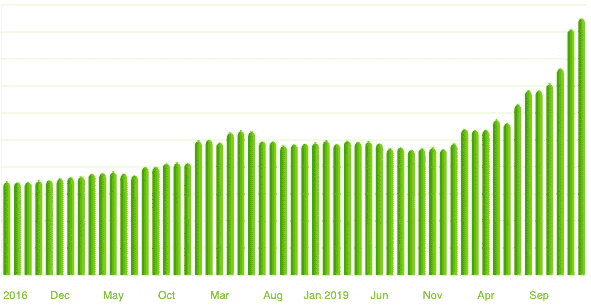

# 慢慢变富计划

> 原文：<https://medium.datadriveninvestor.com/the-get-rich-slow-scheme-f3327e78d754?source=collection_archive---------8----------------------->

[Mint.com](http://mint.com) — My Assets 2016–2020

人们经常寻找快速致富的方法，但是快速致富的却很少。它通常包括承担巨大的风险或获得真正的运气。当他们承担太多风险时，他们中的许多人由于屈服于贪婪而损失了很多钱。如果你遇到一个快速致富的简单方法，很可能这是一个骗局。

因为我有点厌恶风险，不想依靠运气，所以我提倡缓慢致富计划。我相信在 10 到 30 年的时间里，许多美国人有能力成为百万富翁。

1 **消除一切高息债务。如果你有超过 6%的债务，集中精力尽快还清。利率在 14%到 24%之间的信用卡债务尤其糟糕。很少有投资能持续获得 20%以上的收益，所以即使你有很大的投资(10%的年回报率)，如果你用信用卡支付 20%的年利率，你仍然会有 10%的净损失。如果你背负着沉重的债务负担，基本上就没有致富之路。有些种类的债务比其他的要好。消费者债务不是好债务。然而，如果数学可行，以低利率借钱进行可能产生回报的投资可能是一个好主意。重要的是要注意按时支付账单，不要过度扩张自己，这将有助于提高你的信用。良好的信用会让你为未来的投资获得更好的融资。**

2 **先支付自己。制定一个一年的储蓄目标。确定你需要从每份薪水中留出多少钱来实现这个目标。如果你每两周领一次工资，你可以将全年的工资除以 26。如果你还没有，那就开一个高收益储蓄账户。我倾向于使用与你的支票账户不同的银行。这将使你更难把钱从储蓄账户转到支票账户——这是你想尽一切办法避免的。此外，网上银行和信用合作社通常比大型消费银行提供更好的利率。大多数雇主会让你直接存入多个银行账户。把预定的金额存入你的储蓄，其余的存入支票。如果你没有这个选项，可以考虑账户之间的定期转账。**

为了消除债务，首先支付自己，量入为出很重要。简单地说，你应该花比你赚的少的钱。如果你花的比你挣的多，不管你挣多少，你永远都是穷人。

3 **永远不要动你的储蓄账户**。只有在投资或紧急情况下，你才应该动用你的储蓄账户。实际上，我建议创建两个或更多的储蓄账户。你可能有一个储蓄账户来为度假或汽车存钱，而另一个账户只用于积累长期财富。你甚至可以把应急基金存在第三个账户里。将这些账户分开将有助于防止你将长期储蓄账户用于消费。

4 **把你的钱投资于资产**。一旦你消除了高息债务，建立了一个你觉得放心的应急基金，就开始投资资产。不投资资产几乎不可能致富。事实上，[法定货币(如美元、欧元)是长期表现最差的资产](https://medium.com/the-capital/stop-paying-the-hidden-tax-2bb690b5b7e2)。这是因为这些货币被设计成通过通货膨胀来亏损。每年，你的美元都会比前一年贬值 2-3%。目前这比大多数储蓄账户提供的要少。这意味着持有现金会产生负回报，即使你在赚取利息。

从资产中赚钱有两种主要方式——现金流和资产增值。

*   **现金流**资产是产生被动收入的好方法。一些常见的例子是出租物业和支付股息的股票。另一个选择是自己创业。将你的现金流再投资到更多的资产中(或者回到你的企业中)。
*   资产增值是一种长期赚钱的好方法。一些常见的例子是股票或财产的价值随着时间的推移而增加。如果 10 年前你在特斯拉投资 1000 美元，但不知何故抑制住了卖掉其中任何一部分的冲动，那么它现在的价值约为 15 万美元。另外，如果你在十年内每月向特斯拉投资 200 美元，你的股票今天将价值超过 420，690 美元(太棒了！).特斯拉是一只高风险的股票，在业绩方面是一个异数。或者，投资 SPY 等标准普尔 500 指数基金的年平均收益率约为 8-12 %,持有的 rusk 要少得多。以 12%的回报率计算，十年后你的钱会翻三倍。在每次发工资的时候，自动完成这些购买，帮助你积累更多的和[美元平均成本](https://www.investopedia.com/terms/d/dollarcostaveraging.asp#:~:text=Dollar%2Dcost%20averaging%20(DCA)%20is%20an%20investment%20strategy%20in,volatility%20on%20the%20overall%20purchase.)。如果你投资股票，在某个时候，它们可能会贬值。对大多数股票来说，长期趋势是向上的。如果公司的长期前景保持良好，不要在下跌时卖出。事实上，这是一个很好的时机来增加你的位置。如果你有流动资金，而大多数人没有，你会发现自己处于一个非常有利的位置，可以以非常低的价格购买资产。例如，那些在 2008 年金融危机期间拥有充足现金储备和良好信用的人能够以巨大的折扣购买房地产和股票，这是一个不太常见的机会。

我最喜欢的方法是结合这两种资产类型。给自己一份不错的现金流资产。用这些现金流购买会随着时间推移而升值的股票。如果你从资产增值中赚了很多钱，你可以卖掉那些资产来购买更多的现金流资产。一旦这个系统建立起来，你将完全独立于你的工资创造财富。我个人将出租房产作为现金流资产，但成为房东并不适合所有人，所以要找出最适合你的方式。

获得财富的美妙之处在于，你获得财富的速度会加快。10 万美元的 10%比 1000 美元的 10%多得多。这就是复利的妙处。

*“复利是世界第八大奇迹。谁理解它，谁就赢得它。谁没有，谁付钱。”*

-阿尔伯特·爱因斯坦

此外，一旦你创造了更高水平的财富，你就可以获得新类型的资产。例如，投资初创企业是有风险的，通常需要大量资本，但它们有潜力产生 100 倍至 1000 倍的回报。只有当你有一大笔钱并且愿意冒更大的风险时，这些投资才是实际的。80%的初创企业会失败，这相当于你投资的 100%损失。如果你是投资新手，我不建议承担这种程度的风险。

如果你的净资产超过 100 万英镑，或者你每年的收入超过 20 万美元(合 30 万美元)，你可以成为[合格投资者](https://www.investopedia.com/terms/a/accreditedinvestor.asp)并投资 [IPO](https://www.investopedia.com/terms/i/ipo.asp) ，这往往会产生巨大的回报。

如果你害怕投资，不太懂，最简单的办法就是买指数基金。比如你可以买 [SPY](https://www.investopedia.com/articles/investing/122215/spy-spdr-sp-500-trust-etf.asp) ，这是一只[追踪 S & P 500 指数的 ETF](https://www.investopedia.com/etfs-4427784) 。一项间谍投资分散在 500 多家公司。这种多样化有助于降低风险。如果你有或者赚了一大笔钱，找一个专业人士来帮你管理可能是值得的。

5 **考虑税收影响**。有很多方法可以减轻你的税务负担。如果你持有一项资产一年或更长时间，你将在出售时支付资本利得税。这可能比你在一年前出售资产所支付的标准税率要低得多。还有一些工具可以帮助你减轻税务负担。使用 401k、[个人退休帐户](https://www.investopedia.com/terms/i/ira.asp)或罗斯个人退休帐户为退休储蓄。如果你正在出售一处租赁房产以购买一处更贵的房产，使用 [1031 交易所](https://www.investopedia.com/financial-edge/0110/10-things-to-know-about-1031-exchanges.aspx)来避免支付销售税。有一个孩子，并想开始为他或她的大学基金储蓄？获得一个 [529 计划](https://www.nerdwallet.com/blog/investing/529-plans-list/)为免税教育挣钱。投资创业公司？[第 1202 条](https://www.investopedia.com/terms/s/section-1202.asp#:~:text=Section%201202%2C%20also%20called%20the,business%20stock%20acquired%20after%20Sept.)规定，当你投资某些小企业股票时，可以免除资本收益税。

6努力工作。这个问题太明显了，我差点错过了，应该排在名单的第 1 或第 2 位。我们看着超级成功的企业家，作为旁观者，他们的成功似乎是在一夜之间到来的。你看不到的是，在你听说他们之前，他们已经付出了多年的努力。他们在做大之后也继续努力。如果你在为别人工作，让自己变得不可或缺。要求加薪和升职，如果被拒绝了，就去找其他公司。更高的薪水会让通往财富的道路变得更加容易。在他们的生意起步的时候，那些已经创立了新公司的企业家们经常在几年里疯狂地工作，却拿着很少的薪水。

**亲提示**

避免出售表现良好的资产。我最好的投资是特斯拉和 T2 的比特币。他们都表现得很好，但我在[比特币](https://medium.com/datadriveninvestor/what-is-bitcoin-b914ebb292)上赚的钱比[特斯拉](https://damian-shchur.medium.com/how-to-make-money-off-of-the-most-shorted-stock-in-history-tesla-motors-bf2501b1ed7e)多。这主要是因为随着价格上涨，我多次出售了[特斯拉](https://damian-shchur.medium.com/how-to-make-money-off-of-the-most-shorted-stock-in-history-tesla-motors-bf2501b1ed7e)。如果我从未卖掉我的特斯拉股票，我会比现在富有得多。

不要试图通过卖出并希望以更低的价格回购来把握市场时机。你不是你想象中的那么好的交易者。很有可能你最终会以更高的价格回购，或者持有现金太久。[最近的一项研究显示，表现最好的投资者不是死了就是不活跃了。](https://wealthydiligence.com/best-investors-are-dead/)设置好了就算了！

同时，不要抓住一艘正在下沉的船不放。如果一个公司不适应不断变化的世界，它将无法生存。资本主义是经济达尔文主义；你必须适应生存。

[比特币](https://medium.com/datadriveninvestor/what-is-bitcoin-b914ebb292)是过去十年中表现最好的资产之一，我预计它将继续增长。如果你对[比特币](https://medium.com/datadriveninvestor/what-is-bitcoin-b914ebb292)知之甚少，请前往[我的帖子](https://medium.com/datadriveninvestor/what-is-bitcoin-b914ebb292)，在那里我会给你概要。

这些资产中的任何一种都可能贬值，需要很长时间才能恢复，有些永远无法恢复，所以最好分散投资，避免保证金交易(T21)。

[在这里购买比特币](https://www.coinbase.com/join/shchur_h)

**免责声明:**

我不是财务顾问。这不是财务建议。自己做研究。

如果你喜欢这篇文章，可以看看我的新文章，标题是[停止支付隐性税收](https://medium.com/the-capital/stop-paying-the-hidden-tax-2bb690b5b7e2)，在这里我剖析了持有过多现金的陷阱。

如果你喜欢这篇文章，[注册加入我的邮件列表](http://eepurl.com/hT4Nuf)。你每周只会收到一封电子邮件，内容是我最新的博客文章、播客和其他我正在做的事情。我在这里帮助你踏上自我提升的旅程。成为今天最好的自己！

[点击这里报名吧！](http://eepurl.com/hT4Nuf)

[**直接支持我成为中等会员**](https://damian-shchur.medium.com/membership) **。如果你使用** [**这个链接**](https://damian-shchur.medium.com/membership) **注册，你的一部分付款会直接到我这里。**

**获取专家观点—** [**订阅 DDI 英特尔**](https://datadriveninvestor.com/ddi-intel)