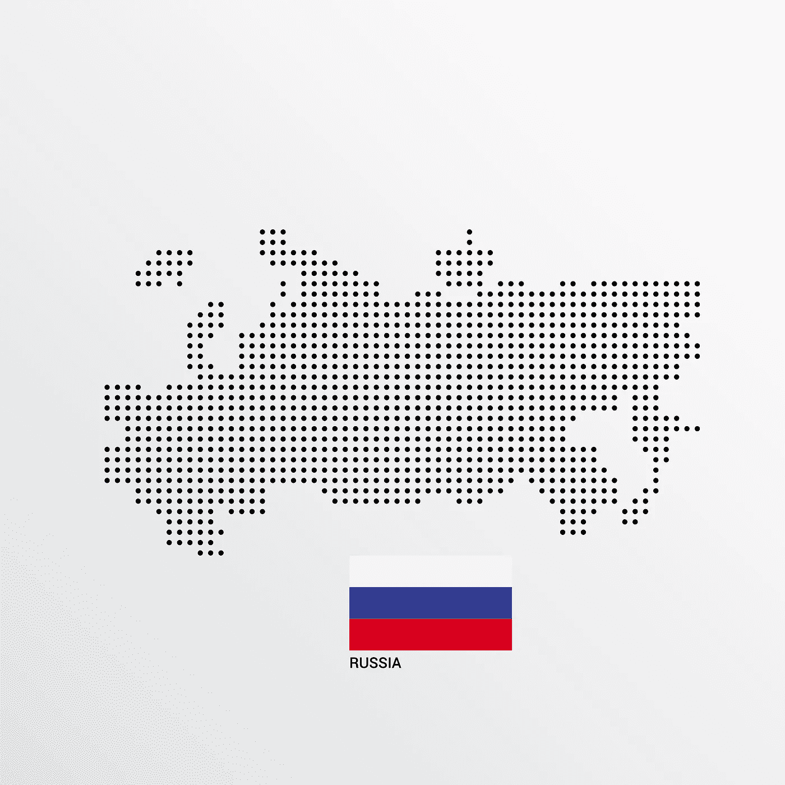
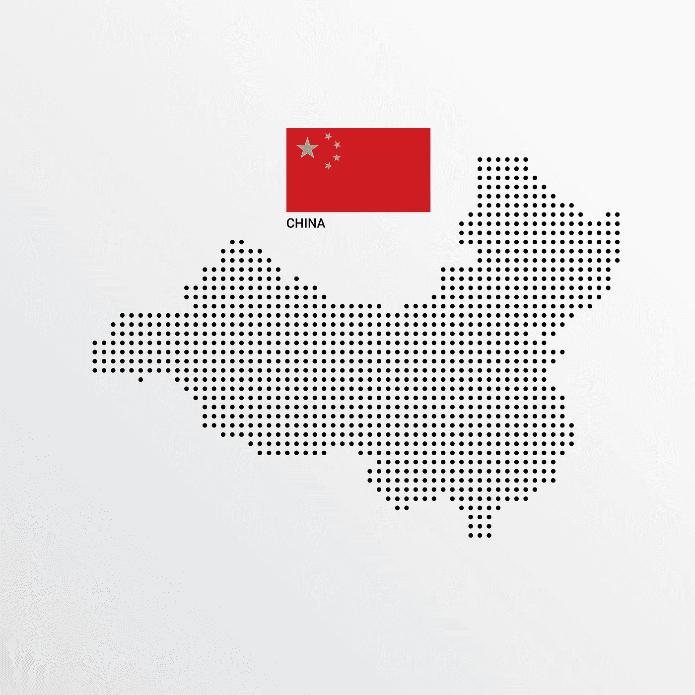

# 全球网络安全指数(GCI)和比较国家网络安全战略——二

> 原文：<https://medium.datadriveninvestor.com/the-global-cybersecurity-index-gci-and-comparing-national-cybersecurity-strategies-ii-d32ec7ad7642?source=collection_archive---------18----------------------->

## 全球网络安全指数(GCI)是国际电联授权的一个组织，调查信息和通信技术使用中的网络安全水平。它决定了各国和网络安全水平的研究和努力。

GCI 通过确定各国关于网络安全的法律法规、国家战略、确定的标准、认证、培训、意识以及网络安全团队的协调能力来揭示一份报告。在编队内，通过 GCI 邀请成员国来评估它们的国家战略和它们在工业和私营部门范围内关于网络安全的情况，形成了一个虚构。这种虚构的最终目标是创造一种全球范围的网络安全文化，并作为将这种文化融入信息和通信技术的一种激励。在过去几年里，会员国的数量和收集所要求的数据的工作都有所进展。

## 俄罗斯联邦

俄罗斯军队并不总是能够有效地使用技术并适应技术。20 世纪 90 年代影响俄罗斯社会的经济和社会弱点，使俄罗斯政府和军队无法将创新融入信息技术。阿富汗和车臣战争后，俄罗斯安全和军事管理人员开始在军事网络技术和信息战及战略领域工作。随着巴尔干半岛的战争，俄罗斯黑客开始在网络战中扮演积极的角色。就在 1999 年北约介入塞尔维亚之后，塞尔维亚黑客(但主要是俄罗斯黑客)对北约成员国的军事通信基础设施和美国国防部的信息系统进行了网络攻击。可以肯定的是，俄罗斯正在努力提高其在网络空间的有效性，特别是在网络情报、电子战、心理战、数字假情报和宣传领域。

## 3.1.战略文件和行动计划

2000 年初，俄罗斯公布了俄罗斯联邦国家安全概念文件。总的来说，已经指出应该采取信息安全措施。**俄罗斯联邦信息安全理论**于同年出版，将被视为第一部关于网络安全的基本文件。本文件解释了总体信息安全的行动计划、目标和原则。在该文件中，还强调了俄罗斯宪法自由的精神复兴。该学说强调以下几点:

提高信息基础设施的使用效率，

建立和保护构成科学、技术和道德潜力基础的信息资源，并安排资源的使用；

在接收和制作信息或使用这些信息时，确保宪法保障的公民权利和自由；

在通信保密范围内保护和捍卫公民的宪法权利、自由和隐私，

保护知识产权与加强这些关系的法律制度，对获取机密信息施加限制，

确保大众信息自由和禁止审查，

不允许社会和种族宣传活动，

未经个人同意，禁止收集和使用私人生活和其他受法律限制的信息。

在同一学说中，将对俄罗斯信息安全构成威胁的因素和相应的行动通过将其分成不同类型来解释。

对公民精神生活、知识行为、公众意识以及宪法权利和自由的威胁；

在信息活动方面侵犯公民宪法权利和自由的规范性法规。

在国内使用电信系统以及接收和传播信息方面的垄断。

攻击公民的人身和通信隐私。

对获取社会信息的限制。

非法使用公众认知工具。

未能遵守联邦立法的要求。

在大众信息领域侵犯公民权利和自由。

将俄罗斯新闻机构和媒体从国家信息环境中清除。

教育知识等。这将损害俄罗斯人民的道德和创造潜力。

假情报、信息隐藏、信息破坏等信息操纵。

俄罗斯国家政策中对信息支持的威胁:

俄罗斯信息环境被国内外组织垄断。

将阻止俄罗斯和外国受众传递信息的媒体研究。

信息安全国家政策不足，合格人才短缺。

对国家信息产业构成威胁的因素；

阻止俄罗斯获得信息技术，试图增加其对技术的依赖，

虽然国内的电信、通信产品与国外同类产品具有相似的特性，但它们是由国家机关进口的，

俄罗斯制造商忽视了国内市场电信和通信设备的生产，

知识产权、合格劳动力和出国专业人员。

对信息和电信设施和系统的威胁；

非法信息收集和使用、

信息系统技术违规、

开发扰乱信息功能的系统，

对信息和电信系统的恶意攻击，

对信息系统中密码保护系统的攻击，

技术渠道信息泄露、

未经授权访问数据库、

总的来说，2000 年发布的这份文件包括信息的收集和处理、信息系统和技术、在线通信网络、信息处理阶段、技术的发展和确保这一技术的安全性。计划保护国家利益免受内部和外部信息的侵害。预计将与国家机构、研究组织和军事机构协调提供保护。

计算机技术的发展导致其他领域出现新的威胁。网络犯罪的种类越来越多。尽管俄罗斯在其公布的文件中没有使用网络安全这个术语，但他们承认，他们必须做出认真的规划，以建立信息技术的安全性。2014 年提出的信息安全政策也在此范围内。该战略文件旨在保护互联网资源免受互联网活动、黑客、网络攻击者和外国网络间谍活动的侵害。

在 2016 年出版的**网络安全学说**中，确定了最近确定的国家网络威胁所面临的挑战。在这一理论中，信息安全被定义为确保信息的完整性、可靠性、可访问性和保密性。

考虑到俄罗斯在军事领域网络安全范围内所做的工作，网络空间已经成为俄罗斯作为一种新的战争环境进行技术研究和人员培训的一个领域。根据公布的理论，旨在开展基于国家利益的活动，例如为军事和非军事人员建立信息安全，存储数据，防止获取数据，特别是防止外来人员获取数据，通过使用信息消除对现有结构的破坏性或破坏性影响。主张在目的范围内，为了确保安全，网络攻击也可以作为网络防御之外的一种方法。

## 3.2.网络安全组织

2011 年出版的信息空间文件中关于俄罗斯联邦武装部队活动的概念观点可被视为“俄罗斯军队初步网络战理论”。在这份文件中，提到俄罗斯军队必须在网络空间建立自己的信息安全，因此有责任提出一项战略。

## 3.2.1.俄罗斯联邦联邦安全局(FSB RF)——[федеральнаяслужбабезопасносиииииииииииииойфедерации(усб)]

联邦安全局是负责俄罗斯联邦内部安全的机构。它直接隶属于俄罗斯总统。俄罗斯联邦安全局是当前苏联时代克格勃的翻版。它在从边境安全到情报活动的许多领域开展活动。联邦安全局负责保护关键基础设施，包括通讯系统。所有电信服务提供商，包括邮政服务和通信机构，必须允许联邦安全局随时将其软件和/或硬件集成到他们的系统中。

## 3.2.2.俄罗斯联邦对外情报局(SVR RF)——[слу́жбавне́шней·федера́ции]

SVR 的任务是俄罗斯联邦境外的情报和间谍活动，不像 FSB。SVR 还有权就反恐问题与国际情报机构谈判合作和情报共享协议，并向俄罗斯总统提供研究和信息传播。

 [## 提高网络安全的最低成本和最有效途径|数据驱动型投资者

### 在组织在 2020 年面临的诸多挑战中，网络安全(或缺乏网络安全)已成为新闻报道的焦点…

www.datadriveninvestor.com](https://www.datadriveninvestor.com/2020/09/04/the-lowest-cost-most-effective-path-to-better-cybersecurity/) 

## 3.2.3.俄罗斯联邦联邦保卫局特别通信和情报处—[службаспециальнойсвязи·информации、спецсвязь·россии]

该机构收集和分析外国信号的国际通信和情报，并保护俄罗斯政府的通信和信息系统，包括信息安全和密码分析/加密。

## 3.2.4.联邦政府通信和信息署(fapsi)——[федеральноеагентствоправительственнойсвязииинформации]

FAPSI 是俄罗斯政府机构，负责信号情报和政府通信安全。于 2003 年 3 月 11 日解散。

## 3.3.规程

考虑到俄罗斯在互联网和网络安全问题上的法律规定，2003 年颁布了《俄罗斯联邦通信联邦法》(联邦法 126-FZ) 。**152-FZ 2006 年 7 月 27 日关于个人数据(个人数据法)**基于信息和信息技术的保护。

**在自动处理个人数据方面保护个人的第 108 号公约**(在自动处理个人数据方面保护个人的公约)是 1981 年欧洲委员会的一项条约，考虑到正在进行自动处理的个人数据的跨境流动日益增加，该条约保护个人的隐私权。这些规范在许多方面被俄罗斯接受。

2010 年，**关于保护儿童免受有害健康和发展信息影响的第 436 号联邦法律——FZ 生效。该法律禁止或适用限制禁止或限制儿童使用的信息。**

**2013 年 7 月 2 日第 187 号联邦法-FZ** 修订了俄罗斯联邦关于保护信息电信网络知识产权的某些法案。该法律的主要目的是能够保护知识产权和所有者免受网络盗版的侵害，这是与知识产权所有者及其代表谈判的结果。

2014 年，俄罗斯议会投票通过了一系列互联网法律，对社交媒体用户施加限制。对《反恐怖主义法》中关于数据定位和数据隐藏的内容进行了修正，在该法律框架内，包括了一项在博客文章中使用作者姓名的规定。社交媒体平台必须在存储区存储数据六个月。根据每日访问量对博客进行了分类，访问量超过三千的博客必须获得相关机构的许可。法律规定，如果有必要，可以阻止俄罗斯公民发表博客文章，即使这些文章位于俄罗斯境内或境外。

2017 年《重要信息基础设施安全法》规定了确保俄罗斯重要信息基础设施安全的基本基础和原则，包括国家系统运作的基础，以检测、预防和消除针对俄罗斯联邦信息资源的网络攻击的后果。

## 中华人民共和国

为了压制国内的反对和阻止任何来自外部的渗透，中国政府试图对内部网络施加更大的影响。这个国家已经被一个巨大的防火墙包围，通常被公安部称为金盾工程(一个互联网审查和监视项目)。

有大量证据表明，中国政府与中国军方、私营公司和无关联人士一道，侵入西方和邻国，以期收集学术界、商界和政府的技术机密。

## 4.1.战略文件和行动计划

国务院于 2006 年发布了《国家中长期科学和技术发展规划纲要(2006-2020 年)》。该文件被认为是中国标准化总体规划的支柱，由单独的法律手册和改革措施组成。因此，该文件列出了中国本土技术进步的优先事项，并承认有必要扩大研发支出。

2012 年，国务院新闻办公室(SCIO)发布了一项新的政策意见(NPO)，**国务院大力推进信息化发展，并提出了关于切实保护信息安全的若干意见**。与以前的文件不同，NPO 将信息安全的进步与公民的经济和社会进步联系在一起。这表明从“维护国家安全信息”扩展到“促进经济平稳较快发展和社会和谐稳定”。

2016 年，中国网络空间管理局发布了首个**国家网络安全战略(简称《战略》)**，阐述并重申了中国在网络空间发展和安全方面的主要立场和主张，是中国网络安全工作的指南。该战略旨在将中国建设成为一个网络强国，同时促进有序、安全和开放的网络空间，维护国家主权。该战略将网络安全视为“国家主权的新领域”，标志着简化网络控制的新步骤。

主要任务包括:

捍卫网络空间主权

保护国家安全

保护关键信息基础设施(CII)

构建健康的网络文化

打击网络犯罪、间谍活动和恐怖主义

完善网络治理

增强基线网络安全

提升网络空间防御能力

加强国际合作

## 4.2.网络安全组织

## 4.2.1\. The Ministry of Industry and Information Technology (MIIT) — [中华人民共和国工业和信息化部]

成立于 2008 年 3 月，负责邮政服务监管和发展、互联网、无线网络、电视、通信、电子产品和信息产品加工、技术产业和促进国家知识经济。以下所有机构都在 MIIT 领导下运作；

**中国国家计算机网络应急技术小组/协调中心**，

**国家国防科技工业局**，

国防科学技术工业委员会(T21)执行了与 MIIT 类似的任务。

## 4.2.2\. The Ministry of Public Security (MPS) — [中华人民共和国公安部]

该部负责调查网络犯罪，并通过广泛的研究实验室网络负责重要基础设施的保护和开发工作。

## 4.2.3\. The Ministry of State Security (MSS) — [中华人民共和国国家安全部]

该部负责执行反间谍、反情报、外国情报和国内情报等任务。

## 4.2.4\. The State Cryptography Administration (SCA) — [国家密码管理局]

SCA，又名国家加密管理局(SEMB)，是负责监管中国加密产品和技术的国家机构。

## 4.2.5\. National Administration of State Secrets Protection (NAPSS) — [国家保密局]

行政部门负责保护机密信息。国家机密被定义为涉及以下内容的机密:

对国家大事的重大决策；

国防建设和武装力量的活动；

外交活动以及在与外国有关的活动中，作为对外国的承诺而予以维持的活动；

国民经济和社会发展；

科技；

维护国家安全的活动和刑事犯罪的调查；和

国家保密局认定的其他属于“国家秘密”的事项。

## 4.2.6\. Cyberspace Administration of China (CAC) — [国家互联网信息办公室]

中国互联网事务委员会负责制定和实施与中国互联网相关的各种政策，并维护一些审查职能。

## 4.3.规程

2003 年，国家网络与信息安全协调小组(SNISCSG)发布了**27 号文件**，实施了重大的网络安全相关政策和国家战略，包括灾难恢复、事件管理和电子政务安全计划。

2016 年，**中华人民共和国网络安全法**，通常被称为中国网络安全法，旨在加强数据保护、数据本地化和网络安全，以维护国家安全。

2018 年，中国**发布了《信息安全技术-个人信息安全规范》(GB/T 35273–2020)(PI 规范)**，为个人数据的存储和使用提供了指导。

值得注意的是，虽然美国和俄罗斯军队都发表了关于网络空间活动的官方文件，但另一方面，中国人民解放军(PLA)没有发布任何具体的原则。

**进行演示:**[https://www2.slideshare.net/EnsarSeker/cyberware](https://www2.slideshare.net/EnsarSeker/cyberware)

## 访问专家视图— [订阅 DDI 英特尔](https://datadriveninvestor.com/ddi-intel)