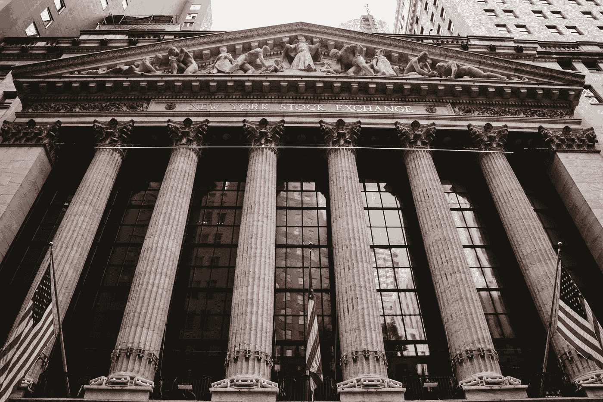

# 2008 年的全球金融危机

> 原文：<https://medium.datadriveninvestor.com/the-global-financial-crisis-of-2008-d8d8f0f8b38e?source=collection_archive---------10----------------------->

## 为什么会这样？

Photo by [Aditya Vyas](https://unsplash.com/@aditya1702?utm_source=unsplash&utm_medium=referral&utm_content=creditCopyText) on [Unsplash](https://unsplash.com/photos/6Ih4UoqzaAs?utm_source=unsplash&utm_medium=referral&utm_content=creditCopyText)

这一年是 2008 年；2007 年次贷危机之后，世界刚刚受到金融危机的冲击。

结果，大型投资银行无力偿还债务。因此，美国联邦政府不得不救助或帮助大多数投资银行和公司生存下来，但在雷曼兄弟的案件中却无能为力，该公司后来于 2008 年 9 月 15 日申请破产。

同一天，道琼斯见证了 7 年来 504 点的巨大暴跌。其他投资银行要么得到联邦政府的援助，要么得到其他私人机构的援助。

房利美和房地美被联邦政府接管，美林被美国银行接管；而高盛和摩根大通不得不改变他们的框架，不得不从投资银行转变为银行控股公司，以获得政府的担保援助。

# 集结

随着法律和利率的自由化，美国的住房需求在 2000 年后开始增长，这导致人们举债为他们的房子融资。

这一选择导致抵押贷款增加，这些贷款被称为抵押支持证券(MBS)。

> **这些抵押贷款支持证券被对冲为信用违约互换(CDS)。CDS 是一种针对贷款(这里是抵押贷款)的对冲工具，确保如果一方(房屋所有者)无法偿还债务，持有 CDS 的一方将偿还债务。**

这些基于抵押贷款的投资组合被进一步转化为债务抵押债券(CDO)。CDO 是由投资银行分类的各种风险到安全债务的组合。这些不同类型的债务被称为份额。

当时的顶级投资银行也将次级贷款纳入这一工具，从基本面价值来看，次级贷款实际上非常差，但被三大信用评级机构(S&P 全球评级、惠誉集团和穆迪)给予了较高的评级。

# 危机

投资银行从当时世界上最大的保险公司美国国际集团(AIG)那里获得了信用违约互换保险，以防范任何潜在的违约

在 2003-2004 年初，这类证券违约的可能性似乎非常低，但一旦人们开始拖欠支付抵押贷款，AIG 就不得不开始支付它所担保的东西，这导致了“太大而不能倒”的惨败，因为美国联邦政府不得不用 850 亿美元救助 AIG，这种金融工具(CDS)的崩溃导致了 2007 年的次贷危机，随后是 2008 年的全球危机。

# 余波

据说这一时期对投资银行和全球机构，包括政府来说非常关键。人民和政府花了几年时间才重新崛起。

除此之外，在这一关键时期，总部设在联合王国的巴克莱投资银行的不当行为也引发了另一场骗局，主要投资银行后来也卷入其中。

今天的骗局被称为 LIBOR(伦敦银行同业拆放利率)骗局，它已成为到 2021 年取代盛行 30 年的 LIBOR 的主要原因之一。

全球危机的历史非常迷人。这是一场灾难，但也带来了一些好东西，比如比特币的发明。

最终，这是人类贪婪和盲目野心导致毁灭的结果。还会发生吗？ ***嗯，历史不会重演，但确实押韵吧？***