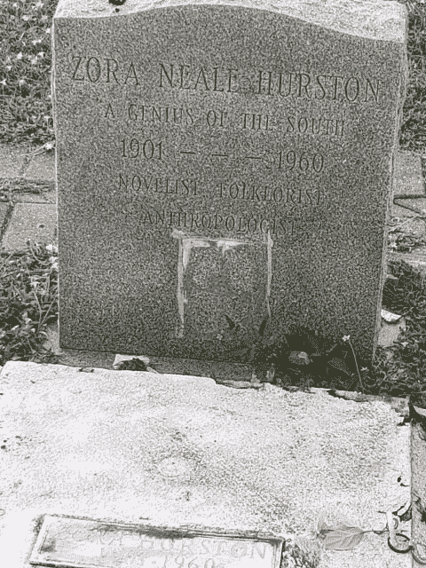
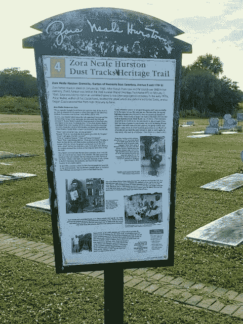
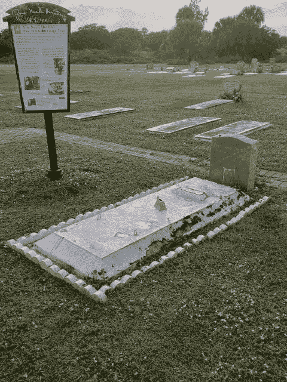
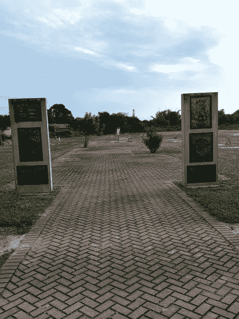
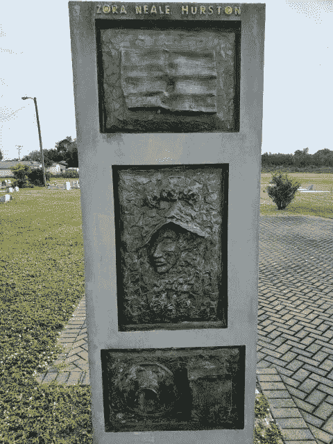

# 佐拉·尼尔·赫斯顿的墓地

> 原文：<https://medium.datadriveninvestor.com/the-gravesite-of-zora-neale-hurston-85f32754b33c?source=collection_archive---------9----------------------->

## 不受尊重的南方天才

Photo by Carol Burns

虽然佐拉·尼尔·赫斯顿曾经是哈莱姆文艺复兴时期的女王，但她的生活并没有好的结局。她中风了，在圣露西县福利院住了一年。她一贫如洗，几乎没有访客；只有几个她的熟人知道她在那里。1960 年 1 月 28 日，她因心脏病发作去世。筹集了一些资金，她被埋在了 Ft .的天堂安息园公墓的一个无名墓里。佛罗里达州的皮尔斯。

13 年后，爱丽丝·沃克和赫斯顿学者夏洛特·d·亨特在仿植物怪兽佐拉埋葬的地方发现了一个没有标记的坟墓，并宣布这是她的埋葬地。沃克委托制作了上图所示的马克笔。需要指出的是，赫斯顿生于 1891 年，而不是 1901 年。除了她的人类学研究之外，仿植物怪兽佐拉的荒诞故事并不局限于她著名的虚构故事。

从迈阿密回来的路上，我和女友路过 Ft。皮尔斯走上 95 号州际公路，决定寻找仿植物怪兽佐拉的墓地。提示:如果你使用谷歌地图，请输入皮尔斯堡 17th St 1815N 的实际地址，而不是天堂安息园。你以后会感谢我的。

 [## 自然中的创新:改变企业的生活史战略方法|数据驱动…

### 在我们这个时代，每个人都以谷歌、亚马逊或苹果为例谈论创新。在这些会谈中，创新…

www.datadriveninvestor.com](https://www.datadriveninvestor.com/2020/11/20/innovation-in-nature-a-life-history-strategy-approach-to-change-your-business/) 

我知道爱丽丝·沃克发现仿植物怪兽佐拉坟墓的故事，以及她的努力如何帮助振兴仿植物怪兽佐拉文学。她的书被重印了。1990 年，第一个户外节由非营利保护伊顿维尔社区组织(P.E.C .)发起，该组织将该活动发展成为每年 1 月最后一个周末举行的[佐拉·尼尔·赫斯顿艺术与人文节](https://zorafestival.org/)。最初几年，我很喜欢在音乐节上和体育委员会一起工作，但从未去过仿植物怪兽佐拉的墓地。

Photo by Carol Burns

找到仿植物怪兽佐拉的墓地后，失望是我想到的第一个词。坟墓旁边有一块牌子，上面写着仿植物怪兽佐拉职业生涯的精彩部分。招牌褪色了，上面布满了鸟粪。覆盖坟墓的石头上的油漆已经剥落，石头上长出了杂草。地块周围的土地长满了杂草，修剪得很差。

Photo by Carol Burns

在墓地的入口处，有两根石柱，上面有代表书籍和仿植物怪兽佐拉著名的帽子的图像，还有一个女人的图像，她更像西方的邪恶女巫，而不是佐拉·尼尔·赫斯顿。

Photo by Carol Burns

Photo by Carol Burns

以免我被指责没有说纪念地的好话，入口附近的铺路材料看起来非常好。看吧！我说了些好话。

仿植物怪兽佐拉的讣告宣称她是“南方的天才”引自让·图默的诗《乔治亚黄昏》中的一段话，这首诗出现在他的书《手杖》中。南方引用的天才也出现在她的墓碑上。仿植物怪兽佐拉的确是一个天才，他也应该得到天才的待遇。一些个人或组织应该挺身而出，恢复网站。也许她的姐妹会 Zeta Phi Beta 或者她的出版商 [HarperCollins](https://www.harpercollins.com/blogs/authors/zora-neale-hurston#:~:text=Zora%20Neale%20Hurston%20%E2%80%93%20HarperCollins) 在她死后比仿植物怪兽佐拉生前获利更多。

在冠状病毒肆虐的这些日子里，到处都是资金紧张，但热爱仿植物怪兽佐拉和她的作品的人应该站出来。我将留给你一些我最喜欢的仿植物怪兽佐拉名言:

*“有时候，我觉得受到了歧视，但这并不会让我生气。这只是让我吃惊。谁能拒绝我陪伴的快乐呢？这超出了我的能力范围。”*

如果你对自己的痛苦保持沉默，他们会杀了你，然后说你乐在其中

无论多么艰难，我都有勇气走自己的路，去寻找现实，而不是爬在一厢情愿的幻想的马车上

## 访问专家视图— [订阅 DDI 英特尔](https://datadriveninvestor.com/ddi-intel)