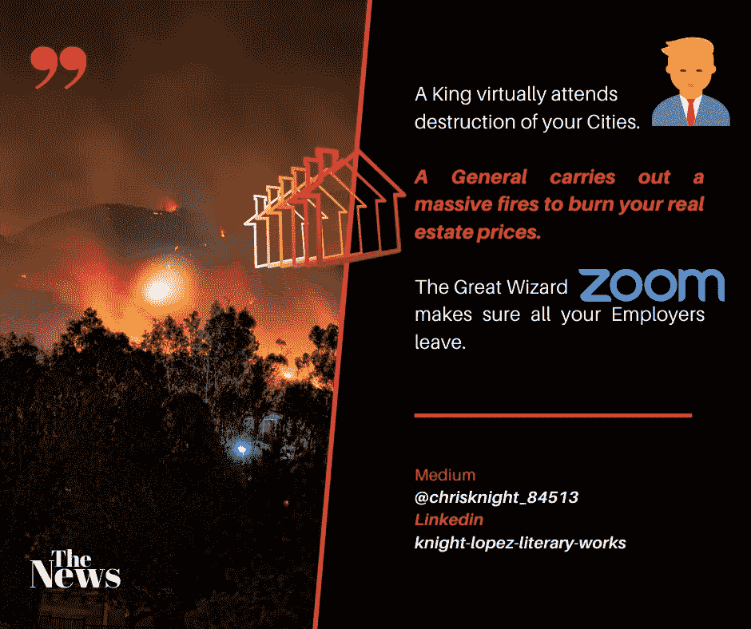

# 我们城市的大火和郊区村庄的拯救

> 原文：<https://medium.datadriveninvestor.com/the-great-burning-of-our-cities-salvation-of-its-suburban-villages-56639d9d0e6b?source=collection_archive---------15----------------------->

## 我们中心城市的房地产价值会直线下降。虚拟环境支持不出勤。公司皇帝不再需要城堡。

Source: Self Created Image with [Canva](http://www.canva.com).

**城市大火**

巨大的火焰笼罩着我们伟大的城市景观。城堡高耸入云。每座城堡顶部都燃烧着余烬。有些人称城堡为摩天大楼。

每座摩天大楼都像一根火柴。每个人都有一团火在燃烧，烟从身体里冒出来。在这些城市中心周围，人们成群结队地逃离。攻击是无情的。士兵们在街上行进。士兵们穿着红色盔甲。街道看起来像是在搏动着血液。

无情的攻击来自四面八方。街道就像患病身体的血管。这些身体有完整的血管。

每个城市周围都有弓箭手。他们等待着坐在远处山顶上的一个人的命令。旗帜和横幅排成了天空线。坐在那里的那个人很年轻。他的头发没有灰白。他通过皇冠与他们交流。

**国王不需要亲自参加每场战斗**。诡异的是，他通过屏幕投射出自己的图像，并对他的将军们说话。物理存在的缺失被一个脉冲全息图所取代。

有人说他使用巫术。他的力量通过他的王冠传递。

古老的王冠被现代的王冠所取代。有人说这种新皇冠嵌入了奇怪的技术。皇冠通过心灵感应向他传递信息。他们称之为*蓝牙*。因为他说话时没有手持任何设备，所以就像是一个鬼魂在世界的另一边跟他说话。

国王用的词是，*虚*。

**殴打的原因**

人们说他被袭击的原因是缺席。**没有人需要占用这些建筑**。价格很高。每个人都想逃离高成本的生活。伟大的税务员德勤表示，其所有税务员现在将永久留在他们的村庄。

*在这座城市里，人们不再需要出勤来完成他们的工作。*

也有人说是引入了大精灵 Zoom。[当大巫师祖姆被引入国王的宫廷时，变化发生了。整个政府防卫力量依靠 Zoom 来处理他们的事务。](https://www.voanews.com/silicon-valley-technology/us-military-government-workers-still-use-zoom-despite-fbi-warning#:~:text=Government%20employees%20can%20use%20Zoom,Risk%20and%20Authorization%20Management%20Program.&text=To%20date%2C%20Zoom%20remains%20on)

大法师变焦是一个狡猾的。大巫师祖姆是如此狡猾，他占据了王者可用市场的 42.8%。

前提是瘟疫。被称为 COVID 的瘟疫。COVID 是笼罩我们大地的瘟疫，笼罩着每一个人。然而…瘟疫并没有阻止国王摧毁这些城市的步伐。

**又一次毁灭性的齐射**

年轻人举起了手。小号手回应。号角吹响。

弓箭手举起弓。每一行的每一个横幅都放弃了。横幅来自邻近的村庄。每个上面都有一个标记。完全包围五个城市花费了大量的时间。

每个城市都是精心挑选的。现在这些攻击是通过一项新技术来协调的。

纽约。

波士顿。

迈阿密。

达拉斯-沃斯堡。

指挥官们齐声高呼“松！！!"

装有爆炸弹的箭在风中翱翔。箭发出尖叫的声音。打击袭击了城市。每个城市都在痛苦中哀嚎，因为箭矢削去了它们的价值。

[纽约市的中值大幅下降了 17.7%。](https://www.nytimes.com/2020/07/02/realestate/coronavirus-real-estate-price-drop.html)

波士顿表现较好，仅经历了 4.4%的资产减值。

迈阿密在四月份遭受了非常痛苦的打击，但是当地的城市银行用免费的钱吸引人们留下来。

[*显然接近零利率的贷款会让人留下来血洗*](https://www.cnbc.com/2020/06/10/fed-holds-rates-near-zero-heres-what-that-means-for-your-wallet.html#:~:text=The%20Federal%20Reserve%20said%20Wednesday%20it%20will%20hold%20its%20benchmark,financial%20analyst%20at%20Bankrate.com.) *。*

国王笑了。他的笑声中弥漫着一种阴暗的娱乐。

达拉斯-沃斯堡的市民正在为剩下的房子而斗争。攻击中对有限房屋的争夺似乎制造了虚假的绝望。

每一次爆炸都发出类似于话语的声音。

第一次齐射发射…轰——*贬值*。

第二次齐射发射…轰——*未出勤*。

第三次齐射发射…轰——*减功*。

**攻击的结论**

当国王观察每一座在火中隐现的城市时，他注意到一匹黑色的骏马正朝山上走来。它的黑色存在被一条红色的尾迹所着色。慢慢地，模糊开始形成图像。他的一名将军向他飞奔而来。将军的马很强壮。

一旦它到达山顶，它黑色的鬃毛就消失在落日的天空中。

将军现在可见了。将军完全穿着黑色砂石盔甲。透过头盔只能看到他的眼睛。他的眼睛是灰蓝色的。一件红色斗篷在他身后留下痕迹，就像鲜血浸透了大地。

将军在国王面前停了下来。

“陛下。”将军敬礼。

国王点头认可。

"这次袭击后我们该怎么办？"

国王花了一些时间回答他的将军。有一种不耐烦的气氛。战斗正在激烈进行。火在燃烧。人们心中充满了恐惧。

国王看着他的将军。

“我们等着。”

将军在一旁观看。

“大人？”

他语气中的困惑是显而易见的。国王意识到他需要让他的将军放松下来。

“将军。房地产正在被夷为平地。这些农民将涌向我们的村庄。聪明的人已经离开，来到我们的门前，推高我们的价格。绝望的人会很快离开。”

国王轻拍他的王冠。将军看着带有全息投影的银色皇冠。怪异的“ZOOM”标志在他王冠的带子上清晰可见。

“这项技术已经做到了。我已经命令所有的大公司把总部设在我国境内。其他人现在将在其他国家运作。没有人再在这些城市居住了。所有主要的经济雇主都在离开。我们提供更便宜的价格。很简单。”

将军看着皇冠。它的氛围是一种奇怪的色调。

"陛下，这顶王冠是伟大的巫师祖姆创造的吗？"

国王笑了。

“可能吧。”

国王笑了。

“让城市燃烧吧。它们很快就会变得一文不值。我们的村庄将获得所有的价值。如果人们想要未来，他们会搬到我们的村庄，放弃城市。”

将军点点头。两人都在看着混乱的城市。

"想想看，他们也都在对付瘟疫."

当城市燃烧时，将军和国王开始大笑。

祝你知识成功！

***

关于 Christopher:Christopher Knight Lopez 是一名职业骗子，在他的职业生涯中，他与职业企业家进行了广泛的合作。在他 14 年的职业生涯中，Christopher 已经开了超过 7 家公司。克里斯托弗的目的是利用各种市场驱动的机会。Christopher 是注册项目经理(MPM)和认证财务分析师(AFA)。Christopher 之前通过了 65 系列证券执照考试。克里斯托弗也有他的总路线——人寿、意外、健康和健康维护组织。Christopher 已经管理了总计 2 . 86 亿美元的报告管理资产和建议资产。Christopher 在 29 个国家有工作经验，为各种业务筹集了超过 5000 万美元，在他的个人职业生涯中总收入超过 1300 万美元。Christopher 曾在高科技行业工作:生物技术、金融、证券、制造、房地产和住房抵押贷款。克里斯托弗是一名美国空军老兵。克里斯托弗热爱家庭、竞技体育、钓鱼、武术，并倡导企业家精神。克里斯托弗为崭露头角的企业家提供自助课程。克里斯托弗对导师的热情来自于企业家和骗子需要指导的信念。这个世界充满了关于企业家身份的相互矛盾的信息。在[www.christopherklopez.com 看更多。](http://www.christopherklopez.com.)

免责声明:这些信息并不意味着是一种投资建议或财务建议。不要把这种情况应用到你自己的个人环境中。各种风险包括:商业风险、投资风险、政治风险和其他风险。此信息仅用于信息和教育目的。请不要向作者寻求任何投资策略或哲学。针对自己的情况，请咨询自己的理财顾问或法律顾问。不是任何形式的推荐或认可。