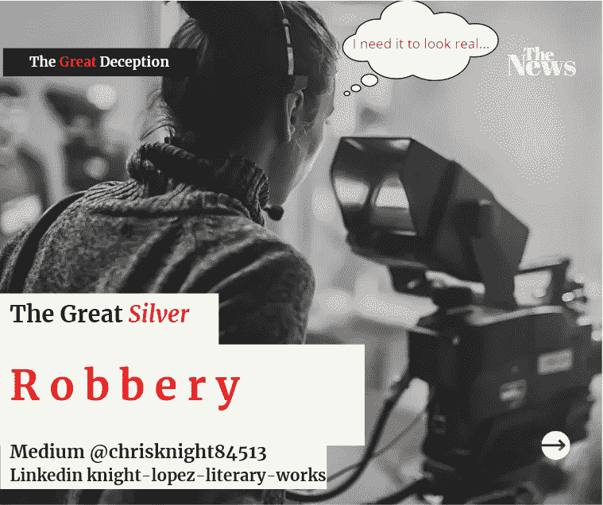

# 白银的大贬值骗局

> 原文：<https://medium.datadriveninvestor.com/the-great-depreciation-deception-of-silver-257da4b3279e?source=collection_archive---------16----------------------->

## 我被称为“穷人的黄金”和“失去光泽的光芒”。我很快给你百分之五十的收益。我在两天内下降百分之二十。我是西尔弗。

Source: Self Created Image with Canva

今年迄今，我仍上涨了近 30%。不要害怕。拥抱我，做你的保护者。我不是你的敌人。

[白银的周线表现](https://www.macrotrends.net/1470/historical-silver-prices-100-year-chart)值得一看。我们这些在 2020 年初购买或持有白银的人享受了一次惊人的反弹。

2020 年 8 月，白银稳步上涨，从每盎司约 16.00 美元上涨至近 27.00 美元。不幸的是，大多数投资者只是看着他们的持股膨胀和减少。有些人在最后上车时惊慌失措。因此，他们抛售股票，导致日跌幅接近 8%。

今年我不是观众。

我知道用交换媒介交换价值储存的游戏。[我举例说明了储值工具如何实现+50%的交易](https://medium.com/datadriveninvestor/120-days-of-loss-for-many-but-120-days-of-profit-for-me-37f5abcbb108?source=friends_link&sk=06c48fc2ab8a6d39e497901a6158633b)。

这就是为什么在一年的时间里，我的个人持有账户仍然上涨了 26%以上。如果你看到疯狂的秋千，你很容易躲开它们。很多年来，我都是西尔弗的观众。我上一次在白银上投入这么多资金是在 2009 年。白银价格飙升至近 40 美元。

**白银被人为压低价值**。

白银在历史上的地位

白银长期以来一直是衡量财富的标准。古代故事讨论金银财宝。国王用金银衡量重量。以财富的名义杀人。财富总是包括银。

自 20 世纪 70 年代以来，美国政府的首要任务是(现在仍然是)将白银商品化。拒绝将历史上的白银与黄金的汇率固定在 18:1 意味着某种不祥的事情。有办法的人可以偷你的东西。在过去的 50 年里，银价波动高达 114:1。白银通常在 45:1 到 50:1 之间浮动。这意味着它通常被低估。

 [## 后疫情经济中的基本 GTM 变革策略|数据驱动的投资者

### 新冠肺炎以一种新的不可想象的方式开展业务。这个疫情甚至强迫…

www.datadriveninvestor.com](https://www.datadriveninvestor.com/2020/08/11/an-essential-gtm-change-strategies-in-the-post-pandemic-economy/) 

**通俗地说，白银的价值通常是其报告价值的 3-5 倍**。

我带你去看。

**我用公认的常识给你看**

自 1970 年以来，白银政府系统地剥夺了白银的身份。

直到 1964 年，美国硬币都是用银铸造的。某些半美元一直持续到 1970 年。直到 1974 年，银元一直保持着白银的身份。我有许多类似当前镀锌季度的美国季度。不同的是我的硬币含有 90%的银。我有 35%银铸造的 1943 年美国战争镍币。我有 90%是银的一角硬币。

我甚至有历史性的“美元银元券”。

曾经有一段时间，你可以去一家中央银行交出你的一美元钞票，换一盎司的白银。

如果不太了解经济学理论，请总结一下这个常识性的观察。

“你手中的美钞曾经价值相当于今天的 40 美元。在我写作的时候，白银大约是每盎司 22 美元。这意味着你账户上的钱只相当于 1964 年的 4.75%。

现在你知道为什么汽水要 5 美分了。汽水是用银支付的。我们不需要大量的引用和复杂的研究论文。运用你的常识。政府当着你的面调换了你的硬币。

罗马在帝国崩溃前玩了一个硬币开关的把戏。美国正在走一条非常相似的道路，历史往往会重演。当心。一位名叫[托拜厄斯·斯通](https://medium.com/@tswriting/no-more-warnings-america-has-weeks-to-save-democracy-487f7a975a74)的伟大媒体作家很好地记录了美国走向崩溃的过程。读他。我不需要说他已经写了什么。

**窃取你财富的诀窍**

银和金是一类的。白银目前没有享受到它历来要求的货币权利。历史上，所有美国公民的价值储备都是贵金属。纵观历史，纸币代表了赎回某物的权利。现在我们必须问，“每个人都在救赎什么？”

这个把戏的起源可以追溯到十字军东征时期，当时神圣的朝圣者不想携带贵重金属旅行。用“汇票”或“旅行支票”更容易些。认识这些术语吗？这些文件被交给当地的圣殿骑士，由他们兑换成黄金或白银。

通过使用纸币，朝圣者们保护他们的财富不被小偷窃取。这个概念最初是为了“安全”而出售的。

> 最终每个人都做了他们知道可以逃脱的事情。人们开始假装他们比实际拥有的更多。过了一段时间，人们习惯了纸。然后就从“精确金额隔离”变成了“精确金额保障”。

今天滥用信任就像过去一样

只要人们信任生产黄金或白银的机构，这些机构就可以自由操纵。因此有了“信用证”这个术语。*认识那个术语*？最终，整个系统是建立在信用而不是硬币之上的。一旦掌权者意识到他们的话语有价值，他们就会做自纸发明以来每个人都做过的事情。

他们把“话语”变成“价值”，说*价值*止于*我的承诺*。这正是美国政府所做的。每当承诺变成金钱时，这样做的机构就会崩溃。 ***10 对 10 失败*** 。如果我们参考历史，美国央行也不会免受这种未来的影响。

**纸币的发明总是导致一种剥离价值储存的系统化方式。**那些寻求财富的人逐渐侵蚀承诺系统(即信用系统),欺骗那些有交换媒介的人，让他们相信他们通过支付来交换价值储存。

这是一个聪明的诡计，对那些缺乏知识的人起作用。

很容易相信储存你价值的东西就是你用来买车的东西。毕竟，没有人会拿黄金去买杂货，但他们都接受了那个承诺。

**要么振作，要么失望**

事实是每个人都处在十字路口。 ***在我们目前的关头是财富保值之路还是财富流失之路*** 。在全球化的疫情，你很难不想要支付你房租的东西。我明白了。毕竟钱是有用的。贵金属没那么有用。*我知道你不能用价值储存来做很多事情*。你可以用你的价值储存做一件事。

可以保护自己不变穷。

在不久的将来的某一天，我们都会遭遇房地产价格的暴涨。我们已经看到食品杂货价格飙升。租金上涨了 30%以上。大家都会说“是市场需求！”或者“这是通货膨胀的本质！”。

我正在做另一个我知道会实现的预测。我希望正在阅读的人不是那些不认真阅读的懒人。

**不祥的预言**

大约两年后，我会引用这篇文章。我将展示每个人是如何因为拒绝持有储蓄来储存像白银、黄金或像 cypto 这样的技术资产而变穷的。

我真诚地希望它不会是我的一个追随者。

不要随便找理由来否认政府让你变穷的原因。**储蓄需要保护**。不要因为追逐高的中等汇率而失去你的财富。**人们正在操纵它让你变穷**。

偷窃是不道德的，不道德的，错误的。为你的家人挺身而出。确保你的未来和现在保持平衡。未来只不过是一系列当下的瞬间。

祝你知识成功！

***

关于 Christopher:Christopher Knight Lopez 是一名职业骗子，在他的职业生涯中，他与职业企业家进行了广泛的合作。在他 14 年的职业生涯中，Christopher 已经开了超过 7 家公司。克里斯托弗的目的是利用各种市场驱动的机会。Christopher 是注册项目经理(MPM)和认证财务分析师(AFA)。Christopher 之前通过了 65 系列证券执照考试。克里斯托弗也有他的总路线——人寿、意外、健康和健康维护组织。Christopher 已经管理了总计 2 . 86 亿美元的报告管理资产和建议资产。Christopher 在 29 个国家有工作经验，为各种业务筹集了超过 5000 万美元，在他的个人职业生涯中总收入超过 1300 万美元。Christopher 曾在高科技行业工作:生物技术、金融、证券、制造、房地产和住房抵押贷款。克里斯托弗是一名美国空军老兵。克里斯托弗热爱家庭、竞技体育、钓鱼、武术，并倡导企业家精神。克里斯托弗为崭露头角的企业家提供自助课程。克里斯托弗对导师的热情来自于企业家和骗子需要指导的信念。这个世界充满了关于企业家身份的相互矛盾的信息。在 www.christopherklopez.com[看更多。](http://www.christopherklopez.com.)

免责声明:这些信息并不意味着是一种投资建议或财务建议。不要把这种情况应用到你自己的个人环境中。各种风险包括:商业风险、投资风险、政治风险和其他风险。此信息仅用于信息和教育目的。请不要向作者寻求任何投资策略或哲学。针对自己的情况，请咨询自己的理财顾问或法律顾问。不是任何形式的推荐或认可。

## 访问专家视图— [订阅 DDI 英特尔](https://datadriveninvestor.com/ddi-intel)