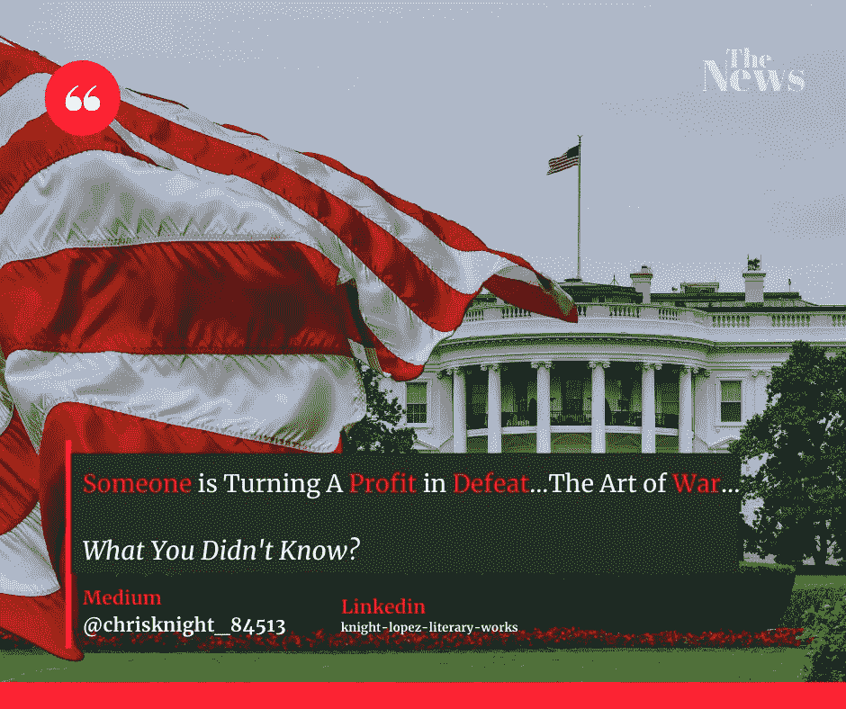

# 伟大的操练在失败前冻结成奸商

> 原文：<https://medium.datadriveninvestor.com/the-great-drill-freeze-to-profiteer-before-defeat-437fa17d262a?source=collection_archive---------19----------------------->

## 我不善言辞。我冻结让步以从我的失败中获利。你不知道我的整个策略就是最后一次投机倒把。

Source: Self Created Image with [Canva](http://www.canva.com).

**戒指戒指**

桌上的电话响了。音调在大厅里振动。这个房间很古老。许多人惊叹于它的历史意义，但很少有人认识到它的谦逊。

白宫是那个时代的产物。

一个男人和另外两个人坐在一个小角落的办公室里。一个似乎是国王，另一个是抄写员。这个人是国王的助手。国务卿、他的幕僚长和翻译都住在同一个房间里。

当他的胳膊肘摩擦他的国王的桌子时，参谋长忍不住傻笑。

*这对白宫官员来说怎么样？*

电话铃声一直在响。看来这只手再也不能无视他的召唤了。参谋长伸手拿起电话。

“国务卿办公室有什么需要我帮忙的吗？

有一种平静的语气。

“喂？”参谋长奇怪地哽咽了。

"[川普政府还在要求公司在阿拉斯加的北极国家野生动物保护区](https://apple.news/AIta0IKKsQJioAWD-m-zmsA)选址吗？"

参谋长在椅子上坐了起来。他拿出一些笔记。大拇指穿过它们，回应道，

“嗯。一个共和党控制的国会在 2017 年授权了这一点。我们接受申请者。”

电话那头一片寂静。

我们是否仍在敲定开发阿拉斯加绝大部分国家石油储备的计划？”

参谋长揉了揉脑袋。他摘下眼镜。洗掉不存在的污渍。该死，他不明白为什么当被问到棘手的问题时，他总是这样做。

他叹了口气，然后深吸了一口气。显然这将是一个冗长的回答。

“即将上任的新政府痴迷于 270 个物种，包括世界上仅存的南波弗特海北极熊、250 头麝牛和 30 万只雪雁。所以，是的，我们将在今年完成。”

电话里的声音有点急促。然后他哽咽着说出他的沮丧。

我持有 92，000 英亩的地下采矿权。ASRC 对用做好环境的东西让阿拉斯加陷入萧条不感兴趣。”

声音的语气很明显。这种语气让参谋长有点慌乱。

手记得他为什么在这里。他很聪明。他知道该问什么问题。书桌旁的国王正怒视着他。

"卡拉对融资说了些什么？"

背景中纸张的沙沙声减弱了声音。

JP 摩根和高盛说他们不会资助我们。但这并不意味着我们拿不到钱。”

参谋长点了点头，因为电话那头的声音可以听到他的声音。国王弄臣想些什么。手知道他的意思。他拉出一个抽屉，把一叠文件放在桌子上。他的助手看着他，“你需要帮助吗？?"她低声说。

他放弃了她。

***他是国王之手而不是皇族的围棋男孩*** 。

"[先生，我们有几个环保团体对整个石油和天然气租赁计划提出质疑。总共有四起独立的诉讼。如果一方赢了，整个租约都是无效的。”](https://earthjustice.org/news/press/2020/lawsuit-aims-to-block-drilling-in-arctic-national-wildlife-refuge)

 [## 利用区块链构建可持续循环经济|数据驱动投资者

### 自从工业革命开始以来，全世界都关注产品的生产和消费。很少或…

www.datadriveninvestor.com](https://www.datadriveninvestor.com/2020/11/17/building-sustainable-circular-economy-with-blockchain/) 

**声音**

“弗— —弗— —弗——CK！！！！!"

整个房间通过办公室都能听到。从电话线传来的愤怒传遍了整个房间。国务卿甚至注意到了。参谋长的额头上开始冒出一颗汗珠。

参谋长闭上了眼睛。*记住*。我是国王之手。我在控制中。我知道该怎么做。

他又深吸了一口气，准备好面对声音的愤怒。

“特朗普政府签发租约，但拜登政府可以收回租约，如果他们考虑一下的话。屎人拜登会沉它来刁难他！一名联邦法官裁定该机构没有认真考虑怀俄明州的 30 万英亩土地，这引发了一场狗屎风暴。他还说钻探分析是不充分的。让秘书接电话。”

参谋长站了起来。他走向国务卿。

“先生，你需要拿着这个。”

这个男人向后靠在椅子上。

“现在我为什么要这么做？我不能和那个家伙交往。告诉他我没空。”

手好像被拍了一下。参谋长回到他的办公桌前，开始和那个人谈话。他们的谈话变得越来越疏远。

一个国王中的国王向窗外望去。对未来的担忧写在他的脸上。讲述世界末日的小说。

“我需要在离任前扭亏为盈。我他妈的肯定不能有电话记录。真是个白痴。”

国务卿起身走出房间。他关上门，看着走廊。总统走了出来。

“进展如何？”总统问道。

“你不会想知道的。”国务卿喃喃自语。

总统咧开嘴笑了。

“那太好了。”

两人都互相理解。这个结局不会太糟。只要他们成功了。

祝你知识成功！

***

关于 Christopher:Christopher Knight Lopez 是一名职业骗子，在他的职业生涯中，他与职业企业家进行了广泛的合作。在他 14 年的职业生涯中，Christopher 已经开了超过 7 家公司。克里斯托弗的目的是利用各种市场驱动的机会。Christopher 是注册项目经理(MPM)和认证财务分析师(AFA)。Christopher 之前通过了 65 系列证券执照考试。克里斯托弗也有他的总路线——人寿、意外、健康和健康维护组织。Christopher 已经管理了总计 2 . 86 亿美元的报告管理资产和建议资产。Christopher 在 29 个国家有工作经验，为各种业务筹集了超过 5000 万美元，在他的个人职业生涯中总收入超过 1300 万美元。Christopher 曾在高科技行业工作:生物技术、金融、证券、制造、房地产和住房抵押贷款。克里斯托弗是一名美国空军老兵。克里斯托弗热爱家庭、竞技体育、钓鱼、武术，并倡导企业家精神。克里斯托弗为崭露头角的企业家提供自助课程。克里斯托弗对导师的热情来自于企业家和骗子需要指导的信念。这个世界充满了关于企业家身份的相互矛盾的信息。在[www.christopherklopez.com 看更多。](http://www.christopherklopez.com.)

免责声明:这些信息并不意味着是一种投资建议或财务建议。不要把这种情况应用到你自己的个人环境中。各种风险包括:商业风险、投资风险、政治风险和其他风险。此信息仅用于信息和教育目的。请不要向作者寻求任何投资策略或哲学。针对自己的情况，请咨询自己的理财顾问或法律顾问。不是任何形式的推荐或认可。

## 获得专家视图— [订阅 DDI 英特尔](https://datadriveninvestor.com/ddi-intel)