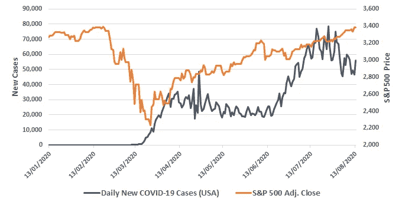
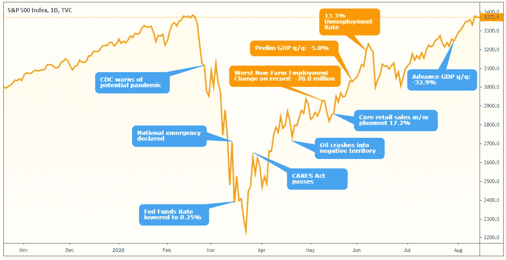
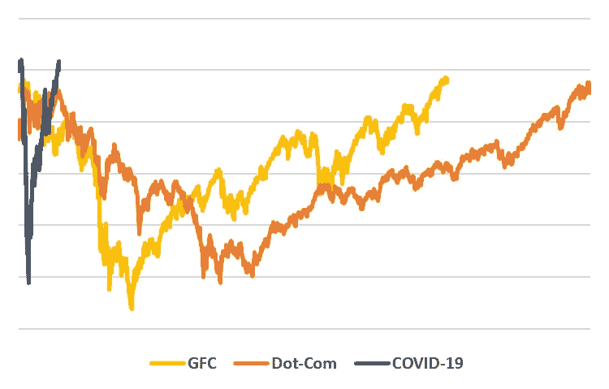
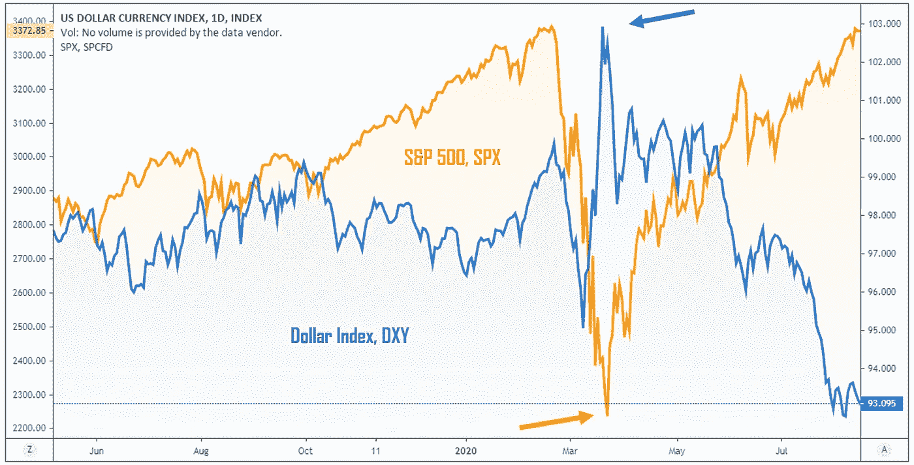
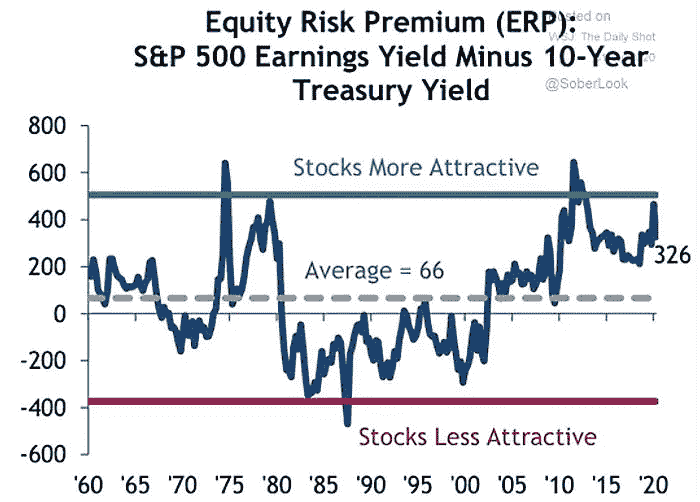
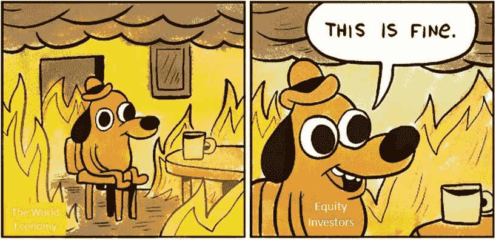

# 巨大的经济脱节

> 原文：<https://medium.datadriveninvestor.com/the-great-economic-financial-market-disconnect-d910d8c89f51?source=collection_archive---------22----------------------->

## 新冠肺炎如何加深了金融市场和实体经济之间的空白。

似乎随着冠状病毒-2019(新冠肺炎)这一全球灾难继续恶化，金融市场(特别是美国)似乎比以往任何时候都更加乐观。当我写这篇文章时，标准普尔 500 正在测试它在 2020 年 2 月创下的历史新高，而纳斯达克指数继续在日均创下历史新高。

冒着听起来像破纪录的风险，在全球经济处于萧条边缘、总需求几乎蒸发的时候，市场能走到这一步几乎是不可思议的；这还没有考虑到中美关系的现状。尽管我们经常被误导，认为实体经济和金融市场是交织在一起的，但最近的事件真实地说明了两者之间的差异，以及新冠肺炎方面是如何加剧了这种“巨大的脱节”。

专家们经常将矛头指向美联储(及其值得信赖的印钞机)，后者通过公开市场操作，导致债券和股票市场过热。虽然这肯定是一个起作用的因素(这是一个完全需要自己的媒介故事的话题)，但我认为还有其他因素在起作用，包括散户和机构投资者在这种行为不值得的时候过度繁荣。

 [## 对有商业头脑的投资者有用的行为经济学概念|数据驱动的投资者

### 在美国企业界，高斯统计，对我们周围世界的确定性解释，以及理性…

www.datadriveninvestor.com](https://www.datadriveninvestor.com/2020/07/09/helpful-behavioral-economics-concepts-for-the-business-minded/) 

# 病毒般的乐观

自 2020 年初以来，新冠肺炎已将美国等经济体置于不同程度的封锁状态。随着大多数发达经济体的 R-nough(感染速度的衡量标准)下降，5 月和 6 月的情况似乎趋于平静，美国各州开始以不同的速度重新开放。不久之后，全国各地的内乱开始将各州推向进一步的混乱，紧接着在 6 月底/7 月初，每天新感染人数激增。

尽管如此，标准普尔 500 似乎只是将每日新增病例的指标推高到似乎与该指数正相关的程度(见下图 1)。给定；在同一时间段内，每日死亡人数也有所下降，尽管很明显 R-零是将国家和经济进一步锁定(总需求枯竭)的原因，而不一定是死亡率。

## **图 1:每日新新冠肺炎病例(美国)对 S & P 500**

Sources: Our World In Data and Yahoo Finance

投资者似乎闭上了眼睛，忽视了疫情延长、总需求因大规模停工(以及随之而来的公司收益)而持续萎缩的可能性。

不考虑行业，对疫情之前的情况应用相同的收益率似乎并不合适。我见过的一个幽默(但完全严肃)的基本术语是“EBITDAC”(利息、税项、折旧、摊销和冠状病毒前的收益)，现在我的词汇中又增加了这个术语。

此外，还有著名的散户投资者的出现，他们将刺激支票、退休金和其他政府支持投入到他们的罗宾汉平台上任何看似“廉价”的东西中。虽然像赫兹和柯达这样的故事似乎已经成为过去，但我渴望看到这个投资集团在未来会带来什么。

# 经济后果

全球范围内的大规模封锁已经使经济陷入瘫痪，并消除了总需求，这反过来又使许多企业陷入破产(和/或“僵尸”状态)，从而减少了长期经济产出。在这种环境下，经济数据通常伴随着诸如“陷入有史以来最糟糕”或“有史以来最糟糕”之类的标题。

面对这些新闻事件，美国股市一直漫不经心地推高，无视经济放缓将对上市实体产生的长期影响。尽管私人部门债务在今年早些时候大幅上升，但私人投资却大幅下降，这表明企业正在囤积现金，以期待更好的时光(这种时光可能会到来，也可能不会到来)，并抓住宝贵的生命不放，而不是寻找投资机会来增加利润。

图 2 总结了自疫情开始以来的一些重大经济事件，说明了该指数对这些事件的忽视。首先想到的是“价格因素”，但即便如此，考虑到这些经济事件的长期影响，标准普尔 500 的复苏似乎也不合适。

## 图 2:标准普尔 500 和主要经济事件

Source: TradingView

全球经济不太可能在几年内复苏，国会预算办公室(CBO)等消息来源预测，美国经济在未来十年内将缓慢复苏。CBO 预测 10 年平均失业率为 6.1%，伴随着联邦预算激增，赤字高达 3.7 万亿美元。

无论如何，白宫仍然乐观地认为，V 型复苏仍有可能出现。这种言论是目前推动市场的因素，而不是我们面临的经济现实。

# v 形回收

尽管美国以外的人一致认为美国经济不太可能出现 V 型复苏，但标准普尔 500 似乎并不认同这种观点。自 3 月 23 日的低谷以来，该指数在不到 5 个月的时间里上涨了 50%以上(年化涨幅近 130%)，目前接近历史高点。

如图 3 和下面的列表所示，尽管许多经济学家认为这是现代经济萧条的开始，但标准普尔 500 恢复其价值的速度比最近的所有危机都要快。

*   **黑色星期一:**从高峰到低谷下跌 36%；恢复需要 645 天。
*   **网络泡沫**:从高峰到低谷下跌 50%；恢复需要 1735 天。
*   **全球金融危机**:从高峰到低谷下跌 58%；恢复需要 1495 天。
*   **新冠肺炎疫情:**从高峰到低谷下跌 35%；142 天恢复。

## 图 3:标准普尔 500 恢复所用的时间

Source: Yahoo Finance

# 冲向和远离美元

随着全球股市在 3 月份崩盘，资本同时涌入避险资产美元。当时，美元指数几乎正在测试 20 年高点，标准普尔 500 在一个月内暴跌了 30%以上。

## 图 4:美元指数与标准普尔 500

Source: TradingView

通过疫情，标准普尔 500 和美元指数似乎有一个(通常)相反的关系。随着投资者转向风险市场，对美元的需求似乎已经蒸发，因为投资者持有美元计价的资产。

考虑到美元和美国股票市场在整个新冠肺炎的反向关系，有必要注意到反向观点，即股票市场(特别是标准普尔 500)正在通过调整以满足相对购买力平价来反映美元的贬值。因此，以购买力平价计算，标准普尔 500 技术上仍低于历史高点(尽管仅低 6%左右)。

由于在可预见的未来可能需要央行的持续支持(通过美元进一步贬值)，以及投资者对风险市场的情绪变化，美元仍将是标准普尔 500 名义增长的驱动力。

# 股票便宜吗？

随着央行向金融体系注入如此多的流动性，很大一部分过剩资本似乎已经进入了股市。相对而言，鉴于其它地方提供的低收益率，股票可能仍显得便宜。

发达经济体的利率下降是与股票估值高度相关的变量，尤其是在利率开始接近零甚至负收益率的时候。如下图 5 所示，随着利率在全球范围内大幅下跌，当前的股票风险溢价(ERP)变得更加有利，这表明股票相对于债务证券而言极具吸引力。

## 图 5:股票风险溢价随时间的变化

Source: Suntrust Private Wealth Management

关于上述情况，橡树资本的霍华德·马克斯最近在一份备忘录中指出:

> “许多投资者低估了低利率对估值的影响。
> 
> 当美国国债收益率低于 1%，加上传统的股票溢价，收益率可能应该是 4%。4/100 的收益率意味着市盈率(倒数)为 100/4，即 25。因此，标准普尔 500 不应以传统的 16 倍市盈率交易，而应高出约 50%。"

资产评估是一门艺术，选择准确的贴现率(通过 ERP 得出)至关重要。新冠肺炎可能会对未来几年产生长期影响，我想知道股票**到底有多有吸引力，因为收益不太可能恢复，更不用说按照马克的观点增长了。**

# 结论

很明显，有许多论据支持和质疑最近股市的上涨(尤其是在美国)。虽然我确实相信，按照传统的 T2 标准，可能有理由宣布股票“便宜”，但这不是我们发现自己所处的传统情况。

现代经济以前从未面临过像新冠肺炎这样的威胁，而且此时此刻，似乎连一丝曙光也没有出现。这只是一场我们在未来数年都需要面对的健康危机，它对供应链和整体全球化的影响将是前所未有的，这还是没有考虑到美中关系的破裂。

利率没有太大的上升空间(如果有的话)，如果在企业破产开始加速、政府支持过快退出的时候，过剩资本开始枯竭，那么肯定有理由引发更多的投资者恐慌，导致股市再次大规模崩盘。或者，在未来几年，我们可能会继续看到历史上最糟糕的经济数据，无论如何，股票市场都将上涨——这是任何人的猜测。

*免责声明:本分析不是建议，也不用于投资目的。它是基于我自己的研究和观点，你应该在考虑投资之前形成自己的观点。我积极邀请公开讨论和批评我的工作。*

**访问专家视图—** [**订阅 DDI 英特尔**](https://datadriveninvestor.com/ddi-intel)