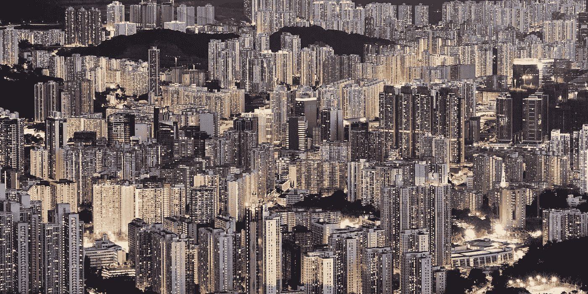
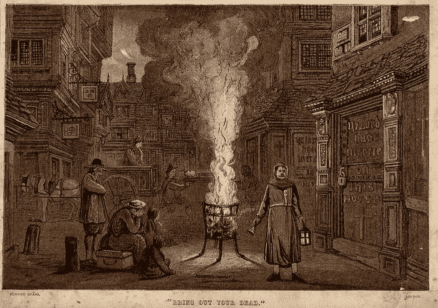
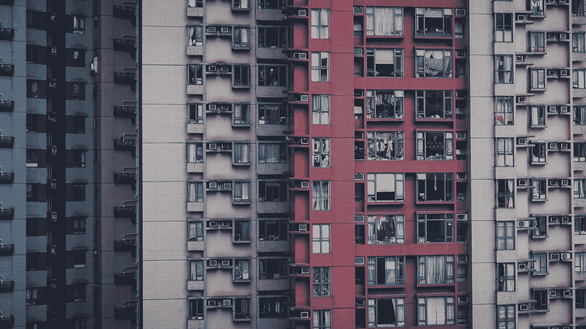
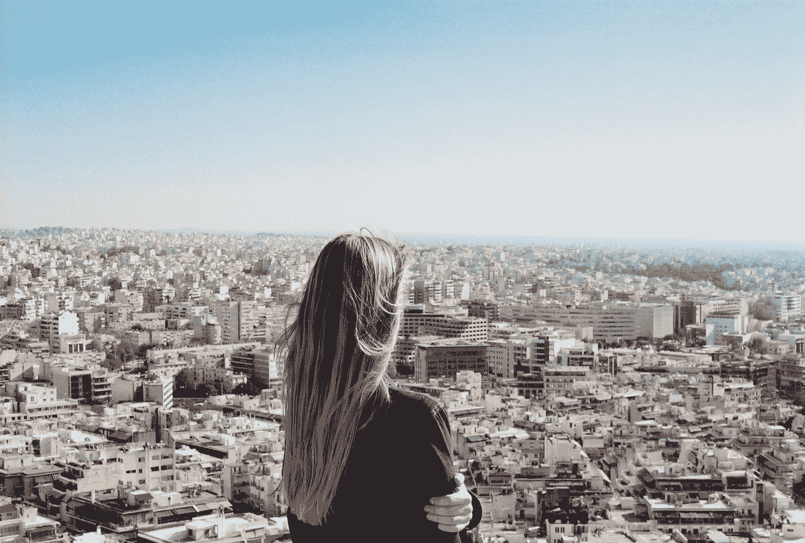

# 大逃亡:寻找更好的地方

> 原文：<https://medium.datadriveninvestor.com/the-great-exodus-searching-for-the-better-place-afb35ac2aeae?source=collection_archive---------8----------------------->

Hong Kong view.

2020 年将是值得纪念的一年。在过去的几个月里，许多人的生活轨迹发生了变化。在我的朋友中，有一半住在疫情之前的大都市，他们已经不在那里了，不清楚回来的前景(和愿望)。

朱莉娅(这是一个虚构的名字)大约一年前从一个中型城镇搬到了伦敦。她打算买一套公寓，和家人一起定居下来。就在疫情之前，她回到家乡解决一些问题，却发现自己被困在随后的暴风雪中。她和她的丈夫现在正在乡下建造他们自己的房子。“重点已经变了。疫情增强了大城市生活的不稳定性。在这里，在我自己的土地上，我感到更加安全”。

在新冠肺炎之前，逃离城市的趋势就已经在增长。“死水”的中产阶级化助长了这一趋势；转向弹性工作和自由职业，更重要的是，大城市的高生活成本。疫情增添了自己的悲剧色彩。

 [## 开发人员提高工作效率的三位一体|数据驱动的投资者

### 在这个被大量工作负载轰炸的世界里，每个人都在寻找新的方法来提高工作效率…

www.datadriveninvestor.com](https://www.datadriveninvestor.com/2019/08/29/triad-for-developers-to-increase-productivity/) 

## 科学背后:城市发展出了什么问题？

在人类历史上，许多传染病在大城市出现。瘟疫、霍乱和肺结核摧毁了城市，并彻底改造了它们。这并不奇怪。大城市是交通枢纽，吸引着移民。不断的人流有助于疾病的进一步传播。大都市的人口密度也很高，他们经常生活在肮脏、不健康的环境中。新冠肺炎也不例外。病毒袭击了纽约、伦敦、巴黎和其他有数百万居民的城市。

“Bring Out Your Dead” — A street during the Great Plague in London, 1665\. From [Welcome Images](https://wellcomeimages.org/indexplus/obf_images/ed/fd/076a57976db7b04c878c460c3cf1.jpg).

当[的社会条件跟不上](https://www.youtube.com/watch?v=F_cky_2kRRM)大城市的快速经济增长时，人口密度就成了一个问题。我们不仅在谈论圣保罗或孟买的贫民窟。在前 COVID 时代，医疗保健和安全常常被“类固醇”消费所牺牲。伦敦拥挤不堪的小餐馆和酒吧。公司把人们像沙丁鱼一样挤到空地上，以获取更多的生产力。高峰时段纽约地铁的末日景象。在应对“黑天鹅”对公共安全的威胁时，西方城市表现出了最大的鲁莽。被盲目的自信所膨胀，我们如此专注于吃、旅行、消费，以至于我们让看不见的“恐怖分子”进入了我们社会体系的核心——我们的大城市。冠状病毒被证明是 911 的微生物类似物。

新冠肺炎表明当前的城市发展方法是多么不稳定，有多少事情需要改变。在疫情之前，城市经济学家认为密度是好的。它让城市变得更加高效，留下更少的环境足迹。现在，城市规划部门正在修改他们的计划。他们寻求降低密度，以防止病毒无法控制的传播。然而，他们正面临着严重的困境:没有集中的人口，资源，能源，大城市将失去其吸引力的最大份额，无论是经济还是社会文化。解决方案不能仅仅依靠降低密度。首尔和新加坡是成功遏制新冠肺炎的高度集中的城市，这两个城市的例子表明，最重要的不仅仅是人口密度，而是城市治理。

Photo by [Yeo Khee](https://unsplash.com/@yokeboy?utm_source=medium&utm_medium=referral) on [Unsplash](https://unsplash.com?utm_source=medium&utm_medium=referral)

疫情也揭示了大城市生活惊人的不平等。研究发现，人口密度越大的城市，社会差距越大，因为城市生活的利益分配[非常不平等](https://www.smartcitylab.com/blog/inclusive-sharing/the-cost-of-high-density/)。在封锁期间，这种不平等变得更加明显。富裕的人有机会在大公寓或避暑别墅中隔离，而贫穷的人更容易感染病毒。新冠肺炎有时被称为社会边缘的[病。](https://www.youtube.com/watch?v=F_cky_2kRRM)“社会边缘”指的是经常被吸引到大城市寻求“更好生活”的贫困阶层。这些人受到冠状病毒等威胁的打击最大。在疫情之后，城市将需要减少在提供基本服务和面临风险方面的不平等。否则，他们的前景可能会变得相当暗淡。

## **大城市之死——腹地的崛起？**

那么，2020 年的震荡过后，大城市会慢慢消亡吗？

一些负面趋势已经出现。研究表明，随着城市居民开始向小城镇和农村迁移，富裕国家的城市逆转了增长趋势。

疫情将加速这一趋势。首先，向更灵活的远程工作转变。许多公司已经宣布了鼓励在家工作到圣诞节的计划。其他公司(如脸书、推特和比特币基地)正在将他们的部分员工转移到永久远程工作岗位。由于不需要每天通勤，人们正在考虑转移到郊区，那里生活更便宜，被认为“更安全”。甚至还有更激进的运动。根据一项民意调查，近三分之一的美国人正在考虑从 T2 搬到农村地区。疫情让人们彻底意识到大城市生活的脆弱。当一切顺利时，它是舒适和平稳的。但是一旦灾难降临，城市居民不得不依靠他人来满足他们基本的生存需求。如果没有食物、水、电的供应，大城市就成了一个致命的陷阱。冠状病毒疫情可能只是可能发生的事情的一个模型。

这种对被切断基本生活的恐惧正驱使许多人脱离电网，以完全自力更生的方式生活——拥有自己的发电机、供水和菜园种植的食物。城市居民对简单的乡村生活有了新的看法。自我隔离也揭示了我们不需要生活在蚁丘中来保持联系。大城市之外较慢的生活节奏释放出更多的精力用于创造力以及与你的朋友和家人面对面或虚拟地互动。

Designed by Freepik.

朱莉娅说搬出大城市是一种解放。“我获得了用有限的资源按照自己的方式安排生活的自由。我是一名自由职业者，所以我可以在任何有网络连接的地方工作。我有更多的空闲时间花在富有成效的工作、娱乐和陪伴家人上。似乎大城市给了你很多——金钱、机会、关系。但也要收回很多。最终，在这个等式中，你不是赢家……”

这种对城市化的反弹将推动大城市在电晕危机后重新审视吸引和留住人才的方式。

## **大城市获得第二次机会**

在疫情事件之后，不是所有的大城市都会消亡，但所有的城市都会发生变化。

大城市是我们文化和社会进步的重要组成部分。在这里，所有的天才、思想领袖和反叛者混合在一起，创造出思想的熔炉。这就是“未来来试音”的地方。虽然就业机会可能会转移到人口密度较低、价格较低、生活质量较高的地区，但只要大城市保持文化和知识中心的地位，吸引年轻人寻求成功，它们就会继续繁荣。

疫情和随后的经济冲击甚至可能对大城市产生复兴效应。过高的生活成本将会下降；住宿会变得更实惠；公共交通——更安全。这反过来又会吸引新的劳动力，给日渐凋零的城市生活注入活力。年轻人将继续来到大城市学习，建立关系网，为他们的职业生涯打下基础。大城市的成功将取决于它们在多大程度上符合被疫情的痛苦经历弄得伤痕累累的千年后 Z 世代日益提高的标准。

未来十年的城市发展将走向更加可持续和智慧的城市。首先，随着社区变得自给自足，城市将变得更加分散。例如，墨尔本计划让居民能够在离家 20 分钟步行距离内满足所有日常需求。巴黎市长建议将巴黎[变成 15 分钟车程的城市](https://www.theguardian.com/world/2020/feb/07/paris-mayor-unveils-15-minute-city-plan-in-re-election-campaign)，以减少通勤和压力，“提高整体生活质量”。第二，行人专用区和[微型流动计划将会越来越受欢迎](https://www.bcg.com/en-gb/publications/2020/how-covid-19-will-shape-urban-mobility.aspx)，减少对集中公共交通的依赖。第三，我们将看到高街零售和大型购物中心的衰落。都市人将转向虚拟购物——这是在疫情期间形成的习惯。企业将不得不重新考虑办公中心的用途。越来越少的公司将拥有大型的市中心总部大楼。高质量的公共空间、绿色区域、共同工作和创意区域将取代购物中心和办公中心。最后，城市管理需要找到解决城市发展带来的不平等的办法，更公平地分配城市生活的负担(如住房费用)。

在这种情况下，大城市将再次成为呼吸和生活的地方。我们将见证大都市的复兴。与此同时，城市生活可能会变得短暂，就像我们在伦敦等超级昂贵的中心看到的那样。随着财富和选择自由的增加，人们会在那里呆 5 到 10 年，然后搬到小城市。这会让大城市经济更多的是分享而不是拥有。很少有人会买自己的公寓，因为他们知道自己最终会搬出去。大城市将类似于巨大的 Airbnb，整个建筑和街区归机构投资者所有，并出租给房客。在更高流动性和更灵活职业道路的趋势支持下，人们将更愿意在紧急情况下搬出去(就像更大的疫情)。

Photo by [Semina Psichogiopoulou](https://unsplash.com/@seminapsichogiopoulou?utm_source=medium&utm_medium=referral) on [Unsplash](https://unsplash.com?utm_source=medium&utm_medium=referral)

我拒绝相信大城市的死亡。我希望我们不会看到大城市成为边缘化、贫困、绝望和患病者的最后避难所的令人沮丧的情景——人们去那里是因为没有更好的地方给他们。然而，转型是不可避免的。在未来十年，大城市将不再互相争夺人才，而是与中小城镇争夺更安全、更低成本和更平衡的生活方式。疫情给了大城市一个更快跟上这些变化的机会——城市管理部门不能浪费这个机会。

*原载于 2020 年 7 月 16 日*[*【https://www.datadriveninvestor.com】*](https://www.datadriveninvestor.com/2020/07/16/the-great-exodus-searching-for-the-better-place/)*。*

**访问专家视图—** [**订阅 DDI 英特尔**](https://datadriveninvestor.com/ddi-intel)