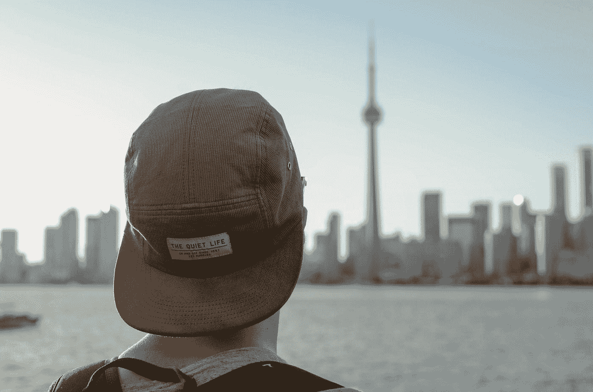

# 大停顿是我们重新创造的机会

> 原文：<https://medium.datadriveninvestor.com/the-great-pause-is-opportunity-for-reinvention-f9ae7905c1b9?source=collection_archive---------7----------------------->

## 现在是重新思考一切的时候了

Photo by [Kilyan Sockalingum](https://unsplash.com/@kilyan_s?utm_source=medium&utm_medium=referral) on [Unsplash](https://unsplash.com?utm_source=medium&utm_medium=referral)

许多故事、猜测和阴谋论围绕着新冠肺炎。一些人确信这种病毒是人造的，诞生于中国武汉的一个实验室。其他人认为，这是大自然母亲控制世界人口规模的一种行为，从而减少人类给地球造成的难以置信的压力。不管这种病毒是如何、在哪里以及为什么起源的，很明显，我们全球社会生活、运作和合作的许多方面都需要改变。

许多类比和表达被用来指现在人类正在发生的事情。比利·波特称之为全球重置，在此期间“大自然决定让我们坐下来。”世卫组织称之为“我们生命中的[战斗](https://www.reuters.com/article/us-health-coronavirus-who-ryan/whos-ryan-says-world-is-in-fight-of-our-lives-but-there-is-hope-idUSKBN22F0PG)许多记者和作家称之为“[大停顿](https://forge.medium.com/prepare-for-the-ultimate-gaslighting-6a8ce3f0a0e0)”无论我们称之为重置、斗争还是暂停，我们分开的这段时间——在一起——给了我们一个重新创造的集体机会。这是一个我们停下来，暂停，反思，并问自己，“我们想要什么样的未来？”在我们的一生中，不会有多少次(如果有的话)我们有机会进行这样的反思。与将此视为不便或负担相反，我们需要扭转这种局面，将此视为历史上的一个时期，我们被给予的时间不仅仅是一瞬间，更像是几个月的时间，来深入挖掘我们想要在我们自己的生活中和这个星球上变得更好的是什么。重塑就是重新开始，带着新的价值观、新的目标和新的目的。要进行彻底的改造，我们必须首先反思。当我们反思我们过去的想法、感受和行为时，如果我们想要改变我们未来的行为来影响我们生活和他人生活的积极变化，我们需要*重新思考一切*。

 [## 如果资本主义失败了，那么还有什么选择呢？数据驱动的投资者

### 在当前政治领域的修辞之旅中，我们都可以面对面地接触到流行词汇，如…

www.datadriveninvestor.com](https://www.datadriveninvestor.com/2020/03/16/if-capitalism-is-a-failure-then-what-is-the-alternative/) 

现在是反思我们对待他人的行为的时候了。我们必须问自己，“我的想法、感觉和行为有助于与家人、朋友、同事、邻居、陌生人和地球建立开放和关爱的关系吗？”如果答案是“不”，那么问题就变成了“我需要改变什么？”人类思想的力量是不可否认的——积极的思想创造积极的感觉，积极的感觉形成积极的行动。在不久的将来，我们知道我们必须远离彼此，以保护彼此的健康，并最大限度地减少这种病毒夺走的生命。从长远来看，我们必须继续我们最近采取的行动来关心他人，但不仅仅是亲密的家人和朋友。我们需要重新思考我们如何对待女性、可见的少数群体、不可见的少数群体、那些不那么幸运的人和高度弱势群体。正如我们在过去几个月所看到的，善行在我们的社区、社区、城市和地球上产生了连锁反应。

我们需要重新考虑 T2 资本主义。我们生活在一个资本主义社会，在这个社会中，个人的权利、成长和繁荣是核心。现在是重新考虑的时候了，‘这是我们生活的公平方式吗？’卡戴珊姐妹赚的钱一样多，因为她们吸引了我们的注意力。而今天，注意力可以货币化。但是，如果我们把我们支付给已经很富有的人的一些资金转到帮助维持我们的食品系统运转的一线工人和在我们的亲人生病时照顾他们的医护人员身上，会怎么样呢？进步的项目和认证，如 [1%的行星](https://www.onepercentfortheplanet.org/)和[认证的 B 公司](https://bcorporation.net/)确实存在。虽然这是一个很好的开始，但还不够。它们需要被放大和扩展，这样我们就可以有几个强有力的项目和系统来把钱分发给那些为改善我们的社会而努力工作的人，而不是那些让我们关注片刻的人。

现在是时候重新思考消费主义和我们购买下一个最好的东西的一贯使命了。我们认为这些物质会给我们带来快乐，然而[的研究](https://medium.com/thrive-global/this-75-year-harvard-study-reveals-the-secret-to-happiness-and-success-3cf0002510fe)表明，只有通过关系和爱才能体验快乐，而这种关系和爱是建立在给予和感激的基础上的。因此，尽管新衣服、新车或新家具可能会给我们带来一段时间的快乐，但这种快乐转瞬即逝。我们需要打破消费主义的恶性循环，首先要意识到它对我们的生活和地球的负面影响。生活中最大的收获之一是，消费越少越有乐趣，因为你自己拿的越少，你能给别人的就越多。你给别人的越多，你从别人那里得到的也就越多，呈指数增长。结果你会感到更多的快乐。这就变成了快乐的良性循环。

现在是重新思考、重新想象和重新设计我们的*城市*的理想时机。城市是为容纳汽车而设计的，这样司机就可以尽可能快速高效地上下班。在许多市中心，道路和停车位可能占到城市房地产的一半以上。如果我们把人们需要在市中心办公室工作的天数减少一半会怎么样？这将有效地将我们城市的交通拥堵和废气排放减半。如果市政府鼓励城市居民放弃他们的汽车，鼓励使用自行车、公共交通、汽车共享和拼车，会怎么样？这将大大减少市中心的交通流量，允许城市重新规划一些道路和停车场，以满足行人的需求，如更宽的步行道、公园和户外野餐区。城市规划者正面临着一个重新思考我们的城市的机会，使其更加可持续和以社区为中心。

我们还需要重新思考我们实现可持续发展的方法。格里塔·图恩伯格吸引了几代人几十亿人的注意力。一个充满激情和决心的 17 岁少年的声音唤醒了我们所有人，让我们意识到地球需要我们做什么——少索取，多养育。许多人认为，当我们恢复“正常”时，我们对环境的关心就会减少。我们将继续消耗地球上的不可再生资源，继续以前所未有的速度变暖地球，污染我们的水资源，使之无法修复。当谈到我们在可持续发展和最大限度地减少对环境的影响方面取得的进展时，我们不能让自己的目光从奖品上移开。像[碳信托](https://www.carbontrust.com/)和[气候中和](https://www.climateneutral.org/)这样的项目正在取得积极的进展。我们怎样才能加速他们的进步？我们看到许多政治家、活动家和国家进行了积极的讨论，这是良好的第一步。然而，没有行动就不可能取得进展。现在是重置和修复损害的时候了，以确保我们的健康和生存。

现在是重新思考医疗保健的时候了。新冠肺炎暴露了我们全球医疗体系中的差距和长期挑战。医疗保健资金严重不足。我们需要问自己，“我们如何才能创建一个高效的医疗保健系统来照顾所有需要的人？”加拿大有一个公共资助的全民医疗保健系统。虽然所有加拿大人的保健是我们作为一个国家的核心，但我们观察和护理我国大量需要快速获得医疗保健的人的能力已经成熟，有待改进。远程医疗的进步无疑让我们朝着正确的方向前进。在美国，医疗保健不是普遍可及的，其他挑战已经浮出水面。全国各阶级之间医疗保健的不平等显而易见，政治家们再也不能忽视了。美国必须放弃其个人主义原则。通过这样做，这个国家将能够从身体上、精神上和情感上共同治愈创伤。

现在是重新思考我们如何开展业务的时候了。这种病毒迅速暴露了我们许多业务基础的漏洞。零售业、餐饮业和体育直播业在很多情况下都遭到了猛烈的抨击和破坏。一种阻止人们在实体店购物的病毒清楚地表明了电子商务对零售业的重要性。电子商务不能再被忽视或被搁置。最具代表性的美国服装品牌[Gap 可能会因为新冠肺炎而消亡](https://marker.medium.com/this-is-how-the-gap-dies-436199e54faf)。今年年初，像 TJX 这样让传统百货公司望尘莫及的低价零售商销售火爆。突然间，由于不得不关闭所有实体店，他们的收入为零。对餐馆来说幸运的是，像 Uber Eats 和 DoorDash 这样的送餐应用程序在过去几年里一直在建立自己的业务和运营模式。在疫情，当外出就餐不再是一个选择时，送餐业务繁荣发展。这是一个为未来增长做好准备的类别。世界各地大多数体育赛事的关闭不仅对团队球员来说是艰难的，对热爱参加体育赛事的热情社区来说也是如此。在这样的时期，对在线游戏和电子竞技的进一步投资和开发对于保持这个社区的联系是重要和不可避免的。我们还需要重新评估我们对工作场所的概念，包括物理办公室和敏捷工作政策。当一种病毒迫使大多数办公室工作人员在家工作，并且这种模式成功时，企业领导人开始质疑他们目前拥有的办公空间是否真的是他们未来需要的。能否缩小物理办公室的占地面积，以提高工作场所的灵活性？其结果是提高了灵活性，减少了员工的通勤时间，并为许多企业节省了成本。需要考虑的一个关键因素是工作场所社区的力量及其对创造力、生产力和业务成果等要素的影响。

现在是时候重新思考我们对*社区*的定义了。我们定义社区的方式通常是我们周围的人。然而，我们需要把社区看得比这更广泛。这种病毒清楚地向我们表明，州、省和地区是大规模的社区，因为它们一直是为食品、必需品、医疗保健等关键系统和供应链的运作以及为最弱势群体提供供应做出关键决定的人。国家是一个庞大的社区，需要强有力的领导以统一的方式运作，同时将所有公民的最佳利益放在心上。也许最重要的是，一个影响整个世界的疫情需要我们反思、重新评估和重新思考我们的全球社会。像世界卫生组织(世卫组织)和联合国这样的组织对各国需要始终运作的联系和合作方式至关重要，而不仅仅是在疫情期间。这些组织需要通过尊重和[适当的资助](https://www.theguardian.com/commentisfree/2020/apr/15/trump-decision-cut-who-funding-international-vandalism-coronavirus)来加强，以优先考虑一个真正的全球社区的进一步增长和发展。这些组织和我们各国的正确领导对我们的集体成功至关重要。

我们需要重新思考*的领导力*。危机时刻是领导力的定义。在这段时间里，我们看到一些领导人茁壮成长，一些领导人苦苦挣扎。蒸蒸日上的领导者是带着远见、诚实、清晰和信念来领导的——他们因此而受到称赞。挣扎中的领导者缺乏远见、谎言、优柔寡断和粗鲁，这在全球都可以感受到——他们因此受到审视和批评。在此期间，我们需要问自己，‘我们希望什么样的领导人来管理我们的学校、公司、城市和国家？’在过去几个月里，我们看到了有效领导的明显例子。我们需要收集这些领导人的优点，并将它们作为我们未来领导人的必备素质，在许多情况下，我们将投票支持他们。我们需要带着积极的意图和目的领导我们的社区、组织、城市和国家的领导人。

我们完全掌握着我们个人和集体的未来。这是我们有生之年最大的重塑机会。我们需要抓住这个机会，重新思考我们将如何生存、生活和发展。

这是文章系列的第一部分。阅读部分 2 [*这里*](https://medium.com/@joshmackinnon/wont-you-be-my-neighbor-756038c20a27) *。*