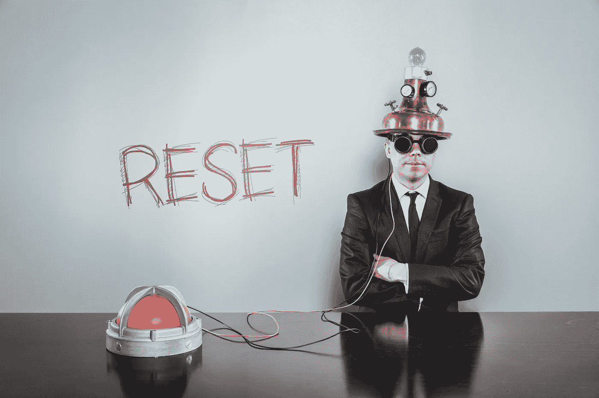

# 伟大的重置及其对您的意义

> 原文：<https://medium.datadriveninvestor.com/the-great-reset-and-what-it-meant-for-you-413605591ee7?source=collection_archive---------1----------------------->

10 月 15 日，国际货币基金组织总裁克里斯塔莉娜·格奥尔基耶娃发表声明，谈论新的布雷顿森林时刻。

成立于布雷顿森林体系的国际货币基金组织现在基本上是在呼吁**进行一次伟大的重置。**

对于那些不熟悉与**布雷顿森林体系的人来说，**它本质上是 1944 年实施的一个新的全球货币管理体系。要完全理解布雷顿森林发生的事情，请阅读 g .爱德华·格里芬的书《来自哲基尔岛的生物》。

*那么，大重置对你来说意味着什么？*

格奥尔基耶娃说，我们必须今天就战胜这场危机，以建设更美好的明天。

这可能是一个优雅的声明，但银行家和政治家的宏大声明通常会导致自由的丧失。

**中央银行数字货币或 CBDCs，**在**“大重置”中扮演着重要角色**

他们会来的比我想象的要快。美联储最近宣布与麻省理工学院合作建立其数字美元。欧洲中央银行正在推出数字欧元的提案。中国已经在深圳推出了数字人民币。

不要犯错误；迟早，每种货币都会被数字化。

所以，这里有**六把钥匙来解开伟大的重置意味着什么:**

# 1.自由的丧失

你消费 CBDCs 的唯一方式是通过你手机上的数字应用程序。这对你的隐私来说将是一场灾难。政府会监控、追踪和记录你的每一笔交易。

*想买未经政府授权的产品？想给你带孩子的侄女小费吗？*

祝你好运。

通过 CBDC，**中央银行可以批准或拒绝**你的任何交易。

# 2.做空银行家

大重置对银行来说是个坏消息。他们即将受到央行、金融科技和密码公司的攻击。

得益于 CBDCs，央行可以绕过整个银行系统，甚至是 SWIFT 系统。随着时间的推移，银行将大大失去其在金融体系中的作用。也许这就是巴菲特开始出售银行的原因。

正如摩根信条数字公司(Morgan Creed Digital)的联合创始人安东尼·波普拉诺(Anthony Popliano)喜欢说的那样，“**做空比特币，做空银行家。”**

# 3.即时收税

CBDCs 是一种革命性的征税方式，可以彻底根除政府的财政政策。中央银行可以绕过你的地方财政系统，直接从你的钱包里拿钱**。**

他们将能够在政府资产负债表之外管理财政政策。

# 4.推出普遍基本收入

普遍基本收入(UBI)是一项政府计划，每个成年人都定期获得免费资金。中央银行可以给你 UBI，而不需要政府的任何帮助。

如果政府现在想开出一张刺激支票，那就必须通过债务，但 CBDCs 改变了这一切。人们可以直接从央行获得直接转移支付到他们的数字钱包。

但是有一个问题。

UBI 意味着更多的印钞，导致通货膨胀。通货膨胀是一种隐性税收。

# 5.负利率

CBDCs 可以让负利率对所有人都是可执行的。央行可以直接从你的电子钱包里扣除利息。

例如，他们可以直接向餐馆老板支付刺激资金，同时向拥有大额账户的储户收取负利率。

# 6.为中国的统治地位做准备

几年来，中国一直在研究数字货币。他们正在深圳积极试点这项技术。

想想吧。

今天，70%的全球贸易是通过美元进行的，尽管美国仅占全球经济的 20%。

在 CBDCs 竞赛中，中国领先美联储和欧洲央行两年多。如果他们能在其他人之前实现货币数字化，人民币将比美元更容易被世界各地的人们使用。

中国可能成为世界上领先的超级大国。

# 你如何保护自己？

似乎这些墙正在向我们逼近。

但是，CBDCs 是比特币的救生船。

与硬资产相比，菲亚特全球的价值将会大大降低。这意味着黄金，尤其是比特币，将会相对于法定货币升值。

**人们将面临在 CBDCs 和比特币之间的选择。**

不可否认，他们最终会选择比特币。有了比特币，他们仍然能够**接收、转移和存储金钱**，没有任何权力阻止他们这样做。

然而，随着中央商务区的发展，人们会因为无休止的印钞而失去他们的财富。随着税收的大幅增加，他们可能会损失更多的钱。这对他们的自由和隐私将是一场灾难。

还是老样子。

你可以用一张名为“伟大的重置”的纸来包一条老鱼，但它还是会发臭。

*如果你喜欢这篇文章，请在左下角“鼓掌”50 次，这样它会被更多的人分享。你也可以随时* [*发微博给我*](https://twitter.com/RasVasilisin) *告诉我你的想法或者关注我*[*LinkedIn*](https://www.linkedin.com/in/rastislav-ras-vasilisin-11bb5819/)*并订阅* [*实时新闻。*](https://www.virtuse.com/)