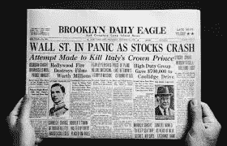
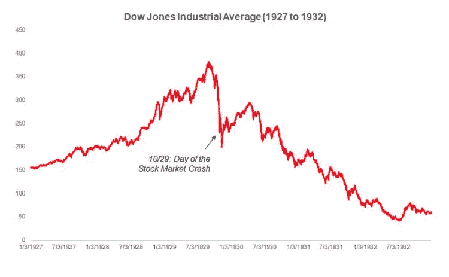
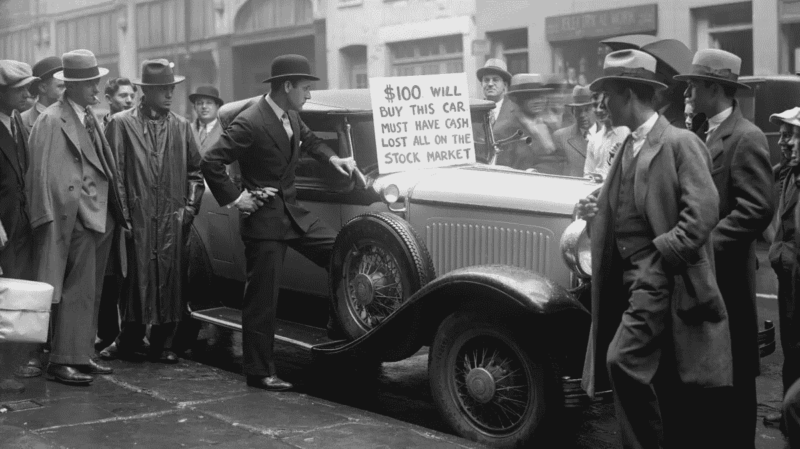
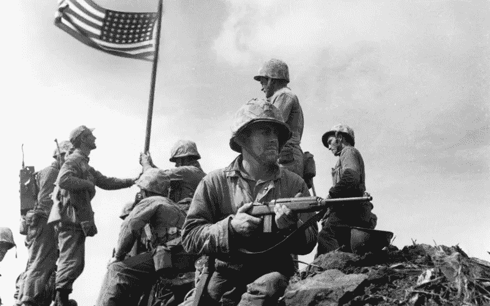

# 1929 年华尔街大崩盘——简要概述

> 原文：<https://medium.datadriveninvestor.com/the-great-wall-street-crash-of-1929-brief-summary-9816ef5a682b?source=collection_archive---------17----------------------->

One of the biggest stock market crashes in the world on the headlines

1929 年股市大崩盘始于忧心忡忡的投资者交易创纪录的 1290 万股，导致道琼斯工业指数下跌近 13%，第二天又下跌 12%。

为了弄清楚发生了什么，让我们回到 1921 年，股市屡创新高，投资者埃尔文·费雪后来说的话就好像“股市已经达到了永久的高平台期”市场以每年近 20%的速度增长，但有涨必有跌，最终，市场在 1929 年 9 月 3 日达到顶峰，道指达到 381 点。

Dow Jones Industrial Average Illustration

巧合的是，在这一高峰的前一周，美联储银行将利率从 5%提高到了 6%。农业衰退，农民们努力赚钱来维持他们的生意。

就这样，人们散开街道，跑到银行取钱。当这种情况发生时，股市在两天内暴跌了近 25%。当人们从银行取钱时，恐慌使糟糕的情况变得更糟，美国各地的银行纷纷倒闭。

Man tries to sell his car during the early stages of the great depression

美国数百万人失业，数百万公司破产，数百万外国民众受到影响。美国进入了大萧条时期。第二次世界大战时，妻子被丈夫抛弃，留下来养家糊口，大萧条变得更加严重。

WWII — United States ARMY

股市崩盘的原因不止一个，包括经济不稳定在内的多种原因导致了大规模的股市崩盘，导致许多企业破产。

1929 年的股市大崩盘是美国发生的最可怕的事情之一，它给数百万美国人带来了巨大的灾难。