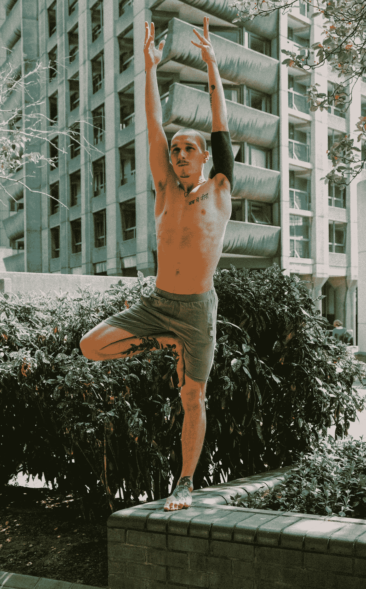
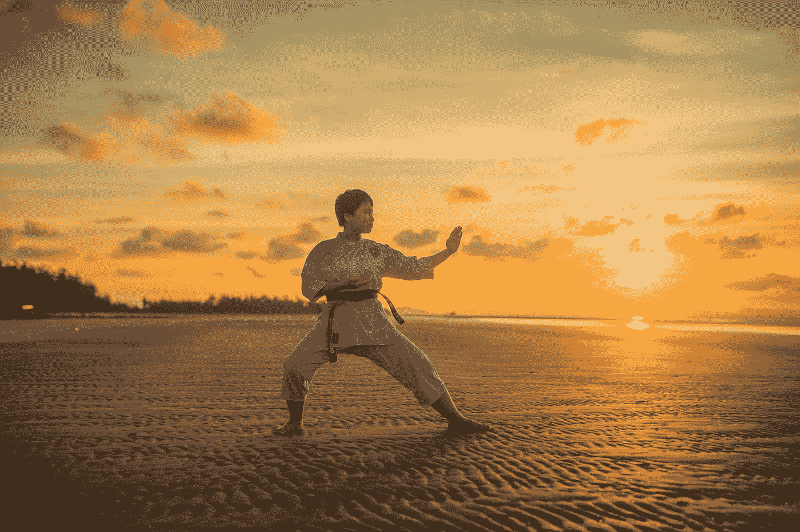
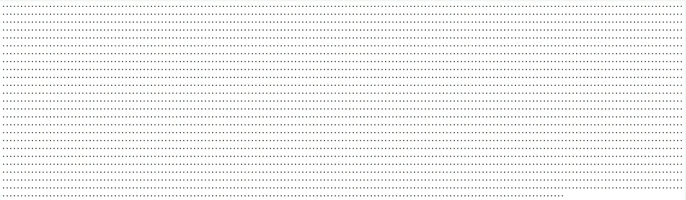

# 一个人能做的最伟大的战斗——通过精神的方式获得自我控制

> 原文：<https://medium.datadriveninvestor.com/the-greatest-battle-one-can-do-right-now-but-none-feels-he-could-win-b1fba812892d?source=collection_archive---------9----------------------->

> 亚历山大赢得了世界，所以他被称为统治者。如果他战胜了自己，他会被称为大师。

自我控制可以说是一个人所能完成的最艰难的事情。这些年来，人们并没有轻易接受它。僧侣们甚至去丛林中追寻它，然而只有极少数人成功了。

# 什么是自我掌握？

它是一种能够在今天不幸事件的滔滔江水中经受住水流，并且能够遵循正确的生活原则的能力。完成它肯定是一场艰苦的战斗。人们不过是愿望的奴隶。

Photo by [Samrat Khadka](https://unsplash.com/@samrat_khadka?utm_source=medium&utm_medium=referral) on [Unsplash](https://unsplash.com?utm_source=medium&utm_medium=referral)

# 一个人如何才能达到自我控制？

通过戒除所有感官的、短期的快乐，以极大的严谨专注于生活的唯一目标，一个人可以实现自我控制。这并不像说的那么容易。它伴随着巨大的奉献和渴望。

那些超越这一点的人，在不知不觉中成为人们的榜样，只有那些人才能体验到**从幸福中解脱***

## 简而言之，避免这四种干扰:

*   **Ka:** *【卡纳克】*生前贪财，死后贪天。
*   **Kaa:***(Kaa mini)***肉欲的奴隶。**
*   ****Ki:** *(Kirti)* 对功名的渴望。**
*   ****辜:***【Koodkapat】*欺骗。**

***(由印度古吉拉特邦的 Shri Madhav Tirth 创造)***

# ***什么是从幸福中解脱？**

*   ****简而言之:**真正幸福的状态。**
*   ****阐述:**灵性解释——**

> **在真实的状态下，我们意识不到幸福。当我们说我们快乐的时候，我们实际上是在和之前的快乐状态进行比较。所以，这意味着我们相对幸福，而且还有更多的幸福。**
> 
> **但是在绝对阶段，既没有快乐也没有不快乐。这是绝对脱离快乐的阶段。**

****

**Photo by [Benn McGuinness](https://unsplash.com/@blouism_?utm_source=medium&utm_medium=referral) on [Unsplash](https://unsplash.com?utm_source=medium&utm_medium=referral)**

# **为什么自我掌握很难？**

**纯粹是因为嗜睡和无知。如前所述，随波逐流很容易，这样做没有必要感到尴尬。**

**我们看到的任何地方都有触发点。每当我们经历这些时，它们会给我们带来即时的满足感。因此，我们成为他们的奴隶，这些使我们无法体验绝对和终极。我们甚至变得过于怀疑，不愿听灵性和改善，因为它不会给我们带来快乐。**

**人类已经变成了一只井底之蛙。是梵语表达，定义某人认为自己的知识视界是所有知识的最远极限，就像一只青蛙如何假设它生活的井是整个世界，无法想象其他更伟大的东西。**

** [## 如何管理优秀的团队和你自己|数据驱动的投资者

### Janice Presser 博士是团队科学及其基础理论的先驱实践者。老生常谈就是说她…

www.datadriveninvestor.com](https://www.datadriveninvestor.com/2020/05/26/how-to-manage-great-teams-and-yourself/) 

> 不要一遍又一遍的过同一天，把那叫做生活。生活是关于心智、精神和情感的进化。
> ――德国肯特郡

Photo by [Thao Le Hoang](https://unsplash.com/@h4x0r3?utm_source=medium&utm_medium=referral) on [Unsplash](https://unsplash.com?utm_source=medium&utm_medium=referral)

# 当你达到自我控制后，你感觉如何？

如果你认为你已经实现了它，并为此感到自豪，你可以肯定你还没有实现它。自制力过了，就没什么好怕的了。你总是很满足，觉得有足够的时间做任何事情。自省的同时也不会有遗憾。人们会在你的预见中找到幸福。

> 大师未必是永远走正道的人。但是，当他走错路的时候，他绝对是第一个纠正自己的人。

你开始爱一切。需要时，你总是乐于助人。你会富有成效。没有嫉妒、愤怒、骄傲、尴尬和拖延的瑕疵。

# 结论:

一个没有自制力的人通常不会被赋予任何价值，至少他自己也不会。完成它肯定是困难的，但是困难的事情是值得的。

> 自我控制的简单经典是**不断的内省**，对它来说是**冥想**。

记住，生命很短暂，你不应该等到为时已晚才后悔。

**这就是你的生命有多短暂:**

每个点代表 90 岁生命中的一周。如你所见，他们人数不多。我们已经用了很多了。每当我们等待一个周末的到来，一个盒子就会被打上一个勾号。我们该开始关注重要的事情了。让我们开始吧…不久的将来！

> 你的生活就是你向世界传达的信息。一定要励志！
> ――匿名

让我们期待顿悟早日到来吧！

我把这篇文章归功于用心冥想。

## 访问专家视图— [订阅 DDI 英特尔](https://datadriveninvestor.com/ddi-intel)**