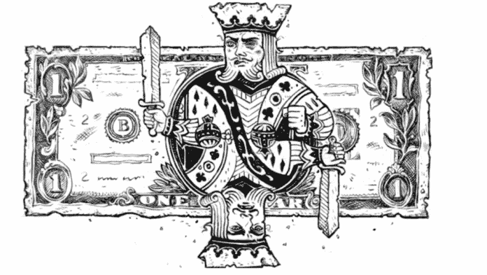
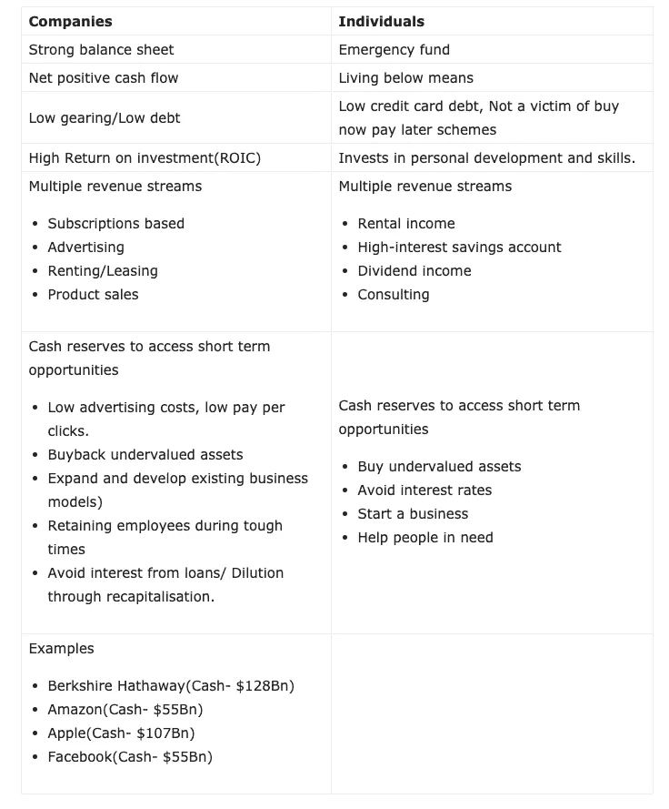

# 当前疫情最大的金融教训

> 原文：<https://medium.datadriveninvestor.com/the-greatest-financial-lesson-from-the-current-pandemic-68de39a57c75?source=collection_archive---------16----------------------->

由于当前的健康危机导致的封锁已经影响了每个人的精神、身体和经济。然而，封锁带来的财务影响将对个人和企业产生不同程度的影响。当一些公司和个人专注于生存时，另一个群体将在危机期间利用其所有资源蓬勃发展。

那么这两个群体最大的区别是什么呢？

**现金。**

Cash is still king.

美联储最近的一项调查显示，40%的美国成年人无力支付 400 美元的紧急费用。属于剩下的 60%，或者更好的是属于前 10%。

资产负债表富有弹性、现金充足且债务较低的公司，可以利用其相对强劲的财务状况，在尘埃落定时变得更加强大。

同样的概念也适用于个人。因此，在繁荣时期，靠借钱挥霍来维持生活在短期内是有吸引力的，但在雨天会回来咬人。

公司的现金相当于个人的应急基金。

“应急基金”这个术语是不言自明的。

> “只有当潮水退去，你才会发现谁在裸泳”——沃伦·巴菲特

# 为什么应急基金很重要？

如果你，

*   只有一个收入来源
*   有受抚养人
*   为了你的职业需要身体健康。
*   有医疗问题
*   远离家人生活
*   是个体户还是承包商
*   拥有自己的家(维修和保养)
*   想问责。
*   想冒险，想进化。

# 这里有一个建立应急基金的简单指南，

*   将工资的一定比例(5-10%)存入高息储蓄账户。
*   更进一步，实现自动化。然后，忘记它的存在。
*   最大化你的抵消房屋贷款帐户，如果你有一个。
*   节省至少 6 个月的生活费用
*   学会投资，剩下的投资。

# 高息储蓄提供者指南

如果你没有注意到，澳大利亚的大多数银行在特定时期有非常有吸引力的储蓄利率，在该时期结束时恢复到低得多的标准利率。目前的通货膨胀率为 1.8%，在低息账户中存钱会大大降低你的购买力。

我们生活在一个非凡的印钞时代，预计在不久的将来，购买力会进一步下降，通货膨胀率会上升。为了长期保护你的资本，考虑投资于强势公司、指数基金、包括黄金和房地产在内的硬资产。

一些银行提供相对较高的现行利率，这对建立应急基金要有用得多。Ubank、Up 和 ING 等数字银行提供更高利率的主要原因是它们的管理费用更低。

1.  基本利率和红利利率:要获得红利利率，您需要满足某些标准。对于 ING 来说，你需要每月存入 1000 美元以上，并进行 5 次交易。
2.  由政府支持:澳大利亚政府为授权存款机构(ADIs)的存款提供高达 25 万美元的担保
3.  自动取款机，交易费和月租费。
4.  其他感兴趣的特点:房屋贷款、保险选择、福利
5.  易访问性:移动平台、付费 ID、客户服务。
6.  回扣:国外交易回扣。回扣有可能在旅行中节省数百美元，并消除对外币兑换的需求。

[点击此处](https://www.savings.com.au/savings-accounts/highest-savings-account-rates)查看储蓄利率最高的提供商列表。

# 2019 年以来我的个人策略。

[Scott Pape 的《赤脚投资者](https://www.amazon.com/gp/product/0730324214/ref=as_li_qf_asin_il_tl?ie=UTF8&tag=ashp07-20&creative=9325&linkCode=as2&creativeASIN=0730324214&linkId=d925c5ce8cefd637a0a46d43429a5e69)》是我通向金融和投资的大门，他更深入地讲述了这些简单而有效的[个人理财](https://www.datadriveninvestor.com/glossary/personal-finance/)技巧。自从我开始学习金融和经济，我就渴望进入市场，增加我的收入。

面对历史上最长的牛市和相对高估的市场，我退缩了，专注于建立应急基金。应急基金的经验法则是 6 个月，但我决定有一个额外的安全层。如果需要的话，12 个月足以完全改变我的职业道路。

之后，我继续学习和记录市场如何变化，并为潜在的低迷时期存钱。

# 让你自己和你的企业抵御衰退

Features, benefits and opportunities in being recession-proof

相比之下，高负债和低现金余额的高杠杆公司希望在经济困难时期通过资本重组获得政府援助和投资者援助。

# 学习和进化

应急基金从未如此重要。

每一次坠机都给了我们宝贵的教训。从这次崩盘中受益最大的人，是那些在市场反弹时，通过运用建立头寸所需的纪律，已经做了艰苦工作的人。现在，他们能够在危机中茁壮成长。

如果 2001 年没有发生网络泡沫破裂，我们会有更多的猜测。2008 年，如果全球金融危机(GFC)没有发生，银行不会像今天这样强大。

如果我们看得足够深入，这将只是从当前危机中吸取的众多教训之一。

> “虽然大多数人在财务上变得难以置信地具有防御性，但世界上最富有的人正准备投入数十亿美元，试图购买所有廉价资产。自我教育。没有人关心你。”—安东尼·蓬皮亚诺