# 科学最伟大的工具对抗人类最大的威胁

> 原文：<https://medium.datadriveninvestor.com/the-greatest-tool-of-science-fights-against-the-greatest-threat-of-humankind-b4c2a9db2a91?source=collection_archive---------5----------------------->

作为宵禁的一部分，我们大多数人被政府锁在家里，而不是因为任何内战。一种致命的病毒造成了这场浩劫，破坏了人们的日常生活，影响了股票市场，并可能导致数百万人失业。突然，我们很多人开始使用消毒杀菌剂，保养手帕，戴口罩，努力变得更加卫生(这确实非常好)。研究人员肯定能够消灭这种流行病(就像他们过去对脊髓灰质炎、天花、猪流感、埃博拉病毒等所做的那样；)几个月之内，我们将恢复正常生活(尽管看起来可能不会再正常)。任何人都不应该鲁莽行事，也不应该对形势反应过度，而是应该采取足够的预防措施。

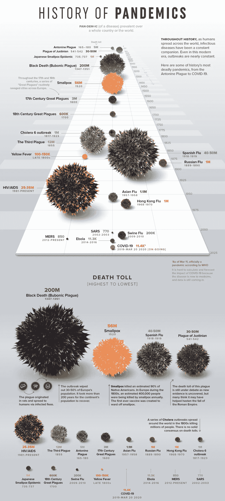

Infographic of the deadliest pandemics in human history (**Source**: Visual Capitalist, [https://www.visualcapitalist.com/history-of-pandemics-deadliest/](https://www.visualcapitalist.com/history-of-pandemics-deadliest/)). **Note**: Numbers may vary and are not to scale. There are more deaths in past because of the lack of proper medical facilities, technology and proper awareness.

我们中的一些人可能会认为这是 ***【最大威胁】*** 或*【天启】*或*【灭霸打响指】*，但在你内心深处的某个地方，你内心的声音在说 ***【更糟糕的还在后面】*** 。除非我们开始稍微改变我们的生活方式，否则我们将面临更大的威胁，即“ ***气候变化*** ”。我坚信这是最大的威胁，因为没有治疗方法和疫苗，一旦恶性循环开始，没有任何消毒、隔离和封锁可以帮助我们。政府将无法控制，任何生物都无法完全扭转局面。也许，这个星球上的一切都将在本世纪末灭亡。

如果你不相信或者听起来有点令人毛骨悚然，那是因为它确实令人毛骨悚然。问问你自己“10 年前我的生活是怎样的？在这期间，我周围的环境发生了怎样的变化？”

与全球变暖及其影响相关的一些参考资料如下:

1.  联合国( [**链接**](https://www.un.org/en/sections/issues-depth/climate-change/)
2.  NASA ( [**链接**](https://climate.nasa.gov/) )
3.  气候 101 ( [**链接**](https://climaterealityproject.org/climate-101)
4.  国家地理([链接 T35)](https://www.nationalgeographic.com/environment/global-warming/global-warming-effects/)
5.  信息图来自 xkcd ( [**链接**](https://xkcd.com/1732/) ) —这张图片描述了一切，是我的最爱

当听到气候变化这个术语时，很少有人会想到:

> **这不会影响我的社区。我会安全的**

电晕病毒于 2019 年 12 月在中国武汉开始，三个月内你可以在*你的社区*观察情况。这也许能回答你的问题。

> **我相信我们有足够的时间采取行动**

下面的图片可能会回答这个问题(尽管对病毒反应迟缓并不是全部事实，但它清楚地告诉我们如果我们忽视/拖延会发生什么)

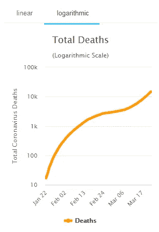

Situation of world for CoVID19 (**Source**: Worldometer, retrieved on March 24, 2020)

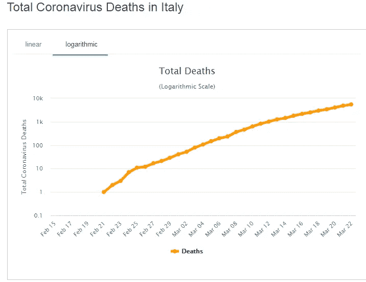

Situation of Italy as it acted bit late to tackle the virus. Another reason is it has higher contribution of old aged people who are less immune. The graph looks linear on a logarithmic scale which speaks the situation is very pathetic (**Source**:Worldometer, retrieved on March 24, 2020)

> **我个人的贡献可能不会产生很大的影响。我为什么要投稿？**

这个你知道答案，是 ***【自我意识】*** 。最近封锁的结果可能是一个完美的例子。

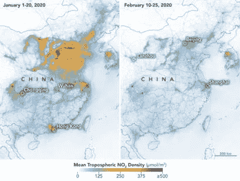

Air Pollution levels reduced after the shutdown due to Corona virus. (**Source**: NASA)

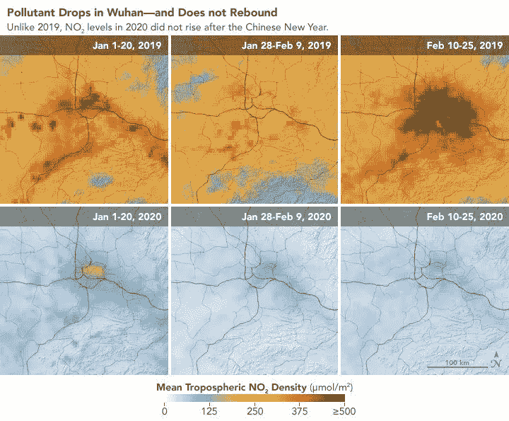

Air pollution levels from year 2019 (normal year) and 2020 (abnormal year, due to outbreak) (**Source**: NASA)

观察空气质量如何改善。它是 ***组合的结果*******每一个个体的*** 贡献。虽然结果是可取的，但原因是不可取的，因为我们不能指望一场流行病能减少全球变暖或温室气体(GHG)的排放。*

> *我能为气候变化做些什么？这难道不是政府和组织的职责吗*

*所以，我们需要找到一个工具，我们可以用它来对抗气候变化，并回答这个问题。*

* [## 今年值得关注的 5 大人工智能趋势|数据驱动的投资者

### 预计 2019 年人工智能将取得广泛的重大进展。从谷歌搜索到处理复杂的工作，如…

www.datadriveninvestor.com](https://www.datadriveninvestor.com/2019/02/19/artificial-intelligence-trends-to-watch-this-year/) 

机器学习(ML)可能是这场长期战斗的最佳选择。我称它为“工具”,因为它本身不能解决问题。它需要结合来自技术、金融、市场营销、政策制定和各种非技术背景的领域专家。我称它为“最伟大的”,因为它在每一个分支的渗透能力和大肆宣传。

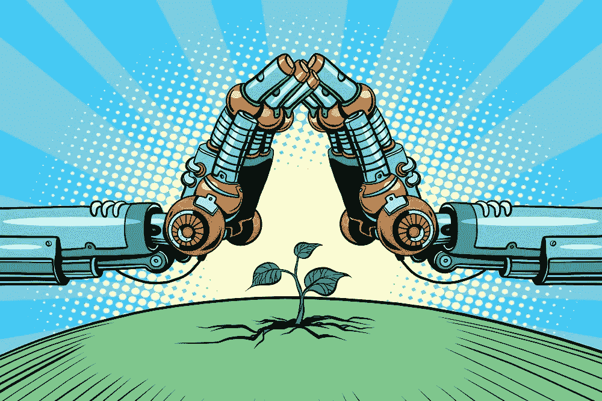

Pictorial representation of AI aiding us to fight against climate change (**Source**: *Igor Sapozhkov/Dreamstime.com)*

如果你被说服了，并且在想，“好吧！我明白了。但是从哪里开始呢？”那么这篇论文可能是一个很好的起点。由 22 人撰写，其中包括像 [Yoshua Bengio](https://en.wikipedia.org/wiki/Yoshua_Bengio) 和 [Andrew Y. Ng](https://en.wikipedia.org/wiki/Andrew_Ng) 这样的专家，这清楚地展示了可以应用 ML 的感兴趣的领域。

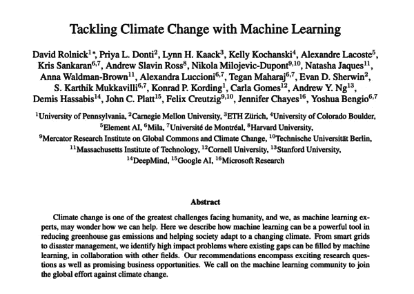

Abstract of the paper “Tackling Climate Change with Machine Learning” published in NeurIPS 2019\. (**Credits**: To all the authors and institutions)

这篇博客的部分灵感来自这篇论文，强烈建议阅读整篇论文，不管你的教育背景如何(因为它是为研究人员、企业家、投资者、领导人和政府写的)。他们选择了 13 个潜在的领域(部门),在这些领域中可以应用 ML 来对抗气候变化。

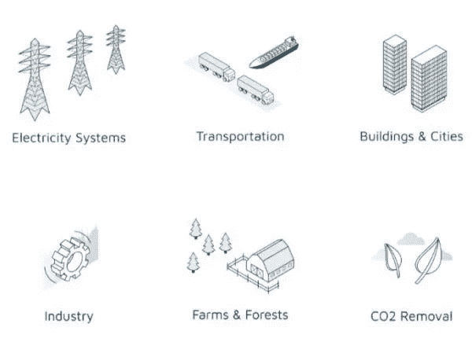

Chosen areas of interest (sectors) by researchers where ML can be applied. (**Source**: Towards AI, Medium)

ML 中的不同技术用于不同的部门。适用于行业的 ML 各领域概述如下:

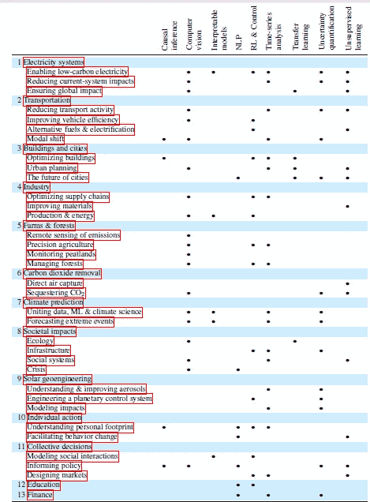

Selected climate change sectors mapped with applied ML domains. (**Source**: Research Paper)

如果你是一个 ML 爱好者，并计划做一个职业生涯，那么这篇文章有助于以更技术性的方式理解重点领域。不考虑部门，一些共同的问题是:

1.  收集大量有价值的数据并开源
2.  通过使用训练模型的特定数据获得全球范围的解决方案(**例如**:在印度环境中使用美国数据而不进行适当的修改将不会有有价值的见解)
3.  隐私问题和政策制定，因为它涉及敏感数据

具有讽刺意味的是，训练 ML 模型本身产生基于能量源的 GHG—([**链接**](https://www.technologyreview.com/s/613630/training-a-single-ai-model-can-emit-as-much-carbon-as-five-cars-in-their-lifetimes/) )

如果你对 ML 不感兴趣，你可以浏览一下这个[总结文章](https://www.climatechange.ai/summaries)并从中获得想法，因为它是一个多学科的问题。

**注:**更多关于*“研究人员能做什么？”*和*“组织能做什么？”*请参考论文或[帖子](https://www.climatechange.ai/summaries)中的相关章节，并进行相应的研究。我从论文和我的观点中整合了一些重要的观点。* 

*在一项新技术进入市场之前，分析引进这项技术是否真的有用是很重要的。 ***【杰文斯悖论】(*** [***效率困境***](https://en.wikipedia.org/wiki/Jevons_paradox)***)***在一定程度上解释了。它指的是*“效率的提高仍然会导致更高的需求。”**

*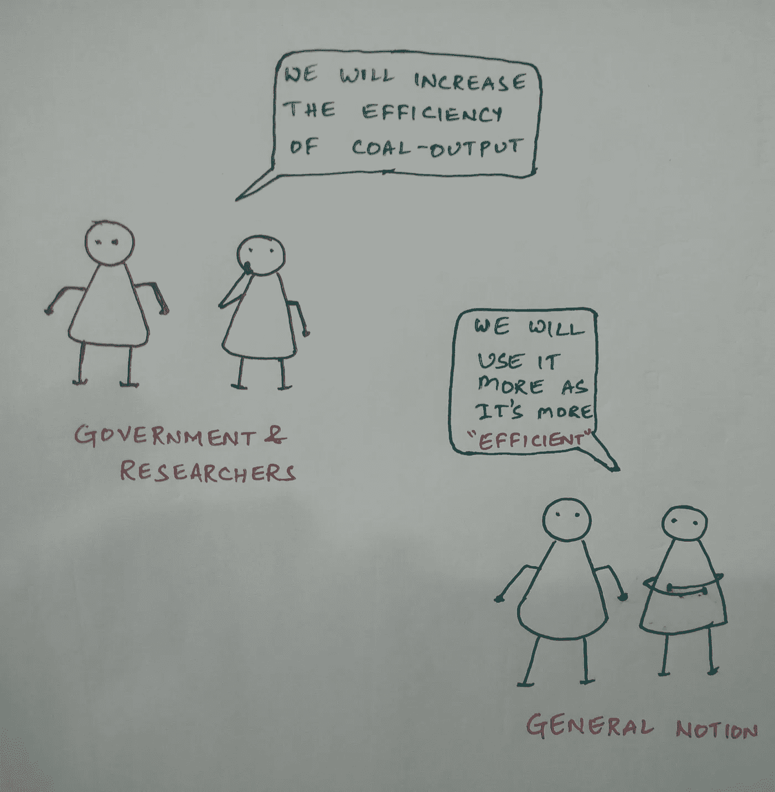*

*A comic example explaining the Jevons paradox. As the output from coal is more efficient, people will start using it more*

*“如果我们的机器消耗更少的能源，我们会消耗更多吗？”——***杰文斯悖论****

*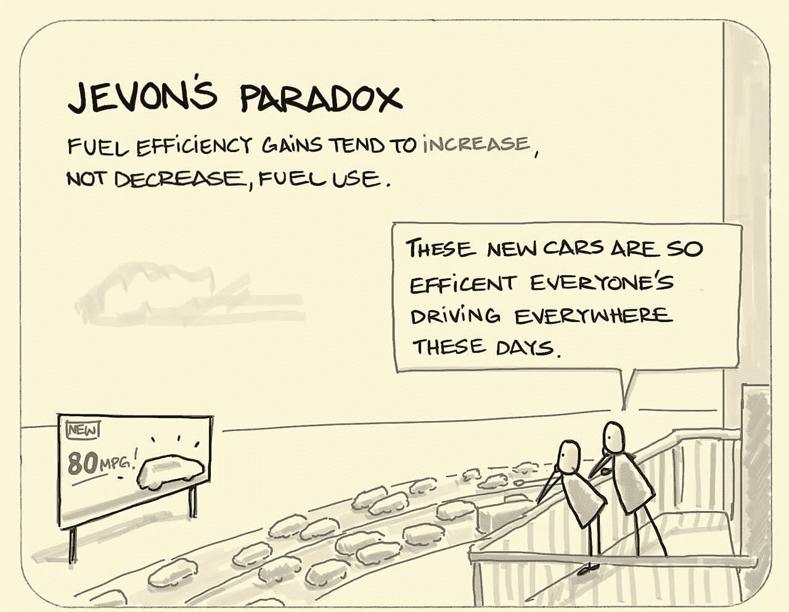*

*Example of Jevons paradox on Autonomous Vehicles (AV) technology, hybrid engine efficiency (**Source**:SketchPlantations)*

# ***1。电力系统***

*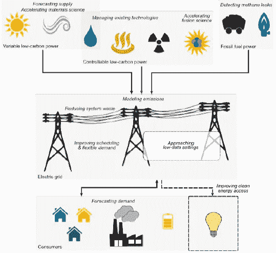*

*Selected opportunities to use machine learning to reduce greenhouse gas emissions in electricity (**Source**:Research Paper)*

## *研究人员能做什么？*

1.  *开发能有效储存更多能量的材料*
2.  *预测放置太阳能电池板、风力发电机、水坝的最佳位置，使其对其他生态系统的影响最小*
3.  *开发和控制电池，使其在价格低时储存能量，在价格高时将能量出售给电网*
4.  *对核反应堆进行更多的研究，预测灾难，更好地控制以避免大规模的破坏(就像切尔诺贝利灾难一样)*

## *组织能做什么？*

1.  *基于供需曲线的可变电价*
2.  *预测供需，并相应地在低碳可变能源(风能、太阳能、核能)、低碳受控能源(核能)和高碳备用可靠能源(化石燃料)之间切换*

## *我能做什么？*

1.  *不用时关掉灯、风扇和所有电器*
2.  *减少空调的使用，定期更换旧电器，因为它们会产生更多热量，因此需要更多能源*
3.  *在非高峰需求期间(通常在上午 9 点之前和下午 6 点之后)使用电力进行所有充电*
4.  *使用太阳能电池板为你的房子供电并储存能量(可以卖给电网或重复利用)*

# ***2。运输***

*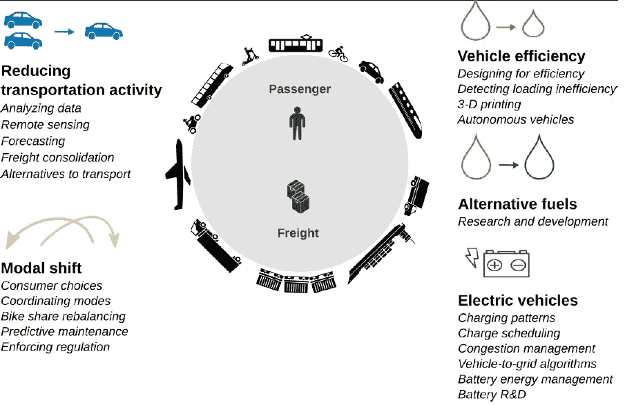*

*Selected opportunities to use machine learning to reduce greenhouse gas emissions in transportation (**Source**:Research Paper)*

## ***研究人员能做什么？***

1.  *开发考虑各种因素的路线算法，并根据成本函数对其进行优化(最短的距离、更少的时间、涉及公共交通、安全、可靠、排放更少的 GHG) ( **注:**谷歌地图仅提供几个选项进行优化，即时间、可靠性，并且没有显示 GHG 排放的内置功能。但是有几个[扩展](https://sites.google.com/site/mapsfootprint/)*
2.  *从卫星图像、众包和提供更好的资源中估计区域内的行人和车辆数量*
3.  *缓解总线拥挤，从而提高效率*

*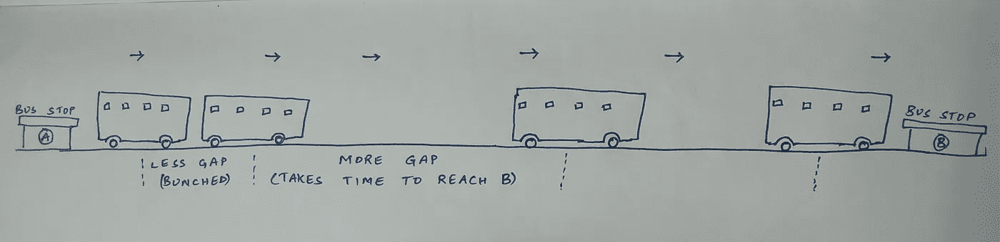*

*A simple pictorial representation of bus bunching problem. Grouped buses causes bunching and is reason for congestion, efficiency reduction*

## ***什么组织可以做？***

1.  *每周在家(WFH)强制工作一次，不影响产量*
2.  *通过提供奖励鼓励员工使用公共交通工具*
3.  *虚拟大会、会议、演示和课程*
4.  *实施每周 4 天的工作计划以避免通勤([示例](https://www.forbes.com/sites/nextavenue/2020/02/06/the-4-day-workweek-has-its-time-come/#2a76ba6551d0))*

## ***我能做什么？***

1.  *尽可能使用铁路而不是飞机*
2.  *尝试使用自行车、公共交通或步行，并鼓励*“交通模式”*，即改变交通模式以减少 GHG*

*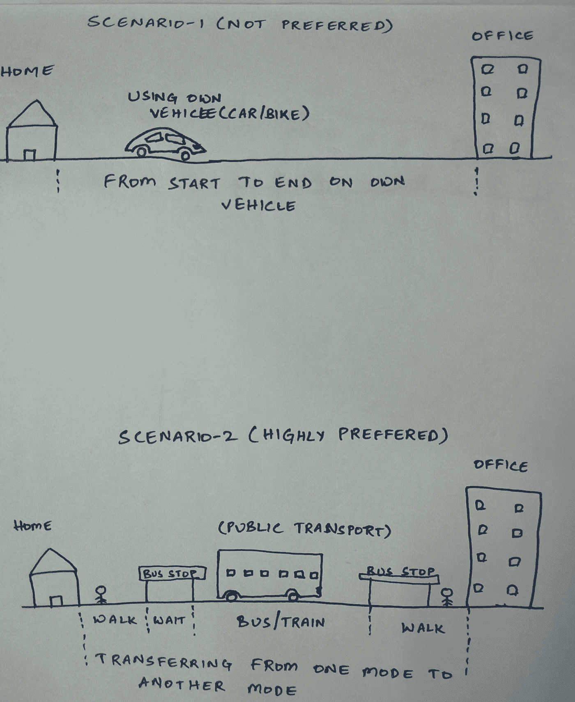*

*An example describing the commute from home to work using modal transit method. It reduces the overall GHG emissions, congestion and increases efficiency of transportation*

# ***3。建筑和城市***

*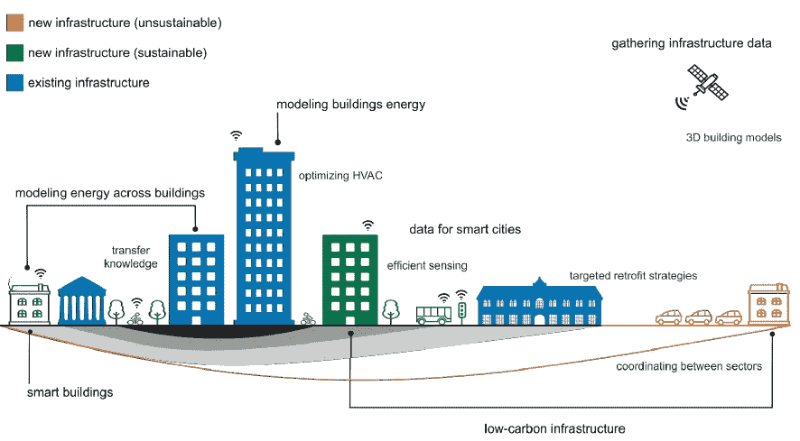*

*Selected opportunities to use machine learning to reduce greenhouse gas emissions in smart cities and buildings (**Source**: Research Paper)*

## ***科研人员能做什么？***

1.  *高效材料智能电能表的设计*
2.  *构建智能城市，并利用获得的数据获取洞察力*
3.  *从信用卡账单、网上商店收集数据，评估个人生活方式*

## *我能做什么？*

1.  *使用气候友好型建筑材料*
2.  *了解家中每个电器消耗多少能源，即能源分解和改变一些习惯(**例如:**桶浴比淋浴节约资源)*

# ***4。行业***

*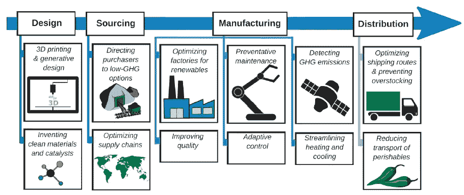*

*Selected opportunities to use machine learning to reduce greenhouse gas emissions in industry (**Source**:Research Paper)*

## ***研究人员和组织能做什么？***

1.  *预测需求以避免生产过剩或生产不足*
2.  *及时生产产品以减少仓库中的浪费*
3.  *定期维护以防止磨损、事故和减少有毒物质排放*
4.  *基于低 GHG 排放路线的交货和货运*
5.  *将减少 GHG 作为激励措施的政策*

## *我能做些什么？*

1.  *减少供应链中的食物浪费*

*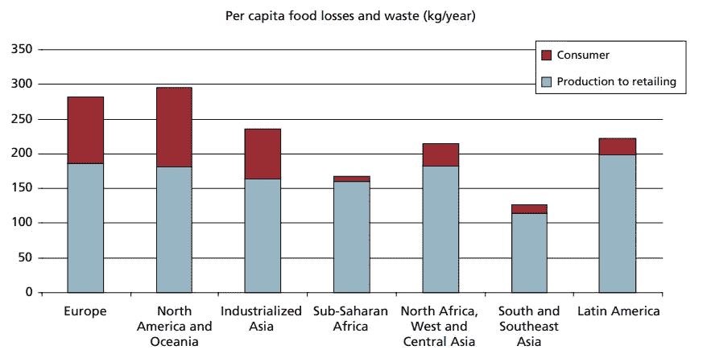*

*Food waste in different parts of the world. While most of the **developing** countries has food waste in **processing, harvesting** (due to lack of infrastructure, facilities), most of the **developed** countries waste food at the **end points** (like houses, restaurants etc;) (**Source**: FAO, UN — [http://www.fao.org/3/a-i2697e.pdf](http://www.fao.org/3/a-i2697e.pdf))*

# ***5。农场和森林***

*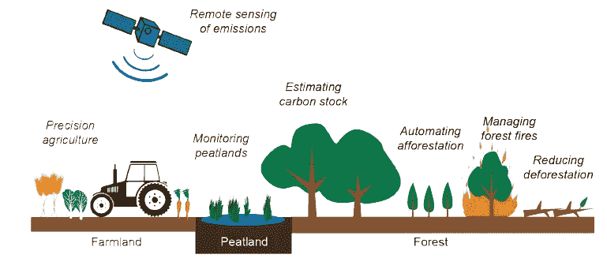*

*Selected opportunities to use machine learning to reduce greenhouse gas emissions in farms, forests (**Source**:Research Paper)*

## ***研究人员和组织能做什么？***

1.  *发展精准农业(控制每一种作物)和间作(在同一块土地上种植多种作物，利用作物之间的空间)*
2.  *使用有机农业，尽量减少杀虫剂的使用*
3.  *从卫星图像预测干旱和洪水*
4.  *使用智能手机预测大森林火灾、非法伐木(**例如:**[https://rfcx.org/](https://rfcx.org/))*

## ***我能做什么？***

1.  *种植树木、树苗，即植树造林*
2.  **减少/避免*肉类、牛肉、猪肉等的摄入；([阅读此文](https://www.nytimes.com/interactive/2019/04/30/dining/climate-change-food-eating-habits.html)了解更多信息)(过去认为，包括冠状病毒在内的大多数流行病都是动物传播的，因此，如果无法完全避免，最好保持安全，至少减少摄入)*

*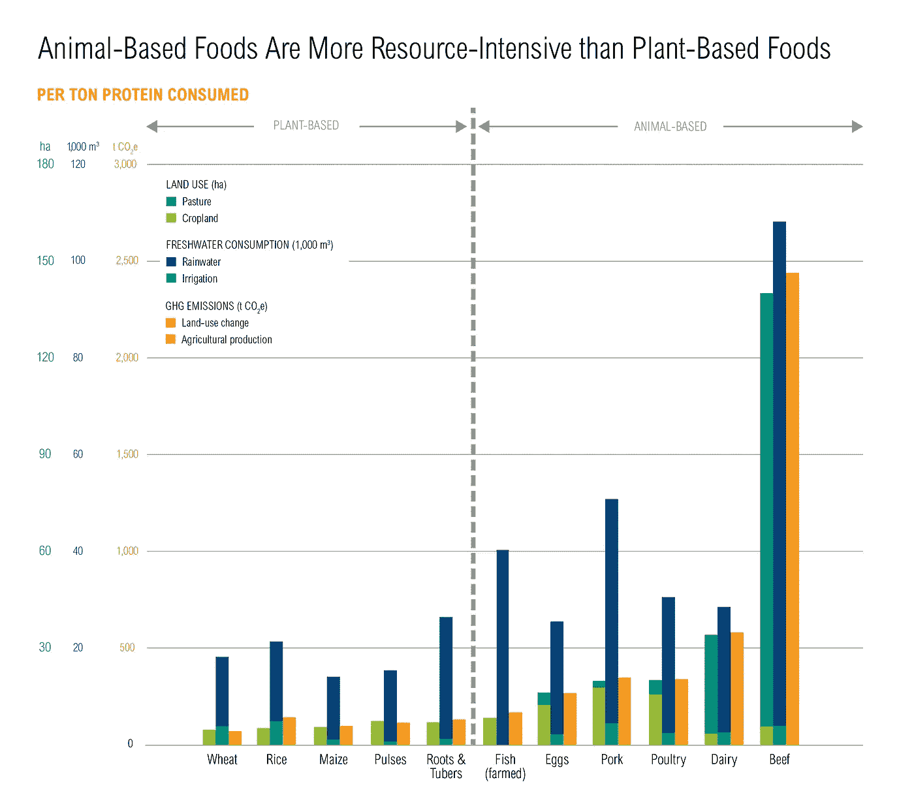*

*Infographic showing how animal based diet is more resource intensive compared to plant based diet (**Source**: World Resources Institute, [https://www.wri.org/resources/charts-graphs/animal-based-foods-are-more-resource-intensive-plant-based-foods](https://www.wri.org/resources/charts-graphs/animal-based-foods-are-more-resource-intensive-plant-based-foods))*

# ***6。二氧化碳去除***

*如果你认为*“我们将从大气中去除二氧化碳”*，那么这就是重点关注的领域。大自然用树木、泥炭地和 T21 为我们完成了这个过程，但是由于我们的干预，我们正在广泛地破坏这个过程。如果你计划专注于这个领域，你只能在研究方面有所贡献。*

# *7。气候预测*

*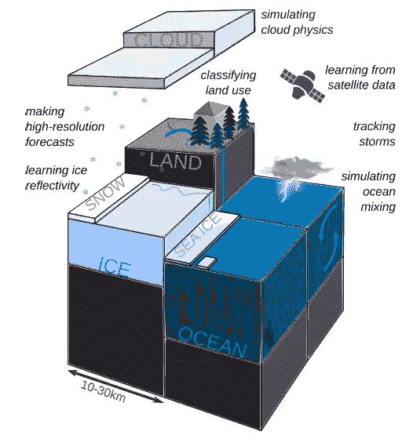*

*Selected opportunities to use machine learning to reduce greenhouse gas emissions in climate prediction (**Source**:Research Paper)*

## ***科研人员能做什么？***

1.  *模拟气候数据并获得气候模型(例如，未来云的行为，特定行为如何改变气候和环境)*
2.  *预报风暴、干旱、地震、洪水等；使用 ML(有倾斜的数据，即数据向一边对齐，这是一个挑战)*

# *8。社会影响*

*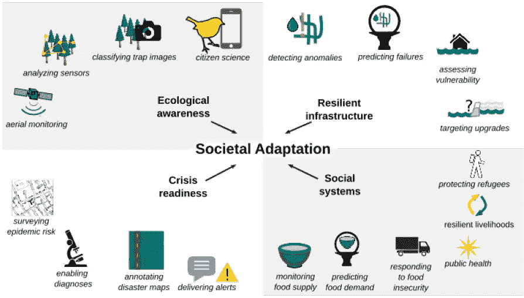*

*Selected opportunities to use machine learning to reduce greenhouse gas emissions in societal impacts (**Source**:Research Paper)*

## ***研究人员和组织能做什么？***

1.  *根据照片预测疾病*
2.  *获取灾难的影响(该地区受影响的程度)以估计需要多少帮助*

# ***9。太阳能地球工程***

*少数人可能会想到的一些科幻想法是:*

1.  *我们可以在空气中喷洒一些东西，一些化学物质，这只是冷却一切*
2.  *控制云层，使阳光能够被适当地引导*
3.  *把一些卫星放在太空中，控制阳光落在地球上*

*那么这一段最让你着迷。但是作为一个门外汉，由于它是一个新兴的研究领域，所以没什么可贡献的。*

*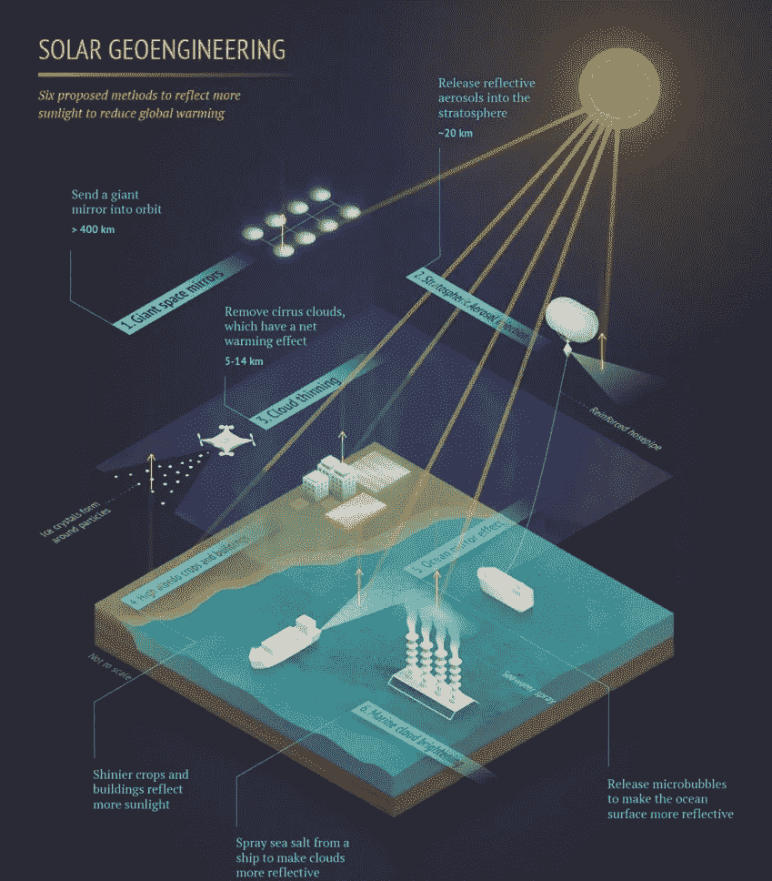*

*Selected opportunities to use machine learning to reduce greenhouse gas emissions in solar geoengineering (**Source**: CarbonBrief)*

# ***10。个人工具***

1.  *通过计算器了解个人碳足迹，如[碳足迹](https://www.carbonfootprint.com/calculator.aspx)、[世界自然基金会](https://footprint.wwf.org.uk/#/)、[联合国计算器](https://offset.climateneutralnow.org/footprintcalc)，并采取相应行动*
2.  *用替代品取代所有形式的塑料(竹牙刷、布袋等；)因为它对我们的健康也有害*

*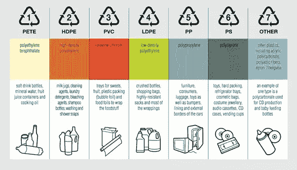**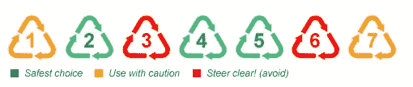*

*Different types of plastic materials and which all to avoid (**Source**: Pinterest)*

**

*Visualizing how our environment looks in extreme weather conditions (**Source**: CycleGANs, ICLR AI workshop, [https://arxiv.org/pdf/1905.03709.pdf](https://arxiv.org/pdf/1905.03709.pdf))*

*   *减少发送电子邮件，因为每封电子邮件都有一些相关的 GHG(尽管这是一个有争议的话题，建议尽量减少发送电子邮件——参考书籍 ***“香蕉有多糟糕？:万物的碳足迹"*** )*
*   *必要时买衣服，因为它减少了资源分配*

# ***11。集体决策***

## ***组织能做什么？***

*设计模型用于:*

1.  *今天实施的政策如何影响我的今天、明天和 10 年后？*
2.  *当一项政策宣布后，公众的反应如何？*
3.  *比较各种决策，选择最佳方案(GHG 排放是其中一个因素)*
4.  *实施碳税，碳定价更加有效*

# ***12。教育和金融***

## ***我能做什么？***

1.  *更多地了解气候变化并教育他人。一种方法是参加一些在线课程。*
2.  *投资生产低碳产品的公司*

*因此，这是留给每一个人去思考这个问题并采取相应的行动。虽然我们团结一致抗击冠状病毒，但更大的战斗在等待着我们。*

*一个人不必完全改变他/她的生活方式(因为有些人可能在几个话题上有矛盾的观点),但应该开始并有一个决心。*

*像*“海洋始于一滴水*”或*马拉松始于一小步*这样的名言有时应该有点鼓舞人心。*

****#从来没有过****

***尾注:**任何建议/纠正/建设性批评都是鼓励的。大多数来源是值得信赖的，但如果有任何差异，请让我知道。*

*如果你喜欢这个博客，可以考虑鼓掌、分享，因为这有助于其他人对气候变化有一个清晰的认识。(从第 12 点开始，即教育)*

***个人网址:**[namburisrinath . github . io](https://namburisrinath.github.io)*

***中柄:**namburisrinath.medium.com*

***领英:**【https://www.linkedin.com/in/namburi-gnvv-satya-sai-srinath/】T2*