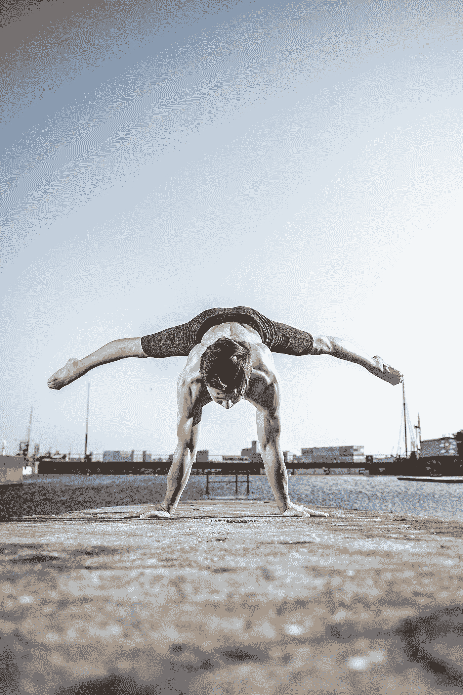

# 人工智能健身应用的影响力越来越大

> 原文：<https://medium.datadriveninvestor.com/the-growing-influence-of-ai-powered-fitness-applications-5767b80235d7?source=collection_archive---------5----------------------->

Photo by [Patrick Kool](https://unsplash.com/@patrick62?utm_source=medium&utm_medium=referral) on [Unsplash](https://unsplash.com?utm_source=medium&utm_medium=referral)

在全球疫情期间，健身可能更容易实现。一项涉及 2000 名美国人的调查显示，由于冠状病毒疫情，去健身房变得越来越过时。

你可能会认为封锁和隔离会让很多人体重增加，最终健康状况不佳。然而， [63%的受访者认为他们在过去几个月里变得更健康了](https://www.studyfinds.org/end-of-gyms-survey-shows-60-of-american-believe-fitness-clubs-will-go-extinct/)。

似乎美国的许多健身爱好者不再需要健身房会员来实现他们的健身目标。另有 64%的受访者对在家健身更感兴趣。

由于疫情，家庭健身应用程序的受欢迎程度在过去几个月激增。一项[研究](https://www.weforum.org/agenda/2020/09/fitness-apps-gym-health-downloads/)发现，2020 年上半年，健身应用增长了 50%。

疫情迫使健身爱好者探索在家健身的新方法。

# **人工智能**

人工智能(AI)是计算机科学的一个领域，专注于创造看起来像拥有人类智能的机器。这些机器的智能是“人工的”，因为它是由人类创造的，它不是自然存在的。

人工智能及其子集的出现，包括计算机视觉、机器学习、自然语言处理等，正在以前所未有的速度实现健身行业的现代化。

人工智能已经与健身器、小工具、可穿戴设备和移动应用程序结合在一起，使它们变得智能，并允许它们帮助用户保持健康。

**计算机视觉**被定义为主流人工智能的一个子集，它处理使计算机或机器视觉化的科学，即它们可以分析和理解图像。

**机器学习(ML)** 是 AI 的一个子集。ML 算法是计算机可实现的指令，它将数据集作为输入，并执行计算以找出该数据集中以前未发现的模式。

ML 模型从经验和自我修正中学习。因此，您用来训练它们的数据集越大，它们就能更好地学习数据集中的模式。

更大的训练数据集意味着你的模型遇到更多的数据，意味着他们获得更多的经验。

**自然语言处理(NLP)——**是人工智能的一个分支，研究机器如何理解人类可以理解的(自然)语言。

NLP 的目标是构建能够理解文本并执行翻译、语法检查或文本分类等任务的系统。

 [## 一名大学生使用语言生成人工智能工具创建了一个病毒式博客帖子|数据驱动…

### 作为作家，我们喜欢告诉自己，我们处在一个无法自动化的职业中，至少短期内不会。但是…

www.datadriveninvestor.com](https://www.datadriveninvestor.com/2020/09/15/a-college-student-used-a-language-generating-ai-tool-to-create-a-viral-blog-post/) 

# **计算机视觉的使用**

健身应用程序使用计算机视觉来监控你锻炼时的姿势，如果你在健身房锻炼，健身教练会为你做这件事。

使用笔记本电脑或智能手机的摄像头，这些应用程序利用计算机视觉扫描你的身体，并计算出你的体型。

然后，他们会为你推荐最适合你体型的锻炼计划和运动。

在锻炼过程中，这些应用程序可以充当虚拟教练。在锻炼过程中，他们会对你的动作和位置进行实时指导和反馈，告诉你这样或那样弯曲，在试图下蹲时放低身体，挺直背部或保持肘部更成直角。

# **健身应用提供众多优势**

让我们来讨论家庭锻炼应用程序的 7 个好处，它们让健身爱好者忘记更新他们的高级健身房会员资格。

## **个性化健身项目**

每个人的身体和健身目标都是独特的。因此，一个锻炼计划不可能适合每个人。借助人工智能、人工智能和其他顶级技术的力量，这些应用程序可以为每个用户量身定制专属的锻炼计划。

用户只需输入所需的详细信息，如身体尺寸、他们当前的健康水平、他们的健康目标等等。

该应用程序将处理这些信息，并使用人工智能算法为用户创建一个独特的锻炼计划。

那些已经健身并打算保持健康的人可以从健身应用程序中提供的数百个锻炼计划中进行选择。

## **随时随地锻炼身体**

使用这些健身应用程序的最大优势之一是，它们允许你随时随地进行锻炼。唯一的要求是你的手机和互联网连接。

无论你是出差、家庭度假，还是出于任何原因离开你的永久居住地，你都没有理由不去锻炼。

## **健身不需要任何设备**

在家健身是基于锻炼和锻炼计划，不需要你在健身房找到的大型锻炼机器或设备。

因此，家庭锻炼应用程序附带的锻炼不需要你购买任何设备。

只要随身携带瑜伽垫，你就可以在任何地方开始并保持你的健身计划。

## **个性化饮食图表**

正确饮食是实现任何健身目标的关键。事实上，研究表明，对于健康来说，饮食比锻炼更重要。因此，一些最好的家庭锻炼应用程序会为你提供个性化的饮食图表。

此外，你可以选择正确的方案来制定素食、非素食、富含蛋白质、富含碳水化合物或任何其他类型的饮食计划。

## **追踪你的健康状况**

一个好的家庭锻炼应用程序可以帮助你跟踪你的锻炼，并为你的身体健康设定新的目标。人工智能应用还根据用户的能力和耐力提供推荐计划。

要使用此功能，您必须使用您的电子邮件地址和密码创建一个帐户并登录。

## **各种健身活动**

锻炼应用程序不一定只包含体能项目。他们也可能有专门的部分来探索瑜伽体式，调解和其他类型的健身。

一些应用程序甚至为用户提供了创建自己的全身锻炼或针对特定身体部位的选项。

此外，在锻炼过程中眯眼或盯着你的设备会令人沮丧。为了解决这个问题，这些应用程序在用户锻炼时提供音频指令。

## **基于人工智能的健身蔻驰**

我们已经在上面讨论了家庭锻炼应用程序的这一方面。如果你没有用正确的方法做练习，你甚至不知道你做错了，那么做练习可能是无效的。

这些家庭锻炼应用程序附带的人工智能训练器不仅可以在锻炼过程中指导你，还可以为你提供增强力量和耐力的技巧。他们还可以回答任何其他与健身相关的问题。

# **结论——健身房所有者应该考虑构建自己的家庭健身应用程序**

正如我们之前讨论的那样，即使在疫情结束后，世界各地的许多健身爱好者也不打算回到健身房，这应该让每个健身房老板都警惕起来，因为这对他们的健身业务的未来可能意味着什么。

自我训练健身应用程序是保持健康的简单、划算和方便的选择，因此在健身界有着越来越大的需求。

作为一个健身房所有者，从商业角度来看，开发自己的家庭健身应用程序是一项有前途的投资。

为了这个目的，你得找一个可靠的有经验的定制手机 app 开发公司，或者干脆就是技术高超的开发者。自己开发一个应用程序会花费你大量的时间和精力。

最重要的是，你需要掌握各种设计、开发和测试技术的专业知识，这几乎是不可能的。在选择前两个选项中的任何一个之前，最好做一个彻底的研究。

## 访问专家视图— [订阅 DDI 英特尔](https://datadriveninvestor.com/ddi-intel)