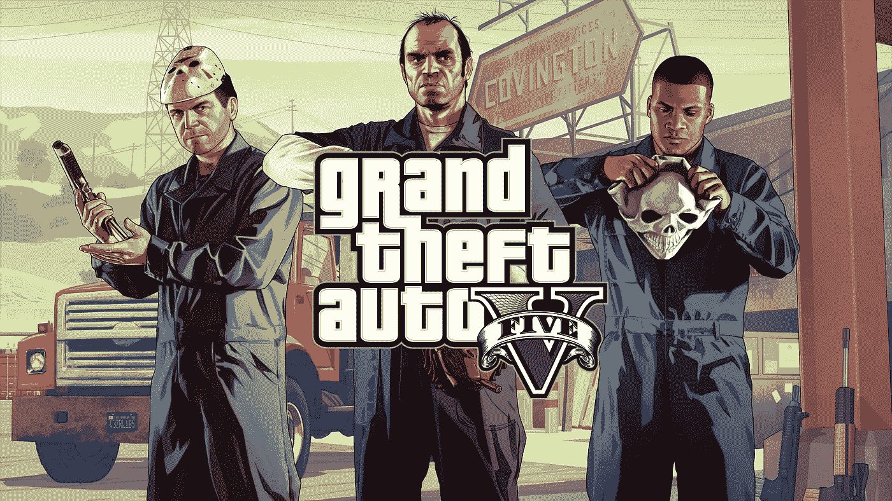
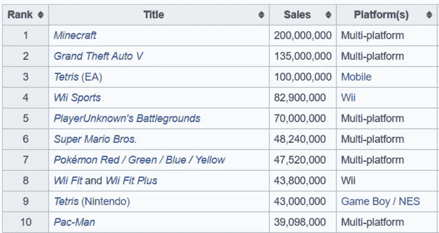
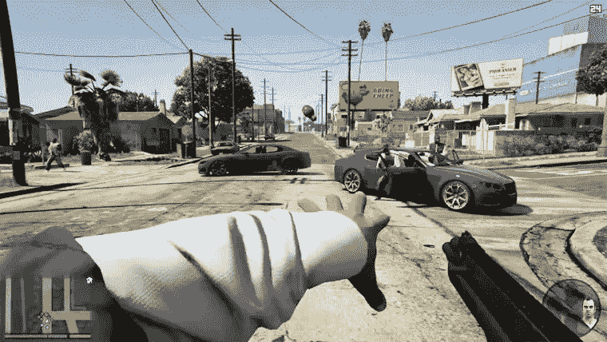
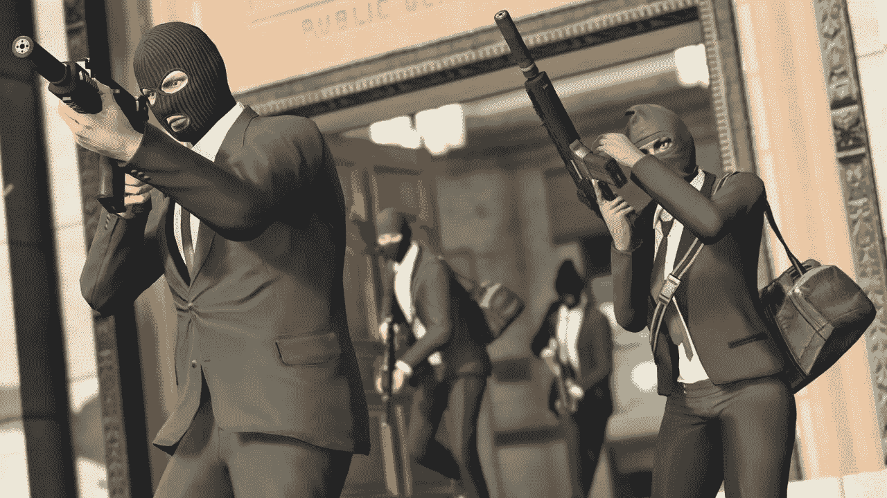
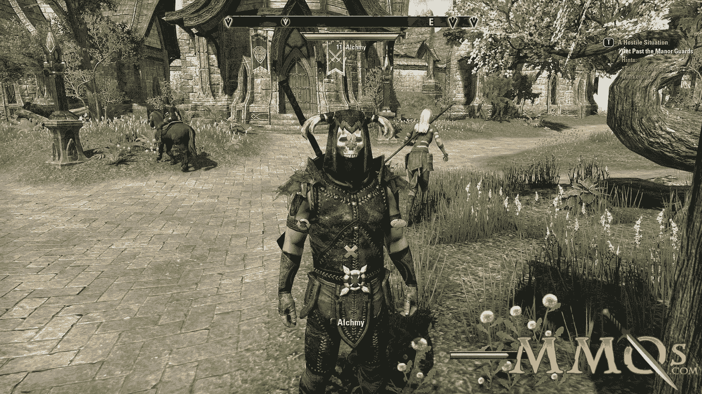
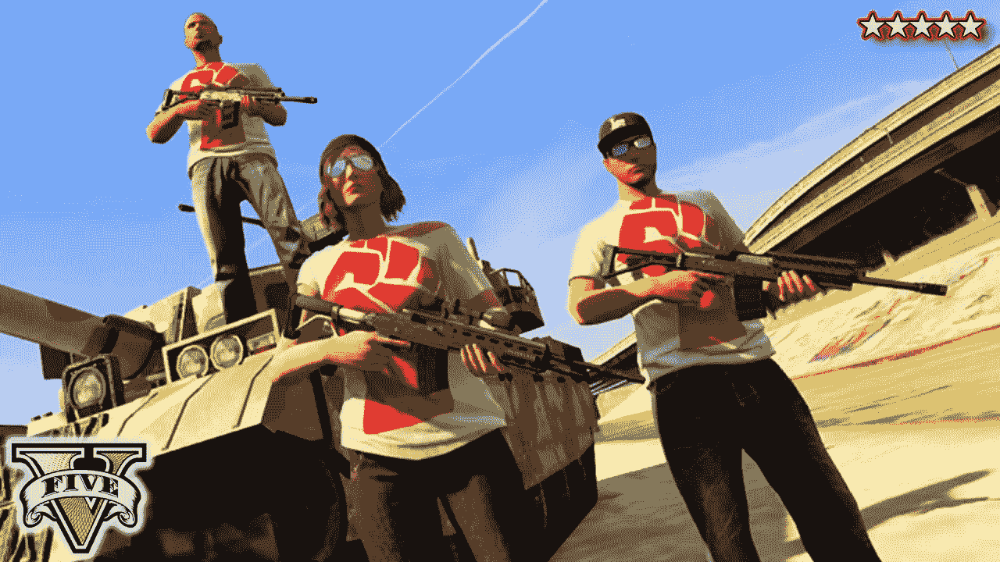
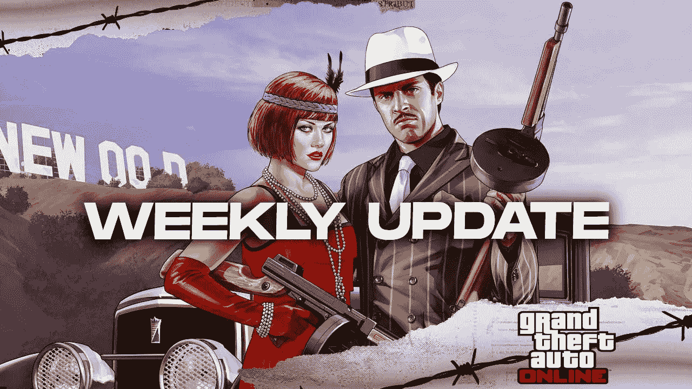
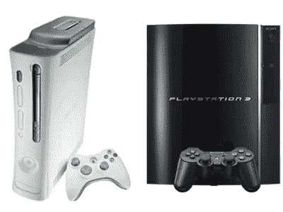

# GTA V 作弊代码:它如何成为十年来最畅销的视频游戏

> 原文：<https://medium.datadriveninvestor.com/the-gta-v-cheat-code-how-it-became-the-best-selling-video-game-of-the-decade-5dfa4801eba6?source=collection_archive---------13----------------------->

## 在不到 7 年的时间里卖出了超过 1 . 3 亿张。

Photo by GTA V

当你想到侠盗猎车手 V 时，你可能会想起毫无意义的数字化枪支暴力，对女性的歧视行为&在充满毒品、罪恶和腐败的网络世界中无休止的犯罪狂欢。

所以你可能不会想到这是十年来商业上最成功的视频游戏，对吗？但事实如此。

自 2013 年推出以来，《侠盗猎车手 V》迄今已累计售出超过 1.3 亿份[**，全球票房超过 60 亿美元**](https://www.forbes.com/sites/paultassi/2020/02/15/the-enduring-mystery-of-how-gta-5-has-sold-120-million-copies/#131dcea81c7b) 。

这为电子游戏赢得了历史上最成功的金融媒体的美誉。

相比之下，有史以来最畅销的电影《复仇者联盟:终结游戏》[在整个放映期间赚了 28 亿美元](https://en.wikipedia.org/wiki/List_of_highest-grossing_films)。

这还不到 GTA V 的一半。

让我们来谈谈电子游戏行业。没有一款视频游戏能够接近 GTA V 所取得的天文成就。看看下面的图表，它展示了迄今为止销售的前 10 个视频游戏及其相应的销售数量:

From Wikipedia

我知道你在想什么。是的，《我的世界》高于 GTA V，但记住 Mindcraft 的价格比 GTA V 便宜得多(27 美元对 60 美元)。尽管事实上《我的世界》可以在比 GTA V 更多的平台上玩

Photo by Minecraft

至于名单上的其他游戏，其中许多游戏如 Wii Sports 和 Super Mario Bros sport 的数字很高，主要是因为它们在购买时有[捆绑交易](https://www.forbes.com/sites/paultassi/2020/02/15/the-enduring-mystery-of-how-gta-5-has-sold-120-million-copies/#131dcea81c7b)——本质上是附带额外东西的包，如免费游戏机或游戏。

目前最接近 GTA V 的无捆绑单机游戏是 [Skyrim，它只卖出了 3000 万份](https://www.forbes.com/sites/paultassi/2020/02/15/the-enduring-mystery-of-how-gta-5-has-sold-120-million-copies/#131dcea81c7b)(仍然令人惊讶，但它甚至没有接近 GTA V 的疯狂数字)。

如果你和我一样，你现在可能也在想同样的事情:像 GTA V 这样备受争议的视频游戏，一直受到公众的反对，而且显然没有得到父母的批准，是如何取得如此前所未有的成功的？

嗯，他们的秘诀在于出色的营销和产品差异化。

# **GTA V 是为了满足**而打造的视频游戏

现在，当我说 GTA 是一款适合任何人的游戏时，我并不是在提倡 GTA 充满犯罪的内容是每个人的茶。

不，我指的是 GTA V 如何囊括了一款视频游戏的所有可取组件；换句话说，它有适合每个人的东西。

首先，这是一个动作冒险游戏，带有一个全面的单人故事战役。玩家可以完成任务，并获得游戏中的独家物品，以推进故事的发展。

Players are free to interact with whatever in-game elements they want.

或者，GTA V 玩家也可以选择[在游戏的开放世界](https://www.forbes.com/sites/paultassi/2020/02/15/the-enduring-mystery-of-how-gta-5-has-sold-120-million-copies/#131dcea81c7b)中自由漫游。游戏设定在虚构的城市洛斯桑托斯，游戏场景非常庞大，玩家经常可以连续几个小时与众多游戏元素互动。

 [## 抓住智能营销，获得巨大成果|数据驱动的投资者

### 网上的人都看过。每当人们在谷歌上搜索某样东西，他们最终都会与类似的广告互动…

www.datadriveninvestor.com](https://www.datadriveninvestor.com/2020/08/19/grab-on-to-intelligent-marketing-for-great-results/) 

该游戏还带有其他模式，如[死亡竞赛、赛车和银行抢劫](https://www.rockstargames.com/V/restricted-content/agegate/form?redirect=https%3A%2F%2Fwww.rockstargames.com%2FV%2F&options=&locale=en_us)——非常适合那些在玩游戏时需要额外刺激肾上腺素的人。

The Pacific Standard Heist: One of GTA V’s co-op missions

虽然许多游戏的故事情节最终会迫使你完成任务前进，但 GTA V 不会给你任何压力:它赋予你做任何你想做的事情的自由。

此外，这款游戏带有无作弊代码和完全可修改的功能，这些功能在市场上的大多数游戏中都是闻所未闻的。

A user-generated mod on GTA V

与生俱来，人们只是喜欢被给予做他们想做的事情的选择，而 GTA V 正是为他们做到了这一点。

这两个方面的自由选择和定制是游戏取得巨大成功的关键；这是 GTA V 区别于竞争对手的地方。

# **GTA V Online 本身就是一个大型多人游戏平台**

如果你打算开发一款非常成功的电子游戏，这里有一个建议——把它放到网上。

当今世界上大多数大型视频游戏(《我的世界》、天际、使命召唤)都完全配备了自己的多人游戏模式。

Skyrim Online

我说的不是仅仅有一个功能，让你可以和朋友一起玩，在线聊天——我说的是创造一个成熟的虚拟世界，完全不同于单人游戏。

GTA V 也不例外。他们有自己的多人游戏模式-同名命名为 GTA V Online-将 GTA 世界提升到一个全新的水平。

例如，游戏模式带有一个[内容创建工具集，让玩家为定制工作创建自己的参数，如洗钱、操纵比赛，甚至合作银行抢劫](https://en.wikipedia.org/wiki/Grand_Theft_Auto_V)。

玩家甚至可以组成自己的团队，一起完成任务，从而获得游戏内的独家奖励。

Players could form crews to complete missions together.

最棒的是，与其他视频游戏公司不同的是，《GTA V Online》的创造者 rock star,[通过不时提供新的和可下载的更新来保持游戏模式](https://www.forbes.com/sites/paultassi/2020/02/15/the-enduring-mystery-of-how-gta-5-has-sold-120-million-copies/#131dcea81c7b)的新鲜。

An update on GTA V Online: These were frequent and often anticipated by players.

通过这种方式，玩家可以完全投入到游戏中，并专注于“努力”达到虚拟排名的顶端，从而保持游戏模式对数百万玩家的竞争力。

当其庞大的玩家数据库每年都在你的游戏上花费成千上万的时间和金钱时，你就会知道这是一个成功的不二法门。

# **GTA V 的发布时间保持了游戏的相关性**

对于那些不熟悉视频游戏行业的人，让我来告诉你它是如何工作的:视频游戏控制台通常分为几代，每一代都有一个主要制造商发布的控制台(想想 Playstation 和 Xbox)

GTA V 在发布的时候是在[第 7 代，也就是说它可以在 Playstation 3 和 Xbox 360](https://pixelkin.org/2017/08/08/how-did-gta-5-achieve-immense-success/) 上同时玩。这有助于围绕游戏进行宣传，因为这意味着它可以显示出色的图形和游戏质量。

The leaders of the 7th Generation: Xbox 360 (left) & PS3 (right)

不久之后，第八代视频游戏机与 Playstation 4 和 Xbox One 一起问世。Rockstar [对即将到来的这一代人非常敏感，推出了 GTA V](https://pixelkin.org/2017/08/08/how-did-gta-5-achieve-immense-success/) 的重新发布，这意味着它现在也可以在新的 Playstation 和 Xbox 游戏机上播放。

一年后，他们[发布了 PC 版的游戏](https://pixelkin.org/2017/08/08/how-did-gta-5-achieve-immense-success/)给了公众很多期待。

这些新版本带来了新的第一人称模式，增加了在线游戏大厅的容量，更好的图形质量，以及许多其他改进。

由于 Rockstar 发布的这些战术版本，他们的观众对游戏本身的改进以及在更多平台上玩的更广泛的可用性不断感到满意——这是任何游戏玩家都欢迎的两件事。

这确保了游戏的长寿，并有助于在发布后数年内保持创纪录的销量。

有些人可能会认为，GTA V 的 2.58 亿美元预算对其巨大的成功发挥了巨大的作用，或者说[的前身(GTA I 至 IV)帮助从零开始建立了这个专营权](https://www.gamesindustry.biz/articles/2018-04-09-gta-v-is-the-most-profitable-entertainment-product-of-all-time)。或者也许事实就是如此[岂有争议](https://www.gamesindustry.biz/articles/2018-04-09-gta-v-is-the-most-profitable-entertainment-product-of-all-time)。

也许这些因素确实有所帮助，然而，最终是上述策略直接影响了 GTA V 取得的史诗般的成就。

为了方便起见，我把它们总结成三个小要点:

1.  **了解你的核心受众以及他们真正想要的是打造成功产品的关键。是的，这可能是老生常谈，但如果 Rockstar 没有完全理解游戏玩家更喜欢在游戏中有选择的自由，并坚持严格的故事情节，这款游戏就不会取得今天的成功。**
2.  **打不过他们，就加入他们**。有时候，不与竞争对手完全差异化也没关系。我的意思是这些竞争者的成功是有原因的。如果你分析你的竞争对手的行为，并找出是什么让他们成功的(在这种情况下，Rockstar 发现了多玩家平台的重要性)，你也许可以将它们应用到你的产品中。
3.  时机决定一切。产品的内容很重要，但它的上市时间也很重要。Rockstar 清楚地知道即将到来的视频游戏控制台时代，并提前做好准备，同时重新发布游戏。

这些是我能想到的主要原因，老实说，仍然很难相信这些帮助视频游戏积累了 1.3 亿份销量。毫无疑问，这将永远成为电子游戏历史上最愚蠢的记录之一，当然，也是娱乐史上最愚蠢的记录之一。

## 访问专家视图— [订阅 DDI 英特尔](https://datadriveninvestor.com/ddi-intel)