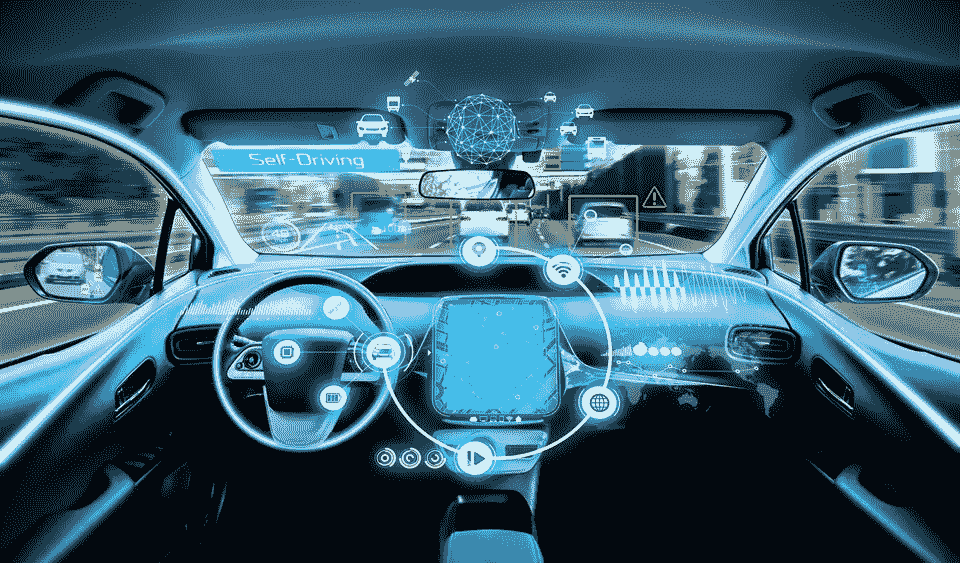

# 对自动驾驶汽车的黑客攻击——会带来什么样的伤害？

> 原文：<https://medium.datadriveninvestor.com/the-hacking-of-autonomous-vehicles-what-mayhem-will-that-bring-5120c663d332?source=collection_archive---------31----------------------->

我们以为只能在杰森一家看到的未来，实际上就在这里。汽车工厂的 R&D 部门充斥着一些世界上最聪明的想法和实施这些想法的汽车工程师。事实上，我们甚至超越了杰森一家的技术。在加州，已经有几十辆自动驾驶汽车上路了。

不久前，我坐在一名工程师在雷德伍德城的办公室里，他正在设计一个机器人系统，将用于路上的每一辆无人驾驶汽车。当我们查看图表时，当 CNN 的新闻通知在我的手机屏幕上滚动时，一阵痛苦击中了我的胃。只有一个词引起了我的注意:**黑客。**尽管新闻警报与自动驾驶汽车没有任何关系，但自动驾驶汽车被黑客攻击的想法打动了我。

> ***使用这种新兴技术有什么风险？***

你猜对了；黑客。这些未来汽车都使用导航、通信、娱乐、环境、传感器技术和计算机化的视觉系统，这些都与外界相连。这是黑客的最佳时机。在汽车设计过程的某个地方，安全性处于次要地位。现在想象一下，十几年后，在高峰时段，你的自动驾驶汽车突然在可能堵塞交通的地方停下来。这时，你的手机收到了一条新闻提示，这条信息你现在很少用了，因为你已经习惯了把汽车仪表盘当成新设备，它写道:黑客已经瘫痪了所有交通。这可能是我们在不久的将来的现实。

 [## 在自动驾驶汽车发生事故的情况下，谁应该承担法律责任？数据驱动的投资者

### 我仍然认为自动驾驶汽车是一种奢侈品，而不是必需品…

www.datadriveninvestor.com](https://www.datadriveninvestor.com/2018/11/02/who-is-legally-accountable-in-the-case-of-an-autonomous-vehicle-accident/) 

尽管美国国家公路交通安全管理局(National Highway Traffic Safety Administration)提议在未来的自动驾驶汽车上安装必要的 V2V(车对车)设备，但点对点通信仍然非常脆弱。嵌入式软件系统可能会比预期的更快过时，让汽车得不到支持。交通部能够满足保持无人驾驶汽车设计和生产安全标准的需求吗？汽车和网络安全行业能否携手努力，更快更努力地制造防黑客的多点安全系统？

你会采取哪些预防措施来保护自己？这些都是我们需要思考的问题，因为未来就在眼前。

Gena 瓦兹奎 2020