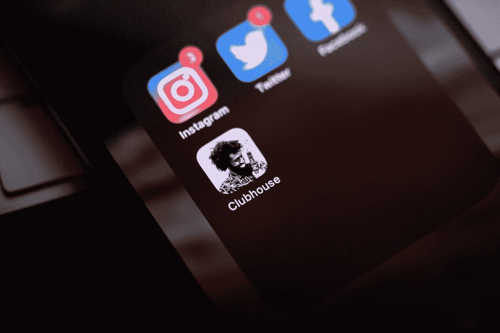
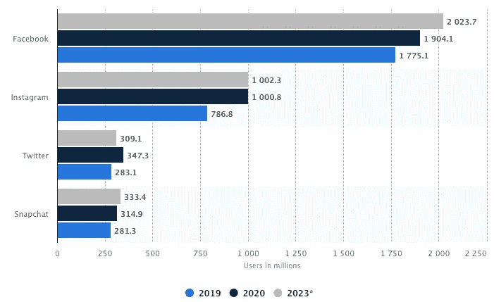
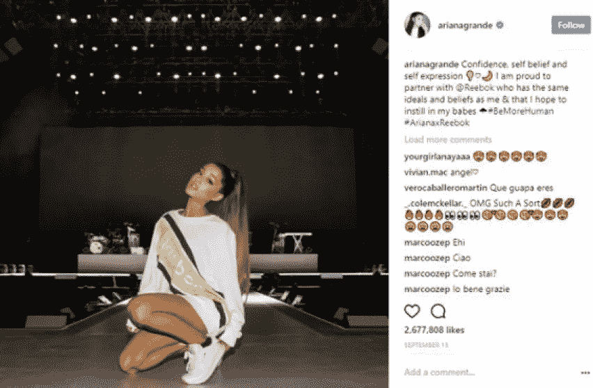

# 关于被误导的世界认知和社交媒体广告的严酷事实

> 原文：<https://medium.datadriveninvestor.com/the-hard-truth-about-misguided-world-perception-and-social-media-advertising-328af5e77942?source=collection_archive---------28----------------------->

Photo by [William Krause](https://unsplash.com/@williamk?utm_source=medium&utm_medium=referral) on [Unsplash](https://unsplash.com?utm_source=medium&utm_medium=referral)

## 从英国脱欧者到特朗普支持者，从阿拉伯之春和黄背心，从穿着最少的模特到社交媒体“影响者”。照片分享应用程序是如何塑造普通人的思想、未来和口袋的？

你能想象我们现在生活的世界吗？一个相互联系的世界。在这个世界上，美国人可以通过盯着屏幕来了解俄罗斯人的节日。社交媒体的世界。

这句话在十几年前毫无意义，人们会认为你是从精神病院跑出来的。十年后，我们不禁要问自己，如果没有它，今天的世界会是什么样子。

Number of social network users of select social media platforms worldwide in 2019 and 2023 (in millions)

[十亿](https://www.statista.com/statistics/1109866/number-social-media-users-worldwide-select-platforms/)……截至 2020 年，Instagram 月活跃用户超过 10 亿！这意味着全世界大约 13%的人口(大约 77 亿)盯着屏幕浏览照片和跳舞视频。这听起来像一个糟糕的电影情节，或者对[乔治·奥威尔的《1984》](https://www.theguardian.com/books/2019/may/19/legacy-george-orwell-nineteen-eighty-four)的理解非常差，但不幸的是，这就是现实。社会已经被吸进了 Instagram 和脸书提供的过滤器、喜欢、回旋镖、卷轴、赞美和广告的幻想世界。令人震惊的是，据估计，到 2023 年，脸书每月活跃用户将达到 20 亿，这似乎比人们意识到的要可怕得多。人们不断寻求彼此的认可，为此他们必须炫耀和炫耀他们非常虚假、奢侈的生活方式。社交媒体创造了人与人之间的竞争，这种竞争总是存在于外部世界，但在更大程度上转移到了网上。这开创了一个新的先例，即赢得更多的观众，并延长谁更优秀的比赛的寿命。

Instagram 成为了最伟大的，尽管是最虚假的平台，在这里，一个普通人，一份普通的工作，一份普通的薪水，一个普通的妻子，可以假装成一个正在实现自己梦想的百万富翁。更准确地说，是同一个 avergae Joe 过着他希望别人相信他在过的生活。

所有这些都是由名人和社交媒体“影响者”规定的社会“趋势”所决定的。这就是广告发挥作用的地方。正如 [Adweek](https://www.adweek.com/digital/10-reasons-why-influencer-marketing-is-the-next-big-thing/#/) 所说:

> “随着世界向社交媒体的转变，消费者会关注其他消费者，以了解他们的购买决定。他们不再像过去那样看公司，而是看彼此和他们最喜欢的人。

## 文化冲击

社交媒体上的增长机会彻底动摇了广告业。Instagram 成为最大的社交媒体平台之一，被广告商用来最大限度地扩大其影响和广告参与。它开始通过对人们生活的虚假描述来塑造人们的满足感和欲望。人们被同龄人的压力和扭曲的社会趋势所灌输，渴望物质享受来满足他们的生活。大卫·贝克汉姆是一位成功的商人和前足球运动员，他有很多钱、名牌衣服、汽车和一个幸福的家庭。每个人都崇拜他。有些人甚至会称他为国宝！如果大卫·贝克汉姆佩戴古驰腰带，那我一定也是对的吧？当人们从环境中寻求认同时，这正是他们的想法。他们错误地认为，他们必须获得那些物质享受，以向每个人展示他们过着多么美好和成功的生活(而他们的银行账户却因透支而被撕裂)。

改变这些社会观点的最大影响因素是名人代言。名人总是出现在电视广告中，但现在通过在平台上上传一张照片来接触数百万人变得比以往任何时候都容易。浏览量、点赞量和总参与度可以为公司增加数百万美元的客户群和利润。流行歌星爱莉安娜·格兰德可以看到这样的效果，她在自己的 Instagram 账户上上传了一张照片，吸引了 2.19 亿粉丝，展示了锐步的服装，并为他们的产品代言。这张照片已经获得了超过 260 万个赞，只要这张照片没有被删除，它就会一直留在账户上，供她的粉丝们查看和参与。

Ariana Grande’s Reebok endorsement

[有人声称](https://www.forbes.com/sites/gabrielshaoolian/2017/04/13/is-instagram-advertising-the-right-social-media-platform-for-your-brand/#f339ff22d36e) Instagram 是品牌个性展现的最佳平台。据估计， [72%](https://www.impactbnd.com/blog/influence-of-instagram-on-buying-infographic) 的 Instagram 用户的购买决定是基于他们在浏览应用程序时看到的产品。这恰恰表明了 Instagram 广告对消费者的影响，因为它是一个对购物习惯和消费者行为影响最大的在线平台。

## 结果

Instagram 改变并发展了广告市场。这种转变扭曲了个人对现实世界的看法。每个人都渴望奢侈的生活方式，不是通过努力工作，而是通过炫耀财富和获得虚假地满足他们生活的物品。

照片分享平台已经今非昔比。它变成了一个精神监狱，在那里个人用虚假的幸福和被他们的环境接受的趋势吞没和压倒自己。

它会改变吗，还是会保持不变？

只有时间能证明一切。